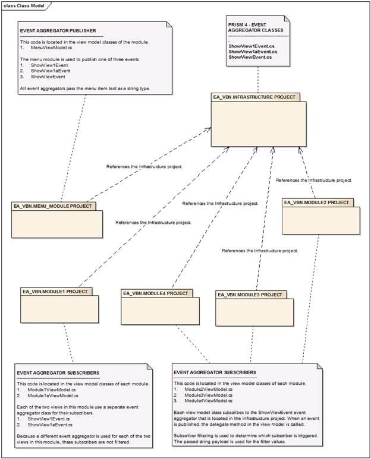

# 第十一章棱镜 4 事件聚合

Prism 4 事件聚合是另一种 Prism 4 通信机制。事件聚合器不是建立在 GoF 命令设计模式上，而是使用*观察者设计模式*。观察者设计模式是一种发布/订阅模式，支持多个发布者和订阅者之间的通信。

|  | 注意:观察者设计模式的 GoF 定义是一对多的结构，它有一个发布者和多个订阅者。Prism 4 事件聚合器使用多对多的结构，可以根据需要容纳任意多的订阅者和发布者。 |

事件聚合是 Prism 4 模块之间的一种出色的通信方法，其多功能接口使其适用于多种不同的情况。

在接下来的两章中，我们将使用*事件聚合* *和基于视图的导航* (EA_VBN)解决方案来解释事件聚合和基于视图的导航。这两个 Prism 4 构造是使用事件聚合来访问不同模块中的视图，同时保持代码松散耦合的极好例子。

图 12:棱镜 4 *事件聚合器和基于视图的导航*演示解决方案

图 12 所示的解决方案使用事件聚合在四个模块中的五个不同视图之间导航。菜单模块中的列表框用于选择菜单项。所选菜单项的字符串值作为参数通过视图 XAML 标记中的交互触发器传递给视图模型。该值用于确定显示哪个视图。

事件聚合器由以下部分组成:

*   事件聚合类
*   订阅者
*   出版商
*   触发机制

事件聚合类

事件聚合类用于识别和创建棱镜 4 事件聚合对象。通常，我将这些类放在解决方案的基础设施项目中，以便其他类可以访问该对象。图 13 显示了 EA_VBN 解决方案的结构示例。



图 13:EA _ VBN 事件聚合结构。

清单 50 是`ShowViewEvent`事件聚合类的一个例子。我通常在这些类的*基础设施*项目中放置一个事件聚合文件夹。

清单 50:棱镜 4 事件聚合类

```
        using System;
        using System.Collections.Generic;
        using System.Linq;
        using System.Text;
        using System.Threading.Tasks;

        using Microsoft.Practices.Prism.Events;

        namespace EA_VBN.INFRASTRUCTURE.EVENT_AGGREGATORS
        {
            public class ShowViewEvent : CompositePresentationEvent<string>
            {
            }

        }

```

这些类继承自`CompositePresentationEvent`泛型类，后者接受传递给类的类型的有效载荷。在这种情况下，会传递一个字符串。字符串的值从发布者传递到订阅者。

事件聚合订阅者

一旦创建了事件聚合类，订阅者就可以订阅该类来监视正在引发的事件。图 13 显示了与三个事件聚合类相关联的五个订阅者。

用户过载

Prism 4 事件聚合器订阅方法有四种重载类型:

1.  默认订阅
2.  用户界面线程订阅
3.  订阅过滤
4.  强引用订阅

默认订阅

请注意，在清单 51 中，我使用构造函数注入将事件聚合器传递给视图模型的构造函数。这确保了事件聚合器是由统一依赖注入容器(DIC)实例化的。guard 子句用于确认事件聚合器不为空。传递的事件聚合器然后被分配给私有本地成员`EventAggregator`。

|  | 注意:没有必要向统一驾驶员信息中心注册事件聚合器，因为当引导程序启动时，棱镜 4 会自动创建一个事件聚合器。 |

默认订阅首先使用`GetEvent`方法获取要使用的事件聚合器。这个类将事件聚合器分配给一个回调方法，该方法被传递给`Subscribe`方法。此方法是执行事件聚合器代码的地方。通常，我会将这段代码添加到视图模型类的构造函数中。清单 51 展示了视图模型的构造函数和基于事件聚合器的`GetEvent`方法的例子。

清单 Prism 4 视图模型构造器和事件聚合 GetEvent 类

```
        private IEventAggregator EventAggregator;

        public Module1ViewModel(IEventAggregator eventAggregator)
        {

            if(eventAggregator != null)
            {
                EventAggregator = eventAggregator;
            }

            EventAggregator.GetEvent<ShowView1Event>().Subscribe(ShowViewOne);

        ...
        }

```

清单 51 中的有效载荷`ShowView1Event`是这个订阅者将使用的事件聚合器。这是添加到基础设施项目中的事件聚合器。回调方法是传递给`Subscribe`方法的`ShowViewOne`参数。在大多数情况下，`ShowViewOne`方法作为独立的私有方法添加到`ViewModel`中。清单 52 显示了`ShowViewOne`方法的一个例子。

清单 52:Prism 4 事件聚合 ShowViewOne 方法

```
        private void  ShowViewOne (string View)
        {
            this.RegionManager.RequestNavigate("ViewsRegion", new Uri("Module1View", UriKind.Relative));

        }

```

不要在意`ShowViewOne`方法中的`RequestNavigate`代码；我们将在下一章讨论这个问题。

请注意，在清单 50 中传递给事件聚合器类的字符串类型负载被解析为`ShowViewOne`方法中的视图参数。

用户界面线程订阅

订阅方方法用户界面线程重载允许事件的发布方更新用户界面。默认情况下，发布事件时使用发布者线程。如果这个线程是后台线程，UI 不会更新。使用订阅方方法的用户界面线程重载可以解决这个问题。清单 53 显示了一个使用这个重载的例子。

清单 53:订阅 ui 线程霸主

```
        this.eventAggregator.GetEvent<ShowView1Event>().Subscribe( ShowViewOne , ThreadOption.UIThread);

```

`ThreadOption`可以使用三种选择之一:

1.  PublisherThread
2.  BackgroundThread
3.  UIThread

PublisherThread

此默认设置允许在发布者的线程上接收事件。

背景线程

这种类型的线程是一个异步线程，可以与。NET 框架线程池线程。

UIThread

用户界面线程允许通过接收能够更新用户界面的线程来更新用户界面。

订阅过滤

订阅筛选重载允许订阅方确定在发布事件时是否执行其关联的回调方法。您可以对单个或多个订户使用筛选。

EA_VBN 解决方案使用订阅过滤。单个事件聚合器触发选定的单个和订户委托。筛选数据作为菜单项文本字符串值从菜单模块项目的菜单列表框中传递。我们在创建事件聚合器时指定的字符串负载是如何传递该值的。模块 2 到 4 使用订户过滤来确保每个菜单选择只触发一个订户。

清单 54 显示了订阅过滤的一个例子。

清单 54:订阅过滤器霸主

```
        EventAggregator.GetEvent<ShowViewEvent>().Subscribe(ShowViewTwo,ThreadOption.UIThread,false,view => view == "Show EA Publications and Subscriptions");

```

只有当`ShowViewOne`参数等于`Show EA Publications and Subscriptions`时，该过滤器才会显示视图。`ThreadOption`之后的假设定就是`KeepSubscriberReferenceAlive`的论点。我们将在下一节中详细讨论这个设置。

强委托参考订阅

有时有必要在短时间内发布一些事件。这可能会导致您的解决方案出现性能问题。要解决这个问题，可以使用强委托引用。

通常，默认情况下使用弱委托引用。这种引用允许垃圾收集器移除对象，而无需您执行任何操作。这种清理的问题是，在对象被销毁之前可能需要很长时间。

另一方面，强委托引用阻止了对象的自动销毁。这样可以防止资源被破坏。当使用强委托引用时，代码手动取消订阅事件是很重要的。

清单 55 展示了在事件聚合器订阅中使用强委托引用的示例。

清单 subscribe 强委托引用霸主

```
        bool KeepSubscriberReferenceAlive = true;

        this.eventAggregator.GetEvent<ShowViewEvent>().Subscribe( ShowViewTwo , ThreadOption.UIThread,  KeepSubscriberReferenceAlive , DisplayMessage => ShowMessage == "Show EA Publications and Subscriptions");

```

要阻止垃圾收集器破坏对象，请将`KeepSubscriberReferenceAlive`成员设置为`true`。

事件聚合发布者

使用事件聚合时，我们的最后一步是发布事件。发布开始的方式与订阅事件的方式相同。从事件聚合器调用`GetEvent`，但在这种情况下，调用`Publish`方法。该方法采用我们将事件聚合类添加到基础架构项目时创建的有效负载。通常，添加此代码是为了在要触发事件的方法中查看模型代码。例如，这段代码可以包含在命令方法中，并由用户界面或计时器控件触发。清单 56 显示了一个由 Prism 4 命令方法触发的事件聚合器发布器的例子。

清单 56:事件聚合器发布方法

```
        private void GetMenuItem(string menuItem)
                {           

                    switch (menuItem)
                    {
                        case "Show Interaction Triggers and Commands":

                            EventAggregator.GetEvent<ShowView1Event>().Publish(menuItem);
                            break;

                        case "Show Event Aggregation (EA) Classes":

                            EventAggregator.GetEvent<ShowView1aEvent>().Publish(menuItem);
                            break;

                        default:

                            EventAggregator.GetEvent<ShowViewEvent>().Publish(menuItem);
                            break;              
                    }

                }

```

在这种情况下，事件聚合器将通过命令交互触发器从用户界面触发。

清单 57:事件聚合器交互触发器

```
        ...
        xmlns:i="http://schemas.microsoft.com/expression/2010/interactivity"
        ...

        <ListBox.Background>
                        <LinearGradientBrush EndPoint="0.5,1" StartPoint="0.5,0">
                            <GradientStop Color="LightSteelBlue" Offset="0.004"/>
                            <GradientStop Color="LightSteelBlue" Offset="1"/>
                            <GradientStop Color="White" Offset="0.537"/>
                            <GradientStop Color="#FFA9C5DC" Offset="0.748"/>
                        </LinearGradientBrush>
                    </ListBox.Background>          

                    <i:Interaction.Triggers>

                        <i:EventTrigger EventName="SelectionChanged">

                            <i:InvokeCommandAction 
                                Command="{Binding GetMenuItemCommand}"
                                CommandParameter=
                                "{Binding ElementName=ViewNames,
                                Path=SelectedValue}">                       
                            </i:InvokeCommandAction>

                        </i:EventTrigger>

                    </i:Interaction.Triggers>

                </ListBox>
        ...

```

清单 57 显示了用于在模块的视图模型中启动`GetMenuItemCommand`命令的交互触发器。首先需要为 Microsoft Expression 交互性代码库设置一个命名空间。XAML 的第一行创建了这个名为 **i** 的名字空间。

接下来，我们在`ListBox`控件中创建一个交互触发器，并将一个事件触发器嵌套到交互触发器中。事件触发器被设置为父`ListBox`控件的`SelectionChanged`事件。

我们接下来添加一个`InvokeCommandAction`标签。此标记用于访问视图模型中的命令属性。第一个标签`Command`是将要执行的命令属性的名称，在本例中为`GetMenuItemCommand`。在许多情况下，这就是执行命令所需的全部内容。我们还为`InvokeCommandAction`添加了一个可选的命令参数。这是我们将对象或属性值传递给命令对象的方式。在这种情况下，我们使用元素绑定将`ListBox`控件的`SelectedValue`属性传递给命令。

当菜单项被选中时，命令被调用，然后发布到事件聚合器。我们要显示的视图作为菜单值参数传递给命令对象，然后传递给事件聚合器。

摘要

事件聚合是 Prism 4 解决方案中可用于松散耦合组件之间通信的多种方法之一。在本章中，我们讨论了如何创建事件聚合器，如何使用`GetEvent`方法来识别和使用事件类，以及如何订阅和发布事件。我们还仔细研究了`Subscribe`方法及其重载。

在下一章中，我们将看看棱镜 4 导航。