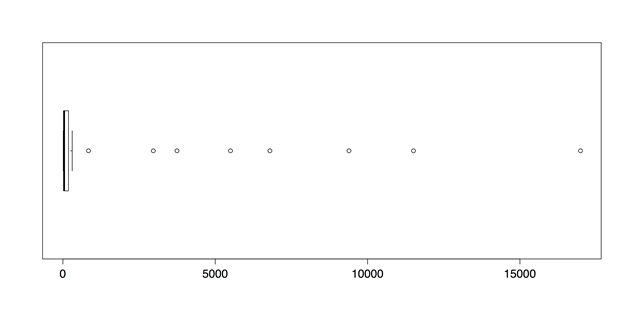
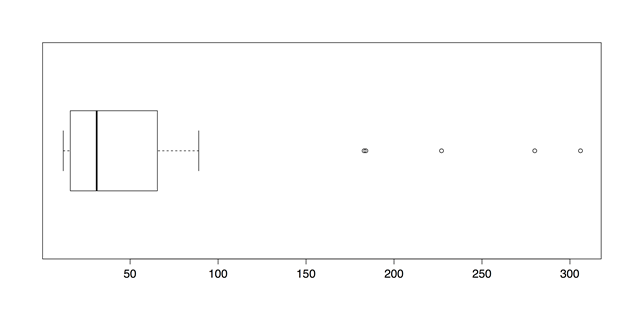
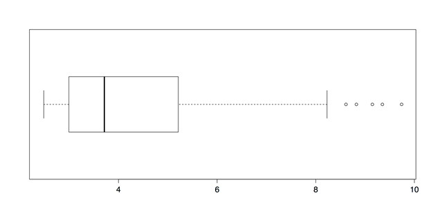

# 第四章修改数据

我相信所有的数据都能告诉一个细心的分析师一些有价值的东西。问题是你能从数据中得到的故事可能不是你需要的故事。获得与你的研究问题更接近的结果的一种方法是修改数据。在本章中，我们将讨论四种可以帮助您从数据中获得更多见解的修改:补偿异常值、转换分布、创建复合变量以及处理丢失的数据。

## 异常值

异常值会严重扭曲分析，结果要么会误导，要么毫无意义。有几种处理异常值的常用方法:

*   让他们进来。如果它们是合法的价值，是你的方程式的必要部分，比如计算股票投资组合的价值，那么它们应该保留。
*   **删除它们。**如果你的目标是分析常见案例，那么删除异常值可能是可以接受的。明确你已经这样做了，并给出你的理由。
*   **转换数据。**例如，对于高异常值，使用对数变换可能会有所帮助。再次明确你已经这样做了，并给出你的理由。
*   **使用稳健统计。**均值、修剪均值或各种稳健估计量等度量受异常值的影响较小。然而，这些措施更难实施，而且不符合其他常见的分析，如回归或相关性。

在这一节中，我们将看看最简单的调整:删除异常值。我们将使用来自 R `data sets`包的`islands`数据集。这个数据集包含了超过 10，000 平方英里的 48 块陆地的面积。其中一些测量值是异常值。

检查异常值最简单的方法是使用方框图，使用 R 的`boxplot()`函数，然后使用`boxplot.stats()`中的数字描述进行跟踪。

**样本:样本 _4_1。R**

```r
          # LOAD DATA & INITIAL CHECKS
          require(“datasets”)
          data(islands)  # Areas (in 1k sq mi) of landmasses > 10k sq mi (n = 48)
          boxplot(islands, horizontal = TRUE)  # Many high outliers.
          boxplot.stats(islands)  # Numbers for the boxplot.

```

图 21 显示这个数据集中有许多异常值。事实上，异常值几乎包含了整个测量范围。



图 21:岛屿区域的箱线图(以 1000 平方英里为单位)

`boxplot.stats()`函数给出了箱线图铰链的五个值(不包括异常值)，以及样本大小、中位数的置信区间、[【11】](11.html#_ftn11)和异常值。在该数据集中，上围栏的值为 306[【12】](11.html#_ftn12)，最接近的异常值为 840。要删除异常值，只需选择它们下面的所有值。您可以用这些值创建一个新的数据集，然后用以下代码检查新的分布:

```r
          # DELETE OUTLIERS
          islands.low <- islands[islands < 500]  # Delete 8 highest
          boxplot(islands.low, horizontal = TRUE)
          boxplot.stats(islands.low)

```

图 22 显示了简化数据集的新箱线图:



图 22:岛屿区域的箱线图(删除了 8 个最大的)

可能令人惊讶的是，在这个分布中有五个新的异常值。这是因为我们删除了大约 16%的先前分布，这调整了用于确定异常值的四分位数值。当然，有可能重复这个过程，直到不再有任何异常值。然而，这样的方法，如果没有合理的理论依据，[【13】](11.html#_ftn13)会破坏分析。通常应避免这种临时办法。

保存工作后，您应该清除工作区中不需要的变量、对象或包:

```r
          # CLEAN UP
          detach("package:datasets", unload = TRUE)  # Unloads data sets package.
          rm(list = ls())  # Remove all objects from the workspace.

```

## 转换

当我们在前面的部分遇到异常值时，我们只是删除了它们。虽然这可能是一种权宜之计，但它也会丢失数据，并可能导致扭曲的结论。处理异常值的另一种方法是转换分布。例如，在具有所有正分数和高异常值的分布中，对数变换通常是有效的。这是我们将用于`islands`数据的方法。如果数据仍然是从前面的练习中加载的，那么我们可以直接进行转换。

**样品:样品 _4_2。R**

```r
          # LOGARITHMIC TRANSFORMATION
          islands.ln <- log(islands)  # Compute natural log (base = e)
          boxplot(islands.ln, horizontal = TRUE)  # Almost looks normal.

```

`log()`函数计算自然对数，基数 e 约为 2.718。r 还会计算普通，基数为 10 的测井带`log10()`和二进制，基数为 2 的测井带`log2()`，结果类似。(注意对数对于零是未定义的。如果您的数据中有零，那么您可以在每个分数中添加少量的 0.5 或 1.0 来避免这个问题。)



图 23:测井转换岛屿数据的箱线图

图 23 中转换值的箱线图只有几个异常值。它也比图 21 中的原始分数分布或者图 22 中的修整分布更适合分析。

对数变换不是线性的，因为它对外围分数的影响大于中心分数。然而，这是一种保存信息或可逆的转换。也就是说，可以通过将分数提高到适当的指数来撤销转换，并准确地重新创建原始数据。相比之下，接下来的两个转换会丢失信息。然而，每一个都有它自己的位置，并且根据数据和分析问题的性质可能是有用的。

这些信息丢失转换中的第一个是排名。分数按顺序排列，最高或最低分数的等级为 1。分数的顺序保持不变，但分数之间的距离消失了。一个重要的考虑是如何处理平均分。r 给出了“平均”、“第一”、“随机”、“最大”和“最小”的选择(更多信息见`?rank`)。如果使用随机，那么分数直方图是平的，因为每个分数只出现一次。

```r
          # RANK TRANSFORMATION
          islands.rank <- rank(islands, ties.method = "random")  # Ranks islands

```

我们将讨论的最后一种数据转换方法是二分法，或者将分数分为两类，如高和低。这种转换丢失了所有信息中的大部分信息，但对于具有合理或自然出现的间断的强偏斜分布是有用的。在岛屿数据中，有这样一个自然发生的分裂:在八个外围分数中，七个是大陆。将大陆和岛屿分开是合理的，因此一分为二的分裂可能是合适的。所需要的只是一个命令，该命令为任何低于某个临界值的案例分配 0 分，为高于临界值的案例分配 1 分。在这个数据集中，最大的岛屿格陵兰岛的面积为 804(即 804，000 平方英里)，而最小的大陆澳大利亚的面积为 2968，即近 300 万平方英里。因此，这两者之间的任何值都可以作为截止值。在下面的代码中，1000 分作为临界值。

需要注意的是，虽然可以用一对`if`语句或者一个`if`和`else`来进行二分，但是用一个`ifelse`语句稍微简洁一些(见`?ifelse`)。这个函数有三个参数:

1.该测试，在这种情况下为`islands > 1000`。

2.如果测试结果为正，则返回的值，在这种情况下为`1`。

3.如果测试结果为负，则返回的值，在这种情况下为`0`。

该函数然后输入一个名为`continent`的新变量，并为所有的大陆分配一个`1`，为所有的岛屿分配一个`0`。在这个例子中，我还通过使用命令`continent[continent == 1]`列出了所有的大陆，该命令要求打印出`continent`的所有行，其中`continent`的值等于`1`。

```r
          # DICHOTOMIZATION
          continent <- ifelse(islands > 1000, 1, 0)  # Creates the indicator variable.
          continent  # List islands and 0/1 for continent.
          continent[continent == 1]  # List just the continents.
                 Africa    Antarctica          Asia     Australia        Europe
                      1             1             1             1             1
          North America South America
                      1             1

```

根据您的数据和研究问题，这四种转换中的每一种都是合适的。选择方法时最重要的标准是它是否能为你的目的提供信息，这是一个重要的分析判断。

保存工作后，您应该清除工作区中不需要的变量、对象或包:

```r
          # CLEAN UP
          detach("package:datasets", unload = TRUE)  # Unloads data sets package.
          rm(list = ls())  # Remove all objects from workspace.

```

## 复合变量

分析中的一个常见任务是创建复合变量，或者由其他变量组成的变量。常见的例子包括总和、平均值或加权指数分数。r 有两个内置功能，使得前两个任务变得简单:`rowSum()`和`rowMeans()`。然而，这些函数的一个不幸的要求是，整个数据集必须由数值组成，并且所有变量必须按顺序包含。(这与 SPSS 甚至 Excel 之类的程序形成对比，后者允许您挑选变量以及变量的输入顺序。)这个问题的解决方案是创建一个子数据框架，其中只包含您需要的变量，如下面的代码所示。我们将从输入一个包含三个数字变量和一个字符串变量的小数据集开始。

**样品:样品 _4_3。R**

```r
          # ENTER DATA
          data1 <- read.table(
                   header = TRUE, # First row is the header.
                   # No comments within the data.
                   text = '
                   A  B  C   D
                   5  3  1  D1
                   2  4  6  D2
                   6  7  8  D3
                   ')
          data1  # check data

```

`rowSum()`和`rowMeans()`函数不能包含字符串变量，所以我们可以创建第二个不包含它的数据集:

```r
          # CREATE DATA FRAME WITH NUMERIC VARIABLES ONLY
          data2 <- data1[, 1:3]  # Exclude the string variable.
          data2  # Check the data.

```

也可以使用连接函数`c()`跳过中间变量。例如，如果有七个变量，我们想包含变量 1、2、3、5 和 7，但首先是 7，我们可以写`data[, c(7, 1:3, 5)]`。

一旦我们有了这个缩减的、只包含数值变量的数据集，我们就可以运行`rowSum()`和`rowMeans()`函数了。首先是:

```r
          # AVERAGE ACROSS BOTH VARIABLES
          # ROW SUMS
          rowSums(data2)
          [1]  9 12 21

```

这是第二个:

```r
          # ROW MEANS
          rowMeans(data2)
          [1] 3 4 7

```

如果在创建辅助数据帧之前执行其他算术函数，则这些函数也是可能的。保存工作后，您应该清除工作区中不需要的变量和对象:

```r
          # CLEAN UP
          rm(list = ls())  # Remove all objects from workspace.

```

## 缺失数据

缺失数据会给分析带来巨大挑战。在 R 中，丢失的数据通常被编码为`NA`，表示“不可用”[【14】](11.html#_ftn14)R 中的某些函数能够容纳丢失的数据，但其他函数不能。因此，知道如何处理丢失的数据是有帮助的。通常有两种方法:删除或忽略缺失的数据，或者通过插补用有效值替换缺失的值。

**样品:样品 _4_4。R**

```r
          # DATA WITH NA
          x1 <- c(1, 2, 3, NA, 5)  # Sample data with NA
          summary(x1)  # "summary" still works with NA
             Min. 1st Qu.  Median    Mean 3rd Qu.    Max.    NA's
             1.00    1.75    2.50    2.75    3.50    5.00       1
          mean(x1)  # But "mean" doesn't
          [1] NA

```

在前面的例子中，R 的`summary()`函数能够处理缺失的数据，但是密切相关的函数`mean()`则不能。如果任何值是`mean()`的`NA`，那么返回值也是`NA`。

在大型数据集中，哪些案例缺少数据可能并不明显。R 函数`which()`和`is.na()`的组合可以给出指定变量中任意 NA 值的索引号。

```r
          # FIND NA
          which(is.na(x1))  # Gives index number of NA
          [1] 4

```

通过包含`na.rm = TRUE`，可以告诉 R 忽略某些函数中的 NA 值，如`mean()`。

```r
          # REMOVE NA
          mean(x1, na.rm = TRUE)  # Removes NA from calculations         
          [1] 2.75

```

在其他情况下，尤其是多元分析，用其他有效值替换缺失值可能更有帮助。这可以通过`is.na()`和一个值来代替丢失的值，如 0。

```r
          # REPLACE NA 1: IS.NA
          x2 <- x1  # Copies data to new object
          x2[is.na(x2)] <- 0  # If item in x2 is NA, replace with 0
          x2  # Show revised data
          [1] 1 2 3 0 5

```

替换缺失值的更好方法是使用平均值或其他值。这种方法被称为插补，可以通过将`x2[is.na(x2)] <- 0`中的`0`替换为`mean(x2, na.rm = TRUE)`来使用之前的代码来实现。(这要求首先复制原始变量。)也可以创建一个新变量，用一个`ifelse()`命令估算平均值:

```r
          # REPLACE NA 2: IFELSE
          x3 <- ifelse(is.na(x1), mean(x1, na.rm = TRUE), x1)  # Impute mean
          x3  # Show revised data
          [1] 1.00 2.00 3.00 2.75 5.00

```

这些是处理缺失数据的一些非常基本的方法。缺失数据的处理是研究的一个活跃领域，R 为此开发了很多包，因为这些包经常更新或发布，所以我鼓励大家看看 R 的官方 [CRAN 网站](http://cran.r-project.org/web/packages/available_packages_by_name.html)或第三方 [CRANtastic](http://crantastic.org/) 。

最后，一旦你保存了你的工作，你应该用`rm(list = ls())`清除工作空间中不需要的变量和对象。