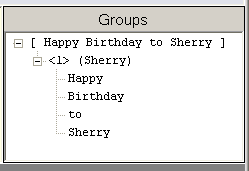

# 第九章正则对象

在本章中，我们将回顾由正则表达式匹配调用返回的各种正则表达式对象。这些对象中有很多关于匹配位置、组等的细节。

## 匹配对象

match 对象(我们在第 2 章中简单讨论过)直接从 Regex Match()方法返回，或者 Regex Matches()方法返回一个集合，其中集合中的每一项都是 Match 对象。您可以使用属性来浏览匹配过程中收集的信息。

### 属性

下列属性返回有关整个表达式结果的信息:

*   index:index 属性返回字符串中找到匹配项的从零开始的位置。
*   长度:Length 属性返回表达式捕获的结果的长度。
*   成功:这是一个布尔值，指示是否找到匹配。
*   value:value 属性是表达式找到的实际结果字符串。
*   Groups Collections:返回正则表达式引擎找到的单个组对象的集合。如果不指定任何组，此集合可以为空。否则，它将包含在处理表达式时找到的组对象列表。

### 捕获收藏

当正则表达式引擎解析字符串时，它将在处理时捕获文本的每个元素，寻找匹配项。大多数正则表达式引擎在此过程中继续搜索时会丢弃匹配项，但微软引擎会将这些丢弃的匹配项保存在一个名为“捕获”的集合中。为了说明，让我们考虑下面的正则表达式来获得一个句子中的单词列表: **\b(\w+\s*)+**

表 12:示例正则表达式

| 英国规则 | 正则模式 |
| --- | --- |
| 从单词边界开始 | `\b` |
| 开始一个小组 | `(` |
| 在组内，查找单词 | `\w+` |
| 后跟任意数量的空格 | `\s*` |
| 关闭群组 | `)` |
| 分组可以发生一次或多次 | `+` |

句子中的每个单词都被认为是匹配的；然而，只有句子中的最后一个词被分配到组中。虽然其他单词将作为不匹配被丢弃，但是当使用 Microsoft 的 regex 对象时，您可以在 captures 集合中找到它们。

如果我用上面的模式祝我的朋友雪莉生日快乐，我会得到下面的树形结构:

图 5:树结构

第一组是句子 **< 1 >** ***【雪莉】*** 中的最后一个单词，捕获(丢弃的匹配)是句子中的每个单词，包括分配给该组的最后一个单词。

我们将在下一章更详细地探讨组和捕获。

## 组对象

组对象包含与匹配对象相似的属性，提供了有关子表达式搜索结果的详细信息。

### 属性

下列属性返回有关子表达式结果的信息。

*   索引:返回字符串中找到匹配项的从零开始的位置。
*   长度:返回子表达式捕获的结果的长度。
*   成功:这是一个布尔值，指示是否找到匹配。
*   值:子表达式找到的实际结果字符串。
*   捕获集合:每个组子表达式还将包含从组中定义的子表达式捕获的搜索结果的集合。

## 捕捉对象

捕获对象包含每个搜索文本结果的基本信息。它可以从匹配对象的捕获集合或组对象的捕获集合中获得。它允许您获取为整个表达式或单个组子表达式返回的所有文本。

### 属性

以下属性返回有关在表达式搜索过程中评估的搜索文本的信息。请注意，在组方案中，最后评估的搜索文本在组对象中返回，并且也出现在捕获集合中。

*   索引:返回字符串中找到匹配项的从零开始的位置。
*   长度:返回子表达式捕获的结果的长度。
*   值:值包含子表达式找到的实际结果字符串。