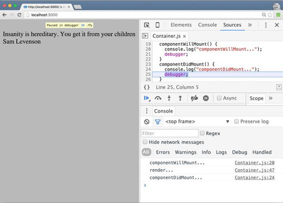

# 八、组件生命周期

每个 React 组件都有一个故事。

故事从我们定义组件类开始。这就是我们每次想要在浏览器中创建一个组件实例时使用的*模板*。

让我告诉你一个`Quote` 组件的故事，我们将使用这个组件在网页上显示有趣的短引号。`Quote`的故事从我们定义它的类开始，它可能从一个如下的模型开始:

代码清单 55:报价组件模型

```jsx
  class
  Quote extends React.Component {
    render()
  {

  return (

  <div className="quote-container">

  <div className="quote-body">Quote body here...</div>

  <div className="quote-author-name">Quote author here...</div>

  </div>

  );

  }
  }

```

组件类是我们应该用来表示单引号元素的标记的指南。通过查看本指南，我们知道我们将显示引用正文及其作者姓名。然而，前面的定义只是一个报价的模型。为了使组件类有用并能够生成不同的报价，定义应该是通用的。

例如:

代码清单 56:通用报价组件

```jsx
  class
  Quote extends React.Component {

  render() {

  return (

  <div className="quote-container">

  <div className="quote-body">{this.props.body}</div>

  <div className="quote-author-name">{this.props.authorName}</div>

  </div>

  );

  }
  }

```

这个模板现在可以用来表示任何报价对象，只要它有一个`body`属性和一个`authorName`属性。

我们的`Quote`组件故事还在继续；它历史上的下一个重大事件是当我们*实例化*它的时候。这是当我们告诉组件类*从模板生成*一个副本来表示一个实际的报价数据对象。

例如:

代码清单 57:报价反应元素

```jsx
  <Quote
  body="..." authorName="..." />

```

实例化的`<Quote />`元素现在是足月的，准备成为*出生的*。我们可以在某个地方渲染它(例如，在浏览器中)。

让我们定义一些实际数据来帮助我们完成组件生命周期中的下一个事件。

代码清单 58:报价数据

```jsx
  var
  quotesData = [

  { 

  body: "Insanity is hereditary. You get it from your children", 

  authorName: "Sam Levenson" 

  },

  { 

  body: "Be yourself; everyone else is already taken", 

  authorName: "Oscar Wilde" },

  { 

  body: "Underpromise and overdeliver", 

  authorName: "Unknown" 

  },

  ...
  ];

```

为了在浏览器中呈现第一个引用，我们首先用一个表示数据中第一个引用的对象来实例化它:`quotesData[0]`。

代码清单 59:实例化一个反应元素

```jsx
  var
  quote1 = quotesData[0];

  var
  quote1Element = <Quote body={quote1.body}

  authorName={quote1.authorName} />;

  //
  Or using the spread operator
  var
  quote1Element = <Quote {...quote1} />;

```

我们现在有了一个官方的`<Quote />`元素(`quota1Element`，它代表了我们报价数据中的第一个对象。

我们来看看它的内容。

代码清单 60: `renderToStaticMarkup`

```jsx
  console.log(ReactDOMServer.renderToStaticMarkup(quote1Element));

  //
  Output
  <div
  className="quote-container">

  <div className="quote-body">

  Insanity is hereditary. You get it from your children.

  </div>

  <div className="quote-author-name">

  Sam Levenson
    </div>
  </div>

```

根据组件类中定义的 HTML 模板，输出将是一个代表数据中第一个引用的大字符串。

我们使用`renderToStaticMarkup`来检查内容，它的工作方式就像`render`一样，但是不需要 DOM 节点。`renderToStaticMarkup`如果我们想从数据中生成静态 HTML，这是一个有用的方法。还有一种`renderToString`方法与此类似，但与客户端的 React 的虚拟 DOM 兼容。我们可以使用it 在服务器端生成 HTML，在应用的初始请求时发送给客户端。这使得页面加载更快，并允许搜索引擎抓取您的应用程序并查看实际数据，而不仅仅是带有一个空 HTML 节点的 JavaScript。

|  | 注意:利用为初始请求呈现 HTML 的技巧的应用程序被称为通用应用程序(或同构应用程序)。他们使用相同的组件为任何客户端(包括搜索引擎机器人)呈现一个现成的 HTML 字符串。普通客户端也将获得静态版本，他们可以用它开始他们的过程。例如，如果我们在客户端给 React 一个使用相同组件在服务器端生成的静态版本，React 将从一开始什么都不做开始，它将只在状态改变时更新 DOM。 |

`renderToString`和`renderToStaticMarkup`都是`ReactDOMServer`库的一部分，我们可以从`react-dom/server"`导入。

代码清单 61: `ReactDOMServer` (ES2015 导入语法)

```jsx
  import
  ReactDOMServer from "react-dom/server";

  //
  For static content
  ReactDOMServer.renderToStaticMarkup(<Quote
  {...quote1} />);

  //
  To work with React virtual DOM
  ReactDOMServer.renderToString(<Quote
  {...quote1} />);

```

然而，在客户端，我们希望我们的应用程序是交互式的，所以我们需要使用常规的`ReactDOM.render`方法来渲染它。

代码清单 62:组件实例

```jsx
  ReactDOM.render(

  <Quote {...quote1} />,

  document.getElementById("react")
  );

```

一个`Quote`组件实例现在在浏览器中，完全挂载，并且是浏览器的原生 DOM 的一部分。

React 有两种生命周期方法，我们可以使用它们在组件实例装入 DOM 之前或之后注入定制行为。这些是`componentWillMount`和`componentDidMount`。

理解这些生命周期方法的最好方法是在我们的组件类中定义它们，并在两者中放置一个调试器行。

代码清单 63:理解生命周期方法

```jsx
  class
  Quote extends React.Component {

  componentWillMount() {

  console.log("componentWillMount...");

  debugger;

  }

  componentDidMount() {

  console.log("componentDidMount...");

  debugger;

  }

  render() { ... }
  }

```

如果我们现在在浏览器中运行这个，开发工具将停止执行两次调试。

第一站将在`componentWillMount`。React 公开了这个方法，让我们在将组件实例的 DOM 写入浏览器之前编写自定义行为*。在下图中，请注意此时浏览器的文档仍然是空的。*

 *

图 5: `componentWillMount()`调试器行

第二站将在`componentDidMount()`。在组件实例的 DOM 被写入浏览器后，React 为我们公开了这个方法来编写自定义行为*。在下图中，请注意浏览器的文档将如何在这一点上显示我们第一个报价的 HTML。*

 *

图 6: `componentDidMount()`调试器行

React 公开了用于更新和卸载组件的其他生命周期方法。每种生命周期方法都有特定的优势和用例。我将为每种方法举一个实际的例子，这样你就可以在上下文中理解它们。

React 在试图将组件实例呈现给目标之前调用该方法。这在客户端(当我们使用`ReactDOM.render`时)和服务器(使用`ReactDOMServer`渲染方法)上都有效。

实例

我们希望每次使用我们的`Quote`组件呈现报价时，都在数据库中创建一个日志条目。这应该包括报价渲染服务器端搜索引擎优化(SEO)的目的。由于`componentWillMount`是在客户端和服务器端触发的，所以它是实现该功能的理想场所。

假设 API 团队为我们编写了一个端点供我们使用，并且我们只需要发布到`/componentLog`并将组件的名称及其使用的道具发送给它，并且还假设我们有一个 AJAX 库(例如像`jQuery.ajax`)，我们可以这样做:

代码清单 64: `componentWillMount()`

```jsx
  componentWillMount()
  {

  Ajax.post("/componentLog", {

  name: this.constructor.name,

  props: this.props

  });
  }

```

React 在浏览器中成功装载组件实例后立即调用该方法。这只有在我们使用`ReactDOM.render`时才会发生。当我们使用`ReactDOMServer`渲染方法时，React 不会调用`componentDidMount`。

`componentDidMount`是让我们的组件与插件和 API 集成以定制渲染的 DOM 的理想场所。

实例

老板希望您将一个应用编程接口集成到`Quote`组件中，以显示报价有多受欢迎。要获得报价的当前受欢迎程度，您需要点击一个 API 端点:

`https://ratings.example.com/quotes/<quote-text-here>`

API 会给你一个 1 到 5 之间的数字，你可以用它来显示五星等级的受欢迎程度。

boss 还要求不要在服务器端实现这个特性，因为它会降低初始呈现的速度，并且这个特性不应该阻止在客户端呈现报价。报价应该立即呈现，一旦我们有了它的星级值，就显示它。

我们不能在这里使用`componentWillMount`，因为它在服务器和客户端渲染调用中都被调用。另一方面，`componentdDidMount`仅在客户端调用时被调用。

因为我们需要在组件的某个地方显示星级编号，并且因为它不是组件道具的一部分，而是从外部源读取的，所以我们需要将其作为组件状态的一部分，以确保当星级变量获得值时，React 将触发组件的重新渲染。

我们可以这样做:

代码清单 65: `componentDidMount()`

```jsx
  componentDidMount()
  {

  Ajax.get(`https://rating.example.com/quotes/${this.props.body}`)

  .then(starRating => this.setState({ starRating }));
  }

```

一旦报价显示在浏览器中，我们就向应用编程接口发起一个请求，当我们从应用编程接口获得数据时，我们将告诉反应通过使用`setState`调用来重新呈现组件的 DOM(现在将有星级)。

|  | 注意:在 componentDidMount 内部使用 setState 时要小心，因为它通常会导致两倍的浏览器呈现操作。 |

集成 jQuery 插件是另一个流行的任务，其中`componentDidMount`是一个很好的选择，但是要小心——当我们将事件侦听器添加到已装载组件的 DOM 时，如果组件被卸载，我们需要移除它们。React 为此公开了生命周期方法`componentWillUnmount`。

为了查看组件生命周期方法的其余部分，让我们在报价应用程序中添加控制按钮，使用户能够浏览我们拥有的所有报价。到目前为止，我们只展示了第一句话。

让我们创建一个`Container`组件来托管当前活动的报价实例以及我们需要的所有控制按钮。这个`Container`组件需要的唯一状态是当前报价的索引。为了显示下一个报价，我们只需增加索引。

`Container`组件类似于:

代码清单 66: `Container`组件

```jsx
  class
  Container extends React.Component {

  constructor(props) {

  super(props);

   this.state = { currentQuoteIdx: 0 };

  }

  render() {

  var currentQuote = this.props.quotesData[this.state.currentQuoteIdx];

  return (

  <div className="container">

  <Quote {...currentQuote } />

  <hr />

  <div className="control-buttons">

  <button>Previous Quote</button>

  <button>Next Quote</button>

  </div>

  </div>

  );

  }
  }

```

我们用它来:

代码清单 67:使用`Container`组件

```jsx
  ReactDOM.render(

  <Container quotesData={quotesData} />,

  document.getElementById("react")
  );

```

这是我们此时应该在浏览器中看到的内容:


图 7:一个报价和按钮

现在让我们让按钮工作。我们所需要做的就是增加或减少按钮点击处理程序中的`currentQuoteIdx`。

有一种方法可以做到:

代码清单 68: `nextQuote`函数

```jsx
  nextQuote(increment)
  {

  var newQuoteIdx = this.state.currentQuoteIdx + increment;

  if (!this.props.quotesData[newQuoteIdx]) {

  return;

  }

  this.setState({ currentQuoteIdx: newQuoteIdx });
  }

```

在`Container`组件类中定义`nextQuote`功能。

`if`语句防止超出我们的数据限制—单击第一个报价上的“上一个报价”或最后一个报价上的“下一个报价”将不起任何作用。

|  | 注意:if 语句检查是我们应该做的最小验证。如果不能点击按钮，也应该禁用按钮。试着自己实现它。 |

下面是我们点击按钮时如何使用`nextQuote`处理程序:

代码清单 69:按钮点击处理程序

```jsx
  <button
  onClick={this.nextQuote.bind(this, -1)}>

  Previous Quote
  </button>
  <button
  onClick={this.nextQuote.bind(this, 1)}>

  Next Quote
  </button>

```

这里的绑定调用基本上是用另一个函数包装我们的`nextQuote`函数的一种奇特方式，但是这个新的外部函数会记住每个按钮的增量变量值。

现在就去试试按钮。他们应该工作。

每次我们点击按钮(假定处理程序中的`if`语句为假)，我们就更新`<Quote />`元素的 DOM。我们通过控制传递给坐骑`<Quote />`的道具来进行反应。

以下是更详细的情况:

*   用户点击“下一个报价”按钮。
*   `<Container />`实例获取`currentQuoteIdx`状态的新值。
*   React 通过触发其`render()`功能来响应`<Container />`中的状态变化。
*   React 为`<Container />`实例计算新的 DOM，这包括重新渲染`<Quote />`实例。由于`currentQuoteIdx`增加了，`currentQuote`对象现在将不同于我们以前使用的对象。
*   在某种程度上，React *用新道具更新*挂载的`<Quote />`实例。

在这个过程中，如果需要的话，React 会调用四种生命周期方法来定制行为。让我们看看他们的行动。

代码清单 70: `Quote`更新生命周期方法

```jsx
  class
  Quote extends React.Component {

  componentWillReceiveProps() {           

  console.log("componentWillReceiveProps...");

  debugger;

  }

  shouldComponentUpdate() {

  console.log("shouldComponentUpdate...");

  debugger;

  return true;

  }

  componentWillUpdate() {

  console.log("componentWillUpdate...");

  debugger;

  }

  componentDidUpdate() {

  console.log("componentDidUpdate...");

  debugger;

  }

  render() { ... }
  }

```

现在刷新你的浏览器，注意这些`console.log`行在第一个报价的初始渲染中不会出现。然而，当我们点击**下一个报价**时，我们会看到他们一个接一个地开火。

我在这里添加了调试器行，让您看到这四个阶段之间的用户界面状态。对于前三个，浏览器的 DOM 仍然会显示旧的引用，一旦到达`componentDidUpdate`调试器行，您将在浏览器中看到新的引用。

让我用实际例子来解释这些方法。

每当用一组新的道具调用一个挂载的组件时，React 将调用这个方法，传递新的道具作为参数。

实例

您编写了一个随机偶数生成器函数`generateEvenRandomNumber`，并在组件`TestRun`中使用它，使用`setInterval`调用每秒钟在浏览器中呈现一个随机偶数。

代码清单 71: `TestRun`

```jsx
  //
  Render every second:
  <TestRun
  randomNumber={generateEvenRandomNumber()} />

```

为了测试生成器代码的准确性，您在浏览器中渲染了 100 个这样的`<TestRun />`实例，并让计时器运行一段时间。

您希望确保没有用奇数渲染任何组件。不用看组件，可以用`componentWillReceiveProps`让组件“记住”是否用奇数渲染，以及这种情况发生了多少次。

代码清单 72: `TestRun`组件

```jsx
  class
  TestRun extends React.Component {

  constructor(props) {

  super(props);

  this.state = { badRuns: 0 };

  }  

  componentWillReceiveProps(nextProps) {

  if (nextProps.randomNumber % 2 === 1) {

  // Bad Run. Log it.

  this.setState({ badRuns: this.state.badRuns + 1 });

  }

  }

  render() { ... }
  }

```

|  | 注意:即使 nextProps 与 currentProps 相同，React 也会触发 componentWillReceiveProps 方法。虚拟 DOM 操作决定了是否应该对 DOM 进行渲染。 |

这是一种特殊的方法。如果你注意到了，当我们测试更新生命周期方法时，这是我们返回`true`的唯一一个。

这个方法和`componentWillReceiveProps`类似，但是有一些区别:

*   除了`nextProps`，React 也传递一个`nextState`对象给这个方法。
*   如果我们用这种方法写返回`false`的代码，更新过程就会停止，组件也不会更新。这就是我们之前测试`shouldComponentUpdate`时返回`true`的原因。继续测试返回`false`，看看“下一步”和“上一步”按钮是如何停止工作的。

这种方法可以用来提高某些反应组件的性能。例如，如果一个组件在`render`函数中只使用其道具和状态，而没有全局，我们可以将当前道具和状态与`shouldComponentUpdate`中的`nextProps`和`nextState`进行比较，如果该组件接收到相似的值，则返回`false`。

在`render`功能中只读取道具和状态的组件称为*纯组件*。它们非常类似于纯函数，因为它们的返回值(`render`的输出)仅由其输入值(`props`和`state`决定。

对于纯组件，我们可以安全地执行以下操作:

代码清单 73:纯组件

```jsx
  class
  PureComponentExample extends React.Component {

  shouldComponentUpdate(nextProps, nextState) {

  return notEqual(this.props, nextProps) || 

  notEqual(this.state, nextState);

  }

  render() {

  // Read only from
  this.props and this.state

  // Don't use any global state

  }
  }

```

`notEqual()`是一个可以比较两个对象的键值的函数。

实例

您有一个组件，它接受一个时间戳属性并呈现它的日期部分，忽略时间。

代码清单 74:日期组件元素

```jsx
  <Date
  timestamp={new Date()} />

```

如果我们频繁渲染这个组件，我们唯一希望它更新的时间是明天，这样我们就可以用`shouldComponentUpdate()`缩短更新过程。

代码清单 75:日期组件`shouldComponentUpdate()`

```jsx
  class
  Date extends React.Component {

  shouldComponentUpdate(nextProps, nextState) {

  return this.props.timestamp.toDateString() !==

  nextProps.timestamp.toDateString();

  }

  render() { ... }
  }

```

当一个安装的组件接收到新的道具时，或者当它的状态改变时，React 调用`componentWillUpdate`方法。这发生在调用`render`函数之前。

注意，如果我们定制`shouldComponentUpdate`并返回`false`，React 将不会调用`componentWillUpdate`。

我们不能在`componentWillUpdate`中使用`setState`。已经太晚了。

实例

在我们的报价应用程序中，我们现在更新一个`<Quote />`实例来呈现多个报价。当我们单击下一个报价按钮时，我们在`componentWillMount`中所做的数据库日志条目将不会被调用。`componentWillMount`仅在初始渲染时调用。

对于这个例子，我们可以使用`componentWillUpdate`来调用我们在`componentWillMount`中使用的完全相同的代码。

代码清单 76: `componentWillUpdate()`重用代码

```jsx
  logEntry(component)
  {

  Ajax.post("/componentLog", {

  name: component.constructor.name,

  props: component.props

  });
  }
  componentWillMount()
  {

  logEntry(this);
  }
  componentWillUpdate()
  {

  logEntry(this);
  }

```

但是，请注意，每次 React 重新呈现时都会调用此方法，即使它使用完全相同的道具进行呈现。如果我们希望日志条目只在道具改变时出现，我们需要在`componentWillUpdate`中引入一个`if`声明。

在组件更新后以及更改同步到浏览器后，React 调用这个最终方法。如果我们需要访问以前的道具和状态，我们可以从这个方法的参数中读取它们。

就像`componentDidMount`一样，`componentDidUpdate`在我们想要将外部库与我们的组件集成、设置侦听器或使用 API 时很有帮助。

实例

我们的`componentDidMount`示例也适用于`componentDidUpdate`，因为我们通过更新道具进行了更改以呈现新报价。然而，由于本例中我们可能会遇到外部应用编程接口，我们应该小心直接在`componentDidUpdate`中遇到，因为我们可能会遇到已经存在的星级值的应用编程接口端点。

对于当前的例子，我们可以做的一件事就是简单地缓存我们从 API 中读取的星级值。

代码清单 77: `componentDidUpdate()`重用代码

```jsx
  setStarRating(ci)
  {

  if (ci.starRatings[ci.props.id]) {

  ci.setState({ starRating: ci.starRatings[ci.props.id] });
      return;
    }

  Ajax.get("https://rating.example.com/quotes/" + ci.props.body)

  .then(starRating => {

  ci.starRatings[ci.props.id] = starRating;

  ci.setState({ starRating });

  });
  }
  componentDidMount()
  {

  setStarRating(this);
  }
  componentDidUpdate()
  {

  setStarRating(this);
  }

```

注意我们如何使用一个组件实例变量(`ci.starRating`)来保存所有 API 调用的缓存。当实例变量的值发生变化时，我们不需要 React 来触发重新呈现调用时，我们可以使用实例变量。

成对的安装和更新生命周期方法之间有很多相似之处，通常您会发现自己将代码提取到另一个函数中，并从多个方法中调用该函数(这就是我们在前面的示例中所做的)。然而，这种分离有时是有帮助的，尤其是当您想要将第三方代码(如 jQuery 插件)与您最初呈现的 DOM 集成时。

你应该知道的最后一个生命周期方法是`componentWillUnmount`。

React 在试图从 DOM 中移除组件实例之前调用这个方法。

要查看这方面的示例，请在`Quote`类上放置一个`componentWillUnmount`方法。

代码清单 78: `componentWillUnmount()`

```jsx
  componentWillUnmount()
  {

  console.log("componentWillUnmount...");
  }

```

然后尝试从 DOM 中移除所有挂载的内容。`ReactDOM`对此有一个方法。

代码清单 79: `unmountComponentAtNode()`

```jsx
  ReactDOM.unmountComponentAtNode(document.getElementById("react"));

```

这将卸载作为参数传递给它的元素中呈现的任何 React 组件。我们应该在控制台上看到从`componentWillMount`开始的`console.log`线。

实例

当我们在`componentDidMount`设置监听器或启动定时器时，我们应该在`componentWillUnmount`清除它们。

代码清单 80:启动和停止监听器

```jsx
  componentDidMount()
  {
    // start listening for event X
  when triggered by Y
  }
  componentWillUnmount()
  {
    // stop listening for event X when
  triggered by Y
  }

```**