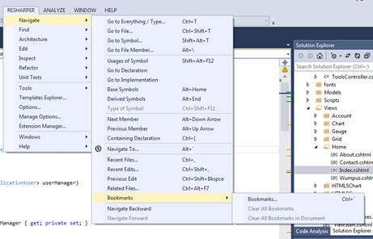
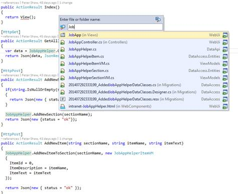
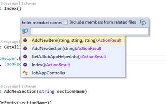
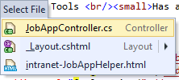
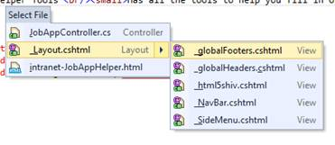
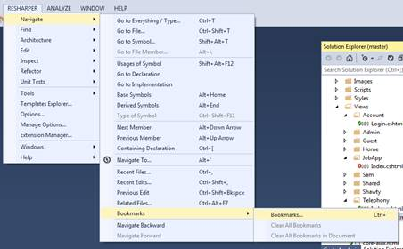
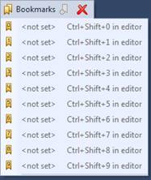

# 第三章导航工具

在本章中，我们将更深入地了解 ReSharper 导航菜单上提供的工具。

如果您通过转到 **RESHARPER** > **导航来展开主导航菜单，**您应该会看到以下内容:

图 33: R#导航工具菜单

顾名思义，导航菜单及其选项可以帮助您以最快的方式找到解决方案。

您已经在上一章中看到了一些导航功能，当时我们使用 F12 在视图和控制器之间移动。然而，F12 就像它在标准的 Visual Studio 中一样，仍然会带您进入方法、变量或类的定义。

试一试:将光标放在应用程序中的某个变量或方法上，按**F12**；你会看到它的行为是一样的。然而，你也应该尝试一些你没有源代码的东西。如果您这样做了，您应该会发现，与其像大多数版本的 VS 一样什么都不做，不如直接将您放入正在检查的对象或界面上的对象浏览器中。

|  | 注意:我知道在 Visual Studio 的某些版本中，您确实获得了更好的导航功能。例如，如果您在专业版或更高版本的 VS2013 中的 MVC 属性上尝试这一点，那么您实际上会得到一个重构的源类，VS 会为您动态构建该类。VS 的许多这些高级特性只在高端产品中可用，所以就本书而言，除非您有可用的源代码，否则许多版本什么也做不了的事实是正确的。 |

谈到 R#，F12 只是冰山一角。在本章的剩余部分，我将一个更复杂的解决方案加载到了我的 VS2013 副本中；如果你真的想充分探索导航命令，我强烈建议你也这样做。我加载的项目包含九个独立的项目、八个类库和一个 ASP.NET MVC 前端。如果您没有包含相当多移动部件的解决方案，您可能会发现许多菜单选项仍然处于禁用状态。即使我加载了解决方案，我仍然会在一些菜单上看到模糊的选项。

### 去一切

导航菜单上的前四个选项都是“转到……”的衍生词，作为开发人员，这些都是一组您会很高兴看到的转到选项。

第一个，**万事俱备/类型**，算是高手过招。将其放在类型、方法、枚举或类上，然后按下 **Ctrl+T** 或从 VS 主菜单栏导航菜单。您应该会看到 R#现在著名的弹出式菜单之一出现:

图 34:上下文相关的“进入所有内容/类型”弹出式菜单

在这个例子中，我在我的 MVC 动作中将我的光标放在`JobAppHelper`调用上。然后我按下 **Ctrl+T** ，ReSharper 立刻打开了一个菜单，里面显示了两件事。

第一个是我最近使用的两个项目的列表，在我的例子中是我的两个 JobApp 助手文件。

二是搜索框；我在这里输入的任何内容都会被过滤到包含我输入的短语的选项列表中。如果我在这里输入“JobApp”，那么我所有的类、对象和模型都将被列出。

使用 Ctrl+T 本质上给了你另一个 R#的专门搜索工具。正如我们在上一章中看到的，在查找要纠正的代码问题时，按下 Ctrl+T 键可以选择搜索类型和成员名称，同时保持一定程度的通配符搜索(以防您不太确定如何拼写您要查找的内容)。因为它是上下文感知的，它还会查看它的周围环境，并根据您在代码中的位置建议您可能正在寻找的东西。如果你的目标在建议列表中，只需点击一下它，你就会直接到达那里。

组中的第二个选项，**转到文件**，再次弹出熟悉的 R#菜单，这次允许您在项目中搜索文件名:

图 35:转到文件的 R#弹出菜单

在图 35 中，您可以看到我已经开始键入“job”，并且 R#向我提供了一个可能的文件匹配列表。如果我选择了任何一个匹配项，那么该文件将立即在 VS 编辑器中打开。就像 Visual Studio 中的其他区域一样，您也可以使用缩写搜索。这意味着，例如，您可以输入“jac”(或小写的“JAC”)，这构成了`JobAppController`的首字母，匹配的任何内容都会显示出来

第三个选项**转到符号**，按下 Shift+Alt+T 会打开另一个弹出窗口。这个选项允许您搜索符号用法。

例如，如果您的解决方案中的文件中有一个名为`MyJobCount`的变量(私有或其他)，并且您使用了“转到符号”导航选项，则定义该变量的位置将显示在搜索结果中，允许您直接转到该位置。

例如，当我记得写了一点类似的代码，但记不起完整的方法或类名时，我发现这非常方便。使用 Go to Symbol，您只需要记住方法或类定义中的一些内容，R#将完成剩下的工作。

最后一步是**转到文件成员**命令。该命令只允许您导航到当前打开的文件中的方法和其他定义。

例如，如果我在我的一个控制器上打开它，我会得到以下结果:

图 36:导航到“转到文件成员”弹出菜单

在我的例子中，控制器是一个非常短的控制器，但是想象一下，如果您正在处理一个来自大型电子商务网站的控制器，您可以使用 Alt+\和一个快速通配符轻松高效地从一个动作跳到另一个动作。

菜单上的下一组命令都与我们的 F12 场景有关。

**符号的用法** (Shift+Alt+F12)将列出光标下当前符号的使用位置。以下示例显示了在实体框架数据库集声明上执行的命令:

图 37:符号弹出菜单的用法

您可以清楚地看到该数据表的用法以及它们使用的确切行号和文件名，与所有其他菜单一样，单击其中一个菜单将跳转到该位置。

**转申报****转执行**都是单发命令；如果您将光标放在类型定义上，前者会直接将您带到定义该类型的文件和位置。实现派生类似，但它将直接带您进入类型内的方法实现。

**基本符号**命令将列出基类中派生类型的任何符号。

例如，如果我在实体框架数据上下文类上按 Alt+Home，我会得到以下结果:

图 38:基本符号弹出菜单

正如您在图 38 中看到的，这允许我导航数据上下文所基于的类型和类。如果我选择 **DbContext** 而源代码不可用，就会出现两种情况之一。第一次尝试访问一个对象时，会询问您是否希望 ReSharper 尝试获取源代码或对其进行反编译，或者会询问您是否希望使用对象资源管理器，如图 39 所示。如果你以前做过这个选择，那么下次你会自动得到这个选择。

图 39:通过图 38 中的菜单选择打开的对象浏览器

无论您得到哪一个选项(默认情况下是源代码反编译程序)，您都可以在 ReSharper Options 对话框的适当部分轻松更改默认选项；由于默认情况下，所有版本的 ReSharper 都提供反编译程序，因此您将始终能够反编译正在使用的程序集。对象资源管理器通常是选项列表中的最后一个。

基本符号的反义词是派生符号；如果您将光标放在前面示例中的**数据库上下文**上，并按下 **Alt+End** ，您将稍微向左移动并定位在数据上下文的声明上。

如果您的解决方案中有多个数据上下文，那么在该符号上按 Alt+Enter 会弹出一个列出这两个数据上下文的菜单。派生符号将列出从光标下的符号或接口派生的任何类或类型，并允许您快速导航到它们。

组中的最后一个，**符号类型** (Ctrl+Shift+F11)，导航到光标下方的符号类型。

例如，在图 34 中，您看到我们可以在类型`JobAppHelper`中导航和搜索方法和类。此外，您应该能够在图像中看到，我们将调用的结果分配给了一个名为`data`的变量，该变量是使用 C# `var`关键字定义的。

如果稍后在代码中您正在使用`data`变量，但是不确定它来自哪个类，将光标放在名称的`data`部分并按下 Ctrl+Shift+F11 将立即进入`JobAppHelper`类的定义。

### 【目标】超越目标

转到导航菜单的其余部分:

图 40:导航菜单上的剩余选项

**下一个成员**和**上一个成员**将在你的源文件中上下移动你，在变量、属性和方法声明中自动定位你。这很像使用 Alt+PageUp 和 Alt+PageDown 从一个检查移动到另一个检查，除了您可以立即在代码的主要块周围跳转，而不必滚动。

**包含声明**将您跳转到您所在的当前成员的容器。例如，如果您有一个名为`Customer`的类，并且在该类中有一个名为`FindAddress`的方法，将光标定位在`FindAddress`上并按下 Ctrl+【将把您定位在类定义上，因为该类是该方法的父类，这对于快速导航到类的顶部非常方便。

**最近的文件**在被调用时应该会产生一个弹出菜单，如下所示:

图 41:最近的文件导航菜单

此弹出式菜单允许您直接转到您最近使用过的任何文件。

**最近的编辑**选项非常相似，但它显示的不是文件列表，而是当前解决方案中所有文件的最新编辑:

图 42:最近编辑导航菜单

Ctrl+Shift+Backspace 将带您回到最近编辑的位置，允许您快速回溯并在需要时撤销更改。

**相关文件**选项在处理 web 和 Razor 视图时最有用，但也可以在 WinForms 代码和其关联的设计器文件之间导航，或者在 XAML 代码和任何绑定视图模型之间导航。在 Visual Studio 中存在文件链接的大多数情况下，ReSharper 可以使用此命令在实例之间快速导航。

如果我们在项目中浏览到一个 Razor 视图，然后按 Ctrl+Alt+F7，我们将获得以下弹出菜单:

图 43:相关文件弹出菜单

因为这是一个 Razor 视图，所以 R#已经正确地识别出该文件有一个附带的控制器，并且它还有一个主布局页面。我在这个应用程序中也使用了聚合，所以 R#也告诉我有一个与之相关联的 HTML 页面，并在菜单上提供它作为选择。使用箭头键和回车键选择其中的任何一个，或者用鼠标单击，将立即将您放入该文件中，以便进行编辑。

如果您将选择栏放在布局条目上并按下右箭头键，您还会看到与布局文件相关的任何文件，根据与布局的关系，这些文件也是当前视图的依赖项。在我的解决方案中，它看起来像这样:

图 44:显示 Razor 布局文件的依赖关系的子菜单

您可以很容易地看到，我的布局文件使用了许多其他部分，我只需按几下键，就可以轻松地将所有这些部分带到我的编辑体验面前。

最后三个，**书签**和**向前/向后导航**，允许你在代码中创建书签点，并轻松来回跳转。

向后导航和向前导航只需查看您的历史记录，然后尝试为您找到最佳导航类型。例如，如果您刚刚执行了编辑并执行了向后导航，R#将选择导航到您的最后一次编辑。如果您最近在文件中向前移动，查看类中的成员，则向前移动将重复移动到下一个成员命令。

像许多 R#的工具一样，向后和向前命令是非常通用和上下文敏感的；这有时会令人沮丧，因为它偶尔会选择错误的导航类型。一旦你学会如何驯服它们，你会发现一切都变得容易多了。

### 书签

R#提供的导航工具中最有用的选项之一就是书签工具。

就像你会在互联网上为网页添加书签一样，或者是海量的网页。在你旁边的桌子上，R#可以让你轻松地做同样的事情。

如果您展开书签子菜单，您应该有一个弹出菜单，如图 45 所示:

图 45: R#书签菜单

最初(除非你已经定义了一些书签而没有意识到)，只有主书签选项可用。单击此按钮将打开书签弹出菜单，看起来应该如下所示:

图 46: R#书签弹出菜单

您最多可以定义九个书签，方法是将光标移动到您想要添加书签的位置，然后按 **Ctrl+Shift+ < *0 到 9* >。**这将在您的源代码旁边的左侧栏中放置一个小书签符号，如图 47 所示:

图 47:显示书签的代码片段

如果随后重新打开书签弹出式菜单，您应该会看到您定义的书签出现:

图 48:显示新定义的书签的书签弹出菜单

有一点你需要注意——当你创建一个书签的时候，如果你同时在左栏有 R#工具图标，你将不能看到你定义的新书签。一旦您将光标从线条上移开，从而隐藏了工具或菜单图标，您将能够看到书签。这让我有点沮丧，我一直按 Ctrl+Shift+ *数字*(从而打开和关闭书签)，认为它不起作用。

移动到书签所在的行并按下 Ctrl+Shift 组合将移除标记，移动到不同的行并按下现有书签的组合将书签移动到该位置。

最后，如果您想导航到您创建的书签，只需按 Ctrl+ < *0-9* >，其中数字是您想要导航到的书签的编号，或者按 Ctrl+并使用弹出菜单选择您想要导航到的书签。

这就是我们要说的——这些是 R#的工具，用来绕过你的项目代码。

正如您所看到的，已经对每个选项的具体行为进行了大量思考，虽然有一些重叠，但您可以看到使用键盘快捷键比必须一直导航到菜单要快得多。

这里的关键是练习。你在工作流程中使用这些组合键越多，它们就会变得越自然。将它们与常规的 Visual Studio 按键一起使用，不久之后，您将会发现没有它们的情况下您是如何做到的。

在我们继续之前，有一个随机且有用的快捷键应该始终保留在内存中，那就是 Shift+Alt+L(在解决方案资源管理器中定位)，它将突出显示您当前正在解决方案资源管理器中编辑的文件。