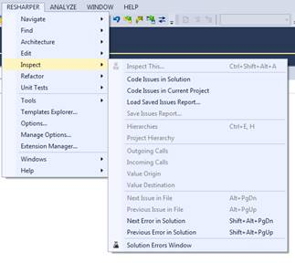
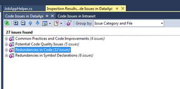
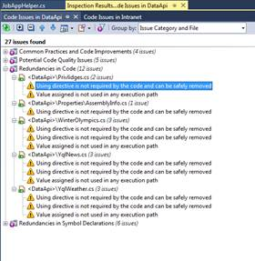
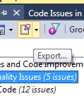
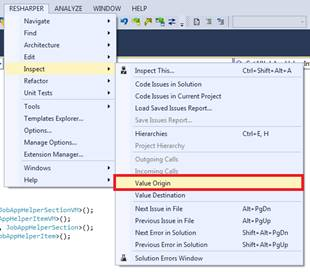
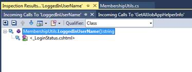
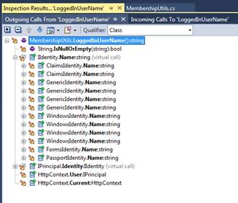

# 第六章代码检查工具

ReSharper 的一个主要特性是它能够告诉你在哪里可以改进你的代码，虽然很多这种功能几乎是自动的，但有很多东西隐藏在引擎盖下，帮助你更进一步。

与其他工具一样，大多数工具都可以从“检查”子菜单下的 RESHARPER 主菜单中访问。

图 107: R#代码检查菜单

这里的所有东西，像大多数 R#的工具集一样，都是上下文相关的，因此您可用的选项将取决于您在项目中的位置。

首先，我们将从检查全局选项开始，如图 107 所示。

当您使用 R#作为指南时，您已经意识到您会得到不同颜色的曲线、警告和错误记号以及其他有用的指示器。

在许多情况下，你实际上并不需要按照你看到的那样去解决这些问题。使用解决方案中的**代码问题、【当前项目中的**代码问题】**和**加载保存的问题报告**，您可以获得 R#认为需要您关注的任何事情的概述。**

顾名思义，一个选项覆盖整个加载的解决方案及其所有项目，另一个选项只覆盖您当前在编辑器中打开的项目。

在我的编辑器中打开一个项目视图，并选择当前项目中的**代码问题**会给我以下视图:

图 108:当前项目中的代码问题

为项目打开的窗口与解决方案的窗口完全相同，只是条目较少，这取决于解决方案的大小。

您可以立即看到，默认情况下，问题被分组到功能区域中。这是经过深思熟虑的，这样当你在树的项目中工作时，你的思路保持在相似的集中区域。作为开发人员，我们都非常痛苦地意识到在截然不同的主题之间进行上下文切换是什么感觉。处理潜在的代码更改、错误和变更也没什么不同。

比如说，从一个建议跳到一个`LINQ`表达式，跳到一堆丢失的符号和语法错误，就像改变任务一样具有挑战性，所以对我来说，默认组织显示了产品设计者对开发人员如何使用 R#的思考。

在图 109 中，您可以看到我正在查看的项目中的所有问题都是警告，例如，如果我们扩展代码树中的冗余，我们可以清楚地看到问题是什么。如果我们双击这些问题中的任何一个，我们将被直接带到项目中出现该问题的位置。

图 109:项目中的代码问题被扩展以显示警告

如果您回想一下我们在前面几章中讨论过的发现类似问题的内容，您会很快发现，仅从一个项目中的一个条目中，只需按几下键和单击几下鼠标，就有可能消除许多问题。

如果你是一个项目的技术负责人，它会变得更好。就在问题树的上方，您将看到一个工具栏，它允许您毫不费力地从一个问题移动到另一个问题，折叠和展开所有节点，等等。

图 110:问题工具栏上的导出按钮

图 110 所示的导出按钮允许您将整个列表导出到一个文件中，然后可以使用检查菜单上的**加载保存的问题报告**选项重新加载该文件。

使用此选项，您可以为特定团队成员隔离问题集，然后通过电子邮件将这些列表传递给团队成员，或者将它们附加到错误跟踪系统，从而允许您轻松委派任务并跟踪正在进行的工作。

### 检查变量值流量

如果您在项目中打开一个源文件，然后移动到并可选地突出显示对变量或属性的赋值:

图 111:显示正在使用的变量的代码片段

然后，您可以打开 R# **检查**菜单并选择**值原点**选项。R#将打开一个检查窗口，向您显示所选变量的确切来源，允许您立即查明其值上次设置的位置。

图 112:显示数值原点选项的 R#检查菜单

图 113:显示变量来源的检查结果

精确定位一个变量的目的地也同样容易——从同一个菜单中选择**值目的地**，你也可以同样容易地走另一条路。使用这两个选项，您可以轻松地跟踪任何代码段中值的进度，而不必阅读和跟踪每一行。

作为一个例子，这在跟随`if-then`构造中的代码时有很大的帮助，因为它让您可以选择深入遍历任何子句，然后立即回溯以首先获得用于做出决定的源值。如果你正在重写旧代码，尤其是意大利面条代码，那么这是一个真正的时间节省。

在图 111 的代码中，您可以看到我们有一个名为`intranetData`的自定义数据上下文。如果您正在处理这段代码，您可能想知道定义这个自定义类型的命名空间树，甚至可能直接回到它的基本对象。R#也涵盖了这一点。

在代码中，将光标放在一行自定义数据类型的行上，然后从“检查”菜单中选择**层次结构**。这将生成一个窗口，向您显示类型路径，该路径沿着链向上一直通向基础对象，以及其间的所有内容。

图 114:类型层次检查器

与任何其他检查窗口一样，您可以双击树中的任何条目，并将其带到适当查看器中的适当位置。如果模块的源可用，则将提供源视图；如果没有，将使用程序集查看器或对象浏览器。

### 检验方法流程

在检查和分析你的项目时，变量和属性并不是唯一得到全明星待遇的东西。如果您打开一个源文件，并将光标放在一个函数调用上，然后使用检查菜单选择**传入调用**，您可以很容易地获得项目或解决方案中调用该方法的每个地方的列表。

图 115:显示实用程序库的代码示例

在图 115 中，只检测到了`LoggedInUserName`的一种用法，这在项目的一个 Razor 视图中使用。

图 116:图 115 中所选方法的来电树

反过来也是可用的——如果你从同一个菜单中选择**呼出**，R#将显示你所选功能或方法使用的所有方法。

图 117:图 115 中所选方法的呼出

在很短的时间内，可以检查一段代码的潜在问题，然后准确地找到高亮显示的代码调用了什么以及被什么调用了。这种对复杂项目的简单导航和理解使得从一开始就掌握新的代码库变得很容易。

inspect 菜单上剩下的选项都是其他问题的合并，或者是按照 R#的主要口头禅允许单次快捷键导航:允许开发人员在编码时将手放在键盘上。