# 第 7 章代码重构工具

我们都知道这个步骤——红色、绿色、重构——这是当今世界上敏捷的、测试驱动的团队的主要饮食。

问题是，重构是一个非常复杂的过程；重命名对象中的关键方法，然后查找解决方案中使用它的每一个点，是一种非常简单的方法，可以用掉整整一周的时间。

毫不奇怪，R#提供了一些非常有用的工具来帮助完成这项任务。事实上，可以说 R#最初上市的主要原因是为了满足这种需求，因为 VS 中的工具在当时相比之下非常原始。

R#的重构工具大多是键盘驱动的(比我们目前看到的大部分功能都要多)；这主要是因为大多数重构工具都是为在典型的编码会话中使用而设计的。

### 那么重构的艺术到底是什么？

嗯，这完全取决于你对它的看法——对某些人来说，重构只是一般的代码整理；对其他人来说，这完全是重组一个复杂的项目。

一般来说，任何涉及重命名方法、对象或属性的事情，或者涉及移动代码块并重新排列的事情，都被归类为重构。正是因为这个原因，重构可能是忙碌的开发人员不得不做的最不稳定的任务之一。

想象一下，你有以下课程:

```
          public class MyClass
          {
            public string returnTwo()
            {
              return "2";
            }
          }

```

我们可以清楚地看到它返回一个字符串。现在让我们假设在一个巨大的网络项目中，我们在很多地方使用它作为一个实用程序类。事实上，每次我们想要在 web 层中呈现数字 2 时，我们都在这个类中调用这个方法。

你可能会想象到，这可能是很多来电。

现在让我们假设我们想把这个方法移到一个存在于 web 层之外的实用程序类中。这将允许我们在其他需要数字 2 作为字符串的地方重用该功能。

通常，如果没有 R#的帮助，这将涉及到我们将类复制并粘贴到一个新文件中，然后在我们的解决方案中寻找对类或方法的所有引用，并手动修复链接，以便再次编译。

使用 R#我们可以简单地将光标放在方法或类签名上，只需按几个键，几分钟内就可以改变一切。

假设我们的 web 项目中有以下类:


图 118:我们要重构的 web 项目中的演示类

假设我们有以下用法:


图 119:图 118 中演示代码的用法

如您所见，我们的使用代码中有正确的`using`语句，一切正常。

现在让我们重命名我们的一个方法。


图 120:我们演示代码中的重命名方法

您将立即看到，我们使用该方法的代码开始显示为错误。


图 121:显示重命名后错误的使用代码

在这种情况下，它只是一个实例，但它很可能是 100。但是，如果我们使用 R#的重构方法来重命名它，我们可以一次完成所有这些重命名。

**Ctrl+Z** 重命名的方法，然后将光标放在现在原来的名字上，按下 **Ctrl+R** 、 **R** (那是连续快速的 Ctrl+R 两次)，你应该会得到如下的问候:


图 122: R#引用重命名对话框

现在在名称栏中输入您的新名称，然后单击**下一步**并浏览向导默认设置。

如您所见，您已经在其源文件中重命名了您的方法。


图 123:源方法重命名

如果你看看你的用法，你也会发现 R#也为你找到并重命名了那些用法。


图 124:由 R#重命名的用法

光是节省的时间就可以加起来几个小时，而不仅仅是几分钟，这只是冰山一角。

让我们再次撤销之前执行的所有重命名，然后回到我们的虚拟类。这次用“重构，移动”键按 **Ctrl+R** 、 **Ctrl+O** 。您应该会看到以下对话框:


图 125: R#重构，移动对话框

在这种情况下，我们只选择了一种方法，但是如果我们愿意，我们可以轻松地选择所有的方法。您还可以看到，如果我们愿意，我们可以在移动时更改访问类型。

如果您单击文本输入框末端的小下拉箭头，您将获得一个导航器，允许您选择希望在解决方案中的哪个位置移动该方法。

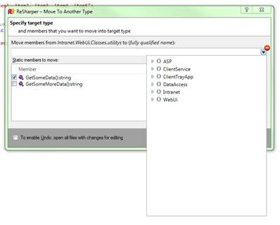

图 126:显示名称空间导航器的重构、移动对话框

如果我选择一个新的地方来移动方法，R#将执行它需要做的任何工作来移动方法和修复任何使用过的引用。

如果我们打开我将方法移入的文件，您会看到它如预期的那样位于那里:

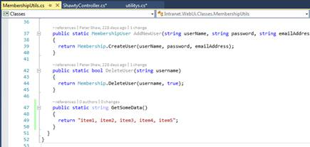

图 127:测试方法转移到另一个类

您还会看到它已从原始文件中删除。


图 128:移除测试方法的虚拟类

我们的用法已经被修正，以引用该方法的新位置。


图 129:方法移动后修复的用法

R#还有许多其他类似的操作。当选择方法签名时，Visual Studio 工具栏中的主菜单如下所示:


图 130: R#主重构菜单

我们已经看到**重命名**和**移动**选项。**安全删除**是用来从你的项目中删除一个方法，然后在之后清理任何剩余的用法。

**更改签名**用于更改方法签名，允许您交换参数、更改类型或以安全的方式进行操作并构造覆盖。

选择您的方法签名，按 **Ctrl+R** 、 **Ctrl+S** ，您会看到“更改签名”对话框:


图 131: R#更改签名对话框

对于我们的演示方法，我们目前没有任何参数——让我们更改并添加一些参数。我们将把这作为一个修改，而不是一个委托。确保选择了**修改**选项，然后点击**添加**，将类型设置为 **`string`** ，名称设置为 **`dataName`** ，不使用修改器，然后点击**下一步**。

因为我们正在添加一些原本不存在的东西，我们将看到一个进一步的对话框:

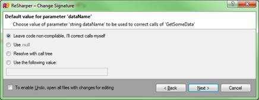

图 132:参数添加对话框

如您所见，当新参数在使用点对签名进行更改时，R#会询问您希望如何设置新参数的值。

默认情况下，您需要自己更改(构建时会出现编译器错误)。您可以添加一个空值，设置一个静态值，或者构建一个调用树，所有这些都是为了在修改您需要的内容时保持无错误的编译。

对于这个例子，我选择了 null，它给出了以下结果:


图 133:我们添加了参数的测试方法

不出所料，我们的用法也进行了更新，以匹配:

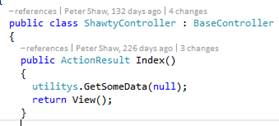

图 134:通过添加参数更新的使用情况

如果重构一个方法以获取一个新参数，那么通常会有一个用例，该参数将用于初始化或设置该方法所属类中的一个值。重构之后，R#可以通过帮助您将属性和变量“引入”到包含类中来提供进一步的帮助。

将光标放在刚刚添加到测试方法中的字符串`dataName`参数上，然后点击 **RESHARPER** > **重构** > **引入字段**或按 **Ctrl+R** 、 **Ctrl+F** 。您应该会看到如下所示的“介绍字段”对话框:

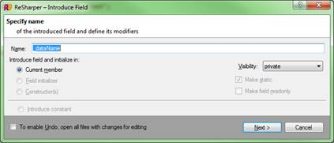

图 135: R#引入字段对话框

从这里，您可以设置字段名、辅助功能类型和其他设置。选择您想要使用的选项，然后点击**下一步**。

您应该看到您的方法源现在被更改为如下所示:


图 136:要求 R#向我们的类引入一个字段的结果

这看起来不多，但你只需点击几下鼠标，就可以节省 50 多次按键。考虑到您可以非常快速地引入多个实例，您可以看到您可以多快地充实一个完全解耦的类依赖，准备使用基于依赖注入(DI)的模式来消费类。

当您从其他项目中复制和粘贴方法时，R#的重构命令中更有用的一个会自动出现。

让我们想象一下，我们只是将来自不同项目的代码粘贴到我们的虚拟类中。我们可能会认为命名空间不同于我们想要使用它的地方:


图 137:显示错误命名空间的演示代码

如图 137 所示，我们的类名称空间用蓝色曲线突出显示；这是因为 R#可以看到它已经被粘贴到了一个生活在`Intranet.WebUI.Classes`的类中，但是文件中实际的命名空间是`Intranet.DummyUtils`。

此时，我只需将光标移动到名称空间行，点击 Alt+Enter 两次即可激活 R#的默认修复机制。我们还可以使用各种菜单中的扩展工具。

我们可以通过右键单击解决方案资源管理器中的类并选择**重构**子菜单来访问命名空间修复。

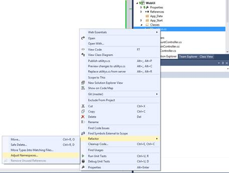

图 138:调整从解决方案资源管理器访问的命名空间

这将提供一个对话框，允许您选择要更正的命名空间。

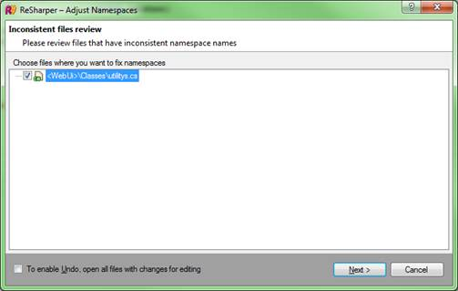

图 139: R#命名空间选择对话框

在这种情况下，我只选择了一个文件，但是您也可以选择多个文件(例如，如果您只是从不同的项目中复制了一些文件)，这允许您一次性更正每个文件的名称空间。正如预期的那样，当您单击“下一步”时，命名空间会在您在对话框中检查的每个文件中得到正确调整。

您还会在上面的菜单中注意到，我们的老朋友**重构，移动**也可以从这里获得。当在类或文件级别调用时，它比简单地使用它来移动一个方法要稍微强大一些，就像我们之前做的那样。

如果从这里选择**移动**选项，会出现如下对话框:

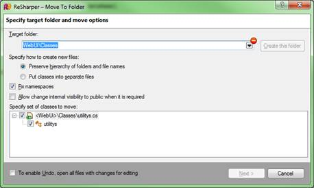

图 140:从解决方案资源管理器调用时的重构、移动对话框

如前所述，您可以将目标字段下拉，选择要将文件移动到解决方案中的哪个位置。但是，这一次，您将在导航器中获得更多信息:

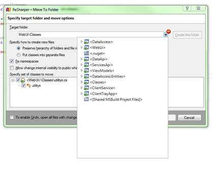

图 141:带有扩展导航器的重构、移动对话框

您可以立即看到，您不仅可以导航名称空间，还可以导航整个解决方案层次结构。因为您正在移动整个文件，所以您不仅可以选择它的名称空间，还可以选择它的物理位置。

与许多其他重构选项一样，当您使用此选项时，文件中的所有内容都将被重新定位，用法将被修复，名称空间将被调整以匹配新位置，并且使用此类的文件中的`using`语句也将被更新以引用新位置。

这个特性的主要目的是将复杂的代码分解成更简单的单元。

如果您有一个在许多不同地方使用的实用程序库集合，您可能希望将它们放入一个完全独立的类库项目中。扩展移动功能几乎可以毫不费力地完成这项任务，而且，将原本可能是半天的工作简化为只需点击几下鼠标。

### 还有更多重构选项

如果我们已经介绍的内容对您来说还不够，那么如果您深入挖掘，重构菜单中还有更多内容。如果我们跟随**RESHARPER**>**Refactor**>**Convert**，我们会得到下面的三级子菜单。

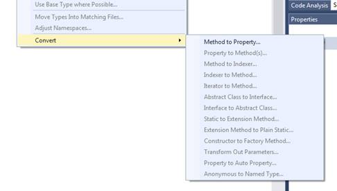

图 142:第三级重构，转换菜单

如果我们将光标放在一个方法上，我们可以将它转换成一个属性，如图 142 所示。根据所选的成员类型，可以启用其他功能，但是您可以很容易地看到我们可以进行的转换范围。

在我的副本中，我没有为许多这样的转换分配快捷键，但是你可以(也应该)允许你在运行中完成所有这些转换，同样遵循将手指放在键盘上的 R#口头禅。

还有更多——如果你冒险进入**提取**三级子菜单，你会发现以下内容:

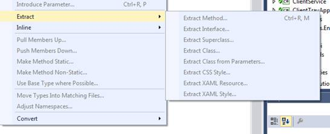

图 143:重构第三级提取子菜单

这里的选项用于将各种实体提取到单独的文件和构造中，或者基于源创建派生实现。

例如，如果您位于类级别，您可能想要提取一个接口，然后可以用它来帮助构建接口驱动的体系结构。


图 144:提取接口对话框

由图 144 中的选择产生的代码放在 IUtilities.cs 中，如下所示:

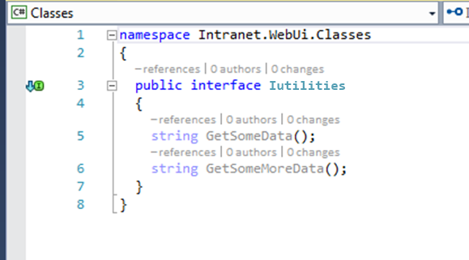

图 145:从我们的测试类中提取接口产生的代码

您的源类也将更新以使用新的接口:


图 146:更新源文件以使用提取的接口

ReSharper 的重构部分有如此多的功能，以至于你可能永远不知道其中有一半的命令。在为这本书研究主题的过程中，我发现了我从来不知道存在的功能。

我能推荐的就是你去看看菜单。创建一个或两个虚拟项目，然后选择并将光标移动到不同的位置。

JetBrains 网站尽最大努力将事物分成功能组，这样你就可以根据你想做的工作找到东西，而不是通过在菜单中排序。这对帮助你探索有很大帮助。然而，到目前为止，最好的学习方法是只玩产品。

剩下的重构选项我将留给读者作为练习——这样更有趣。