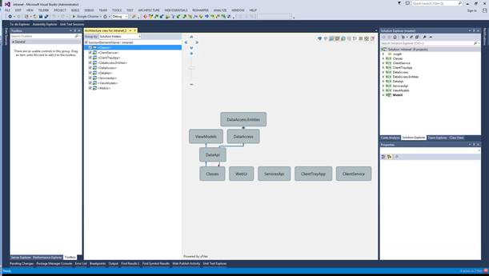
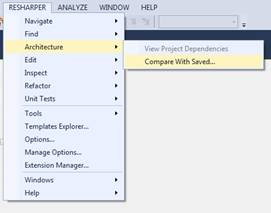
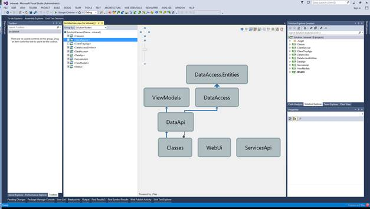

# 第 9 章架构工具

一旦您弯曲、重构并测试了您的销毁解决方案，您需要做的最后一件事就是检查 1000 英尺的视图，以确保您的整体架构看起来与您计划的完全一样。

毫不奇怪，R#也涵盖了这一点。

在解决方案资源管理器中的解决方案节点上单击鼠标左键，然后前往 **RESHARPER** > **查看项目依赖关系**，您应该会看到类似于以下内容的内容:

图 174:R #架构浏览器

您可以立即看到大图，并立即拥有工具来放大、移动和导出，以及以不同的方式操作图表。

前两个控件(蓝色箭头)是**撤销**和**重做**控件，允许您在图表中来回移动更改。

第三个按钮是**耦合分析**控制。该控件打开和关闭 R#对解决方案中模块间引用的深度检查。它通常在后台运行，大型解决方案可能需要几分钟才能完成。允许它运行(默认情况下是打开的)意味着 R#可以构建一个令人难以置信的架构细节图，但代价是等待那个图。

第四个按钮是**显示/隐藏可传递引用**图标。打开此选项后，模块之间的链接会折叠成一个链接，关闭此选项后，可以看到模块之间独立的多个链接。对于大型项目来说，这可以大大提高图表的可读性。

第五个按钮上有一个小的磁盘映像，允许您将当前显示的体系结构文件保存到磁盘上，这不仅是为了保护图表的副本，也是为了将来进行比较。

如果您返回查看 VS 主工具栏上的体系结构菜单，您会看到第二个菜单项允许您加载一个文件进行比较。

图 175:显示“与保存的进行比较”的 ReSharper 架构菜单

这里的想法是，您可以在开发架构时拍摄它的快照，然后在项目上运行比较，看看在一段时间内有什么不同。

您将看到图 174 中的第六个按钮看起来像一个小网格。当您在当前架构图旁边加载了一个已保存的文件时，单击此图标将要求 R#生成一个人类可读的描述，说明它发现的两个模型之间的差异。

继续，下一个按钮是**显示可能的路径**按钮。在我图 175 的截图中，这个选项变暗了，因为我加载的解决方案不够大，或者不够复杂，无法有效工作。

**显示可能的路径**功能通常在您有大型的多解决方案项目打开时使用，或者当您在项目级别从许多不同的项目创建依赖关系图时使用，而不是在解决方案级别创建单一的依赖关系图。该工具用于分析当前的体系结构并检测可能的违规，例如循环引用，或者模块之间的链接，这些链接通过对其他模块的引用被无意地放置。

接下来的两个按钮用于折叠和展开图形中的节点，最后一个按钮用于将当前显示的图形的副本导出到 PNG 文件中，以便在其他地方使用。

在图 174 中，您还可以看到图的右边是包含的项目列表；取消选中您不希望看到的模块会将它们从图表中删除。在我的例子中，如果我取消选中 **ClientService** 和 **ClientTrayApp** (因为它们不是整个项目的直接依赖项)，我的图会重新组织自己，删除这两个模块。

图 176:重组后的 R#架构视图，显示移除的未勾选引用

如果将鼠标悬停在图形节点上，图形的其余部分将不再突出显示，以强调所选节点:

图 177:具有弱化节点的架构视图

如果您右键单击某个节点，您会看到一个弹出菜单，让您可以即时访问我们已经探索过的许多工具，从而让您可以快速评估项目中给定节点的状态。

图 178:显示通过弹出菜单快速访问工具的架构图

架构图是您项目的路线图，允许高级开发人员和首席开发人员一目了然地看到事情是否按照应有的方式进展，并允许在需要时快速排除故障和采取补救措施。