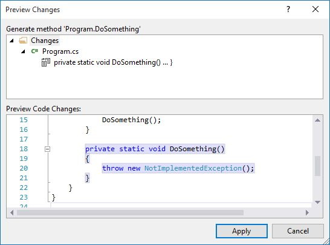
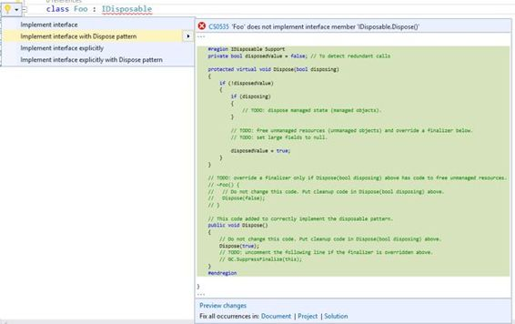
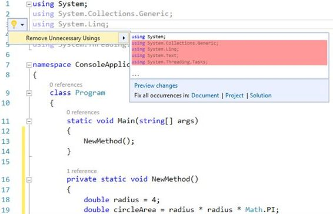
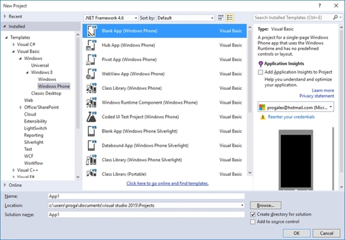
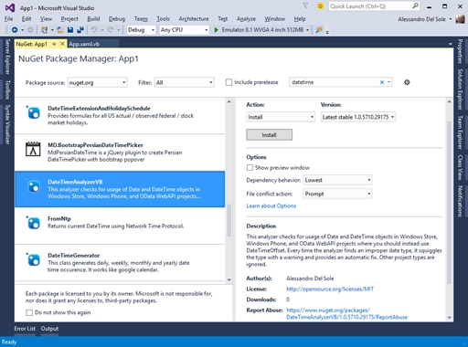
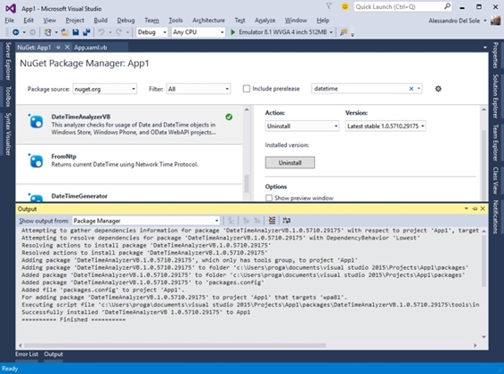
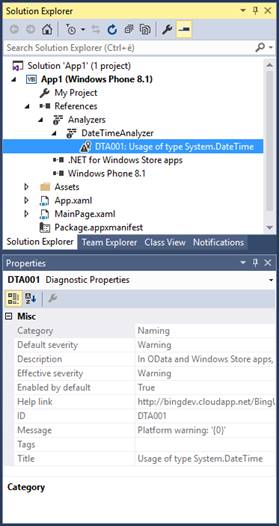
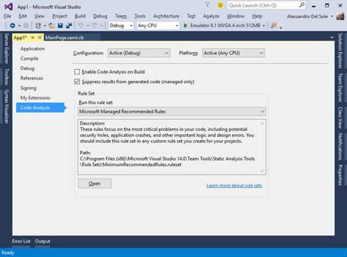
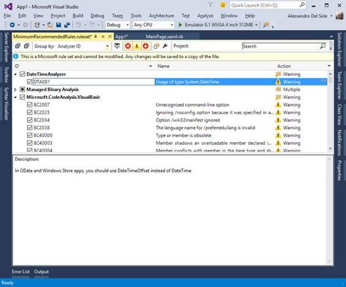

# 第二章 Visual Studio 2015 中的编码:罗斯林驱动的体验

要更准确地了解罗斯林应用编程接口的用途，最好的方法是看看微软如何在 Visual Studio 2015 中使用新的编译器服务。代码编辑器得到了增强，给编码体验带来了显著的改进。一些现有的工具已经得到了改进，并且添加了新的功能，通过在修复问题和重构代码的同时将注意力集中在活动的编辑器窗口上，帮助开发人员比以往任何时候都更有效率。这种改进的体验也被称为**专注于代码的体验**，并且完全由。NET 编译器平台。本章介绍代码编辑器中的更新和新功能。这样，您将从 Visual Studio 2015 本身如何使用该平台开始，对 Roslyn 更加熟悉。

尽管仅限于特定的代码问题，但 Visual Studio 代码编辑器始终提供实时静态代码分析，这意味着后台编译器可以通过扭曲需要您注意的代码，并用详细的错误或警告消息填充“错误列表”窗口来检测代码问题并报告警告和错误。图 5 显示了一个实时静态代码分析的例子，其中的代码声明了一个从未使用过的类型为`int`的变量，并试图调用一个不存在的`DoSomething`方法。


图 Visual Studio 中的实时代码分析

但是，Visual Studio 2015 之前的代码分析引擎有以下限制:

*   大多数代码问题只能在编译时检测到。
*   代码编辑器只能分析在微软编码的许多规则的代码，无法添加自定义规则。

在 Visual Studio 2015 中，实时静态代码分析引擎已经在。NET 编译器平台。这改变并改进了您修复代码问题的方式，并允许创建和集成自定义分析规则，这将在[第 4 章](4.html#_Chapter_4_Writing)和[第 5 章](5.html#_Chapter_5_Writing)中解释。例如，如果您将鼠标指针悬停在代码编辑器中的一个错误上，就会出现一个名为**灯泡**的图标(见图 6)。


图 6:无效代码行上的灯泡

如果您单击灯泡或**显示潜在修复程序**超链接，Visual Studio 会显示许多潜在修复程序(称为**快速操作**，如图 7 所示。


图 7:修复当前问题的快速行动

对于每个快速操作，Visual Studio 都会显示一个实时预览，突出显示将以绿色添加的代码行，并突出显示以红色删除的代码行。要应用建议的修复，请单击所需的快速操作。在这种情况下，您可以点击**生成方法的程序。做点什么。**

|  | 提示:您也可以通过按 Ctrl+句点或在代码编辑器中右键单击，然后从弹出菜单中选择“快速操作”来手动启用灯泡。这就是应用代码重构要做的事情。此外，当您单击包含错误的代码行时，灯泡会自动出现在该行的开头。 |

也可以通过点击**预览更改**获得更详细的预览。这将启动“预览更改”对话框，该对话框显示代码更改的预览以及受快速操作影响的文件列表。图 8 显示了一个基于当前问题的示例。



图 8:预览快速动作的变化

可以点击**应用**应用建议的修复，也可以点击**取消**忽略。值得注意的是，在 Visual Studio 2015 中，错误列表窗口已经被完全重写，以支持新的以代码为中心的体验。在其他更改中，您将看到代码列以超链接的形式报告错误代码；如果单击它，Visual Studio 2015 将打开一个包含错误信息的网页(如果没有提供特定页面，则为阿炳搜索)。

前面的例子很简单，但是 Visual Studio 2015 分析引擎要强大得多。例如，假设您有一个必须实现`IDisposable`接口的类。如果您声明该类将实现接口，但是您没有提供所需的代码，不仅会像您预期的那样报告错误，而且灯泡还会建议适当的修复。图 9 展示了如何用四种不同的替代方法实现接口，对于每种可能的修复，您都可以看到预览，而不会失去对代码的关注。



图 9: Visual Studio 2015 提出了上下文相关的代码修复

这是一个巨大的好处。Visual Studio 2015 不仅为您节省了为特定场景编写所需代码的时间，而且还为您正在处理的上下文显示了适当的修复。探索`IDisposable`界面的其他潜在修复是留给您的练习。当然，`IDisposable`接口实现并不是 Visual Studio 可以建议多个和上下文相关的修复的唯一场景，但这绝对是一个非常常见的情况，也可能是让你理解新代码分析引擎的强大功能的最有效的情况。

重构是一种技术，它允许以更好的方式重组部分代码，而不改变原始行为。在编写了许多行和块之后，重构是非常常见的(也是推荐的)，因为它提高了代码的可读性和可维护性。Visual Studio 的代码编辑器一直为 C#中的重构提供内置支持，但对 Visual Basic (VB)完全不支持。在 Visual Studio 2015 中，对 C#中的重构进行了改进，并首次引入了对 VB 的支持，实现了语言间的工具对等。在 Visual Studio 2015 中，重构工具可通过灯泡和快速操作获得。

为了演示这在新的集成开发环境中是如何工作的，请考虑代码清单 1 中的例子，它计算给定半径的圆的面积。

代码清单 1:计算圆的面积

```cs
            static void Main(string[] args)
            {
                double radius = 4;
                double circleArea = radius * radius * Math.PI;
                Console.WriteLine(circleArea);
            Console.ReadLine();
                }

```

选择整个方法体，然后通过右键单击选择并从弹出菜单中选择**快速操作**来启用灯泡。如图 10 所示，灯泡提供了**提取方法**工具，其目的是将所选代码封装到一个单独的方法中，以获得更好的可读性和可维护性。


图 10:使用提取方法工具的代码重构

如果您接受建议的更改，Visual Studio 将提取一个新方法，并要求您通过**内联重命名**工具提供一个新名称，该工具将在您键入时替换以前名称的所有出现(参见图 11)。


图 11:提取和重命名方法

内联重命名非常简单，因为它还允许您重命名字符串和注释中出现的标识符，并替换了以前版本的集成开发环境中使用的旧模式对话框。使用这种新方法，开发人员可以重构代码，而不会失去对编辑器的关注，编辑器始终保持活动状态。有关 Visual Studio 2015 中 C#和 VB 可用重构的完整列表，您可以下载我的免费电子书: [*Visual Studio 2015 简洁地*](http://www.syncfusion.com/resources/techportal/details/ebooks/visualstudio2015) 。与代码分析一样，在通过“预览更改”对话框应用更改之前，您可以获得更详细的预览。

代码编辑器可以自动检测多余的代码，比如不必要的`using` (C#)和`Imports` (VB)指令，不必要的`this`和`Me`关键字，或者类型之间不必要的转换。冗余代码以较浅的颜色显示，例如保留字为浅蓝色，标识符为浅灰色。使用灯泡，您可以轻松重构冗余代码，如图 12 所示，它展示了如何删除不必要的`using`指令。



图 12:删除不必要的指令

正如您在实时预览中看到的，将被删除的代码行以红色突出显示。关于`using`和`Imports`指令，如果您选择多个指令，然后右键单击，弹出菜单将显示一个名为**的项目，C#使用**组织，VB 使用**组织导入**，这将显示删除指令、排序指令或两者的命令。

在幕后，本章介绍的所有功能都是由。NET 编译器平台。为了提供前面描述的编码体验，代码编辑器使用了许多名为**代码分析器**的特殊插件来实时分析代码，并在您键入时检测代码问题。代码分析器，或简称分析器，是一个库，它使用罗斯林应用编程接口来分析源代码的语法正确性、编程模式实现的准确性以及对微软的遵守。NET 编码规则等等。

分析器包含特定于领域的规则，并与代码编辑器无缝集成。对于每个规则，分析器提供一个**诊断**，负责对单个规则进行代码分析。您的代码会在每次击键时自动解析；当诊断检测到不符合分析器中定义的规则的代码时，它会发送通知并公开可能的修复，以便 Visual Studio 可以报告指定的错误或警告，并提供适当的快速操作。

Visual Studio 2015 附带了一套内置的分析器，用于检查微软的编码和语法规则。这个集合会自动添加到每个新项目中，但是您可以安装额外的分析器，甚至创建您自己的分析器，正如您将在[第 4 章“编写代码分析器”](4.html#_Chapter_4_Writing)中学习的那样。类似的概念适用于**代码重构**。Visual Studio 2015 附带了一组内置的代码重构，可以帮助您用常见的场景重新组织代码。

至于诊断，代码重构由一个库公开，该库使用罗斯林应用编程接口并分析源代码，以检测是否有任何代码块可以以更好的方式重组。您还可以安装额外的代码重构，甚至创建自定义代码重构，正如您将在[第 5 章“编写重构”中学习的那样](5.html#_Chapter_5_Writing)第 5 章总结了 Roslyn 如何在 Visual Studio 2015 中增强以代码为中心的体验，但从下一章开始，您将了解更多充分利用的技术概念。NET 编译器平台。

|  | 注意:代码编辑器不是 Visual Studio 2015 中唯一依赖。NET 编译器平台。语言服务、表达式求值器以及许多工具窗口和对话框也是由罗斯林应用编程接口提供的。了解 Visual Studio 2015 中的哪些工具是基于。NET 编译器平台，可以在线浏览[源代码](http://source.roslyn.io/)看看名字中包含“Feature”字样的文件夹，再加上 VisualStudio 文件夹。 |

借助罗斯林，开发人员可以创建自定义分析器和重构，并将其发布到在线 [NuGet](http://www.nuget.org) 包存储库或 [Visual Studio 图库](http://www.visualstudiogallery.com)。在学习如何创建分析器并将其发布到两个存储库之前(这将在后面的章节中介绍)，了解如何通过下载、安装和配置项目中的这些组件来使用现有的分析器是非常重要的。因为其他开发人员会对您的分析器执行相同的步骤，所以您需要了解他们的行为。

在下一个示例中，您将下载我创建的示例分析器，该分析器可用于 Windows Store 应用程序、Windows Phone 应用程序以及使用微软 OData 客户端库的项目。更具体地说，该分析器检测`System.DateTime`类型的使用，并建议使用`System.DateTimeOffset`来代替。

|  | 提示:像 Windows 商店和 Windows Phone 应用程序中的日期选择器这样的控件可以处理类型为`System.DateTimeOffset`的对象，但是传递类型为`System.DateTime`的对象不会被报告为问题。此外，OData 协议适用于`DateTimeOffset`，但通过`DateTime`并未被报告为问题。样本分析器有助于传递正确的对象类型。 |

在 Visual Studio 2015 中，使用您选择的语言创建一个新的 Windows Phone 8.1 项目(此示例在 Visual Basic 中)。根据您使用的 Visual Studio 版本，默认情况下可能不会安装 Windows Phone 应用程序模板。如果你想尝试这个例子，你必须下载并安装视窗手机软件开发工具包。选择**窗口 8** 项目模板项目后，您可以在**新项目**对话框中的 Visual Studio 中执行此操作。安装 Windows Phone SDK 后，可以使用**空白 App (Windows Phone)** 模板，该模板位于**新建项目**对话框中**Windows**>**Windows 8**>**Windows Phone**下，如图 13 所示。您可以保持默认项目名称不变。



图 13:创建 Windows Phone 8.1 项目

当项目准备好之后，保存它，在**解决方案资源管理器**中右键单击项目名称，并从上下文菜单中选择**管理 NuGet 包**。此时，将出现“获取软件包管理器”窗口。在搜索框中，输入**日期时间**，搜索**日期时间分析程序包(或 C#的日期时间分析程序)，如图 14 所示。**



图 14:在 NuGet 上搜索分析器

其他库的分析器也作为 NuGet 包提供。当您浏览 NuGet 包时，您可以看到描述、许可协议(如果有)、作者姓名、可用版本列表和其他信息。如果单击**安装**，Visual Studio 将首先显示一个对话框，其中包含所选包的摘要信息和依赖项列表(如果有)。然后，您将被要求接受许可协议，如图 15 所示。


图 15:接受包的许可协议

此时，Visual Studio 集成的 NuGet 包管理器将下载包并将库放在适当的位置。操作的进度显示在“输出”窗口中，当它完成时，您还会在“获取包管理器”窗口中的包名称附近看到一个绿色的复选标记符号(参见图 16)。



图 16:下载并安装后的 DateTimeAnalyzerVB 分析器

|  | 提示:这本书解释了如何从 NuGet 安装分析器，因为这是最常见的场景。但是，如果要在 Visual Studio 库中搜索分析器，则必须选择“工具”>“扩展和更新”，然后从“扩展和更新”对话框中在线搜索包。这也正是您在为 Visual Studio 搜索扩展时所做的事情。 |

或者，您可以从软件包管理器控制台安装软件包。控制台可以通过选择**工具** > **获取包管理器** > **包管理器控制台**来启用。启用后，在命令行中键入以下内容:

`Install-package DateTimeAnalyzerVB`

软件包安装完成后，展开**解决方案资源管理器**中的**引用**节点，然后展开**分析器**子节点。后者包含额外安装的分析仪列表，在这里您应该会看到新安装的 **DateTimeAnalyzer** (见图 17)。每个分析器都显示为一个可扩展的节点。当您展开一个分析器节点时，您将看到它公开的诊断和重构列表。

在这种情况下，只有一个诊断，称为 **DTA001:系统的使用。日期时间**。该名称由诊断程序的唯一标识及其标题组成。如果单击某个诊断，您将在“属性”窗口中看到有关该诊断的有用信息。



图 17:调查诊断及其属性

在这里，您可以看到诊断的描述、严重性级别(本例中为警告)、默认情况下是否启用以及其他信息。现在您将在实践中使用下载的分析器，然后您将看到如何调整其配置。打开项目中的任何代码隐藏文件(即. vb 或。cs 文件根据您选择的语言)。然后，声明一个类型为`System.DateTime`的变量(在 Visual Basic 中，您也可以使用`Date`关键字)。如图 18 所示，代码编辑器检测到您正在一个项目中使用一个`DateTime`对象，您可能更喜欢这个项目`DateTimeOffset`，所以它会报告一个警告并建议正确的修复方法。


图 18:分析器检测到一个代码问题，并建议正确的修复方法

如您所见，安装和使用分析器很容易，因为一切都与代码编辑器无缝集成。您还可以微调内置和外部分析器的行为。为此，双击**解决方案资源管理器**中的**我的项目**(对于 VB)或**属性**(对于 C#)。当项目的属性窗口出现时，选择**代码分析**选项卡，如图 19 所示。



图 19:项目属性窗口中的代码分析选项卡

不要更改默认规则集。只需点击**打开**。这将打开一个窗口，其中包含当前规则集的分析器列表，包括许多内置分析器。图 20 说明了这一点。



图 20:配置分析器的行为

展开**日期时间分析器**节点。您可以通过选择或清除标识旁边的复选框来启用或关闭诊断，也可以更改默认严重性。例如，您可以禁用诊断，因为您需要处理`DateTime`对象，或者您可以将默认严重性从“警告”更改为“错误”，导致代码编辑器在图 18 所示的代码行下方显示红色曲线，这将阻止项目编译。这些调整也可以针对窗口中显示的内置分析器执行，但当然我们鼓励您保持默认设置不变。现在，您对罗斯林可以做什么和分析仪可以做什么有了更好的了解，是时候转向更复杂的概念了。

本章描述了 Visual Studio 2015 中的编码体验是如何增强的，并解释了您在代码编辑器中使用的许多功能实际上是如何在。NET 编译器平台。这使得动态静态代码分析引擎能够在您键入时检测代码问题，并提出适当的修复建议。实时代码分析依赖于代码分析器和重构，这两者都由利用罗斯林应用编程接口的库公开。

非常好的消息是，您不限于使用内置的分析规则；您也可以从 NuGet 或 Visual Studio Gallery 下载并安装第三方分析器。安装后，分析器与代码编辑器无缝集成，并基于自定义的特定于领域的规则完美地检测代码问题。此外，您可以通过启用和禁用诊断或更改其严重性级别来微调分析器的行为。