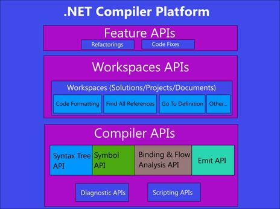
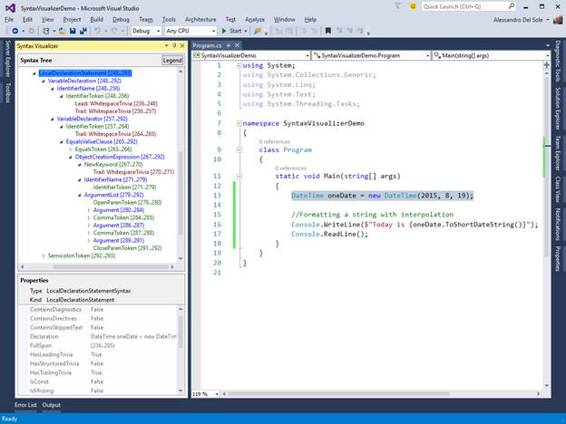
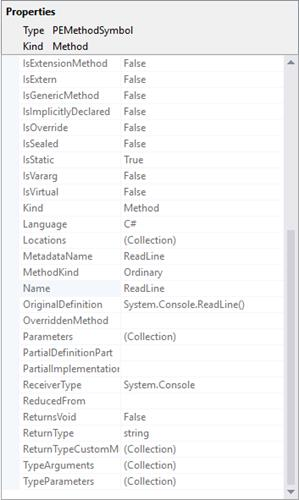

# 三、穿越Roslyn：架构、API、语法

那个。NET 编译器平台建立在几个应用编程接口层和服务之上。其中一些层允许向消费者公开编译器的 API，并允许您利用代码分析来构建令人惊叹的开发工具。本章为您提供了重要的概念概述。NET 编译器平台体系结构，描述了 API 层和服务，并为您将在接下来的章节中面对的概念和主题提供了基础。您还将开始学习语法的基本概念，发现。NET 编译器平台允许在一个名为语法可视化工具的帮助下，通过托管对象对源代码进行操作，这将成为你为Roslyn编码时最好的朋友。也就是说，慢慢来仔细阅读这一章。这都是关于理论的，但是在你继续实践之前理解是很重要的。

那个。NET 编译器平台为开源的 Visual Basic (VB)和 C#编译器提供了丰富的代码分析 API。代码分析并不意味着仅仅搜索代码问题和报告源代码中的错误；相反，代码分析意味着开放编译器，通过 API 共享它们拥有的关于我们代码的所有信息，开发人员可以使用这些 API 在他们的应用程序或工具中执行与代码相关的任务。为了实现这一点，编译器实现了一个映射经典编译器管道的 API 层。如图 21 所示，传统的编译器管道由以下不同阶段组成:

1.  解析阶段，编译器标记源代码，并根据给定的语言语法将其解析为语法。
2.  符号和元数据阶段，根据声明和导入的元数据生成命名符号。
3.  绑定阶段，将标识符分配给符号。
4.  IL 发射器阶段，编译器从前面的阶段构建所有信息，发出一个程序集。


图 21:传统的编译器管道和新的编译器 API

在。NET Compiler Platform 中，编译过程中的每个阶段都被视为一个独立的组件，该组件由一个对象模型呈现，该对象模型以。NET 对象。解析阶段现在由**语法树**表示(参见本章后面的[“使用语法”](#_Working_with_Syntax))。符号和元数据阶段由分层符号表表示。绑定阶段现在由一个对象模型来表示，该对象模型公开了编译器对当时收集的信息进行语义分析的结果。中间语言发射器阶段由发射应用编程接口表示，它产生中间语言字节代码。

这些重新架构的阶段也显示在图 21 中，并被称为**编译器 API**，稍后将对其进行更详细的讨论。理解这种变化非常重要。事实上，将 VB 和 C#编译器视为平台是您必须完成的第一个概念性步骤，因为正是在这里信息开始开放。

那个。NET 编译器平台的架构由两个主要层和一个次要层组成:编译器 API 和工作区 API，以及特性 API，如图 22 所示。



图 22:的。NET 编译平台的分层体系结构

两层将很快详细介绍；然而，一个总结性的解释可能有助于给你一个起点。**编译器 API**层提供了一个对象模型，该对象模型保存了编译器管道每个阶段公开的语法和语义信息。编译器不仅执行它的自然任务(即从源代码生成程序集)，而且还通过适当的。NET 对象。编译器应用编程接口还包括编译器单次调用的不可变快照，包括源代码文件、选项和程序集引用。

第二个主要层是**工作区 APIs** 层，它公开了一个对象模型，该模型保存并组织解决方案中的所有信息。通过使用该层，您可以跨整个解决方案执行代码分析，并访问编译器的对象模型，而无需解析源代码文件或配置编译器选项和依赖项。

**特性 API**层是一个额外的层，专门设计用于提供代码修复和重构，并依赖于其他层。现在是时候对。NET 编译器平台以及如何使用它。

那个。NET 编译器平台通过一组。NET 程序集。以下是最重要的程序集列表:

*   `Microsoft.CodeAnalysis.dll`，它公开了编译器 API 的语言不可知集。
*   `Microsoft.CodeAnalysis.VisualBasic.dll`，公开了为 Visual Basic 定制的编译器 API。
*   `Microsoft.CodeAnalysis.CSharp.dll`，公开了为 C#定制的编译器 API。
*   `Microsoft.CodeAnalysis.Workspaces.dll`，公开了一组通用的工作区应用编程接口。
*   `Microsoft.CodeAnalysis.VisualBasic.Workspaces.dll`，公开了为 Visual Basic 量身定制的工作区 API。
*   `Microsoft.CodeAnalysis.CSharp.Workspaces.dll`，公开了为 C#定制的工作区 API。
*   `Microsoft.CodeAnalysis.Common.dll`，公开了代码分析的常用工具。
*   `System.Collections.Immutable.dll`，它公开了特殊的、不可变的集合，用于处理语法树的不变性。

这些程序集通过 NuGet 安装在您的项目中。它们会自动安装在您使用提供的模板创建的任何项目中。NET Compiler Platform SDK，但是您也可以使用 NuGet Package Manager 工具将它们手动下载并安装到不同类型的项目中，例如，如果您想要在独立应用程序中实现代码生成。它们有相应的名称空间，如`Microsoft.CodeAnalysis`、`Microsoft.CodeAnalysis.VisualBasic`、`Microsoft.CodeAnalysis.CSharp`等，这些名称空间暴露了。代码分析所需的对象。

|  | 提示:通过浏览[在线参考源](http://source.roslyn.io/)，可以轻松调查Roslyn程序集的完整列表和完整源代码。 |

正如您将在下一节中发现的那样。NET 编译器平台提供了数百种类型来表示编译器公开的所有信息。这些类型中的大多数，如`Solution`、`Document`、`SyntaxTree`、`SyntaxNode`，都是**不变的**。不变性是Roslyn中的一个关键概念，它提供了线程安全，这样多个开发人员就可以在没有任何锁或重复的情况下对同一个对象进行工作。

例如，如果你想对一个由`Document`类表示的源代码文件进行更改，你实际上是在现有的基础上创建一个新的`Document`，并提供所需的更改。您基于现有的不可变对象在代码中创建新对象的方式在实践中显示在[第 4 章](4.html#_Chapter_4_Writing)和[第 5 章](5.html#_Chapter_5_Writing)中。现在，请记住什么是不变性，因为在这一章中你会发现很多对它的引用。

编译器应用编程接口层提供了一个对象模型，该模型与编译器管道每个阶段公开的语法和语义信息相关。这一层还包括编译器单次调用的不可变快照，包括程序集引用、编译器选项和源代码文件。Visual Basic 和 C#有两种截然不同的编译器 API，它们非常相似，但都是为高保真地适应每种语言而定制的。这一层有一个基本特征:它不依赖于任何 Visual Studio 组件，因此任何开发人员也可以在独立应用程序中使用它。

当编译器分析源代码时，除了生成程序集之外，它还可能生成一组涵盖语法和语义的诊断，报告每个代码问题的曲线、错误、警告或信息性消息。这些诊断由编译器通过诊断应用编程接口公开，诊断应用编程接口是一组可扩展的应用编程接口，允许开发人员将他们的自定义分析器和诊断与编译器定义的诊断一起插入编译过程。通过这种方式，这组 API 可以自然地与诸如 MSBuild 和 Visual Studio 2015 之类的工具集成，这些工具利用诊断 API 来显示动态曲线、停止基于错误的构建以及建议代码修复。

诊断 API 不依赖于任何 Visual Studio 组件，因此您可以使用这些库将增强的体验插入到您的开发工具(如代码编辑器)中。诊断应用编程接口是您将在本书中更多使用的集合。事实上，第 4 章和第 5 章都讨论了如何创建依赖于诊断 API 的定制的、特定于领域的分析器和重构。此外，任何开始使用。NET 编译器平台通常从诊断应用编程接口开始，因为它们让你对Roslyn平台有一个精确的概念。

作为编译器 API 的一部分。微软的 NET 编译器平台团队已经创建了脚本应用编程接口，它允许您编译和执行代码片段，并积累运行时执行上下文。在撰写本文时，该层在 GitHub 上的[源参考页面](http://source.roslyn.io)中提供，但尚未随一起提供。NET 编译器平台 1.0，目前还没有关于其发布的官方消息。

工作区应用编程接口层是对整个解决方案和项目执行代码分析和重构的起点。这些 API 将解决方案中项目的所有信息组织到一个对象模型中，并提供对编译器对象模型的直接访问，这样您就不需要解析源代码文件、配置编译选项或管理项目及其依赖关系。

这一层不依赖于任何 Visual Studio 组件，但它提供了一组通用的 API 宿主环境，如 IDEs(如 Visual Studio 2015)可以用来实现代码分析、代码重构、代码格式化和着色等。例如，Visual Studio 2015 使用这些 API 来实现“查找所有引用”和“文档大纲”窗口，在编辑器中格式化和着色源代码，并执行代码生成。那个。NET 编译器平台通过特定的。NET 对象，这将在下一节中描述，并在[第 8 章](8.html#_Chapter_8_Workspaces%2C)中用更多的例子进行重新检查。

工作区是`Microsoft.CodeAnalysis.Workspace`对象的一个实例，并且是作为项目集合的 MSBuild 解决方案的表示，每个项目都有一个文档集合，其中每个文档代表一个. vb 或。cs 源代码文件。更具体地说:

*   解决方案是由`Microsoft.CodeAnalysis.Solution`类型的实例表示的项目和文档的不可变模型。由于不变性，解决方案模型可以在没有锁定或复制的情况下共享。您可以在工作区中使用`Workspace.CurrentSolution`属性获得当前解决方案的一个实例，该属性的类型为`Solution`，并且由于其不可改变的特性而从未改变。您可以通过基于现有解决方案和所需的更改创建新的解决方案来修改解决方案。新创建的解决方案必须应用回工作区，以反映所提供的更改。
*   项目是`Microsoft.CodeAnalysis.Project`类的不可变实例，是所有源代码文档、程序集引用、项目到项目引用、解析选项和编译选项的集合。从`Project`中，您可以访问关于编译的信息，而不需要解析源代码文件或迭代项目引用，您还可以访问解决方案名称、程序集名称、版本和输出文件路径等信息。
*   一个文档代表一个单独的源代码文件，并由`Microsoft.CodeAnalysis.Document`类的一个实例表示。这允许访问文件的源文本和元素，如语法树和语义模型，这两者都将在后面描述。

因为工作区应用编程接口不依赖于 Visual Studio 2015，所以每个主机环境(如自定义 IDEs)都可以访问解决方案的对象模型。这允许宿主环境检索所有的解决方案信息，或者对整个解决方案、项目或单个文档执行与代码相关的任务，例如代码分析、重构或格式化。

|  | 提示:您还可以创建与主机环境断开连接的独立工作区，或者在不作为主机环境的应用程序中使用工作区。您将在[第 8 章“工作区、代码生成、发出”](8.html#_Chapter_8_Workspaces%2C)中看到后一种场景的示例。 |

## 使用语法

使用Roslyn应用编程接口，您可以分析和生成 Visual Basic 和 C#源代码。这可能发生在 Visual Studio 解决方案中打开的源代码、应用程序在运行时生成的源代码、磁盘上文件的源代码，以及更一般的任何位置的源代码上。

源代码实际上是文本。无论您需要解析源文本以生成二进制对象，还是从二进制对象往返返回源文本，您都需要一种结构化的方式来表示源代码。像 C#和 Visual Basic 这样的编程语言有自己的词汇、语法、语义以及编写程序所需的一切。

在。NET 编译器平台，源代码的词法和句法结构由**语法树**表示。语法树由`Microsoft.CodeAnalysis.SyntaxTree`类的实例来表示，并且完全忠实地保存源信息，因此它们很重要，原因如下:

*   它们允许在托管的。NET 的方式，而不是使用纯文本。
*   它们允许 Visual Studio 2015 在解决方案中详细说明源代码的语法结构。
*   编译、代码分析、代码生成和代码重构都建立在它们之上。
*   它们代表编译器在源代码中检测到的每一项，如代码块、语法结构、注释和空格，就像它们被键入时一样。言外之意，语法树可以用来将源代码返回到解析它的文本。

正如您将很快了解到的，语法树由。NET 对象。这提供了一种以托管方式用新语法树替换语法树的方法，而不需要使用纯文本。关于语法树，此时需要考虑的一个重要事实是，一旦创建了语法树或者获得了现有树的实例，这种情况就不会改变。事实上，语法树是不可变的。现在，您将开始使用一个名为语法可视化工具的可视化工具，它允许您更熟悉语法元素。

### 研究语法

我已经多次声明，在 Visual Studio 2015 中，代码编辑器已经在。NET 编译器平台。这意味着 Visual Studio 本身和托管编译器使用语法树来解析和分析您编写的源代码。

为了更好更深入地理解源代码的语法结构。NET Compiler Platform SDK 提供了一个名为**语法可视化工具**的不错的工具窗口，你可以通过**查看** > **其他窗口** > **语法可视化工具**来启用。语法可视化工具使得以面向Roslyn的方式浏览源代码变得更加容易，它显示了语法树和组成代码块的子元素。例如，考虑代码清单 2 中的代码，它被称为控制台应用程序。

代码清单 2

```cs
    using System;
    using System.Collections.Generic;
    using System.Linq;
    using System.Text;
    using System.Threading.Tasks;

    namespace SyntaxVisualizerDemo
    {
        class Program
        {
            static void Main(string[] args)
            {
                DateTime oneDate = new DateTime(2015, 8, 19);

                //Formatting a string with interpolation
                Console.WriteLine($"Today is {oneDate.ToShortDateString()}");
                Console.ReadLine();
            }
        }
    }

```

代码很简单；它只是创建一个`System.DateTime`对象的新实例，并将日期属性打印到 Console 窗口。这段小代码足以帮助您理解许多关于语法树的概念。

启用语法可视化工具，然后单击代码编辑器中的任意位置。当您单击时，语法可视化工具开始以分层方式表示代码文件的内容，如图 23 所示。

语法可视化工具由两个区域组成:**语法树**和**属性**。“语法树”区域提供了当前文件语法的分层视图。层次结构中的每一项都根据其含义进行着色:蓝色表示语法节点，绿色表示语法标记，而栗色表示语法琐事(所有这些元素都将在稍后讨论)。您可以单击“图例”按钮来获得关于颜色的解释。

“属性”区域显示语法树中当前选定项目的详细信息。正如您将在[第 4 章“编写代码分析器”](4.html#_Chapter_4_Writing)中发现的，属性区域也有助于确定是哪一个。NET 类型根据其种类映射选定的语法节点、标记或琐事，这使得理解什么更容易。NET 对象来解析或生成代码块。在本书中，您将多次使用语法可视化工具，因此，如果此时有不清楚的地方，请不要担心。

如图 23 所示，在层次结构的第一层，有编译单元。CompilationUnit 表示源代码文件的整个结构化内容(。cs 或。vb)。如果您展开这样的元素，您可以找到许多嵌套的元素，每个元素代表源代码的一部分。


图 23:语法可视化工具允许检查源代码的语法结构

例如，如果您展开 CompilationUnit，您会发现其中有一个 NamespaceDeclaration，它表示一个命名空间定义及其内容。如果您展开名称空间声明，您会看到一个类声明及其语法元素。在这种情况下，您可以看到`Program`类是如何定义的。在类声明中，如果您单击并展开 MethodDeclaration 元素，您可以看到构成`Main`方法定义的所有部分(参见图 24)。


图 24:理解方法块定义

正如您所看到的，方法声明从整体上代表了一个方法定义。对于这些元素中的每一个，您将找到一个对象，它代表每个关键字、每个空格、每个标点符号元素、每个类型名称等等，与在源文本中键入的完全一样。如果您浏览组成方法定义的语法元素，您可以找到一个名为 LocalDeclarationStatement 的元素，它代表声明和实例化类型为`System.DateTime`的对象的整行代码。LocalDeclarationStatement 有嵌套元素，每个元素代表一个类型名、一个空格、对象初始化表达式和分号。这如图 25 所示。



图 25:理解对象是如何声明和实例化的

如果您选择包含`Console.WriteLine`语句的代码行，您将看到一个名为 ExpressionStatement 的语法元素，它由嵌套元素组成，如方法调用、插值字符串、对`ToShortDateString`的调用以及所有必要的元素。图 26 展示了这一点。


图 26:理解带有参数的方法调用

没有提到层次结构中涉及的所有语法元素，这是有意的。事实上，我想鼓励您通过选择和扩展语法树中的许多节点来自己练习语法可视化工具，以便更熟悉源文本的Roslyn表示。在接下来的章节中，您将获得更多关于语法元素的详细信息，在[第 4 章](4.html#_Chapter_4_Writing)和[第 5 章](5.html#_Chapter_5_Writing)中，您将在语法可视化工具的帮助下在实践中使用许多语法元素。

现在，在编辑器中单击，展开语法树，并尝试在语法可视化工具的属性区域检查语法元素的含义。您将发现理解。NET 编译器平台。

语法树有一个分层结构，其中有子节点，称为语法节点，这些子节点有子语法元素，您可以使用语法可视化工具看到这一点。本节描述语法节点和其他语法元素。

|  | 提示:本节中描述的所有语法元素将在[第 4 章](4.html#_Chapter_4_Writing)和[第 5 章](5.html#_Chapter_5_Writing)中重新讨论。 |

#### 语法节点

语法节点表示语法树中的语法结构，如表达式、类块、语句和子句。语法节点最基本的表示是`Microsoft.CodeAnalysis.SyntaxNode`类的一个实例，它是表示不同类型构造的更专业的对象的基类。例如，`ClassStatementSyntax`类表示与 Visual Basic 中的类声明相关的语法节点，其继承层次结构中的基类是`SyntaxNode`。

|  | 提示:您可以使用对象浏览器工具窗口探索语法节点的完整继承层次结构。 |

在语法可视化工具中，语法节点以蓝色表示。如果回头看看[图 24](#Figure24) ，可以看到一些语法节点的例子，比如 UsingDirective 和 NamespaceDeclaration。

以下是语法节点的特征列表:

*   它们总是有其他子节点和令牌。
*   它们公开了一个`ChildNodes`方法，该方法返回嵌套语法节点的顺序列表，但不返回语法标记。
*   它们公开了一个不可变的`Parent`属性，允许访问父节点。
*   它们公开了`Descendant`方法，如`DescendantNodes`、`DescendantTokens`和`DescendantTrivia`，允许访问语法节点的子元素，并在子节点内分别返回节点列表、令牌列表和琐事列表。
*   每个专用语法节点类都允许访问命名属性。例如，`NamespaceDeclarationSyntax`类代表一个名称空间的语法节点，它有`NamespaceKeyword`和`Name`属性，分别代表`namespace`关键字和名称空间名称。

语法节点是语法层次结构中的主要元素。在编写代码分析器和重构时，您将经常使用专门的语法节点类，这将在接下来的两章中详细介绍。

#### 语法标记

语法标记表示标识符、标点符号、文字和关键字。它们从来不是语法节点或其他语法标记的父节点。如果回头看看[图 24](#Figure24) ，可以看到 NamespaceKeyword 元素是如何成为语法标记的；在语法可视化工具中，语法标记以绿色表示。

语法标记由`Microsoft.CodeAnalysis.SyntaxToken`结构表示。为了提高效率，它是一种值类型，与语法节点不同的是，所有类型的标记只有一个`SyntaxToken`结构，每个标记所代表的值都有许多共同的属性。其中，`SyntaxToken`展示了以下属性:

*   `Value`(属于`Object`类型)，返回它所代表的对象的原始值。
*   `ValueText`(类型为`String`)，返回`Value`上调用`ToString()`方法的结果。

这两个属性之间的区别可以总结如下:假设您有一个整数文字标记，例如 1000。`Value`返回精确的解码整数值`1000`。`ValueText`可以识别由转义序列识别的 Unicode 字符；因此，它可以包含`1000`，也可以包含`&H3E8`(十六进制)或`&O1750`(八进制)。这三个标记有不同的文本，但它们有相同的值(1000)。

#### 语法琐事

语法琐事表示编译器忽略以发出 IL 的部分源文本，如空格、注释、XML 注释、预处理指令和行尾终止符。它们的存在是为了保持与原始源文本的完全保真度，但它们不包含在语法树的子节点中。因此，当您基于现有的语法树生成一个新的树时，您必须显式地包含琐事。一个琐事由另一种值类型`Microsoft.CodeAnalysis.SyntaxTrivia`结构表示。您将使用`LeadingTrivia`和`TrailingTrivia`集合来调查节点的琐事。

#### 种类

通常，您需要确定您正在使用的确切语法节点类型，或者消除共享相同节点类的语法节点类型的歧义。为了使事情变得更简单，语法节点、语法标记和语法琐事公开了一个`Kind`扩展方法，该方法从`SyntaxKind`枚举中返回一个整数值，该整数值标识了所表示的确切语法元素。`SlashToken`和`ForKeyword`是由枚举中的值表示的语法元素的示例。它们还公开了一个`IsKind`扩展方法，该方法返回一个布尔值，指示语法节点是否属于指定的语法类型。

|  | 提示:VB 和 C#有单独的`SyntaxKind`枚举。在 VB 中，使用`Microsoft.CodeAnalysis.VisualBasic.SyntaxKind`枚举，而在 C#中，使用`Microsoft.CodeAnalysis.CSharp.SyntaxKind`枚举。 |

#### 跨度

尤其是在生成诊断时，宿主环境必须知道在代码编辑器中何处放置错误和警告标记或高亮显示。语法节点、标记和琐事知道它们在源代码中的位置以及它们包含的字符数。该信息被称为**跨越**，并通过`TextSpan`对象表示。语法节点公开了`Span`和`FullSpan`属性，两者都是`TextSpan`类型。两者都表示从语法节点的子树中的第一个标记开始到最后一个标记结束的文本跨度，但是`Span`不包括任何琐事的跨度，而`FullSpan`包括。

#### 错误

Roslyn 可以公开一个完整的语法树，即使它包含语法错误，也可以循环返回到源文本。在这种特殊情况下，解析器使用以下技术之一来创建语法树:

*   如果解析器需要一种特定的标记，但没有找到，它可能会在语法树中需要标记的位置添加一个丢失的标记。这个`SyntaxToken`有一个空的跨度，它的`IsMissing`属性返回`true`。
*   解析器跳过标记，直到找到可以继续解析的标记。跳过的代币作为代币的琐事收集，其种类为`SkippedTokens`。

通过在代码中添加任何有意的错误，并查看语法可视化工具如何用红色突出显示包含诊断信息的代码行，您可以很容易地演示这一点，无论如何都会维护一个分层的语法树。

虽然语法树代表了源代码的词法和语法结构，但它们不足以代表生成程序所必需的一切。事实上，有必要应用语言规则来产生有意义的结果，并且有必要确定引用了什么。例如，源代码中可能有同名的类型和成员，因此您需要一种方法来确定标识符所指的类型或成员。此外，一个程序可以引用已编译的库，即使源代码不可用，程序仍然可以使用它们定义的类型。语义将生成程序所需的所有信息封装到由不同组件组成的对象模型中，每个组件将在接下来的章节中描述。

编译表示编译 C#或 Visual Basic 程序所需的一切，由类型为`Microsoft.CodeAnalysis.Compilation`的对象表示。编译包括源文件，但也包括程序集引用和编译选项。它将每个声明的类型、成员或变量表示为一个**符号**。`Compilation`类公开了许多方法，使得查找和关联符号变得更加容易，无论它们是在源代码中声明的还是从程序集中导入的。编译也是不可变的，这意味着一旦创建就不能更改。但是，您可以基于现有的编译创建新的编译，进行必要的更改，例如添加程序集引用。

类型、名称空间、方法、参数、属性、字段、事件、变量，以及在源代码中声明的或从程序集中导入的每个不同元素都由**符号**表示。符号包含编译器从源或程序集的元数据中确定的信息，包括引用的符号。每种符号都由源自`ISymbol`的专用接口来表示，每种接口都是为它需要表示的符号量身定制的。

例如，`IMethodSymbol`接口表示编译器收集的关于方法的信息。它的`ReturnType`属性决定了方法的返回类型。符号在。NET 编译器平台，语法可视化工具允许您获得符号的可视化表示。为了演示这一点，右键单击一个语法节点，例如与`Console.ReadLine()`语句关联的**表达式**节点，然后选择**视图符号(如果有)**。此时，语法可视化工具的**属性**区域显示所选语法节点的完整符号信息，如图 27 所示。



图 27:在语法可视化工具中查看符号信息

`Compilation`类公开了许多方法和属性，帮助您从源或导入的元数据中查找符号。符号在概念上类似于 CLR 类型系统中的反射 API，但它们是语言概念的表示，而不是 CLR 概念。值得一提的是，符号不可用于语法标记和语法琐事。符号可以为您节省大量时间，随着您对Roslyn API 的进一步熟悉，您将会了解它们的重要性。

源文件的所有语义信息都由一个**语义模型**表示，该模型由一个类型为`Microsoft.CodeAnalysis.SemanticModel`的对象映射。该模型帮助您发现以下信息:

*   所有诊断(错误和警告)。
*   特定位置引用的符号。
*   任何表达式的结果类型。
*   源代码中跨区域的变量流。

编译中的每个语法树都拥有一个`SemanticModel`类的实例。语义模型也非常有用，您将在分析器和重构中多次使用它。

本章简要介绍了。NET 编译平台的体系结构和应用编程接口。您首先看到了如何通过一系列镜像的？NET 对象。然后您看到了架构是如何由两个主要层组成的:编译器 API 和工作区 API。您了解了不变性的概念，这在。NET 编译器平台，您了解了工作区，它为您提供了一个访问对象模型的选项，该对象模型代表了一个包含项目和文档的解决方案。

然后你移到了。NET 编译器平台，也就是语法，学习了如何使用语法可视化工具，以及有哪些语法元素可以用结构化、层次化和托管的方式来表示源代码。最后，向您介绍了语义，它代表编译程序所需的一切，并提供了一个对象模型，您可以使用它来访问编译属性和每个声明的符号。

理论现在就够了。您已经具备了开始在代码中使用Roslyn应用编程接口所需的所有必要基础，您将在下一章开始编写第一个代码分析器。