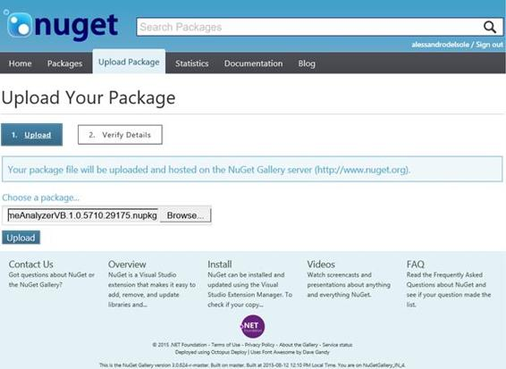
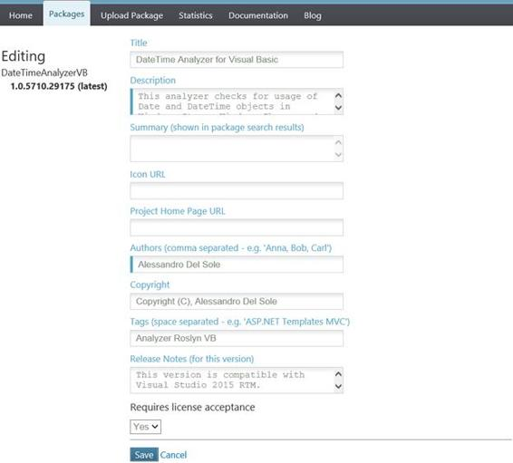

# 第 6 章向 NuGet 部署分析仪

代码分析器的好处之一是可以与其他开发人员共享。例如，您可能已经编写了一个分析器，当在 WPF 实现 MVVM 模式时，它可以检测代码问题，并且您希望将其公开。此外，您可能会提供自己的库和 API，包括集成的罗斯林代码分析。这是一个不可思议的机会:例如，如果您构建和销售用户控件，您可以包含代码分析器，该分析器可以检测代码问题，并根据您的 API 所需的编程模式提出修复建议。本章介绍如何将分析器打包并部署到流行的在线库存储库 [NuGet](http://www.nuget.org/) 以获得最佳的集成体验。

|  | 注意:本章中描述的步骤不适用于代码重构项目，因为这些步骤不会自动生成 NuGet 包。本章将提供一些将代码重构发布到 NuGet 的技巧，但是官方支持的部署重构的方法只能通过 Visual Studio 图库，这是下一章的主题。 |

[NuGet](http://www.nuget.org/) (发音为 *New Get* )是一个在线包存储库，开发者可以在其中发布和查找库。NuGet 包包含。关于包描述和包依赖关系的 dll 库和元数据信息。Visual Studio 2015 集成了 NuGet 客户端工具，允许在集成开发环境中查找、下载和安装 NuGet 包。这些客户端工具会自动解析并安装软件包所依赖的任何依赖项，因此您不必担心手动查找和下载其他库。在第 2 章中，您看到了一个如何使用 NuGet 将分析器包安装到项目中的例子。在本章中，您向前迈出了一步:您将学习如何将分析器包发布到 NuGet，以便其他开发人员能够在他们的项目中安装和使用您的分析规则。

为了演示将分析器部署到 NuGet 的过程，我将使用第 4 章中创建的 DateTimeAnalyzer 项目。显然，您将无法发布相同的分析器，因为它已经存在于 NuGet 图库中，但是这里描述的步骤适用于您自己构建的任何分析器。

带代码修复的**分析器(NuGet + VSIX)** 项目模板会在您每次构建项目时自动生成一个包含编译后的分析器的 NuGet 包。这是可能的，因为特定的 MSBuild 规则会自动生成包。根据所选的生成配置，它位于项目的 Bin\Debug 或 Bin\Release 子文件夹中。它的名称由项目名、版本号和。nupkg 扩展。例如，我在本章中使用的 DateTimeAnalyzer 包的最新稳定版本的名称叫做 datetime analyzer _ VB . 1 . 0 . 5710 . 29175 . nupkg，其中 1.0 是主要/次要对，5710.29175 是构建/修订对。

一般来说，NuGet 包是带有。nupkg 扩展名，并包含许多元素，包括必须安装到目标计算机上的文件。NuGet 包的结构可能非常复杂，详细解释它超出了本书的范围，本书的目的是教您。NET 编译器平台，而不是 NuGet 包约定。

对于分析器，NuGet 包包含(至少)以下元素:

*   包清单，其中包含元数据信息以及包所依赖的文件和依赖项的列表。这将在下一小节中讨论。
*   一个名为**analyzer \ dotnet**的文件夹，包含语言无关的分析器或语言特定的文件夹，如**analyzer \ dotnet \ VB**和**analyzer \ dotnet \ cs**。
*   一个名为**工具**的文件夹，其中包含两个名为 **Install1.ps** 和**unnstall 1 . PS**的 PowerShell 脚本。当您使用 NuGet 包管理器将分析器包安装到项目中时，Visual Studio 2015 会执行 **Install1.ps** 脚本来安装分析器。要删除该包，当您决定不再需要它并且想要通过 NuGet 工具删除它时，Visual Studio 会执行**卸载. ps1** 脚本。

理解这些基本概念很重要，因为在下一小节中编辑包的清单时，您将使用包的结构。有关可以添加到 NuGet 包中的元素的完整列表，以及完整的包创作指南，您可以阅读官方的 [NuGet 文档](http://docs.nuget.org/)。

在发布 NuGet 包之前，您需要编辑它的清单。清单包含元数据信息，如包 id、标题、描述和作者，还包含包将要安装到目标项目的文件列表以及 NuGet 将自动解析的依赖项列表。包清单是一个带有。nuspec 扩展。对于分析器，Visual Studio 2015 会自动创建一个名为 **Diagnostic.nuspec** 的清单文件，您可以在解决方案资源管理器中看到该文件，并在 Visual Studio 编辑器窗口中打开该文件。中的 XML 元素。nuspec 文件是不言自明；但是，您必须特别注意以下几点:

*   `id`:这表示 NuGet 在线图库中包的唯一标识符。
*   `version`:这允许指定包版本号，对于提供包更新很重要。请注意，您可以手动编辑主要版本号和次要版本号，但是 Visual Studio 2015 会在您每次重建项目时自动提供和更新包的内部版本号和修订版本号，而不考虑`version`的内容。
*   `licenseUrl`:包的许可协议网址(可选)。
*   `requireLicenseAcceptance`:如果`true`，用户在下载安装包之前需要接受链接的许可协议。注意默认值是`false`。请记住，如果您没有指定有效的许可证网址，它就不能是`true`。
*   `tags`:通过指定逗号分隔的标签，用户将能够通过在 Visual Studio 的“管理 numget 包”窗口的搜索框中或在线网站中键入指定的标签之一，在 numget 库中找到您的分析器。

代码清单 18 显示了如何为当前的示例包编辑 Diagnostic.nuspec 文件。

代码清单 18:编辑 NuGet 包清单

```
    <?xml version="1.0"?>
    <package >
      <metadata>
        <id>DateTimeAnalyzer_VB</id>
        <version>1.0.0.0</version>
        <title>DateTime analyzer for Visual Basic</title>
        <authors>Alessandro Del Sole</authors>
        <owners>Alessandro Del Sole</owners>
        <licenseUrl>http://opensource.org/licenses/MIT</licenseUrl>
        <projectUrl>https://github.com/AlessandroDelSole/RoslynSuccinctly/>
        <!-- Commenting this line, not necessary
        <iconUrl>http://ICON_URL_HERE_OR_DELETE_THIS_LINE</iconUrl> -->
        <requireLicenseAcceptance>true</requireLicenseAcceptance>
        <description>This analyzers detects improper usages of the DateTime type in Windows Store and OData applications, where you should use DateTimeOffset instead</description>
        <releaseNotes>First stable release to the public.</releaseNotes>
        <copyright>Copyright 2015, Alessandro Del Sole</copyright>
        <tags>Roslyn, analyzers, datetime</tags>
      </metadata>
      <!-- The convention for analyzers is to put language agnostic dlls in
      analyzers\dotnet and language specific analyzers in either
      analyzers\dotnet\cs or analyzers\dotnet\vb -->
      <files>
        <file src="*.dll" target="analyzers\dotnet\vb"
              exclude="**\Microsoft.CodeAnalysis.*;
    **\System.Collections.Immutable.*;
    **\System.Reflection.Metadata.*;
    **\System.Composition.*" />
        <file src="tools\*.ps1" target="tools\" />
      </files>
    </package>

```

您可以使用`releaseNotes`元素来描述更新的包版本的新功能。请注意`files`节点如何包含将由软件包安装的文件列表。更具体地说，第一个文件元素将安装分析器的。如果分析器以 Visual Basic (VB)为目标，将 dll 库加载到名为 analyzers \ dotnet \ vb 的项目文件夹中；如果分析器以 C#为目标，则加载到 analyzers \ dotnet \ cs 中。如果分析器与语言无关(也就是说，可以用于两种语言)，那么分析器的。dll 库安装到名为 analyzer\dotnet 的项目文件夹中。`exclude`属性告诉 NuGet 指定的依赖项不会被下载(原因是它们在项目中默认可用)。第二个`file`元素告诉 NuGet 将上一节中描述的 Install.ps1 和 Uninstall.ps1 脚本提取到名为**工具**的项目子文件夹中。

假设您已经对分析器的清单进行了所有必需的编辑，确保构建配置设置为 **Release** ，然后重新构建项目。打开 **Bin\Release** 项目子文件夹，找到包的最高更新版本。这将在下一节中用来完成部署过程。

在前一节中，您为分析器创建了一个 NuGet 包。这样的包可以发布到 NuGet 图库，这样其他开发人员就可以在他们的项目中使用它，就像您在第 2 章中使用 DateTimeAnalyzer 一样。然而，官方的 NuGet 存储库不是游乐场，您可能希望避免发布不稳定的包。幸运的是，Visual Studio 2015 可以在您的开发机器上使用本地包。这允许在升级到在线存储库之前进行本地测试。这是本章的下一个主题。

Visual Studio 2015 不仅允许在线从官方 NuGet 存储库中挑选 NuGet 包，还允许从与 NuGet 规范兼容的本地文件夹和在线提要中挑选。这为您提供了一个选项，在在线发布您的工作之前，在您的开发机器上测试您的包。为了演示这是如何工作的，创建一个名为 **C:\LocalPackages** 的新本地文件夹。然后，将 datetime analyzer _ cs . 1 . 0 . 5710 . 29175 . nupkg analyzer 的 NuGet 包复制到此文件夹中(或者对于 Visual Basic，复制 datetime analyzer _ VB . 1 . 0 . 5710 . 29175 . nupkg)。

最后，打开 Visual Studio 2015。请记住，Visual Studio 会在每次构建时更新包版本号，因此您可能会有稍微不同的版本号。此时，您需要做的是配置集成的 NuGet 客户端工具，将本地文件夹识别为包源。为此，选择**工具** > **选项**，在选项对话框中，展开**获取包管理器**节点。最后，选择**封装源**元素(见图 38)。


图 38:配置 NuGet 包源

点击带有绿色 **+** 符号的按钮，添加新的包源。在名称文本框中，输入包源的友好名称，该名称将显示在“获取包管理器”窗口中。在 Source 文本框中，输入新创建的文件夹名称(参见图 38)。准备好之后，点击**确定**。

要在本地测试包，请执行以下步骤:

1.  使用与分析器目标语言匹配的编程语言创建并保存新的 Windows Phone 8.1 项目。
2.  在解决方案资源管理器中，右键单击项目名称并选择**管理 NuGet 包**
3.  当“获取包管理器”出现时，从**包源**组合框中，选择**本地包**源(见图 39)。
4.  选择需要的包，查看信息，然后点击**安装**。


图 39:从本地存储库中选择并安装 NuGet 包

几秒钟后，包将被安装到项目中，分析器将立即可用。为了演示它是如何工作的，您可以按照第 2 章中“下载、安装和使用代码分析器”一节中描述的步骤进行操作，您可以参考图 17 和 18。假设您已经进行了本地测试，以确保分析器按预期工作，那么是时候转到在线并与其他开发人员共享分析器了。

|  | 注意:开发人员期望在官方的 NuGet 图库上只找到稳定和专业的包。因此，在您将包从本地测试升级到 NuGet 之前，最好通过将包发布到在线 NuGet 托管服务之一(如 [MyGet](http://www.myget.org) )来进行中间测试。这允许您在官方图库之外创建您的个人和企业 NuGet 提要。 |

为了与公众共享一个分析仪包，您必须登录 [NuGet](http://www.nuget.org) 门户。如果您没有帐户，您可以通过提供您的凭据或使用现有的微软帐户[免费注册](https://www.nuget.org/users/account/LogOn?returnUrl=%2F)。

登录后，点击**上传包**。系统会要求您指定想要上传的 NuGet 包，所以点击**浏览**，然后定位选择最高版本的包。图 40 显示了一个基于 DateTimeAnalyzer_VB 包的版本 1.0.5710.29175 的示例。



图 40:上传 NuGet 包

点击**上传**。上传完成后，您可以选择查看包的详细信息，如图 41 所示。无论是否需要更改包详细信息，都要提交信息以完成发布过程。15 到 20 分钟后，该包将在 NuGet 提要中列出。



图 41:查看和编辑包详细信息

在 Visual Studio 2015 中，您可以从官方存储库中以支持的项目类型之一添加 NuGet 包，例如，一个 Windows Phone 8.1 应用程序。图 42 显示了突出显示已发布包的“获取包管理器”窗口。


图 42:从在线存储库中可以获得 NuGet 包

然后，您可以按照第 2 章中描述的步骤下载软件包，并使用它将安装到您的项目中的分析器。此时，您已经与世界共享了您的分析器，其他开发人员将能够在他们的项目中利用您的分析规则。

这一部分包括许多技巧和诀窍，让您在 NuGet 和 Roslyn 上的体验更好。

正如我在本章开始时告诉您的那样，代码重构项目模板不包括自动生成 NuGet 包的 MSBuild 规则，共享重构的默认方式是通过 Visual Studio Gallery，这将在下一章中详细描述。但是，如果您通过重构项目模板将代码重构添加到分析器项目中，它将与分析器一起捆绑到 NuGet 包中，并将与诊断一起正确安装。

您可以发送包含您的库和罗斯林分析器和重构的 NuGet 包。这让开发人员在使用 API 时有了更好的编码体验。例如，每当开发人员针对您的库编写不正确的代码时，诊断可能会报告警告，代码修复可能有助于提供更合适的代码片段。你有两个选择来实现这一点:

*   包括你的。Visual Studio 为您的分析器生成的 NuGet 包。
*   发布两个独立的 NuGet 包:一个用于您的 APIs，一个用于代码分析，还有第三个空包，它只包含在安装时收集它们所需的元数据和依赖信息。这种方法允许开发人员选择是只需要您的 API，还是同时需要库和集成代码分析。

在这两种情况下，您都需要熟悉包创作。找到这方面信息的最好地方是官方的 [NuGet 文档](http://docs.nuget.org/)。另外，你可以看看我为 [MSDN 杂志](https://msdn.microsoft.com/en-us/magazine/mt573715)写的一篇文章，里面更详细的讨论了这个话题。

Microsoft Visual Studio 2015 提供了一种与其他开发人员共享代码分析器的简单方法，它自动生成了一个 NuGet 包，其中包含向消费者提供包详细信息所需的分析器二进制文件和元数据信息。在您将分析器部署到官方的 NuGet 库之前，在您的开发机器上进行本地测试非常重要，以确保您的包能够正常工作并提供稳定的开发体验。

Visual Studio 2015 有特定的选项，可以配置为从本地文件夹中挑选包，这样您就可以像从在线 NuGet 存储库中一样测试任何包。一旦您对本地测试感到满意，您可以通过登录并上传您的包来将您的包升级到 NuGet。开发人员将能够在几分钟内找到您的分析仪，他们将能够利用您的罗斯林动力工作。