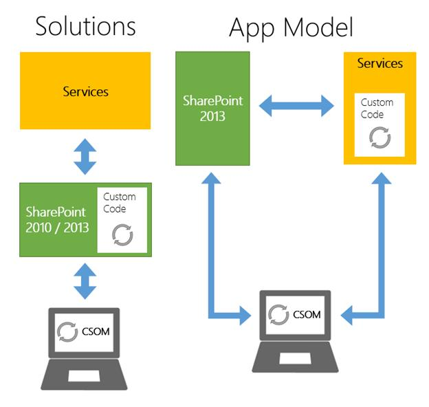

# 第 1 章介绍 SharePoint 2013 开发模式

应用程序的使用现在非常普遍。人们每天都在智能手机、平板电脑、桌面操作系统甚至社交网络上使用它们。使用 SharePoint 解决方案模型时，无法定义实现应用程序的精确边框。有了解决方案，我们可以创建列表、工作流、功能区控件扩展、事件接收器、web 部件等。每个工件都可能独立于其他工件(当然，这取决于您创建的逻辑)。工作流相对于事件接收器或 web 部件是完全独立的。

的确，通过合作，您可以实现应用程序的概念，但是创建解决方案模型是为了扩展 SharePoint，而不是创建应用程序。这个概念，更像早期版本的应用程序，可以被同化为在列表或库中读取或写入数据的 web 部件(这是非常危险的，但这只是一个例子)。

随着 SharePoint 2013 的推出，微软重新发明了这个概念，现在正在为新的应用程序和可扩展性概念提供新的开发模式。首先，让我们回顾一下 SharePoint 2013 为我们提供的当前开发模式:

*   农场解决方案
*   沙盒解决方案
*   应用模型

## 农场解决方案

自 2007 年版本以来，服务器场解决方案是微软使开发人员能够在 SharePoint 中安装自定义内容的方式。严格来说，这些是扩展名为. WSP 的内阁文件。在内部，一个 SharePoint 解决方案包(WSP)包含动态链接库(DLL)，可能是 ASP.NET 网络表单页面、用户控件、图像、级联样式表(CSS)、JavaScript 文件和各种资源文件 element.xml，它们将告知 SharePoint 如何安装所有这些东西。

服务器场解决方案模式非常强大，因为它允许我们完全扩展 SharePoint 功能。我们可以在 SharePoint 安装文件夹中安装文件，使用 SharePoint 提供的服务器端对象模型，以高于当前用户的权限运行代码，并使用事件接收器扩展 SharePoint 引擎，只阻止用户在我们自己的逻辑上执行的操作。简而言之，我们可以完全控制我们的 SharePoint 解决方案。

但是，一如既往，过多的权力有时会带来伤害。

当我们开发一个服务器场解决方案时，我们必须始终考虑这样一个事实，即我们手头有 SharePoint 引擎。

除此之外，我们还有许多必须做的事情:

1.  我们必须尽可能以最有效的方式使用 SharePoint 提供给我们的对象，否则我们将面临 SharePoint 场过载的风险。
2.  我们实现的代码必须使用。用于开发 SharePoint 的. NET 框架。
3.  开发环境要求 SharePoint 与 Visual Studio 一起存在于本地。这意味着要有一个可供开发的虚拟化系统，或者一台足够强大的个人计算机来运行 SharePoint 场。
4.  为了在生产环境中以这种安装模式安装我们的定制，我们必须以管理权限访问服务器场，并使用 PowerShell 执行一系列既用于安装又用于激活的命令。

## 沙盒解决方案

这种类型的解决方案是在 SharePoint 2010 中引入的，其主要目的是能够安装自定义项，即使用户不是服务器场管理员。

为了做到这一点并保持一定的安全性，与场类型的解决方案相比，这种类型的解决方案是有限的。例如，您不能在文件系统上部署任何类型的文件。对象模型是有限的，这使得代码无法访问逻辑上位于网站集之上的大多数对象。

沙盒解决方案根据默认配额对每个网站集的资源使用情况进行监控，以防止使用过多的系统资源。

如果一个或多个沙盒解决方案超过了为网站集设置的配额，该网站集中的所有沙盒解决方案都将自动停止。

每天晚上都会运行一个计时器作业，并重置所有网站集中所有沙盒解决方案的每日资源使用配额。

显然，这些限制旨在保持 SharePoint 场的安全，同时对在不同站点上安装自定义设置给予较少的限制。此模型是在 SharePoint Online 版本中安装自定义设置的唯一方法，因为它是使用 2010 版本实现的。

目前，这个模型已经被弃用，取而代之的是新的应用模型(至少在包含服务器端代码的解决方案方面)。

## App 模型

该应用程序模型是微软在 SharePoint 2013 中推出的新模型，仅适用于此版本和 SharePoint Online (Office 365)。与前面描述的两种模式相比，这种新模式从根本上改变了您的思维和开发方式。

该模型的主要思想是，我们实现的代码将不再在 SharePoint 内部运行，而是完全在客户端(或服务器端，但托管在 SharePoint 之外)运行，无论这意味着在浏览器内还是在 web 服务器应用程序(如 ASP.NET、PHP、JSP、Node.js 或任何其他技术)内。这确实是一个重大的变化，任何一个已经在以前版本的 SharePoint 中开发过的人肯定都能理解。

开发使用了最新的客户端技术，包括 HTML5、CSS3 和 JavaScript。但是，它也使用 OAuth 等技术来实现安全性，使用 OData 来进行 REST 调用，或者使用客户端对象模型(CSOM)来与 SharePoint 进行通信。

在这种情况下，SharePoint 成为一个为我们的应用程序提供服务的系统，尤其是安装和运行它们的能力。SharePoint 在身份验证模式下提供了所有现成的功能(OOTB)，并且已经向应用程序和用户授予了特定的权限。

有了应用程序的模型，我们就有了统一的开发模型，使得在 SharePoint 2013 上而不是在 Office 365 上实际安装应用程序成为可能，而无需重新编译或修改项目。

除此之外，微软还提供了更广泛的选项来为 SharePoint 提供应用程序:

1.  公共办公室商店:将您的应用程序发布到微软公共办公室，使应用程序商店公开可用。
2.  内部组织应用程序目录:将您的应用程序发布到托管在您的 SharePoint 部署上的内部组织的应用程序目录。这使得它只对有权访问该 SharePoint 网站的用户可用。
3.  手工安装。

在接下来的章节中，我将深入学习这门课程。但是，让我们首先分析新应用程序模型的主要主题:

*   很容易迁移到 SharePoint 的未来版本；这是因为代码不再在 SharePoint 流程中执行。
*   由于客户端应用编程接口，开发人员对 SharePoint 内部的了解可能比场解决方案开发少。
*   不仅仅是使用。NET，但除了在不同系统上扩展这些应用程序的能力之外，还有其他技术可用。

一个毋庸置疑的优势是，为了开发应用程序，您不再需要本地 SharePoint 实例。相反，您可以完全远程工作，甚至使用 Office 365 的开发人员订阅。

图 1:解决方案与应用模型

## 客户端 API

当您无法在 SharePoint 中执行服务器端代码时，唯一的通信方式是使用客户端应用程序编程接口(API)，该接口允许我们访问 SharePoint 提供的大多数功能。

根据所选的应用程序类型和平台，您可以选择:

*   。NET 客户端对象模型(也称为托管代码的客户端对象模型)
*   JavaScript 对象模型
*   REST/OData

例如，如果我们选择创建一个 SharePoint 托管的应用程序，我们可以决定使用 JavaScript CSOM 或使用 Rest/OData 端点，因为使用的主要平台是 JavaScript。(没有人禁止我们在 SP 托管的应用中使用 SilverLight，但是现在浏览器的插件从架构的角度来看已经有些过时了。)

或者，如果我们决定使用。NET 技术。NET CSOM 是最合适的。诚然，我们也可以在这里使用 Rest/OData 端点，但是在这种情况下，使用类型化对象模型肯定更方便。

如果我们使用任何我们想要的网络平台(PHP，Node)创建一个自托管的提供者。Js、Java 等。)，我们几乎被迫使用 REST/OData 端点，因为有一个适用于所有技术的 CSOM 版本。

在接下来的章节中，我们将进一步讨论这些方面。

## 总结

在本章中，我们了解了 SharePoint 为我们创建定制或应用程序提供的模型。在接下来的章节中，我们将讨论使用新的应用程序模型开发应用程序。