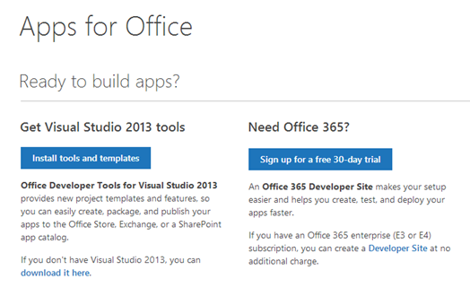
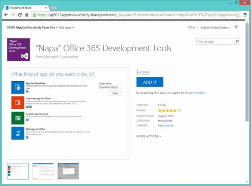
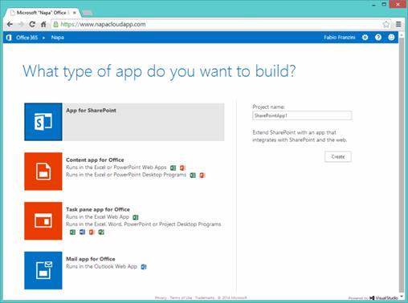
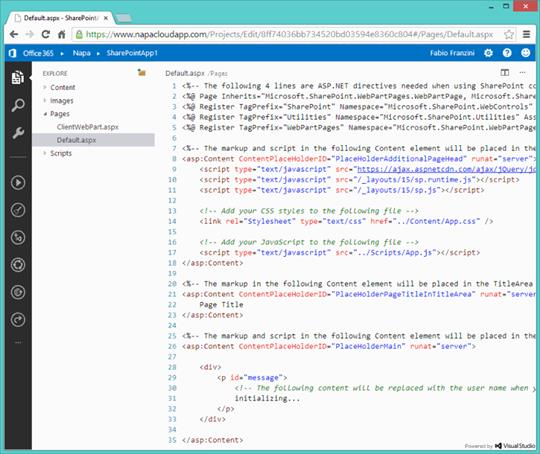

# 第二章准备开发环境

支持 SharePoint 应用程序开发的另一点是开发环境的创建和使用。

由于该应用程序可用于云和内部部署，因此可以通过两种方式创建开发环境:

1.  创建用于 SharePoint 解决方案的经典开发环境，其中我们需要将 Visual Studio 安装在安装 SharePoint 的同一台机器(虚拟机或其他机器)上。
2.  使用 Office 365 的开发人员订阅，使我们能够拥有一个更加精简的系统，而无需安装 SharePoint，这非常值得赞赏，因为我们知道 SharePoint 需要大量资源。

显然，第二种方法最适合我们在本书中讨论的内容，但不适用于农场解决方案的开发。它还允许我们立即开始开发，而不会浪费太多时间来正确安装和配置 SharePoint。

在需要完全控制正在开发的服务器场的所有情况下，建议您使用安装了 SharePoint 的虚拟机(VM)。

您可能想知道如何获得 Office 365 的开发者订阅。最好的方法是购买或使用 MSDN 套餐中包含的服务。您还可以利用 30 天的测试环境。这是你的选择。

在这两种情况下，我们都使用使用开发人员网站模板创建的网站集，该网站集允许我们启用名为“侧面加载”的功能。

|  | 注意:侧面加载允许我们安装应用程序，而无需通过应用程序目录，然后确保 Visual Studio 可以在调试时直接安装应用程序。 |

要开始创建基于 Office 365 的开发环境，请转到[http://dev.office.com/build](http://dev.office.com/build)，向下滚动，然后单击“为 SharePoint 构建应用程序”

此时，我们必须做两件事:一、首先确保我们已经在 Visual Studio 中安装了 Office Developer Tools，否则我们必须停止并安装它们。其次，我们必须注册免费试用 Office 365 开发人员网站。

## Visual Studio 的办公开发工具

Office 开发人员工具适用于 Visual Studio 2012 和 Visual Studio 2013。我的建议是使用最新版本的 Visual Studio，这样您就可以使用这个集成开发环境(IDE)的最新功能。此工具允许您拥有为 SharePoint 开发应用程序所需的所有项目模板和项目项。

图 2:dev.office.com 站点

## 注册 Office 365 开发者网站

如果您没有配置 SharePoint 2013 环境或 Office 365 的开发人员订阅，您可以使用试用版 30 天来开发和测试您的应用程序。

图 3: Office 365 开发人员网站注册

此步骤要求您创建一个帐户，并购买 Office 365 的开发人员订阅，其中包括 SharePoint Online、Exchange Online 和 Lync Online。订阅后，请按照设置说明进行操作。

## 纳帕

Napa 是另一个可以用来为 SharePoint 开发应用程序的工具。此工具作为 SharePoint 应用程序分发(可在 SharePoint 在线商店免费获得)。它允许您开发只有客户端代码(HTML 和 JavaScript)的应用程序，因此，在您想要开发 SharePoint 托管的应用程序而不想或不能使用 Visual Studio 的环境中非常有用。

图 4:添加纳帕应用

这些工具完全基于网络，不仅允许您编写代码，还可以打包应用程序，以便随后部署。

图 5:使用 Napa 创建新的 SharePoint 应用程序

图 6:使用 Napa 代码编辑器修改应用程序代码

## 总结

在本章中，我们学习了如何轻松创建一个可以为 SharePoint 2013 创建应用程序的开发环境。开发人员订阅 Office 365 使我们能够立即意识到开发应用程序而不是解决方案的潜力，从而开发既能在云中运行又能在内部运行的应用程序。

如果您希望有一个完整的环境，可以为 SharePoint 创建各种应用程序，那么选择是带有 Office 开发工具的 Visual Studio。如果您只想创建 SharePoint 托管的应用程序并使用基于网络的集成开发环境，那么您可以选择 Napa。