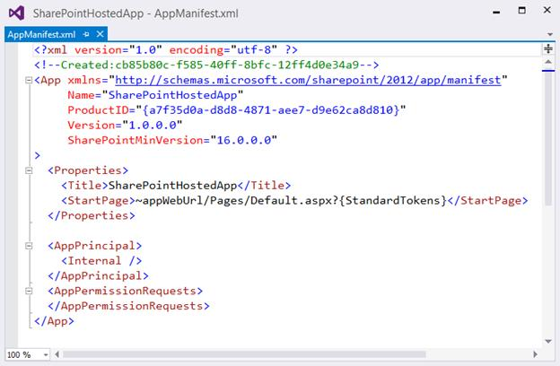
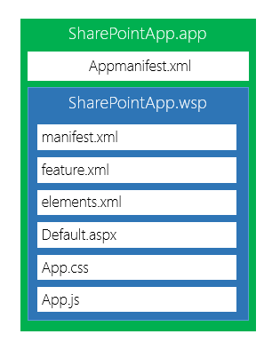
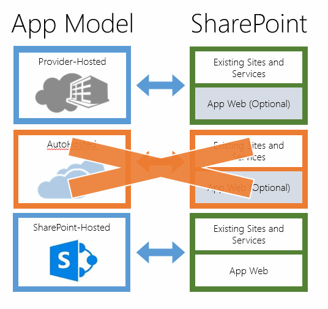

# 三、新应用模型架构概述

## 简介

在 SharePoint 中，应用程序在技术上是一个 zip 文件，它使用与 Office 文档包相同的格式，只是它的文件类型扩展名不同”。App”。

这个包包含一个非常重要的文件，名为 AppManifest.xml。这个文件描述了我们的应用程序到 SharePoint 的一系列元数据，包括标题、版本号、图标、主页、应用程序应该保证能够工作的权限、在 SharePoint 服务方面必须满足的先决条件、支持的语言以及应用程序必须能够与之通信的任何外部域(如果需要)。

图 7:应用程序清单

在接下来的章节中，我们将更详细地讨论清单文件的重要性。

除此文件外，该包可能还包含其他需要部署的文件，如列表定义、内容类型或页面以及资源(如在 SharePoint 托管的应用程序中)。为了做到这一点，应用程序可能包含 wsp 来部署这些文件，以便 SharePoint 每次都使用相同的机制。

就部署到 SharePoint 的内部操作而言，此软件包安装操作对安装应用程序的用户完全透明。图 8 显示了应用程序包结构，让您更好地理解我刚才解释的概念:

图 8:应用包结构

要决定您需要的应用程序架构类型，您必须了解您正在开发的环境。与任何其他信息系统一样，需求将是您使用的架构的核心决定因素；然而，你所掌握的知识将是任何评估分析的基础。

## 托管

在为 SharePoint 开发应用程序时，我们必须牢记微软要求我们使用的新架构。

我们有两种不同的可用架构来创建 SharePoint 应用程序:

*   SharePoint 托管的应用程序
*   云托管应用

在 SharePoint 托管架构中，我们的应用程序将驻留在 SharePoint 中，所有资源(包括页面)将托管在一个特殊的独立子网站中，该子网站将为我们应用程序的每个已安装实例创建。但是如果我们不能在 SharePoint 中执行服务器端代码，我们如何创建在 SharePoint 中托管的应用程序？简单:您的应用程序逻辑应该完全使用客户端 JavaScript 创建。使用这种 SharePoint 托管的体系结构，SharePoint 只提供托管服务和 API，供我们访问它们提供的功能(但业务逻辑必须首先在 SharePoint 之外执行，然后在客户端执行)。

在第二种情况下，当使用云托管架构时，我们的应用程序必须托管在 SharePoint 外部的托管服务中；这可以是一个 IIS 站点，也可以是一个私有云或公共云，无论您想使用哪种技术来创建应用程序。这意味着我们不仅可以使用。NET，但也包括 PHP、Java、Node.js、Python 或任何您想要的技术栈和平台。

让我们记住，我们谈论的是您通过网络浏览器使用的网络应用程序。即使在这种情况下，应用程序也可以使用由 SharePoint 托管的特殊的独立子网站，以便通过 SharePoint 提供的应用编程接口读取或写入信息。

直到 2014 年 6 月 30 日，云托管应用由两个子类别组成:提供者托管应用和自动托管应用。但是，后一种模型被认为是不推荐使用的，并且已经作为一种开发模型被删除了，所以我们不会在本书中介绍它。

图 9:不同的应用模型

在这一点上，我们应该从那些可用的模型中选择哪一个？

这是我们开发任何应用时都会问的问题。通常的答案是视情况而定。没有一个模型可以解决所有的问题。下面是一个有助于解决我们可能遇到的问题的模板:

表 1: SharePoint 托管与云托管

| 要求 | SharePoint 托管的 | 云托管 |
| --- | --- | --- |
| 使用和创建新的 SharePoint 工件 | 是 | 是 |
| 使用客户端代码 | 是 | 是 |
| 必须管理托管空间的负担 | 不 | 是 |
| 使用已经开发的服务器端组件，或者做服务器端做不到的事情 | 不 | 是 |
| 已制作的端口应用程序 | 依赖 | 是 |
| 运行耗费时间和大量计算资源的进程 | 不 | 是 |
| 安全可靠地对用户提交的数据进行验证 | 不 | 是 |
| 多租户的自动管理 | 是 | 不 |

通过应用程序的模型，我们可以在安全性下与 SharePoint 的工件进行交互，我们将在下一章中看到这一点。

该应用程序只能访问我们授予权限的数据。

我们如何在 SharePoint 中创建新的工件？看情况。如果我们正在部署列表、库等。，在声明模式下，这些将在一个名为网络应用程序的特殊隔离站点中可用。

否则，我们被迫使用提供给我们的 API，因此必须通过编写允许我们创建这些工件的代码以命令模式工作。

## 入口点

当一个应用程序被制作出来时，外观和感觉以及用户如何与应用程序本身进行交互都是需要考虑的非常重要的事情。

SharePoint 应用程序模型允许您选择不同的方式来呈现界面:

*   沉浸式整页:界面实现为网页。这是默认模式，每个应用程序都需要至少一个沉浸式页面。
*   应用程序部分:让我们将应用程序的图形用户界面或部分图形用户界面放在 SharePoint 的页面中，就像 web 部件一样。应用程序部件只是一种由 ClientWebPart 类表示的 web 部件。这种 web 部件本质上是一个 IFrame 的包装器，它将承载应用程序的一个页面。
*   扩展应用程序:从技术上来说，这只不过是一个自定义操作，允许您将 SharePoint 中的几乎所有菜单共享为功能区控件、项目菜单等。在网络主机上。当用户点击链接时，他们将被重定向到 web 应用程序。

这些形状可以单独使用，也可以组合使用，使您能够以与 SharePoint 网站最集成的方式使用应用程序。

## 应用范围界定

在 SharePoint 中，我们有两种安装应用程序的方法:

1.  网站管理员在您想要使其可用的网站中安装应用程序；在这种情况下，它说应用程序有一个“网络范围”。
2.  租户管理员在应用程序目录中安装应用程序。在这种情况下，应用程序将有一个“租户范围”

在 SharePoint 2013 中，租户是一组网站集，这些网站集又可以分类如下:

*   SharePoint Online:属于单个客户帐户的一组网站集
*   SharePoint 场:一个 Web 应用程序中的所有网站集，或它们的子集，或您在同一场中的多个 Web 应用程序中创建的网站集。

那么你如何决定给这个应用程序一个什么样的范围呢？

范围级别的选择不是在应用程序本身的开发过程中做出的，而是在系统中安装应用程序的过程中选择的。

### 网络范围

安装此类范围的应用程序时，SharePoint 会创建一个名为“应用程序网站”的新子网站，但前提是您的应用程序需要它。该应用程序能够在安装它的站点(网络主机)中提供您创建的应用程序部分和自定义操作。

### 租户范围

在这种情况下，只有租户管理员可以安装具有此范围的应用程序，并且必须在以前配置的名为“应用程序目录”的特殊站点中安装。完成后，管理员可以决定在属于同一租户的所有站点上部署该应用程序，或者在一个站点上部署，或者在可用站点的子集上部署。租户管理员可以通过使用托管路径列表、网站模板列表或网站集列表来指定应用程序安装在哪些网站上。已批量安装的应用程序只能由租户管理员卸载。当租户管理员卸载应用程序时，它会从租户中的每个网站卸载。用户不能逐个网站地卸载批量安装的应用程序。

关于此操作的一个重要注意事项是，当更新批量安装的应用程序时，只有租户管理员有权执行此操作，并且它会在安装它的租户的所有网站上进行批量更新。

如果包含应用程序网站的应用程序是批量安装的，则只创建一个应用程序网站，并由安装该应用程序的所有主机网站共享。应用程序网站位于组织应用程序目录的网站集中。当在租赁中创建新的网站集时，以前批处理安装的应用程序会自动安装在新的网站集上。

你也需要记住一些关于应用网站的事情。在这种情况下，您将创建单个“应用程序网站”应用程序目录级别。这意味着保存在此特殊子网站中的任何数据将在安装该应用程序的所有网站之间共享。您可以在下一部分了解更多关于应用程序网站的信息。

### 网络范围与租户范围

表 2:范围比较

| 方案 | 网络范围 | 租户范围 |
| 共享相同的数据，独立于您正在工作的站点 | 不 | 是 |
| 应用程序必须安装在大量的网站上 | 不 | 是 |
| 每个安装的应用程序必须有不同的数据 | 是 | 不 |
| 在安装应用程序的站点上提供应用程序部件和自定义操作 | 是 | 不 |

## 应用网站

我们根据应用程序的范围了解应用程序网站是什么以及它是在哪里创建的。因为它是一个 SharePoint 网站，所以它会有一个网址，但不会是一个普通的网址。

URL 的主要功能是完全隔离的，甚至在域级别:应用程序。

其组成如下:

**http://[租户]-[APPID].[域]/[应用程序名称]**

其中:

*   租户:在 SharePoint 中配置的租户名称
*   为应用程序的每个实例生成的唯一标识符
*   域:SharePoint 的域名
*   应用程序名称:应用程序的名称(包含在应用程序清单文件中的值)

一个例子如下:

https://**sp 2013 app 简要介绍**-**【8235 CEB 5953 D4**。SharePoint . com/**share point app 1**

其中:

*   sp 2013 app dev 简洁地说就是租户
*   8235ceb59053d4 是 APPID
*   sharepoint.com 是域名(在这种情况下，是 Office 365)
*   SharePointApp1 是应用程序名

此应用程序安装在以下地址的网站上:

**https://sp2013appdevsuccinctly.sharepoint.com**

这说明了两个网址的区别。但是，请记住，这是安装该应用程序的子网站应用程序网站(SPWeb)。

正如我们刚才所说，主要目的是完全隔离应用程序。例如，你可以删除经典的 XSS 议题。但是另一个目的是加强权限，以便连接到站点的代码从授权的角度被隔离。

## 总结

在本章中，我们了解了新模型的架构布局。我们现在了解了设计和实现 SharePoint 应用程序的三个基本因素:托管模式、应用程序中的图形界面类型及其范围。