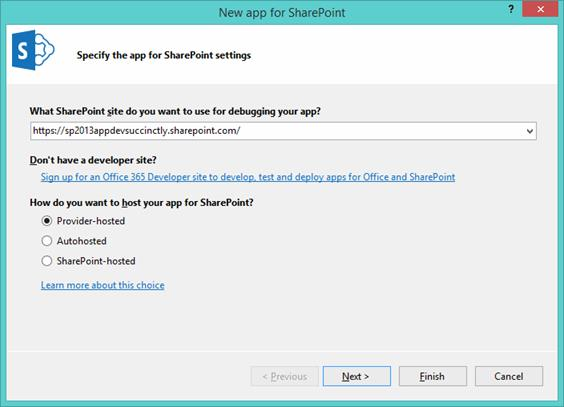
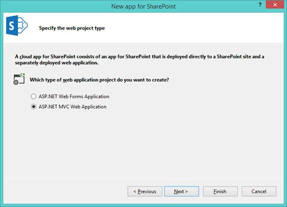
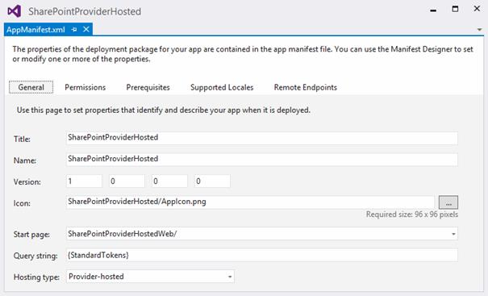

# 第 5 章提供商托管的应用

由提供者托管的 SharePoint 应用程序是一种能够执行服务器端代码但不能在 SharePoint 中执行的应用程序。因此，有必要根据所使用的技术，使用诸如互联网信息服务(IIS)或任何其他应用服务器来托管作为应用一部分的网络应用。这是因为我们不再被迫使用。NET，因此可以自由使用我们想要的任何语言或平台。

## 项目

此时，Visual Studio 要求我们输入信息(稍后将修改)，其中包括应用程序的名称、我们要在其上执行调试的站点以及我们要创建的应用程序的类型。在这种情况下，选择“提供商托管”，如图 19 所示:



图 19:主机类型的选择

在此屏幕中，Visual Studio 允许我们选择要用于创建应用程序的网络项目类型。我们可以选择 ASP.NET 网页表单或 ASP.NET MVC:



图 20:web 应用程序项目类型的选择

在这里，我们需要指定我们的应用程序将使用 SharePoint Online 向 SharePoint 进行身份验证的方式。我们的选择要么是 Azure 的访问控制服务(ACS)，要么我们可以设置一个数字证书。


图 21:应用验证类型的选择

单击“完成”后，解决方案将显示两个项目。第一个是 SharePoint 应用程序的真实项目，第二个是包含我们应用程序代码的网络项目。


图 22:解决方案浏览器

这个网络项目，一个 ASP.NET MVC 类型，包含一些有趣的文件。

第一个文件是 **SharePointContext.cs** 文件，它允许我们从当前的 http 上下文开始，创建一个在 CSOM 使用的新 ClientContext。

第二个是 **TokenHelper.cs** 文件，它由 SharePointContext 类在内部使用，并启动一种机制来获取对 OAuth 身份验证下的请求有效的访问令牌。

在 HomeController 控制器中，我们可以看到它如何使用这种机制来获得有效的客户端上下文，并使用 CSOM 托管的。

```
          var  spContext = SharePointContextProvider .Current
                           .GetSharePointContext(HttpContext);

          using  (var  clientContext =
                  spContext.CreateUserClientContextForSPHost())
           {
               if  (clientContext != null )
               {
                   // CSOM Code here
                }
           }

```

**SharePointContext** 类已经有了几种方法，以便根据使用范围创建不同的 **ClientContext** :

*   CreateUserClientContextForSPHost
*   createuserclientntextforspapp web
*   createappnlyclientcontextfor phost
*   createapponlyclientxtforspapp web

这将创建连接到应用程序网站或主机网站的上下文，或者只使用应用程序的凭据，或者与用户凭据结合使用，使其非常易于使用。

## 应用清单

关于应用程序清单，与对 SharePoint 托管应用程序的描述相比，没有任何重大变化。如您所见，不同之处在于托管类型，它被设置为提供者托管。然而，其他一切与第 4 章[应用清单部分](04.html#_App_Manifest)中描述的相同。



图 23:常规选项卡

在 XML 视图中，我们可以看到起始页是如何标识的:

```
          <Properties>
              <Title> SharePointProviderHosted</Title>
              <StartPage> ~remoteAppUrl/?{StandardTokens}</StartPage>
          </Properties>

```

**~remoteAppUrl** 的值将替换为该应用将托管的域名，这是已发布的应用。

## 总结

在本章中，我们学习了如何创建一个提供商托管的应用程序，以及它的结构。我们选择创建一个 ASP.NET MVC 网络项目，但是您也可以使用 ASP.NET 网络表单创建一个。

Visual Studio 为 web 项目提供了这两个模板，但是您可以使用任何您想要的 web 开发框架。