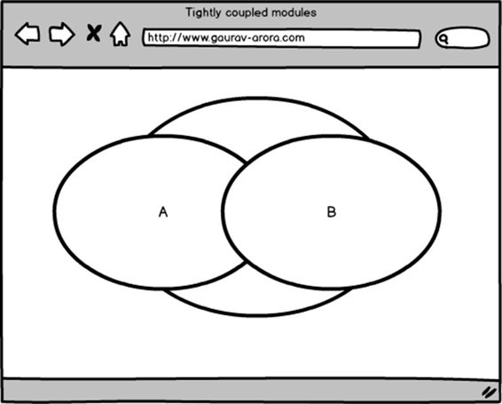

让我们从两个问题开始:作为开发人员，你在写什么？它是好的代码吗？当你回答时，记住简单地遵循一些设计模式并不能保证你写的是好的代码。


图 1:立体图像

图 1 显示了大多数程序员对他们在 SOLID 上的工作的印象——不稳定的代码松散地结合在一起，就像水桶里的一堆鹅卵石。程序员通常会想象，如果他们只是简单地采用一些设计模式，他们就能写出好的代码，但当然，在现实中，这还不够。虽然我们的代码不会像砖墙或装有鹅卵石的容器那样坚固，但是使用 SOUND，我们的代码将更加健壮和可用。

坦率地说，“为什么是固体？”简单地说，固体原理产生更好的代码。如果你感到困惑，不要担心——当我们研究几个实例时，这将变得更加清晰。但是总结一下我的基本原理:我使用固体原理来抵消我在一个类中编写包含数千行和无数方法或函数的代码的坏习惯。是的，我是有意无意写坏代码的人之一，然后不得不为代码审查付出巨大的努力。

最终，我将识别脏代码作为优先事项，并组织了一个清单来帮助找出我的问题。您可以使用这些要点来检查您是否正在编写糟糕、肮脏的代码:

*   代码是否实现了设计模式？
*   代码是否紧密耦合？
*   代码可测试吗？
*   代码是人类可读的吗？
*   代码是否重复？
*   代码是否太长，难以理解？

也许你可以添加更多适合自己体验的检查表点，但是每当我使用上面的检查表点分析我的代码时，我就能够辨别我的代码是否脏了。然而，这个列表并没有告诉我我的代码是固体。

让我们首先尝试理解前面的清单要点如何有助于分析我们的代码。

在代码或程序中采用设计模式不是强制性的。没人能强迫你这么做。用你最好的判断来决定你是否想要实现模式。


图 2:图案图像

作为一名程序员，我可以想象模式是什么样子，我可以很容易地将它们与墙上的纹理联系起来。图 2 只是一个与程序中的模式相关的图像。

当然，没有人能阻止您编写脏代码，例如单击按钮打开并触发 Save 命令将值保存在数据库中。我们很多人在学生时代都是这样做的。我仍然记得我的 C 编程时代，当时我正在努力编写一个简单的控制台游戏，要求我将玩家的分数保存到 dat 文件中。我用一个函数编写了同一类中的所有内容。当时，这种方法对我来说很有趣。但是现在，当我想起那些日子，我想起我犯了一个多么愚蠢的错误。

再看看图 2，想象一个普通的地板。现在，想象一个普通的湿地板。当你走在潮湿的地板上会发生什么？你会摔倒的。现在，想象一个涂有你可以用鞋或脚抓住的表面的地板。在这个地板上，害怕的理由更少，因为即使地板是湿的，摔倒的机会也更少。

接下来，假设您正在进行一个维护项目，其中的代码是非托管的或脏的(即没有模式，没有原则，等等)。).这有点像在潮湿的地板上行走，不是吗？另一方面，如果同一个项目管理得很好，遵循模式和原则，当你修复或增强项目时，你的生活会更容易。模式为你的程序提供了一个额外的涂层，这样你就可以用很小的几率写出健壮的代码。

总之，脏代码是需要大量重构的代码，不遵守任何模式或原则。

不要匆忙，只要对你的编码决定三思而后行。清单中有更多的点可以帮助您决定代码。

|  | 提示:决定哪种设计模式适合您的需求，并实现该设计模式。 |

来自维基百科:

“在软件工程中，耦合是软件模块之间相互依赖的方式和程度；衡量两个例程或模块联系紧密程度的标准。”

换句话说，当一个模块完全连接到另一个模块时，就会发生耦合。



图 3:紧密耦合的模块

想象一个场景，你正在编写一个数学软件程序，你需要实现所有可能的数学运算。作为实现的一部分，您引入了两个模块。在这种情况下，无论何时需要对任何一个模块进行更改，都需要对这两个模块进行更改。这意味着您的应用程序或软件是紧密耦合的，这意味着您的代码属于脏代码。

底线是——如果你的代码模块是依赖的，你就是在写脏代码。

总是为代码编写测试和可测试代码是一个很好的实践。以下是您通过这样做获得的一些优势:

它减少了因任何未修复问题而需要的返工时间。

它在代码中提供能力测试代码。

它减少了调试代码所需的时间——在测试驱动开发(TDD)的帮助下，我们可以轻松快速地找到问题。

它允许轻松确定最近的更改或重构是否破坏了代码。

TDD 帮助我们提高代码质量，并将我们的注意力吸引到任务的主要目的上。它确保测试新的更改，并且不会破坏任何现有的代码功能。

编写测试可能令人不愉快且耗时，并且您完成应用程序或代码的时间可能非常有限，但是测试很重要。测试和代码一起工作来获得更好的代码。编写可测试的代码是一个好习惯，可以用来避免将来的复杂情况。

因为你的代码会被人类读取，所以它应该是有意义的代码。

例如，如果您正在编写一个简单地返回两个数字之和的函数，您应该选择一个有意义的名称来描述这个函数。这样，在深入代码之前，另一个开发人员可以查看函数并轻松理解其目的。在这种情况下，您可能会想到像 Sum 或 Add 这样的函数名。

|  | 提示:为了使您的方法名有意义，不要犹豫使用一个长名称，如 Is ValidForCharactersOnly。 |

在编写代码时，为类、方法、函数和模块名称赋予有意义的名称。你的程序会被人阅读，而不是机器。机器可以理解你的代码，但是你应该写得让人类也能理解。

|  | 注意:访问您的代码，看看您是否能阅读它。如果没有，那就意味着你写的是坏代码。 |

您可能在许多地方做着相同的事情——您正在创建类似业务规则的东西来验证任何输入，并且您正在为每个输入编写相同的代码。重新访问并检查您是否有这样的代码。如果是这样的话，试着将代码移到一个公共的地方，并在整个应用程序中使用它。

|  | 提示:如果不能决定将公共代码放在哪里，请创建一个公共类。 |

还要记得避免和删除任何多余的代码。为了检查冗余，以不同的方式多次访问您的代码是一个好主意。例如，您可以编写 Console。直截了当地写下“坚实的原则！”);而不是系统。控制台。写线(“简洁的固体原理！”);如果您已经添加了“名称空间”在这种情况下，‘系统’是多余的，可以去掉。

让我们看看代码清单 1，以便更好地理解冗余代码。

代码清单 1

```cs
  using System;

  public class Program
  {
      public static void
  Main()
      {
          //System can be removed as it is
  redundant code here.
          System.Console.WriteLine("SOLID Principles
  Succinctly!");

          //This is fine.
          Console.WriteLine("SOLID Principles
  Succinctly!");
      }
  }

```

避免编写冗长的代码。如果一个函数包含数千行，它可能很难理解。一般来说，我们开发人员会编写大量的代码，这些代码最好分割成小的函数或属性。

冗长的代码总是会造成混乱，尤其是对于那些实际上没有编写代码的新开发人员。这些类型的程序、函数和方法可能满足规定的要求并产生预期的结果，但是它们仍然很难理解。幸运的是，这些类型的代码通常可以组合成有意义的函数。

如果我们正在编写冗长的函数或方法，而我们可以将它们分解成小而有意义的函数，那么我们可以将代码标记为坏代码。

最后，这里有一个完整的清单来分析你的代码是坏代码还是脏代码。

表 1:脏代码清单

| 脏代码清单 |
| 检查站 | 是/否 |
| 设计模式 | 是/否 |
| 连接 | 是/否 |
| 可测试代码 | 是/否 |
| 人类可读代码 | 是/否 |
| 重复/冗余代码 | 是/否 |
| 冗长的代码 | 是/否 |

如果你的清单包含上述任何一点的“是”，你就是在写脏代码。

|  | 注:如果您想在此清单中添加更多内容，请发送给我。 |

接下来，我们将看看 SOLID 如何帮助我们防止编写糟糕或肮脏的代码。