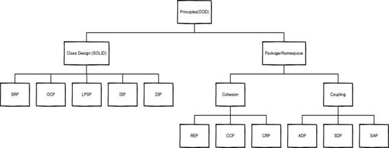

SOLID 是一套设计原则，这些原则帮助程序员编写更好的代码。表 3 显示了首字母缩略词 SOLID 代表什么。

表 3:一目了然

| 固体 |
| **S** 为 SRP | 单一责任原则 |
| **O** 为 OCP | 开-闭原理 |
| **LSP 的 L** | 利斯科夫替代原则 |
| **I** 为 ISP | 界面分离原理 |
| **D** 为 DIP | 依赖倒置原则 |

每当我提到 SOLID 时，有些人会感到困惑，但没关系——起初，这些原则确实会令人沮丧。表 4 描述了这些原则最容易混淆的方面。

表 4:固体令人困惑的方面

| 固体的迷惑性 |
| 设计模式 | 设计原则 |
| 面向对象编程 | 设计原则 |

特别是，人们混淆了设计模式和固体原则。表 5 说明了这项工作最令人困惑的方面。

表 5:设计模式与设计原则

| **设计图案** | **设计原则** |
| 是设计问题的解决方案(我们身处软件世界，所以我们会考虑任何软件问题)。 | 是指导我们如何使用特定设计模式的指南。 |
| 都关系到实际问题的落实。 | 可以应用于任何地方，而不考虑具体的上下文、问题或难题。 |
| 在处理任何问题的解决方案时都是高层次的问题。 | 是构建模块，并与模式一起使用来实现目标或解决问题。 |
| 示例:考虑一个策略模式，您正在实现或遵循原则(检查此表的右侧列)。 | 示例:在策略设计模式的情况下，我们使用 SOLID 如下-**SRP:** 定义负责一个算法并从另一个代码中提取算法的代码。**OCP:** 代表所有不同的算法并使用它。**LSP:** 不在客户端代码中使用具体的算法类，只在抽象中使用。 |

我记得在过去，当我学习计算机编程时，我发现很难掌握数据结构、算法、人工智能、计算机体系结构等等。在那些日子里，我并没有太在意我的编码风格。我不担心我写什么样的消息给用户看，也不担心我写什么样的乱码。我讨厌用完美的签入消息来检查代码的繁琐工作。

正如我提到的，我后来才明白样式在编码中有多重要。事实上，如果您没有使用任何集成开发环境，如 Visual Studio，那么创建自己的编码风格或从您的学长那里获得编码风格指南(如果您在团队中工作)是一个好主意。

当我在做代码评审的时候，我总能识别出开发人员，因为所有的开发人员都有他们自己独特的编码风格。

|  | 注:C#编码员参考:[https://msdn.microsoft.com/en-us/library/ff926074.aspx](https://msdn.microsoft.com/en-us/library/ff926074.aspx)。 |

OOAD 是一种众所周知且流行的技术方法，通过使用面向对象和开发生命周期建模来设计和分析应用系统。让我们来看看 OOAD 的示意图。

图 4: OOAD 一览

|  | 注意:我们不会讨论 OOAD 的细节。 |

面向对象的设计原则不仅是用来设计的原则，也是创造有礼貌的设计的路线图。在接下来的一章中，我们将详细了解 SOLID，但现在让我们来看看下表中 OOD 的所有 11 个原则的概述。

表 6:面向对象设计的原则

| 一目了然—指班级设计 |
| **S** 为 SRP | 单一责任原则 |
| **O** 为 OCP | 开-闭原理 |
| **LSP 的 L** | 利斯科夫替代原则 |
| **I** 为 ISP | 界面分离原理 |
| **D** 为 DIP | 依赖倒置原则 |
| 内聚性一目了然—指包和名称空间 |
| **R** 代表 REP | 发布重用等价原则 |
| **C** 代表 CCP | 共同封闭原则 |
| **C** 代表 CRP | 通用重用原则 |
| 耦合一目了然—指的是包和名称空间 |
| ADP 的 **A** | 非循环依赖原则 |
| **S** 为 SDP | 稳定依赖原则 |
| **S** 为 SAP | 稳定抽象原则 |

下图显示了理解相同想法的另一种方式。

图 5:面向对象设计的原则

我们不打算讨论面向对象设计的每一个原则，但在继续之前，我们将回顾罗伯特·马丁所描述的最后两个部分。

|  | 注:参考:[http://butunclebob.com/ArticleS.UncleBob.PrinciplesOfOod](http://butunclebob.com/ArticleS.UncleBob.PrinciplesOfOod)。 |

虽然在这里详细讨论超出了本电子书的范围，但是表 7 总结了内聚的原则。

表 7:衔接原则

| 发布重用等价原则 | 重复使用的颗粒与释放的颗粒相同。只有通过跟踪系统发布的组件才能被有效地重用。 |
| 公共闭包原理 | 一起变化，一起归属的阶级。 |
| 通用重用原则 | 不能一起重用的类不应该组合在一起。 |

同样，我们不会在这里详细讨论，但是包和名称空间耦合的原理总结在下表中。

表 8:耦合原理

| 非循环依赖原则 | 已发布组件的依赖结构必须是有向无环图。不可能有周期。 |
| 稳定依赖原则 | 发布的类别之间的依赖关系必须朝着稳定的方向发展。依赖者必须比依赖者更稳定。 |
| 稳定抽象原则 | 一个类类别越稳定，它就越必须由抽象类组成。一个完全稳定的类别应该只由抽象类组成。 |

面向对象程序设计提供了一种将我们的程序写得更好的方式。这些都是指导我们写好程序的基本点。

对于伟大的面向对象设计，我们需要超越基础去思考，而 SOLID 原则为我们提供了一种实现伟大设计的方法。是的，有某些设计模式以类似的方式指导我们，但是 SOLID 存在于这些模式之前。

那么，什么是固体？我们已经看到了面向对象设计的 11 个原则——这些原则是我们开发、设计和分析应用程序或系统的基础。现在，让我们简要讨论一下每一个固体原理。

坚实的原则既不是法律也不是规则——它们是旨在帮助我们编写简洁代码的原则。通过遵循 SOLID 原则，我们的代码可以很容易地扩展和维护。

单一责任原则

一个班级应该只有一个责任。假设我们的类负责保存数据。这意味着它不应该也负责检索数据或任何其他任务。

开-闭原理

一旦编写了一个类，它就不应该允许任何人进行更改。任何人都不应该为了实现新的功能而回去修改类代码。

利斯科夫替代原则

从属对象应该能够使用父对象类型的任何对象。

界面分离原理

建议使用较小的接口。如果一个接口有一个方法，那么如果我们需要改变代码，那么只有一个地方可以改变。然而，在有更多方法的接口的情况下，可能有更多的改变的理由。

依赖倒置原则

简单地说，这解决了松散耦合的问题。在 DIP 的帮助下，我们可以编写不依赖于具体类的代码。