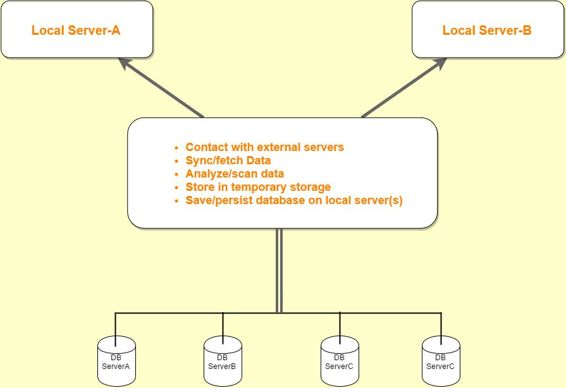
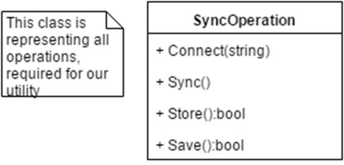

一个班级应该有一个单一的责任。

让我们潜入这片海洋。我们可以把上面的陈述理解为:一个班级不应该被设计成做多种活动。但这就引出了一个问题:一个班级应该或不应该做什么样的活动。

例如，假设我需要设计一个向我提供员工详细信息的系统。这个系统应该包括活动，我依赖于创建、读取、更新和删除(CRUD)操作。但是，根据单一责任原则，我需要设计几个类来执行这些操作中的任何一个，但不能超过其中一个。

在过去，尤其是在我学习 C++的时候，我在一个包含许多 if…else 语句的程序中编写了数千行代码。

在学习这个原则的时候，我质疑为什么一个班级不应该负责多个活动。在那些日子里，我会设计一个负责修改数据、检索数据和保存数据的类。后来，如果我们的修改或数据检索逻辑改变了的某种业务需求，我们将需要在许多地方多次改变我们的类，这将引入更多的错误和更多的代码改变。

我开始发现，将班级保持在一个责任范围内实际上是一个预见问题，即班级的责任将与未来更多的变化联系在一起。今天，我不喜欢包含超过 4-5 行的方法。世界变了！

我们将通过一个代码示例来讨论 SRP。让我们考虑以下几点:

有一个解决问题的场景，我们需要在提取、扫描和存储操作之后从不同的数据库服务器导入和同步数据。我们还需要在服务器上保存或保存数据库。

以下是我们可以起草的步骤:

1.  联系外部服务器
2.  同步/提取数据
3.  分析/扫描数据
4.  存储在临时存储器中
5.  在本地服务器上保存/保存数据库



图 6:数据同步应用概述

通过参考图 6 对我们的数据同步应用程序/实用程序的概述，我们可以定义以下操作或步骤来设计我们的类:

1.  创建一个类(例如，同步操作)
2.  添加联系外部(数据库)服务器的方法(例如，连接)
3.  获取数据方法(例如，同步)

调用临时存储(如存储)

1.  保存数据(如保存)

|  | 注意:你可以选择你喜欢的类名或方法名。 |

之后，我们准备开始为 DBSync 工具设计我们的类。

我们将分析这个过程的每一步——但是首先，让我们考虑一下我们班级的以下设计。



图 7:类图

使用图 7 中的类设计，我们可以编写如下代码片段所示的代码。

代码清单 2

```
  public interface ISyncOperation
  {

  void Connect(string serverName);

  void Sync();

  bool Store();

  bool Save();
  }

```

在代码清单 2 中，我们编写了一个简单的接口 ISyncOperation，并定义了工作所需的某种操作方法——数据库实用程序。

接下来，我们将实现这个接口，以便定义我们对这些方法的实际操作。

代码清单 3

```
  public class SyncOperation : ISyncOperation
  {

  public void
  Connect(string serverName)

  {

  //TODO—logic to connect
  external database.

  //Refer to
  http://www.connectionstrings.com/

  }

  public bool
  Save()

  {

  //Permanently persist
  data from temporary storage.

  //This is the final
  operation.

  return true;

  }

  public bool
  Store()

  {

  //Store synced data in
  temporary storage.

  return true;

  }

  public void
  Sync()

  {

  //Start syncing external
  data.

  }
  }

```

你能在那个代码片段中找到什么违反了 SRP 吗？

|  | 注意:代码清单 3 并不完整。完整的源代码请参考 Bitbucket。 |

接下来让我们看看代码清单 4 是否遵循 SRP。

代码清单 4

| `namespace` SRP{`class` `Program`{`static`t1【main】(`string`args){`//Client stuff goes here.`}}}`public` `interface` `ISyncOperation`{`void`连接(`string`服务器名)；`void` 同步（）;`bool`商店()；`bool`Save()；} |

在这个阶段，我们手里有一个设计和实际的代码实现，所以让我们回去阅读 SRP 的定义，看看我们如何应用它。基本上，我们必须建立一个操作类，这个操作类也必须是一个责任类。

不幸的是，我们班有几个责任，所以它违反了单一责任原则。

遵循代码清单 4 中的 SRP 的最好方法是分离责任。我们的类用于同步数据，这意味着它应该只承担同步责任。

在第一阶段，我们已经分离了接口，这是向分离耦合责任(SCR)迈出的一步。

|  | 注意:SCR 超出了本电子书的范围，因此我们将不在此讨论该主题。 |

让我们看看下一个代码片段，它确实为 SRP 服务。

代码清单 5

```

  /// <summary>

  /// This class should be responsible
  only for the sync operation.

  /// </summary>

  public class SyncOperation

  {

  private IList<ExternalServerData> _data;

  private DataStore _dataStore;

  private DatabaseServer _dbServer;

  private IExternalServerDataRepository _repository;

  public SyncOperation(IList<ExternalServerData> data, IExternalServerDataRepository repository, DatabaseServer dbServer)

  {

  _data = data;

  _repository = repository;

  _dbServer = dbServer;

  _dataStore = new DataStore(new TempStoreRepository());

  }

  public void
  Sync()

  {

  //Start syncing of data
  as per requested server.

  _dataStore.Store(_repository.Sync());

  }
      }

```

在代码清单 5 中，我们的同步操作类只负责同步操作。无论如何，如果我们需要定制或改变这个类，它现在只处理一个单一的责任。

这里，我们的同步类将在请求的数据库服务器上工作。首先，应用程序与外部服务器连接，并请求一个特定的数据库来同步类。Sync 类将简单地同步外部数据库中的数据，并将其发送到 DataStore 类，以保存在临时存储中供进一步分析。之后，它将被保存类永久保存。

代码清单 6

```
      public class ExternalServerData

  {

  public int
  Id { get; set;
  }

  public DateTime InitialDate { get; set; }

  public DateTime EndDate { get; set;
  }

  public int
  OrderNumber { get; set;
  }

  public bool
  IsDirty { get; set;
  }

  public string IP { get; set;
  }

  public int
  Type { get; set;
  }

  public int
  RecordIdentifier { get; set;
  }

      }

```

代码清单 7

```
  namespace SRP_Follow
  {

  public class InternalServerData

  {

  //Stuff goes here.

  }
  }

```

代码清单 7 显示，在 ExternalServerData 类中，需要某些字段来同步来自外部数据库服务器的数据。

代码清单 8

```
      public interface IExternalServerDataRepository

  {

  IEnumerable<ExternalServerData> Sync();
      }

```

在代码清单 8 中，IExternalServerDataRepository 接口仅仅是为 **`Sync`** 操作定义的。

代码清单 9

```
      public class ExternalServerDataRepository : IExternalServerDataRepository
  {

  private readonly List<ExternalServerData> _dataList = GetServerData();

  public
  IEnumerable<ExternalServerData> Sync()

  {

  return _dataList;

  }

  //This is sample data.

  private static List<ExternalServerData> GetServerData()

  {

  return new
  List<ExternalServerData>(new[]

  {

  new ExternalServerData

  {

  Id = 1,

  InitialDate= new DateTime(2014,01,01),

  EndDate= new DateTime(2015,01,30),

  OrderNumber=1,

  IsDirty=false,

  Type = 1,

  IP ="127.0.0.1"

  },

  new ExternalServerData

  {

  Id = 2,

  InitialDate= new DateTime(2014,01,15),

  EndDate= new DateTime(2015,01,30),

  OrderNumber=2,

  IsDirty=true,

  Type=1,

  IP ="127.0.0.1"

  }

  });

  }
  }

```

在代码清单 9 中，ExternalServerDataRepository 实现了前面代码片段中的同步操作(为了演示，我们创建了假数据)。

|  | 注意:完整的代码请参考源代码库。 |

单一责任原则，固体的第一个原则，告诉我们分配责任，创建只坚持单一责任的类。从代码示例中，我们可以得出结论，这是使我们的类体面、整洁和干净的良好实践。我们可以想到一个类可以承担的许多相关操作，但我们必须思考承担过多责任的类的缺点和含义。因此，单个类应该负责单个操作。