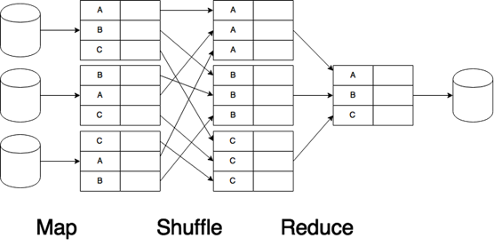
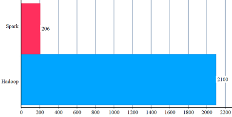

# 零、简介

当今世界上许多领先的公司都面临着大数据的问题。关于什么是大数据，不同的作者有不同的定义。老实说，这是一个模糊的定义，该领域的大多数作者都有自己的定义。这本书的范围太有限，无法深入讨论和解释，但是如果你是该领域的资深开发人员，你可能对什么是大数据有自己的看法。

如果你是这个领域的新手，也许解释这个概念最简单的方法是，它是传统计算技术无法处理的数据，传统计算技术大多使用单机来处理数据。我不会讨论诸如“如果你有一台真正强大的计算机会怎么样”之类的问题。思考大数据最简单的方法是，它是无法由单台机器处理或存储的数据。谈到整个大数据用例，流程通常如下图所示:

图 1:大数据信息流

要创建大数据，首先你必须收集数据。收集到的数据可以来自任何地方，例如气象站、社交媒体，甚至其他计算机程序。如果您曾经处理过大型数据集，那么您可能知道我们接收的数据通常不是我们期望的格式，或者可能包含各种无效值。数据通常是经过预处理的，这样我们就可以保持系统中数据的可用性。信息处理流程的下一步是存储数据。我们将在后面的章节中解释存储步骤。现在，只要说存储步骤只是保存将在稍后时间点处理的数据就足够了。最后一步通常是后处理。这本书将主要讲述后处理步骤，因为这是 Spark 最常用的方式。现在，不要误解我的意思:你可以在任何步骤中使用 Spark。但大多数情况下，Spark 被用作大数据信息流的最后一步。这是在 Spark 使用的背景下对大数据的一点简化描述，但这足以让您在接下来的章节中继续前进。让我们看一下 Spark 使用的高级概述:

图 2:大数据流中的 Spark

请注意，在图中，Spark 使用相同的存储获取输入数据并生成输出数据。实际上，这可能会有所不同，因为数据可能来自多个数据源。当涉及到数据输出和数据处理结果的数量时，本书提供的大多数示例都将相对简单，因为重点是如何收集和处理数据。数据输出是相对容易的一步，但请记住，在实践中，Spark 会将数据输出到其他存储系统，尤其是在大数据生产系统的环境中。这并不意味着你不能独自享受 Spark 的乐趣，也不意味着你只能在拥有多个内核的多台机器上使用它。Spark 还可以利用 Spark 捆绑的弹壳，自行进行各种数据探索。

编程语言有很多种，Spark 作为一种技术并不仅仅局限于其中一种。Spark 1.4 版本中支持的现成语言有:

*   面向 Java 虚拟机的多范例编程语言
*   Java——非常流行的基于类的面向对象编程语言
*   python——通用编程语言，在学术界非常流行
*   r–统计计算的编程语言

如果您想将 Spark 与其他编程技术结合使用，那么就有了管道的概念，通过管道 Spark 可以从标准的 Unix 流中读写数据。我们将在本书后面的章节中讨论这个问题；这是对什么是 Spark 以及如何在大数据处理环境中使用 Spark 的非常高级的概述。在进一步了解 Spark 之前，让我们先深入了解一下大数据处理的基础知识。

## 大数据处理基础

在前一节中，我们提到大数据的最简单定义是，它是不能在单台计算机上处理的数据，至少不能在合理的时间范围内处理。理论上，人们可以通过使用速度更快、内存更大的计算机来解决这个问题，但那种专门的机器要花很多钱。下一个合乎逻辑的步骤将是在多台商品计算机之间划分计算。但是分割数据和处理数据并不像看起来那么简单:

图 3:拆分数据处理的问题

有大量与处理时间和输入/输出操作相关的调度来完成这样的事情。让节点自己协商在它们之间分配任务将意味着大量复杂且难以调试的技术，在节点之间会有大量开销和协商时间。为了避免所有这些问题，大多数现代系统使用主从架构。主节点决定在什么工作节点上处理什么数据以及何时处理，如下图所示:

图 4:主从架构

你们中的一些人可能会认为在使用主-工作者架构时存在某种瓶颈，这在一些解决方案中是正确的，但是大多数现代解决方案都让主节点只负责委派工作和监控结果。工作节点根据主节点的指令从源节点获取数据。到目前为止，数据只是简单地显示为一小片云，我们没有深入研究。前面我们提到，大数据也是指实际上无法放在单台计算机上的数据。这就是为什么数据通常保存在分布式文件系统中。在大数据领域，目前最流行的分布式文件系统是 Hadoop 分布式文件系统(HDFS)。你们中的一些人现在可能会想:等等，这本书应该是关于 Spark 而不是 Hadoop 的。你们中的一些人可能甚至不知道 Hadoop 是什么。如果你想了解更多关于 Hadoop 的知识，请使用你最喜欢的搜索引擎；整本书都会提到 Hadoop，因为这个框架是过去十年大数据处理的行业标准，据一些人说现在仍然如此。许多公司，尤其是财富 100 强中的公司，已经在这个框架上有很多基础设施。Spark 的创造者不想重新发明轮子，他们也希望 Spark 在公司中有更好的采用率。在现有基础设施的基础上，这要容易得多，例如，Spark 开箱即用地支持 HDFS。

让我们看看 HDFS 的建筑。你可能会觉得它很有趣，因为它也是一个大师级的建筑:

图 5:主从 Hadoop 分布式文件系统架构概述

上图中显示的节点名称既不是主节点，也不是工作节点，但是从架构上看，节点“名称节点”非常重要。除了概述架构之外，前面的图片非常重要，因为它描述了分布式系统如何克服故障。随着系统变得越来越大，统计上有相当大的概率，一些节点会不时出现中断。数据节点上的数据在其他数据节点上有冗余副本，以防特定节点出现故障，因此主节点知道备份在哪里。如果数据节点出现故障，只需从副本中读取数据。主节点本质上是 HDFS 的单点故障；为了应对这种情况，系统中添加了一个备份节点。备份节点定期检查主节点是否活动，并与其同步数据。如果由于某种原因，名称(主)节点出现故障，备份节点将接管主节点在集群中的角色。

大数据分析中的一个基本 hello world 示例是字数统计示例，我们将在后面的章节中介绍如何使用 Spark 实现这一点。在进入 Spark 的历史和围绕它的基本概念之前，我想回顾一下一个非常重要的数据处理概念，这个概念已经存在了相当长的时间。这是一个叫做 MapReduce 的编程模型。MapReduce 有三个基本阶段。首先是地图，然后是洗牌阶段，最后是减少阶段。下图显示了基本概述:

图 MapReduce 编程模型概述

描述 MapReduce 最简单的方法是使用字数统计示例。想象一下，在一个非常大的文件中，我们只有三个单词。我们对每个单词出现的次数感兴趣。在 MapReduce 编程模型中，每个节点都会在本地将单词分组在一起，并在映射阶段对每个单词进行计数。上图中未显示的主节点会将每个字分配给特定的节点。然后在下一步中对数据进行混洗，使其与特定节点相关联。混洗阶段通常耗时最长，因为节点必须通过网络传输数据并将其存储在临时存储中。该节点然后组合来自其他节点的信息，并产生一个结果——在我们的示例中是字数——并将其存储为最后一步。在每个阶段结束时，数据都存储到磁盘中。将数据写入磁盘通常是数据处理中耗时最长的部分，使用 MapReduce 至少有三个阶段会发生这种情况。

Hadoop 使用的 MapReduce 模型背后的基本概念是，它将处理和磁盘负载分配给集群中的节点；这是 Spark 在 2009 年推出时的行业标准。Spark 和 Hadoop 的主要区别在于 Spark 不仅可以分配处理器和磁盘的使用，还可以分配内存中的操作。正因为如此，它可以在处理数据时获得更高的速度。对于定位，让我们看看完成各种计算机相关操作所需的时间，从一个 CPU 周期到物理系统重新启动。为了便于比较，我们将添加一个人工比较列，其中最快的操作将被映射到一个单独的秒间隔:

表 1:根据人类时间感知调整的计算机任务处理时间

| 事件 | 持续时间 | 人类比较 |
| 1 个中央处理器周期 | 0.3 ns | 1 s |
| L1 高速缓存访问 | 0.9 ns | 3 s |
| L2 高速缓存访问 | 2.8 ns | 9 秒 |
| L3 缓存访问 | 12.9 ns | 43 岁 |
| 从中央处理器访问内存 | 120 ns | 6 分钟 |
| 固态硬盘输入输出操作 | 50-150 美元 | 2-6 天 |
| 旋转磁盘输入输出操作 | 1–10 毫秒 | 1-12 个月 |
| 互联网:旧金山到纽约 | 40 毫秒 | 4 年 |
| 互联网:旧金山到英国 | 81 毫秒 | 8 年 |
| 互联网:旧金山到澳大利亚 | 183 毫秒 | 19 年 |
| TCP 数据包重传 | 1–3 秒 | 105-317 年 |
| 物理系统重启 | 5 分钟 | 32000 年 |

对我们来说，上表中最重要的是比较了来自中央处理器的内存访问和旋转磁盘输入/输出操作。同样，如果一个中央处理器周期是一秒钟，内存输入/输出需要六分钟，旋转磁盘输入/输出操作需要大约一个月甚至一整年。现代计算机系统有大量可用的内存，所以有人发现内存可以作为分布式资源来处理大量数据可能只是时间问题。这实际上是 Spark 的第一个杀手级特性之一，我们将在后面的章节中描述细节。让我们在下一节看看 Spark 是如何发展的。

## 星火简史

Spark 由 Matei Zaharia 于 2009 年在加州大学伯克利分校 AMPLab 创建。这听起来可能难以置信，但是 Spark 的第一个版本只用了 1600 行 Scala 代码。Spark 背后的主要目标之一是制造一个大数据处理框架，该框架对于机器学习来说足够快。Hadoop 不适用于这种方法，因为涉及大量磁盘使用，在创建 Spark 时，近实时数据处理需要大约二三十分钟。在最初的版本中，由于内存占用过多，Spark 可以在不到一分钟的时间内解决相同的任务。Spark 项目于 2010 年在 BSD 许可下开源。只要保留其版权声明和许可证的免责声明，BSD 许可证允许出于任何目的无限制地重新分发。该许可证还包含一项条款，限制在未经特定许可的情况下，使用贡献者的姓名为衍生作品背书。2013 年，该项目被捐赠给阿帕奇软件基金会。它还将其许可证切换到 Apache 2.0。Apache 许可证在版权和代码再分发方面限制更多，并且有特殊要求，主要是关于给那些从事代码工作的人适当的信任以及维护相同的许可证。同年，Spark 的创始人创办了一家名为 Databricks 的公司。该公司的目标是通过使用 Spark 帮助客户进行基于云的大数据处理。2014 年 2 月，Spark 成为顶级 Apache 项目。

接下来非常重要的事情发生在 2014 年 11 月。Spark 赢得了代托纳格雷索特竞赛。Daytona GraySort 是一场各种公司前来展示其大数据处理框架和解决方案的竞赛。基本目标是尽可能快地对 100 万亿字节的数据(由一万亿条记录组成)进行排序。需要排序的数据位于 HDFS 上，我们在上一节中描述了它的内部工作方式。对数据进行排序通常需要大约 500 TB 的磁盘输入/输出和大约 200 TB 的网络输入/输出。来自世界各地的组织通常使用专门的硬件和软件来构建专用的排序机器。赢得 2014 年的排序比赛对于 Spark 项目来说是一个非常重要的里程碑，尤其是考虑到之前雅虎用 Hadoop MapReduce 创造的世界纪录:

表 2:代托纳格雷索特 2014 年比赛结果

|  | 2013 年记录:Hadoop | 2014 年记录:Spark |
| 数据量 | 102.5 TB | 100 TB |
| 经过时间 | 72 分钟 | 23 分钟 |
| 节点数量 | Two thousand one hundred | Two hundred and six |
| 短期利率 | 1.42 TB/分钟 | 4.27 TB/分钟 |
| 每个节点的排序速率 | 0.67 GB/分钟 | 每秒 20.7 GB |

超过前一个记录的数量简直令人难以置信。Spark 实际上用少了十倍的机器将数据处理速度提高了三倍。

图 Spark 和 Hadoop 在灰度排序挑战中使用的节点数量

这场比赛的结果吸引了来自世界各地的许多开发人员，2014 年，Spark 拥有超过 465 名贡献者。这使得它成为 Apache 软件基金会中最活跃的项目，也可能是最活跃的大数据开源项目。在下一节中，我们将概述 Spark 作为大数据处理平台的情况。

## Spark 概述

Spark 由多个组件组成。Spark 的核心部件是 Spark 芯。所有其他组件都有这个组件。这种方法有很多好处。其中之一是，当优化被添加到核心时，所有其他组件立即开始使用这种优化。另一个优点是 Spark 的代码库保持紧凑，重新发明轮子的工作减少到了最低限度。Spark 概述如下图所示:

图 8:Spark 组件

Spark Core 负责内存管理、任务调度、错误恢复和存储系统交互。它还定义了弹性分布式数据集。我们将在接下来的章节中讨论它们，但是现在把它们描述为可以并行操作的分布式项目集合就足够了。

Spark SQL 是一个用于处理结构化数据的包。该组件最初是支持 Hive Query Language 的，但随着时间的推移，它发展成为一个支持处理几乎任何类型数据的组件，从 JSON 到驻留在分布式存储上的大型数据集。Spark SQL 为开发人员提供了一种独特的能力，在处理结构化数据时，可以将编程结构与类似 SQL 的语法结合在一起。

Spark 流支持数据流的处理。有些人可能想知道什么是数据流。本质上，它是来自各种来源的数据的持续流入，如日志文件或从客户端接收消息的排队解决方案。传统的大数据处理框架面向数据的批处理。Spark 的这个组件实际上是迈向现代数据处理框架的一步，因为它从一开始就被设计为处理实时传入的数据并动态生成结果。

MLlib 为机器学习提供功能。本质上，它是高级算法的松散集合。Spark 创立的主要驱动力之一是机器学习。当时可用的解决方案相对较慢，因为它们没有利用内存的速度。在过去的十年里，这种规模的机器学习是基于一个名为 Mahout 的库，它主要用于 Hadoop 生态系统。2014 年，Mahout 宣布不再接受 Hadoop MapReduce 代码，并将其新开发切换到 Spark 的库 MLlib。

GraphX 是一个用于图形数据操作的库。它允许用户创建和操作由顶点和边组成的图形数据，我们用它来完成对 Spark 的简短概述。在下一章中，我们将讨论 Spark 的安装步骤。