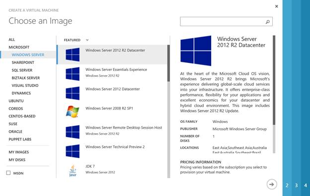
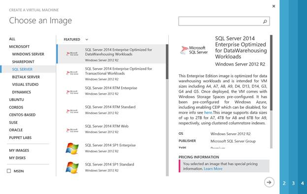

# 第 2 章在 Azure 虚拟机上安装和配置 SQL Server

要在 Azure 中创建 SQL Server 虚拟机，您必须首先获得 Azure 平台订阅。您可以购买 Azure 套餐或注册 [Azure 免费试用套餐。](https://azure.microsoft.com/en-us/pricing/free-trial/)

Microsoft Azure 支持以下选项在 Azure 虚拟机上安装和配置 SQL Server:

*   在 Hyper-V 中创建一个 SQL Server 的系统预置映像，并将其上传到 Azure。
*   从 Azure 库提供一个窗口映像，并在其上安装 SQL Server。
*   使用门户或 PowerShell 从 Azure 库调配一个 SQL Server 映像。

您选择的方法在很大程度上受您的部署的 SQL Server 许可策略的影响。使用 Azure 虚拟机中的 SQL Server，您可以使用平台提供的 SQL Server 映像，也可以将您的 SQL Server 许可证带到 Azure。使用 SQL Server 平台提供的映像时，成本取决于虚拟机大小以及您选择的 SQL Server 版本。基本上，您需要支付 SQL Server 的每分钟许可成本、Windows Server 的每分钟许可成本和 Azure 存储成本。每分钟计费选项允许您在需要时使用 SQL Server，而无需购买完整的 SQL Server 许可证。如果您将自己的 SQL Server 许可证带到 Azure，则只需支付 Azure 计算和存储成本。有关更多信息，请参见[通过 Azure](http://azure.microsoft.com/pricing/license-mobility/) 上的软件保障许可移动性。

在本章中，我们将简要讨论前两个选项，并主要关注使用 PowerShell cmdlets 从 Azure Gallery 中调配和配置 SQL Server 映像。在本章的后面部分，我们将讨论安装 SQL Server 后需要执行的部署后任务。

## 在 Hyper-V 中创建 SQL Server 的系统化映像并将其添加到 Azure 中

这种方法用于在 Azure 虚拟机上安装 SQL，如果您希望自己携带许可证(Azure 许可证移动性支持)，并且希望只支付在 Azure 上托管虚拟机所产生的 Azure 计算和存储成本。SQL Server 支持从 SQL 2008 R2 开始准备安装的 SysPrep 映像；因此，很容易创建一个系统化的 SQL Server 映像。

该方法包括以下步骤:

1.  [在 Hyper-V 虚拟机中准备安装了 SQL Server 的 SysPrep 映像](https://msdn.microsoft.com/en-us/library/ee210664.aspx)。
2.  将虚拟机的 VHD 文件上传到 Azure Blob 存储。
3.  从 Azure 管理门户或 PowerShell 的上传 VHD 创建映像。

|  | 注意:微软 Azure 不支持 VHDX 格式。您可以使用 Hyper-V 管理器或转换-VHD PowerShell cmdlet 将磁盘转换为 VHD 格式。 |

以下文章提供了创建 Windows Server VHD 并将其上传到 Azure 的详细说明。

[https://azure . Microsoft . com/en-us/documentation/articles/virtual-machines-create-upload-vhd-windows-server/](https://azure.microsoft.com/en-us/documentation/articles/virtual-machines-create-upload-vhd-windows-server/)

## 在虚拟机上配置一个窗口库映像并安装 SQL Server

当您想要带着您的 SQL Server 许可证而不是 Windows 许可证时，此方法用于在 Azure 虚拟机上安装 SQL。在这种情况下，您每分钟为 Azure 计算、存储和 Windows 许可证付费，但不为 SQL Server 许可证付费。

该方法包括以下步骤:

1.  如下图所示，从 Azure 库调配一个 Windows 服务器映像。



图 4:从 Azure 图库配置 Windows 服务器映像

2.  将 SQL Server 安装文件下载或复制到虚拟机中。
3.  使用您自己的许可证 PID 在虚拟机上安装 SQL Server。

下面的文章提供了有关从 Azure 图库配置 Windows 服务器映像的详细说明:

[https://azure . Microsoft . com/en-us/documentation/articles/virtual-machines-windows-tutorial/](https://azure.microsoft.com/en-us/documentation/articles/virtual-machines-windows-tutorial/)

## 使用 Azure 管理门户从 Azure 图库调配 SQL Server 映像

当您不拥有或不想使用您的 SQL Server 许可证，并且希望每分钟付费购买 SQL Server 许可证以及 Azure 计算、存储和 Windows 许可证时，可以使用此方法。这最适合短期项目，或者如果您不确定当前项目是否可持续，并且希望从 Azure 平台提供的 SQL Server 映像开始。

此方法包括从 Azure 图库中可用的预配置 SQL Server 映像列表中调配虚拟机。Azure Gallery 以各种服务包级别提供了 SQL 2008 R2-SQL 2016 的所有 SQL Server 构建映像，这大大减少了在所需服务包级别构建、安装和配置 SQL Server 的时间。

下图展示了 Azure 图库中的 SQL Server 图像。该图没有显示可用的 SQL Server 映像的完整列表，因为该列表太长，无法包含在单个框架中。



图 Azure 图库中可用的 SQL 服务器映像

下面的文章描述了使用门户提供 SQL Server 映像的详细步骤:

[https://azure . Microsoft . com/en-us/documentation/articles/virtual-machines-provision-SQL-server/](https://azure.microsoft.com/en-us/documentation/articles/virtual-machines-provision-sql-server/)

## 使用 Azure PowerShell 从 Azure 图库配置 SQL Server 映像

这种方法与前一种方法没有什么不同，只是虚拟机是使用 Azure PowerShell 调配的。您可以使用 Windows PowerShell 在 Azure 中执行各种任务，既可以在命令提示符下交互执行，也可以通过脚本自动执行。Azure PowerShell 是一个模块，它提供了通过 Windows PowerShell 管理 Azure 的 cmdlets。您可以使用 cmdlets 来创建、测试、部署和管理通过 Azure 平台交付的解决方案和服务。在大多数情况下，您可以使用 cmdlets 来执行可以通过 Azure 管理门户执行的相同任务。例如，您可以创建和配置云服务、虚拟机、虚拟网络和网络应用程序。

您可以通过运行[微软网络平台安装程序](http://go.microsoft.com/fwlink/p/?linkid=320376&clcid=0x409)下载并安装 Azure PowerShell 模块。出现提示时，单击运行。网络平台安装程序安装 Azure PowerShell 模块和所有依赖项。按照提示完成安装。此安装还将创建一个 Azure PowerShell 控制台，您可以从“程序”或“应用程序”列表中访问该控制台，具体取决于您使用的 Windows 版本。

|  | 注意:在本节中，我们将只讨论与在 Azure 中提供 SQL Server 映像相关的 PowerShell cmdlets。Azure PowerShell cmdlets 的完整列表及其定义可在以下链接中找到:[https://msdn.microsoft.com/library/azure/jj554330.aspx](https://msdn.microsoft.com/library/azure/jj554330.aspx) |

### 连接到蔚蓝账户

要使用 PowerShell 连接到 Azure 帐户，请执行以下步骤:

1.  打开 Azure PowerShell 控制台。
2.  在 PowerShell 窗口中键入以下命令。

代码清单 1:连接到一个 Azure 帐户

```
      Add-AzureAccount

```

3.  在窗口中，键入与您的帐户相关联的电子邮件地址和密码。
4.  Azure 验证并保存凭据，然后关闭窗口。

### 选择蓝色订阅

一个 Azure 帐户可以映射到多个 Azure 订阅。使用以下 cmdlet 登记映射到您的 Azure 帐户的所有 Azure 订阅。

代码清单 2:识别映射到 Azure 帐户的 Azure 订阅列表

```
      Get-AzureSubscription

```

如果分配了多个订阅，请务必选择要为其调配虚拟机的订阅，因为每个订阅都可能映射到不同的 Azure 位置并支持不同的虚拟机大小。

使用以下 cmdlet 选择所需的订阅。订阅名称可以从*Get-azure subscription*cmdlet 的输出中获得

代码清单 3:选择用于配置虚拟机的 Azure 订阅

```
      Select-AzureSubscription –SubscriptionName <<Subscription Name>>

```

### 创建或识别 Azure 存储帐户

在准备在 Azure 中调配虚拟机之前，您需要有一个 Azure 存储帐户，该帐户将用于托管虚拟机的虚拟硬盘。给定的 Azure 订阅可以有多个存储帐户。每个存储帐户对其可以处理的 IOPs 数量都有限制，因此建议创建多个存储帐户以避免存储争用。

要识别在 Azure 订阅中创建的 Azure 存储帐户列表，请使用以下 cmdlet:

代码清单 4:确定当前订阅可用的 Azure 存储帐户列表

```
      Get-AzureStorageAccount

```

要在给定的订阅中创建新的 Azure 存储帐户，请使用以下 cmdlet:

代码清单 5:在 Azure 订阅中创建新的 Azure 存储帐户

```
      New-AzureStorageAccount -StorageAccountName <<String>> -AffinityGroup <<String>> -Description <<String>> -Label <<String>> -Type <<String>>
      New-AzureStorageAccount [-StorageAccountName] <<String>> -Location <<String>> -Description <<String>> -Label <<String>> -Type <<String>>  

```

亲和组或位置参数是互斥的，不能一起使用。亲和组指定当前订阅中现有亲和组的名称，而位置指定创建存储帐户的 Azure 数据中心的位置。您可以通过启动 *Get-AzureLocation* cmdlet 来获取给定订阅支持的位置。

类型参数指定存储帐户的类型。有效值包括:

*   标准 LRS
*   标准 ZRS
*   标准 _GRS
*   标准 _RAGRS

如果不指定此参数，cmdlet 将使用标准 GRS 的默认值。标准 ZRS 帐户不能更改为其他帐户类型，反之亦然。

### 创建新的 Azure 云服务

云服务是 Azure 连接服务的域名。为了远程访问虚拟机，您需要确保它映射到云服务。此外，云服务必须在与存储帐户相同的位置创建。以下 PowerShell cmdlet 用于创建新的云服务:

代码清单 6:为虚拟机供应创建新的云服务

```
      New-AzureService –ServiceName <<New ServiceName>> –Location <<Locationname>>

```

### 确定要调配的 SQL Server 映像

如前所述，Azure Gallery 提供了从 SQL 2008 R2 到 SQL 2016 的各种服务包级别的 SQL Server 映像列表。以下 PowerShell cmdlet 可用于列出和筛选 SQL 2014 映像的映像。

代码清单 7:从图库获取 SQL 2014 图像列表

```
      Get-AzureVMImage | where { $_.os –eq “Windows” –and $_.ImageFamily –like “*SQL*2014*” } | Sort-Object -Property PublishedDate -Descending

```

### 确定要调配的 Azure 虚拟机大小

虚拟机大小决定了虚拟机的计算容量和每分钟成本。Azure 中的虚拟机分为 A 系列、D 系列、DS 系列和 G 系列虚拟机。你应该先了解它们之间的区别。

**A 系列** **虚拟机**具有基本的 Azure 数据磁盘，可以在中等延迟下支持高达 500 IOPs。当您从大小 A0 移动到 A11 时，内核数量和内存量会增加。此外，虚拟机大小 A8-A11 使用英特尔至强 E5-2670 2.60 Ghz，与较低的虚拟机大小相比，它提供了出色的计算性能。当您从 A0 移动到 A11 时，虚拟机的每分钟计算成本也会相应增加。

**D 系列虚拟机**是后来推出的，旨在为需要快速本地临时存储的应用程序提供快速性能。D 系列虚拟机与 A 系列虚拟机相似，只是它们有一个本地临时存储驱动器(D 驱动器)，该驱动器是固态的，提供快速、低延迟的响应。在 SQL Server 的情况下，临时驱动器对于托管 tempdb 文件非常有用，该文件会在每次重新启动服务时进行清理和重新创建。

**DS 系列虚拟机**是全新的 Azure 高级存储支持虚拟机。Azure 高级存储是一种基于固态硬盘的新型存储，旨在支持输入/输出密集型工作负载。借助高级存储，您可以调配持久磁盘，并配置满足您要求的大小和性能特征。然后，您可以将几个高级存储备份数据磁盘连接到一个虚拟机，在它们之间进行条带化，并以极低的延迟向您的应用程序提供每个虚拟机高达 32 TB 的存储，每个虚拟机超过 50，000 IOPS。有关高级存储的更多信息，请参见[高级存储概述。](http://azure.microsoft.com/en-us/documentation/articles/storage-premium-storage-preview-portal/)

**G 系列虚拟机**是该系列的最新成员。在目前公共云中可用的所有虚拟机规模中，它们提供了最多的内存、最高的处理能力和最大数量的本地固态硬盘。g 系列采用最新的[英特尔至强处理器 E5 v3 家族](http://www.intel.com/content/www/us/en/processors/xeon/xeon-e5-solutions.html)，448GB 内存和 6.59 TB 本地固态硬盘空间，最多可提供 32 个虚拟硬盘。这种强大的虚拟机规模可以轻松处理任务关键型应用程序的部署，例如大型关系数据库服务器(SQL Server、MySQL 等)。)和大型 NoSQL 数据库(MongoDB、Cloudera、Cassandra 等)。).

Azure 中提供的每个虚拟机大小的完整详细规格可在以下文章中找到:[https://Azure . Microsoft . com/en-us/documents/articles/virtual-machines-size-specs/](https://azure.microsoft.com/en-us/documentation/articles/virtual-machines-size-specs/)

使用以下 PowerShell cmdlet 来标识当前 Azure 订阅支持的虚拟机大小。并非所有 Azure 位置都有所有虚拟机大小。

代码清单 8:列出给定 Azure 订阅中可用的虚拟机角色大小

```
      Get-AzureRoleSize

```

### 配置 SQL Server 映像虚拟机

以下 cmdlet 用于在指定的云服务中使用 Azure 图库中的指定映像来调配指定大小的新 Azure 虚拟机:

代码清单 9:配置一个 SQL Server 映像虚拟机

```
      New-AzureQuickVM -Windows -ServiceName <<ServiceName>> -Name <<VMName>> -ImageName <<ImageName.imagename>> -Password <<password>> -AdminUsername <<AdminAccount>> -InstanceSize <<VmSize>> -EnableWinRMHttp | out-null

```

*–EnableWinrmHttp*命令用于打开远程桌面和 PowerShell 远程处理的端点。

最后，使用上面讨论的所有 cmdlets，我们创建了以下脚本，可用于在 Azure 中自动执行 SQL Server 虚拟机配置:

代码清单 10:在 Azure 中自动配置 SQL Server 映像虚拟机的完整脚本

```
      # The original script for Provisioning of SQL Server Azure VM was created by Sourabh Agrawal and Amit Banerjee
      # The script is modified by Parikshit Savjani to suit the readers of the book SQL on Azure Succintly
      Add-AzureAccount | out-null
      # Make sure the Authentication Succeeded.
      If ($?)
      {
            Write-Host "`tSuccess"
      }
      Else
      {
            Write-Host "`tFailed authentication" -ForegroundColor Red
            Exit
      }

      #Select the desired Azure Subscription
      [array] $AllSubs = Get-AzureSubscription
      If ($AllSubs)
      {
              Write-Host "`tSuccess"
      }
      Else
      {
              Write-Host "`tNo subscriptions found. Exiting." -ForegroundColor Red
              Exit
      }
      #Write-Host "`n[Select Option] - Select a Subscription to Work With" -ForegroundColor Yellow
      $count = 1
      ForEach ($Sub in $AllSubs)
      {
         $SubName = $Sub.SubscriptionName
         Write-host "`n$count - $SubName"  -ForegroundColor Green
         $count = $count+1
      }
      $SubscriptionNumber = Read-Host "`n[SELECTION] - Select a Subscription to Provision the VM"
      If($SubscriptionNumber -gt $count)
      {
          Write-Host "`Invalid Subscription Entry - Existing" -ForegroundColor Red
          Exit
      }
      $SelectedSub = Get-AzureSubscription -SubscriptionName $AllSubs[$SubscriptionNumber - 1].SubscriptionName 3>$null
      $SubName = $SelectedSub.SubscriptionName
      Write-Host "`n Selected Subscription - $SubName" -ForegroundColor Green
      $SelectedSub | Select-AzureSubscription | out-Null

      #Identify the Azure Storage Account to be used to provision the VM
      $StorAccName = Read-Host "`nEnter Azure Storage Account Name"
      if(Get-AzureStorageAccount -StorageAccountName $StorAccName)
      {
          Write-Host "`n[INFO] - Using Storage Account - $StorAccName" -ForegroundColor Yellow
      }
      else
      {
          Write-Host "Storage Account $StorAccName does not Exists - Please Create it" -ForegroundColor Red
          Exit
      }

      # Identify the Cloud Service to use to Provision the VM
      $ServiceName = Read-Host "`nEnter your Cloud Service Name for VM"
      if(Get-AzureService -ServiceName $ServiceName)
      {
      Write-Host "`n [INFO] - Cloud Service $ServiceName already exists, using the same..." -ForegroundColor Yellow
      }
      else
      {
      $Location = (Get-AzureStorageAccount -StorageAccountName $StorAccName).Location.ToString() 3>$null
      New-AzureService -ServiceName $ServiceName -Location $Location|Out-Null
      Write-Host "`n [INFO] - Cloud Service $ServiceName created..." -ForegroundColor Yellow
      }
      $azureService = Get-AzureService -ServiceName $ServiceName

      #Get the name for the Azure VM
      $VMName = Read-Host "`n Enter the name for the Azure VM"
      $VMName = $VMName.ToLower()

      #Using PreConfigured Values for VM Size
      $VmSize = "Standard_D11"

      [array] $AllImageFamily = get-azurevmimage |where {$_.os -eq "Windows" -and $_.ImageFamily -like "*SQL*2014*" } | Sort-Object -Property PublishedDate -Descending
      $cnt = 1
      ForEach ($ImgFamily in $AllImageFamily)
      {
         $ImgName = $ImgFamily.Label
         Write-host "`n$cnt - $ImgName"  -ForegroundColor Green
         $cnt = $cnt+1
      }
      $ImageNo = Read-Host "`n[SELECTION] - Select the Image to install"
      If($ImageNo -gt $cnt)
      {
          Write-Host "`Invalid Subscription Entry - Existing" -ForegroundColor Red
          Exit
      }

      $ImgName =$AllImageFamily[$ImageNo - 1].Label

      Write-Host "`nCreating a VM of size $VMSize, with $ImgName " -ForegroundColor Green

      #Identify the Admin Account and Password to be used for VM
      $AdminAccount = Read-Host "`n Enter the Admin account name"
      $password = Read-Host "`n Enter the password"

      #Select the Storage to be used and create the VM.
      Set-AzureSubscription -SubscriptionName $SubName -CurrentStorageAccountName $StorAccName

      Write-Host "`n[INFO] - Script is creating a $ImgName image, Please wait...." -ForegroundColor Yellow
      New-AzureQuickVM -Windows -ServiceName $ServiceName -Name $VMName -ImageName $AllImageFamily[$ImageNo - 1].imagename -Password $password -AdminUsername $AdminAccount -InstanceSize $VmSize -EnableWinRMHttp | out-null

      #Check to make sure that VM was created
      $CreatedVM = Get-AzureVM -ServiceName $ServiceName -Name $VMName -ErrorAction SilentlyContinue
      If ($CreatedVM)
      {
            Write-Host "`tVM Created Successfully"
      }
      Else
      {
            Write-Host "`tFailed to create VM" -ForegroundColor Red
            Exit
      }

```

## 调配的 SQL Server 虚拟机的部署后配置

### 连接数据磁盘

在 Azure 虚拟机上创建 SQL Server 后，有必要向虚拟机添加一个数据磁盘，用于托管数据库文件。作为 SQL Server 的最佳实践，建议为系统数据库、事务日志文件、用户数据文件和 tempdb 文件设置单独的专用磁盘。

通常，我们需要向虚拟机添加至少四个数据磁盘。可以连接到虚拟机的最大数据磁盘数取决于虚拟机大小。A 系列(A7-A11)虚拟机支持的最大数据磁盘数量为 16 个，而 D 系列(D14)虚拟机为 32 个，G 系列虚拟机(G5)为 64 个。每个数据磁盘的最大大小可以是 1024GB(或 1 TB)。

我们可以使用以下 PowerShell cmdlet 将数据磁盘连接到虚拟机:

代码清单 11:将数据磁盘附加到虚拟机

```
      Add-AzureDataDisk –VM <<vm>> -CreateNew -DiskSizeInGB <<size>> -DiskLabel <<diskname>> -LUN <<LUN>> -HostCaching None

```

我们可以使用以下 PowerShell 脚本将四个数据磁盘附加到我们之前创建的 SQL Server 虚拟机上:

代码清单 12:为 SQL Server 虚拟机附加多个数据磁盘

```
      # The original script for Provisioning of SQL Server Azure VM was created by Sourabh Agrawal and Amit Banerjee
      # The script is modified by Parikshit Savjani to suit the readers of the book SQL on Azure Succintly
      #Create and Attach the Disks
      Write-Host "`n[INFO] - Script is creating and attaching 4  data disks, Please wait." -ForegroundColor Yellow
      for($i = 0; $i -lt 4; $i++)
      {
          $disklabel = "disk$VMName"
          $diskname = $disklabel + $i.ToString()
          Add-AzureDataDisk -VM $vm -CreateNew -DiskSizeInGB 20 -DiskLabel $diskname -LUN $i -HostCaching None | out-null
      }       
      $vm | Update-AzureVM | out-null

      #Make sure all disks are attached and working
      $vm = Get-AzureVM -Name $VMName -ServiceName $ServiceName
      [array]$CreatedDataDisks = Get-AzureDataDisk -VM $vm
      $CreatedDataDisksCount = $CreatedDataDisks.Count

      If($CreatedDataDisksCount -eq 4)
      {
          Write-Host "`nDisk Creation Successfull - All 4 disks are up and running" -ForegroundColor Green
      }
      else
      {
          Write-Host "`nData disk creation failed " -ForegroundColor Red
          Exit
      }

      #Check to make sure VM is done building
      Write-Host "`n[INFO] - Script is checking to see if VM is ready, Please wait." -ForegroundColor Yellow
      $iteration = 0
      while($vm.status -ne "ReadyRole" -and $iteration -lt 60)
      {
      Start-Sleep -Seconds 30
      $vm = Get-AzureVM -Name $vmname -ServiceName $ServiceName
      write-host "`tVM status is:" $vm.status
      $iteration++
      }

```

### 为 SQL Server 侦听器添加 TCP/IP 端点

Azure 虚拟机在微软数据中心的云服务中运行。为了远程通信或连接到服务器，您需要在虚拟机中创建端点，这些端点将打开防火墙端口，以便按照指定的通信协议与虚拟机通信。

SQL Server 的默认实例侦听 TCP 端口 1433，而命名实例侦听需要运行 SQL Browser Service 进行发现的动态端口，以便帮助客户端在当前运行 SQL Server 的端口连接到该服务器。但是，对于运行在 Azure 虚拟机上的 SQL Server 实例，您需要确保 SQL Server 运行在静态端口上，以便只为 SQL Server 正在侦听的端口创建 TCP/IP 端点。以下博客文章描述了为 SQL Server 的命名实例分配静态端口的必要步骤:

[http://blogs . msdn . com/b/arvindsh/archive/2012/09/08/如何将静态端口分配给 SQL server 命名实例并避免常见陷阱. aspx](http://blogs.msdn.com/b/arvindsh/archive/2012/09/08/how-to-assign-a-static-port-to-a-sql-server-named-instance-and-avoid-a-common-pitfall.aspx)

使用以下 PowerShell cmdlet 向 Azure 虚拟机添加端点。

代码清单 13:向 Azure 虚拟机添加端点

```
      Add-AzureEndpoint -Name <<Endpoint Name>> -Protocol tcp -LocalPort <<LocalPort>> -PublicPort <<Public Port>>  -VM <<vm>>

```

*公共端口*是外部客户端将与云服务名称一起用于连接到 Azure 服务的端口，而*本地端口*是运行服务的虚拟机内的实际端口。到*公共端口*的连接在内部映射并路由到 Azure 虚拟机中的*本地端口*。您可以为*公共端口*和*本地端口*使用相同的端口号，但是端点也通过将公共端口和本地端口分开，为我们提供了隐藏*本地端口*的灵活性。

对于之前创建的 SQL Server 虚拟机，您可以使用以下 PowerShell 脚本创建一个带有 *LocalPort* 1433 和 *PublicPort* 14481 的 SQL 侦听器端点。

代码清单 14:向 Azure 虚拟机添加一个 SQL 侦听器端点

```
      Add-AzureEndpoint -Name "SQL Listener Port" -Protocol tcp -LocalPort 1433 -PublicPort 14481  -VM $vm | Update-AzureVM | Out-Null

```

### 使用 SSMS 连接到 Azure 虚拟机上的 SQL Server 实例

最后，在 Azure 虚拟机上安装和配置 SQL Server 之后，在将系统移交给应用程序团队之前，验证从外部客户端到 SQL Server 的连接性非常重要。

[SQL Server 管理工作室(SSMS)](https://msdn.microsoft.com/en-us/library/mt238290.aspx) 是数据库管理员用来管理和管理 SQL Server 实例的流行客户端工具。您可以使用安装在任何客户端工作站上的 SSMS 来连接到 SQL Server。您的 SQL Server 的连接字符串将采用以下形式:

<cloud service="" name="">.cloudapp.net，</cloud>

但是，如果您的组织中配置了 Azure 虚拟网络，则可以将 Azure 虚拟机带入您的网络和域中。当 Azure 虚拟机进入活动目录中的您的 OU 时，广告管理员可以应用适用于网络中任何服务器的组策略设置。如果将 Azure 虚拟机纳入组织的域，连接字符串将采用以下格式:

<cloud service="" name="">。<fqdn>、</fqdn></cloud>

一旦验证了与 SQL Server 实例的连接，SQL Server 就可以进行应用程序部署和用户工作负载了。