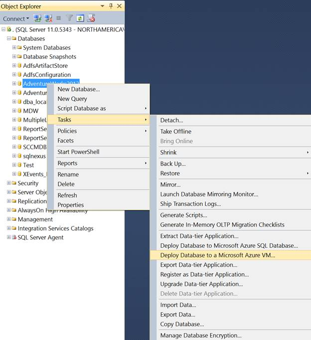

# 第 3 章在 Azure 虚拟机上迁移到 SQL Server

随着您采用和接受云平台，出于成本和效率的考虑，一些内部工作负载需要迁移到 Azure。通常，开发/认证/质量保证/测试环境是初始迁移的最佳选择，因为这些服务器对业务的影响最小，不需要全天候运行。通过仅在工作时间运行虚拟机，并在不使用时关闭虚拟机，迁移这些环境还可以带来最大的成本效益。

在本章中，我们将讨论将本地 SQL Server 数据库迁移到 Azure 虚拟机上的 SQL Server 的各种方法。

## 选择正确的迁移方法

主要迁移方法有:

*   使用将 SQL Server 数据库部署到 Microsoft Azure 虚拟机向导。
*   使用压缩执行本地备份，并将备份文件手动复制到 Azure 虚拟机中。
*   备份到网址，并从网址恢复到 Azure 虚拟机。
*   分离数据和日志文件，然后将其复制到 Azure blob 存储，然后从网址附加到 Azure 虚拟机中的 SQL Server。
*   将本地物理机转换为 Hyper-V VHD，上传到 Azure Blob 存储，然后使用上传的 VHD 部署为新虚拟机。
*   使用 Windows 导入/导出服务运送硬盘。
*   使用“始终打开”在 Azure 中添加复制副本，并进行故障切换以进行迁移。

用于迁移的方法主要取决于 Azure 虚拟机中 SQL Server 实例的目标版本和数据库备份的大小。下表列出了每种主要迁移方法，并讨论了每种方法最适合的使用时间。

表 2:选择正确的迁移方法

| 方法 | 源数据库版本 | 目标数据库版本 | 源数据库备份大小限制 | 笔记 |
| --- | --- | --- | --- | --- |
| 使用将 SQL Server 数据库部署到 Microsoft Azure 虚拟机向导 | SQL Server 2005 或更高版本 | SQL Server 2014 或更高版本 | > 1 TB | 最快最简单的方法。尽可能使用迁移到 Azure 虚拟机中的新的或现有的 SQL Server 实例。 |
| 使用压缩执行内部备份，并将备份文件手动复制到 Azure 虚拟机中 | SQL Server 2005 或更高版本 | SQL Server 2005 或更高版本 | [Azure 虚拟机存储限制](https://azure.microsoft.com/en-us/documentation/articles/azure-subscription-service-limits/) | 仅在无法使用向导时使用，例如当目标数据库版本小于 SQL Server 2012 SP1 CU2 版或数据库备份大小大于 1 TB(对于 SQL Server 2016 为 12.8 TB)时 |
| 备份到 URL，并从该 URL 恢复到 Azure 虚拟机中 | SQL Server 2012 SP1 CU2 或更高版本 | SQL Server 2012 SP1 CU2 或更高版本 | > 1 TB(对于 SQL Server 2016，< 12.8 TB) | 一般来说，使用[备份到 URL](https://msdn.microsoft.com/library/dn435916.aspx) 在性能上等同于使用向导，不太容易 |
| 分离数据和日志文件，然后将其复制到 Azure blob 存储，然后从 URL 附加到 Azure 虚拟机中的 SQL Server | SQL Server 2005 或更高版本 | SQL Server 2014 或更高版本 | [Azure 虚拟机存储限制](https://azure.microsoft.com/en-us/documentation/articles/azure-subscription-service-limits/) | 使用 Azure Blob 存储服务将数据库文件附加到存储这些文件的 Azure 虚拟机[中的 SQL Server 时使用，特别是对于非常大的数据库](https://msdn.microsoft.com/library/dn385720.aspx) |
| 将内部机器转换为 Hyper-V VHDs，上传到 Azure Blob 存储，然后使用上传的 VHD 部署新的虚拟机 | SQL Server 2005 或更高版本 | SQL Server 2005 或更高版本 | [Azure 虚拟机存储限制](https://azure.microsoft.com/en-us/documentation/articles/azure-subscription-service-limits/) | 当[携带自己的 SQL Server 许可证](https://azure.microsoft.com/en-us/documentation/articles/data-management-azure-sql-database-and-sql-server-iaas/)时，当迁移将在旧版本的 SQL Server 上运行的数据库时，或者当作为依赖于其他用户数据库和/或系统数据库的数据库迁移的一部分将系统数据库和用户数据库一起迁移时，请使用。 |
| 使用 Windows 导入/导出服务运送硬盘 | SQL Server 2005 或更高版本 | SQL Server 2005 或更高版本 | [Azure 虚拟机存储限制](https://azure.microsoft.com/en-us/documentation/articles/azure-subscription-service-limits/) | 当手动复制方法太慢时，例如对于非常大的数据库，使用 [Windows 导入/导出服务](https://azure.microsoft.com/en-us/documentation/articles/storage-import-export-service/) |

上表和迁移方法摘自卡尔·雷布勒的文章:

[https://azure . Microsoft . com/en-us/documents/articles/virtual-machines-migrate-onpremises-database/# ship-硬盘](https://azure.microsoft.com/en-us/documentation/articles/virtual-machines-migrate-onpremises-database/#ship-hard-drive)

## 使用将 SQL Server 数据库部署到微软 Azure 虚拟机向导

当压缩的数据库备份文件小于 1 TB 时，建议将运行在 SQL Server 2005 或更高版本上的本地用户数据库迁移到 SQL Server 2014 或更高版本。

使用向导前，请务必在客户端工作站上[下载并安装](http://go.microsoft.com/fwlink/?linkid=616025&clcid=0x409)最新版本的 SSMS。此向导的最新版本包含了对 Azure 门户的最新更新，并支持库中最新的 Azure 虚拟机映像(旧版本的向导可能无法工作)。

这个方法需要我们在微软 Azure 网关上为 SQL Server 云适配器服务配置一个开放端点，私有端口为 11435。此端口是作为微软 Azure 虚拟机上的 SQL Server 2014 或 SQL Server 2016 资源调配的一部分创建的。云适配器还创建了一个 Windows 防火墙规则，允许其在默认端口 11435 上的传入 TCP 连接。该端点使向导能够利用云适配器服务将备份文件从本地实例复制到 Azure 虚拟机。更多信息参见[SQL Server 云适配器](https://msdn.microsoft.com/library/dn169301.aspx)。

您可以使用以下 Azure PowerShell cmdlet 在端口 11435 上添加一个 SQL Server 云适配器端点。

代码清单 15:向 Azure 虚拟机添加一个 SQL Server 云适配器端点

```sql
      Add-AzureEndpoint -Name "SQL Server Cloud Adapter" -Protocol tcp -LocalPort 11435 -PublicPort 11435  -VM $vm | Update-AzureVM | Out-Null

```

该方法包括以下步骤:

1.  打开 Microsoft SQL Server 2016 的 Microsoft SQL Server 管理工作室，并连接到包含要迁移到 Azure 虚拟机的用户数据库的 SQL Server 实例。
2.  右键单击要迁移的数据库，选择任务，然后单击将数据库部署到 Microsoft Azure 虚拟机，如下图所示:



图 6:将数据库部署到微软 Azure 虚拟机向导

3.  在介绍页面上，单击下一步。在“源设置”页上，连接到包含要迁移的数据库的 SQL Server 实例。
4.  在“源设置”页上，指定一个临时位置来存放源 SQL Server 实例可读写的备份文件，然后单击“下一步”。
5.  在“Microsoft Azure 登录”页面上，登录到您的 Azure 帐户并选择您想要使用的订阅。
6.  在“部署设置”页面上，您可以指定新的或现有的云服务名称和虚拟机名称:

*   指定新的云服务名称和虚拟机名称，以使用 SQL Server 2014 或 SQL Server 2016 库映像使用新的 Azure 虚拟机创建新的云服务。

*   如果您指定新的云服务名称，请指定您将使用的存储帐户。
*   如果您指定现有的云服务名称，将为您检索并输入存储帐户。

*   指定现有的云服务名称和新的虚拟机名称，以便在现有的云服务中创建新的 Azure 虚拟机。仅指定一个 SQL Server 2014 或 SQL Server 2016 图库图像。
*   指定现有的云服务名称和虚拟机名称以使用现有的 Azure 虚拟机。这必须是使用 SQL Server 2014 或 SQL Server 2016 图库图像构建的图像。

7.  单击部署设置页面上的设置。

如果您指定了现有的云服务和虚拟机，系统将提示您输入管理员用户名和密码以连接到虚拟机。

如果您指定了新的虚拟机，系统将提示您输入以下信息:

*   图像(从 Azure 图库中选择 SQL 2014 或 SQL 2016 图像)
*   用户名
*   新口令
*   确认口令
*   位置
*   大小

此外，您需要选中该框来接受为这个新的 Microsoft Azure 虚拟机创建新的、自生成的证书。

8.  如果目标数据库名称与源数据库名称不同，请指定目标数据库名称。如果目标数据库已经存在，系统将自动增加数据库名称，而不是覆盖现有数据库。
9.  单击下一步，然后单击完成开始迁移。

该向导将数据库的压缩备份带到指定的备份位置，虚拟机中的云适配器服务用于将备份恢复到 Azure 虚拟机中的目标 SQL 实例中。

向导花费的时间取决于备份大小、跨网络复制压缩备份的时间以及恢复时间，而恢复时间又取决于 Azure 虚拟机计算大小。

如果您创建了一个新的虚拟机，请按照上一章中提到的步骤配置 Azure 虚拟机和 SQL Server 实例。

## 执行内部压缩备份，并将文件复制到 Azure 虚拟机

当您无法使用“将 SQL Server 数据库部署到 Microsoft Azure 虚拟机”向导时，请使用此方法，因为您正在迁移到 SQL Server 2014 之前的版本，或者您的备份文件大于 1 TB。如果备份文件大于 1 TB，则必须对其进行条带化，因为虚拟机磁盘的最大大小为 1 TB。使用以下常规步骤，使用此手动方法迁移用户数据库:

1.  在本地位置执行压缩的完整数据库备份。
2.  使用远程桌面、窗口资源管理器或命令提示符下的复制命令，将备份文件复制到虚拟机。
3.  将数据库从复制的备份文件恢复到 Azure 虚拟机中的 SQL Server 实例。

## 备份到网址并从网址恢复

除了数据直接备份到 Azure Blob 存储并从同一位置恢复之外，此方法与以前的方法没有什么不同。下面的文章提供了创建 Azure Blob 存储 URL 备份的步骤:

[https://msdn.microsoft.com/library/dn435916.aspx](https://msdn.microsoft.com/library/dn435916.aspx)

微软从 SQL 2012 SP1 CU2 开始推出了备份到 URL 选项；只有当源 SQL Server 实例已经在 SQL 2012 SP1 CU2 上或更高版本时，才能使用此方法。

当您无法使用“将 SQL Server 数据库部署到 Microsoft Azure 虚拟机”向导时，请使用“备份到 URL”方法，因为您的备份文件大于 1 TB，并且您正在从 SQL Server 2016 迁移到 SQL Server 2016。对于小于 1 TB 或运行 SQL Server 2016 之前版本的数据库，建议使用该向导。对于 SQL Server 2016，支持条带化备份集，建议使用条带化备份集以提高性能，并要求条带化备份集超过每个 blob 的大小限制。对于非常大的数据库，建议使用[窗口导入/导出服务](https://azure.microsoft.com/en-us/documentation/articles/storage-import-export-service/)。

## 分离数据库，复制到网址，并从网址附加

当您计划使用 Azure Blob 存储服务存储这些文件并将它们附加到运行在 Azure 虚拟机中的 SQL Server 时，请使用此方法，尤其是对于非常大的数据库。使用以下常规步骤，使用此手动方法迁移用户数据库:

1.  从本地数据库实例中分离数据库文件。
2.  使用 [AZCopy 命令行实用程序将分离的数据库文件复制到 Azure Blob 存储中。](https://azure.microsoft.com/en-us/documentation/articles/storage-use-azcopy/)
3.  将数据库文件从 Azure URL 附加到 Azure 虚拟机中的 SQL Server 实例。

## 转换为虚拟机，上传至网址，部署为新虚拟机

这种方法与我们在[一节中讨论的在 Hyper-V 中创建 SQL Server 的系统预配置映像并将其添加到 Azure](02.html#_Creating_a_Syspreped) 中的方法相同。当您想要自带许可证并将整个 SQL 实例以及用户和系统数据库迁移到 Azure 虚拟机时，这种方法非常有用。

## 使用 Windows 导出/导入服务运送硬盘

微软 Azure 团队几年前引入了 Windows 导入/导出服务方法，作为将大量内部数据传输到 Azure Blob 存储的高效解决方案。当要传输的数据量过高，并且通过网络传输数据可能会受到限制或不可行时，使用这种方法。借助 Windows 导入/导出服务，您可以通过联邦快递将成千上万的加密数据通过硬盘运送到 Azure 数据中心。此方法的要求仅是 3.5 英寸 SATA II/III 硬盘，最大容量可达 6 TB。此外，硬盘在发送到 Azure 数据中心之前需要进行 BitLocker 加密。使用 Windows 导入/导出服务传输数据的详细步骤将在下面的文章中介绍:

[https://azure . Microsoft . com/en-us/documentation/articles/storage-import-export-service/](https://azure.microsoft.com/en-us/documentation/articles/storage-import-export-service/)

## 使用“始终打开”在 Azure 中添加副本，并使用“故障切换”进行迁移

当您想要最小化迁移的故障切换时间时，此方法非常有用。在这种方法中，我们使用新的[添加 Azure 副本向导](https://msdn.microsoft.com/library/dn463980.aspx)，将 Azure 虚拟机上的 SQL Server 实例添加为本地 SQL Server 实例的 Azure 副本。这种方法需要一个混合的信息技术环境，其中内部子网有一个带有视窗 Azure 的站点到站点虚拟专用网络。设置并同步始终在线可用性组后，您可以随时进行故障切换，并在 Azure 上启用数据库。迁移成功后，可以将本地数据库从可用性组中删除并停用。