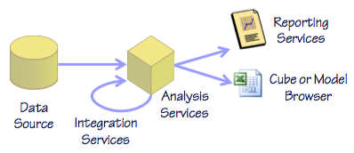

# 第 1 章 SQL Server 分析服务简介

SQL Server 分析服务是作为 Microsoft SQL Server 2012 的一部分提供的几个组件之一，您可以使用这些组件来开发商业智能分析解决方案。在这篇对 SQL Server Analysis Services 的介绍中，我解释了商业智能的概念以及设计商业智能解决方案的所有可用选项。我还从高层次回顾了开发分析服务数据库的过程，并介绍了您用来构建、管理和查询分析服务的工具。

## 什么是商业智能？

商业智能对不同的人意味着不同的东西。无论该术语的使用范围有多广或多窄，一个全球公认的概念是，它支持组织中的决策过程。简而言之，在做出有助于企业赚钱或省钱的决策之前，组织各级人员必须收集有关其业务中发生的事件的信息。

许多业务中的一个常见问题是收集业务事件细节的操作系统无法促进信息收集过程，因此决策过程受阻。当唯一的信息来源是操作系统时，在最坏的情况下，人们依靠直觉做出不明智的决定，因为他们无法获得所需的信息，而在最好的情况下，人们有工具或其他人来帮助他们汇编所需的数据，但这一过程需要时间，而且繁琐。

大多数业务应用程序将数据存储在关系系统中，任何人都可以查询该系统是否拥有合适的工具、技能和安全权限。那么，为什么有必要将数据移动到完全不同类型的数据库中呢？为了理解这一需求以及为什么商业智能解决方案中包含分析服务，比较像 SQL Server 这样的关系引擎和像分析服务这样的在线分析处理(OLAP)引擎的行为是很有帮助的。首先，让我们考虑对决策者来说很重要的三种类型的问题，因为他们分析数据以了解业务中正在发生的事情:

*   **总结**。用户通常希望汇总特定时间范围内的信息，例如特定年份的总销售额。
*   **对比**。用户希望回答需要多组信息或时间段的比较数据的问题。例如，他们可能希望按产品类别查看总销售额。他们可能希望进一步细分这些数据，以了解按产品类别或按当年所有月份划分的总销售额。
*   **巩固**。用户也经常有问题，需要合并来自多个来源的数据。例如，他们可能希望将总销售额与预测销售额进行比较。通常，这些类型的数据在单独的应用程序中管理。

|  | 注意:出于本书的目的，我使用总结、比较和整合问题来表示要构建的商业智能解决方案的业务需求。虽然我讨论的场景非常简单，但我在这里描述的相同原则也适用于现实世界的场景，在这些场景中，决策者有更多的问题需要数据能够回答的答案，只要它以更好的方式构建。 |

当数据仅在关系引擎中可用时，这些类型的查询中的每一种都可能有问题，原因如下:

*   决策查询依赖于存储在用于保持业务运行的同一数据库中的数据。如果许多用户正在执行需要汇总数百万行数据的查询，可能会出现资源争用问题。汇总查询需要大量数据库资源，并且会干扰与业务操作同时发生的正常插入和更新操作。
*   数据源通常集中于当前状态。历史数据在指定的时间段后存档。即使它没有完全归档，也可能只保留在摘要级别。
*   计算通常不能存储在关系数据库中，因为在执行计算之前必须聚合基值。例如，百分比利润计算要求首先计算销售额和成本之和，然后从总销售额中减去总成本，最后将其除以总销售额得出结果。无论逻辑是相对简单的，如百分比利润计算，还是复杂的，如预测的加权分配，该逻辑都不会存储在关系引擎中，必须在查询时应用。在这种情况下，不能保证使用不同工具收集数据的不同用户会以相同的方式构建计算。
*   数据的关系存储通常使用一种称为[第三范式](http://en.wikipedia.org/wiki/Third_normal_form)的结构，它将相关数据分散到多个表中。因此，从这些表中检索数据需要复杂的查询，这些查询很难编写，并且可能包含许多可能导致查询运行缓慢的连接。

OLAP 发动机通过以下方式解决这些问题:

*   使用单独的数据源进行查询减少了资源争用。当然，您可以维护一个专用于报告的关系数据库的副本，但是还有其他原因让您更喜欢 OLAP 而不是关系数据库。
*   您可以将历史数据保留在 OLAP 数据库中，否则可能会通过覆盖或归档源系统来消除这些数据。同样，您可以通过创建关系数据集市或数据仓库来解决这个问题，但是实现 OLAP 还有其他原因。
*   OLAP 的一个更显著的好处是业务逻辑的集中化，以确保所有用户对特定查询得到相同的答案，而不管查询是在什么时候运行的，也不管执行查询所使用的工具是什么。
*   分析服务使用的存储机制旨在快速检索数据。如果您更喜欢编写查询而不是使用查询生成器工具，那么很多时候查询会更短更简单(一旦您学习了 Analysis Services 的查询语法，MDX)。
*   OLAP 数据库以二进制格式存储数据，因此文件更小，访问数据更快。
*   最后但并非最不重要的是，OLAP 数据库为用户提供了对数据的自助访问。例如，Microsoft Excel 用户可以通过使用数据透视表图表或数据透视表轻松连接到分析服务多维数据集并浏览其数据。

## 架构选项

有几种不同的方法可以设计分析服务:

*   **原型**。这是实现起来最简单的架构。在这种情况下，您可以在服务器上安装分析服务，然后创建并处理一个数据库以加载数据。您关注的是在概念验证中使用的单个数据加载，因此您不会将任何数据刷新过程作为体系结构的一部分来实现。
*   **个人或团队使用**。如果您有一个结构相对简单、数据量较小的单一数据源，并且不需要管理数据的历史变化(也称为[缓慢变化维度](http://en.wikipedia.org/wiki/Slowly_Changing_Dimensions)，则可以实施分析服务，并添加定期刷新分析服务数据库的机制，例如每晚或每周。
*   **部门或企业使用**。随着需要访问数据库的用户数量的增长，或者数据源的数量或数据结构的复杂性的增加，您需要建立一个更正式的体系结构。通常，这需要您为 Analysis Services 设置一个专用的关系源，例如特定于主题的数据集市或包含多个数据集市或合并来自多个源的数据的数据仓库。在这个场景中，您实现了更复杂的[提取、转换和加载](http://en.wikipedia.org/wiki/Extract,_transform,_load) (ETL)过程，以保持数据集市或数据仓库最新，并保持分析服务数据库最新。如果需要横向扩展解决方案，可以对分析服务数据库进行分区。

* * *

| 多维还是表格？安装分析服务时，您可以选择安装三种类型的实例之一:

*   多维的
*   扁平的
*   用于 SharePoint 的 PowerPivot

前两种实例类型是独立的服务器实例，而第三种需要与 SharePoint 集成。多维服务器托管包含一个或多个多维数据集的数据库。它是一个成熟的、功能丰富的产品，支持复杂的数据结构，并可扩展以处理高数据量和大量并发用户。表格服务器为存储在其数据库中的模型支持更广泛的数据源，但管理数据存储和内存的方式大不相同。更多信息见[http://msdn.microsoft.com/en-us/library/hh994774.aspx](http://msdn.microsoft.com/en-us/library/hh994774.aspx)。 |

* * *

|  | 注意:虽然本书的重点是分析服务的多维服务器模式，但是包含表格服务器模式的分析服务的环境的体系结构是相似的。多维数据库需要关系数据源，而表格数据库也可以使用电子表格、文本数据和其他来源。您可以使用相同的客户端工具来查询数据库。 |

在**原型**架构中，您的完整环境可以存在于单个服务器上，尽管不要求您这样设置。它包括一个关系数据源、一个分析服务实例和一个用于浏览分析服务数据库的客户端工具，如图 1 所示。关系数据源可以是一个 SQL Server、DB2、Oracle 或任何可以用 OLE DB 驱动程序访问的数据库。出于原型设计的目的，您可以使用分析服务的开发人员版，但是如果您认为原型将演变为永久解决方案，则可以使用标准版、商业智能版或企业版，具体取决于您想要实现的功能，如表 1 所述。对于浏览原型数据库，Excel 2007 或更高版本通常就足够了。

图 1:原型架构

表 1:按版本划分的功能比较

| 特征 | 标准版 | 商业智能版 | 开发者和企业版 |
| --- | --- | --- | --- |
| 客户情报 | 是 | 是 | 是 |
| 行动 | 是 | 是 | 是 |
| 高级维度(参考，多对多) | 是 | 是 | 是 |
| 高级层次结构类型(父子、不规则) | 是 | 是 | 是 |
| 聚集 | 是 | 是 | 是 |
| 二进制和压缩的 XML 传输 | 是 | 是 | 是 |
| 自定义程序集 | 是 | 是 | 是 |
| 自定义汇总 | 是 | 是 | 是 |
| 维度和单元级安全性 | 是 | 是 | 是 |
| 直接写回 | 不 | 是 | 是 |
| 钻取 | 是 | 是 | 是 |
| 等级制度 | 是 | 是 | 是 |
| 高可用性 | 是 | 是 | 是 |
| 关键绩效指标 | 是 | 是 | 是 |
| 链接的度量和维度 | 不 | 是 | 是 |
| MDX 查询和脚本 | 是 | 是 | 是 |
| 度量表达式 | 不 | 是 | 是 |
| MOLAP、ROLAP 和 HOLAP 存储模式 | 是 | 是 | 是 |
| 多个分区 | 最多 3 个 | 是 | 是 |
| 观点 | 不 | 是 | 是 |
| 主动缓存 | 不 | 是 | 是 |
| 可编程性(AMO、AMOMD.NET、OLEDB、XML/A、ASSL) | 是 | 是 | 是 |
| 推送模式处理 | 不 | 是 | 是 |
| 基于角色的安全模型 | 是 | 是 | 是 |
| 可扩展共享数据库(连接/分离，只读) | 不 | 是 | 是 |
| 可扩展字符串存储 | 是 | 是 | 是 |
| 半累加性度量 | 仅最后一个孩子 | 是 | 是 |
| 时间智能 | 是 | 是 | 是 |
| 翻译 | 是 | 是 | 是 |
| 写回单元 | 是 | 是 | 是 |
| 写回多维数据集 | 是 | 是 | 是 |
| 写回维度 | 不 | 是 | 是 |

对于**个人或团队**解决方案，您可以引入自动化来保持分析服务中的数据最新。您使用原型架构中描述的相同组件:数据源、分析服务和浏览工具。然而，如图 2 所示，您将集成服务作为附加组件添加到环境中。集成服务使用称为包的单元来描述要执行的任务。然后，您可以使用计划的流程来执行一个或多个更新分析服务数据库中数据的包。Excel 仍然是一种流行的浏览工具，但是您也可以设置报表服务来提供对使用分析服务作为数据源的标准报表的访问。

图 2:个人或团队架构

为了建立一个供组织使用的架构，如图 3 所示，您引入了一个数据集市或数据仓库，作为加载到 Analysis Services 中的数据的来源。集成服务定期更新数据集市中的数据，然后将数据从数据集市加载到分析服务中。除了 Excel 或 Reporting Services 作为客户端工具之外，您还可以使用 SharePoint 商业智能功能，包括 Excel Services、SharePoint 状态指示器和仪表板，或者 PerformancePoint 记分卡和仪表板。

图 3:组织架构

## 开发、管理和客户端工具

如果您负责创建或维护分析服务数据库，您可以使用以下工具:

*   SQL Server 数据工具(SSDT)
*   SQL Server 管理工作室(SSMS)
*   各种客户端工具

**SSDT** 是您用来开发分析服务数据库的环境。使用此工具，您可以使用包含一个或多个项目的解决方案，就像在 Visual Studio 中开发应用程序一样。

您可以使用 **SSMS** 来配置服务器属性，这些属性决定了服务器如何使用系统资源。您还可以使用对象资源管理器查看部署到服务器的数据库，并浏览每个数据库中包含的对象。您不仅可以查看对象的属性，而且在某些情况下还可以对这些属性进行更改。此外，您可以创建对象定义的脚本，以便在另一个数据库或另一台服务器上重现它。

SSMS 还为您提供了一种快速检查多维数据集中数据或单个维度中数据的方法。您可以使用 MDX 查询窗口来编写和执行从多维数据集中检索数据的查询。图形界面也可用于浏览这些对象，而无需编写查询。

SSMS 的另一个功能是 XML for Analysis (XMLA)查询窗口，您可以在其中编写和执行脚本。您可以使用 XMLA 脚本来创建、更改或删除数据库对象，也可以处理对象，这是将数据加载到分析服务数据库中的方式。然后，您可以将这些脚本放入集成服务包中以自动执行它们，也可以将它们放入 SQL Server 代理作业中。但是，您不需要使用脚本进行处理。相反，您可以在必要时在 SSMS 手动处理对象，或者创建集成服务包来自动化处理。

作为开发过程的一部分，您应该使用您的用户社区可能使用的**客户端工具**，以确保浏览体验按预期工作。在本章中，我将解释微软提供的客户端工具的选择，但是也有几个第三方选项需要考虑，当然，如果您希望用户拥有特定的可用功能，您可以随时创建自定义应用程序。微软商业智能堆栈包括以下工具:

*   **超越**。这是浏览多维数据集的一个非常常见的选择，因为用户经常因为其他原因已经在使用 Excel，并且可能对透视表有一些经验。Excel 提供了一个易于使用的界面来选择浏览的维度，如图 4 所示，并且还提供了过滤、排序和执行假设分析的高级功能。

图 4:用 Excel 浏览立方体

*   **报告服务**。当用户需要查看信息但对数据的探索较少时，这是一个选项。这些用户通过使用预先构建的静态报告来访问数据，如图 5 所示。

图 5:带有分析服务数据源的报告

*   **SharePoint** 。您可以使用分析服务作为仪表板过滤器的数据源，如图 6 所示。

图 6:带有分析服务数据源的仪表板过滤器

*   **性能点服务**。您可以使用 Analysis Services 作为数据源创建记分卡(如图 7 所示)和仪表板。

图 7:记分卡中的分析服务关键绩效指标

## 数据库开发流程

在深入分析分析服务数据库开发的细节之前，让我们看一下一般过程:

1.  设计维度模型。
2.  开发维度对象。
3.  为数据库开发多维数据集。
4.  向多维数据集添加计算。
5.  将数据库部署到服务器。

首先，你从设计一个**尺寸模型**开始。您可以使用数据集市或数据仓库中已有的维度模型，也可以定义要用作源的表或视图，设置逻辑主键，并定义关系以生成与关系数据库中实例化的维度模型非常相似的结构。我在第二章[设计维度模型](2.html#_Chapter_2_)中更详细地描述了这一步

一旦维度模型就位，您就可以开发**维度对象**。浏览多维数据集时，可以使用维度来“切割”数据。您将在第 3 章[开发维度](3.html#_Chapter_3_)中了解更多关于该步骤的信息

下一步是**为数据库开发一个或多个立方体**。这通常是一个迭代过程，您可能会返回并向数据库添加更多维度，然后返回对多维数据集进行更多开发工作。我将在第 4 章“T2 开发立方体”中对此进行更多解释

最终，您**将计算**添加到多维数据集中，以便在多维数据集中存储原始数据中不可用的数据的业务逻辑。有专门的计算类型来生成维度成员集和关键性能指标。您将在第 5 章“用 MDX 增强立方体”中学习如何处理所有这些类型的计算

在开发工作期间和之后，您**将数据库**部署到服务器，并处理对象以向其加载数据。没有必要等到完成了开发过程中的每一步才进行部署。开发一个维度，部署它以便您可以看到结果，返回并修改维度，然后再次部署，这是非常常见的。你继续这个循环，直到你对这个维度感到满意，然后你准备好进入下一个维度的发展。

### 分析服务项目剖析

要在 SSDT 启动多维数据库开发过程，您需要在 SSDT 创建一个新项目。在这里，您可以从以下项目类型中进行选择:

*   **分析服务多维度和数据挖掘项目**。您可以使用此项目类型从头开始构建项目。项目最初是空的，然后您单独构建每个对象，通常使用向导快速开始。
*   **从服务器导入(多维和数据挖掘)**。如果分析服务数据库已经部署到服务器，则可以导入数据库对象，并让 SSDT 逆向工程设计并创建项目中的所有对象。

无论是从空的分析服务项目开始，还是从现有的分析服务数据库导入对象，分析服务项目中都有几种不同类型的项目项:

*   **数据源**。此项目类型定义如何连接到要使用的 OLE 数据库源。如果您需要更改服务器或数据库名称，那么您在 SSDT 只有一个地方可以进行更改。
*   **数据源视图(DSV)** 。数据源视图表示维度模型。您构建到分析服务数据库中的所有内容都依赖于您在数据源视图中创建的数据结构的定义。
*   **立方体**。分析服务项目中至少有一个多维数据集文件。您可以根据需要创建任意多个。
*   **尺寸**。您的项目必须至少有一个维度，尽管大多数多维数据集都有多个维度。
*   **角色**。您可以使用角色来配置用户访问权限。我在第 6 章“管理分析服务数据库[中解释了如何做到这一点然而，没有必要在 SSDT 创造一个角色。您可以稍后在 SSMS 添加一个角色。](6.html#_Chapter_6_)