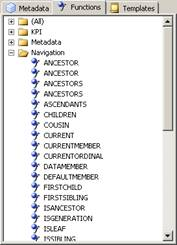
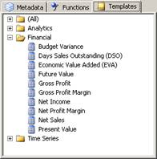
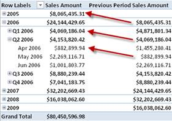
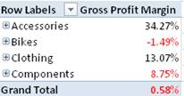
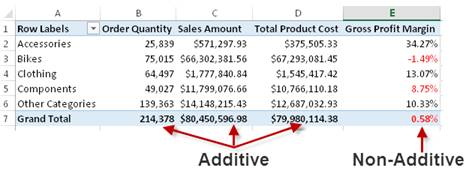
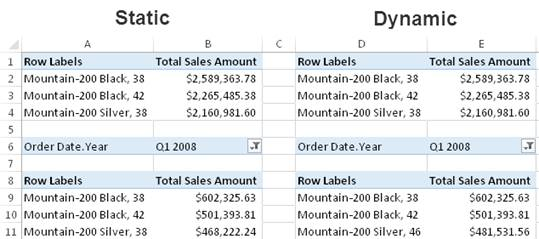
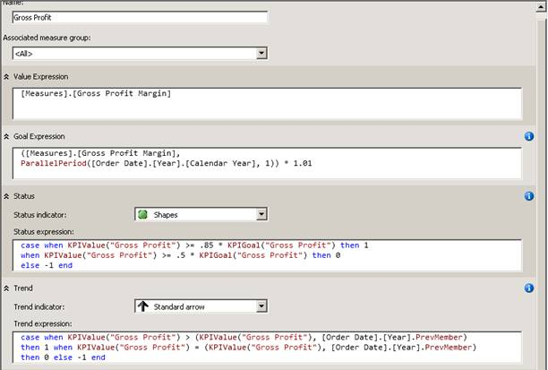
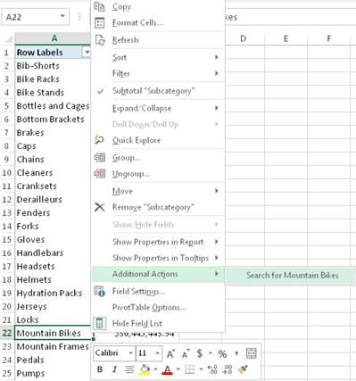

# 第 5 章用 MDX 增强立方体

使用分析服务数据库进行报告和分析(而不是使用关系数据库)的好处之一是能够将业务逻辑作为计算直接存储在多维数据集中。这样，您就可以确保每次都以相同的方式计算特定的业务指标，而不管是谁要求查看该指标，也不管他们的技能水平如何。要在多维数据集中存储业务逻辑，可以使用 MDX，这是多维表达式语言的缩写。MDX 也是一种查询语言，表示层工具使用它从多维数据集中检索数据。

我将从解释如何向立方体添加基本计算开始这一章。用户可以像任何其他度量一样访问这些计算。计算设计器包括几个工具来帮助您创建计算，从查找正确的对象名称到选择用于构建计算的函数或模板。在本章中，您将学习如何创建简单的计算以及如何使用表达式来更改计算结果的外观，以便用户可以一眼看出某个数字是高于还是低于指定的阈值。此外，本章向您展示了如何使用表达式向维度添加自定义成员和命名集。您还将了解用于跟踪目标进度的关键性能指标的更专门的表达式类型，以及用于向多维数据集浏览添加交互性的操作。

## 计算成员

要创建计算成员，请打开 SSDT 多维数据集设计器的**计算**选项卡，然后单击工具栏中左侧第五个按钮**新建计算成员**。表单视图根据我们正在创建的计算类型要求我们需要的信息。对于计算成员，您需要提供一个名称和一个表达式，并将**可见**属性设置为最小值，如图 65 所示。如果名称中有空格或以数值开头，则需要用大括号括起来，并且表达式必须是有效的 MDX 表达式。


图 65:新的计算成员

在本例中，一个简单的加法操作将评估两个指标的结果结合起来，即互联网销售额和销售额。对于查询中行和列的每个单元格交集，Analysis Services 会单独评估表达式的每个部分并添加结果。也就是说，互联网销售额是在当前行、当前列和当前筛选器的维度上下文中计算的，如图 66 所示，销售额也是如此。然后，分析服务将结果相加，以生成为具有相同行、列和筛选器成员组合的总销售额显示的值。


图 66:新的计算成员

### 计算成员属性

计算还有几个属性，其中许多类似于度量:

*   **格式字符串**。正如您可以为度量设置格式字符串一样，您也可以为计算成员选择内置字符串或键入自定义字符串。
*   **可见**。为了排除故障，通常最好不要尝试构建一个复杂的计算，而是将其分解为单独的组件，通过将此属性设置为 False 来隐藏这些组件。然后，您可以在可见的计算成员中使用单个计算成员。
*   **非空行为**。对于此属性，您可以指定一个或多个度量值，Analysis Services 应评估这些度量值以确定计算成员是否为空。如果选择多个度量值，则所有度量值都必须为空，以便 Analysis Services 也将计算成员视为空。另一方面，如果不配置此属性，Analysis Services 将评估计算成员以确定它是否为空，这可能会增加查询响应时间。
*   **关联度量组**。如果选择度量值组，则计算成员将出现在元数据树中度量值组的文件夹中。否则，它将与其他未关联的计算成员一起显示在元数据树的单独部分中。
*   **显示文件夹**。组织计算成员的另一个选项是使用显示文件夹。您可以在下拉列表中选择现有文件夹，或者键入新文件夹的名称来创建它。
*   **颜色表达**。当 Analysis Services 评估计算成员时，您可以定义表达式来确定在演示工具中显示的字体或单元格颜色。
*   **字体表达**。当计算成员显示在演示工具中时，还可以定义表达式来确定字体名称、大小或属性。

|  | 注意:演示工具对颜色和字体表达的支持各不相同。请确保在您打算使用的每个演示工具中测试一个计算成员，并相应地设置用户期望。 |

每个计算成员都成为多维数据集的 MDX 脚本的一部分。MDX 脚本是一组命令和表达式，代表整个多维数据集的所有计算，包括命名集和关键性能指标，我将在本章后面解释。使用 MDX 脚本，您不仅可以创建与表示事实表中聚合值的度量共存的计算，还可以在多维数据集中设计一些非常复杂的行为，例如在特定的单元格交叉点更改值。然而，广泛使用 MDX 脚本需要对 MDX 有深刻的理解，这超出了本书的范围。

|  | 提示:要了解更多关于 MDX 的知识，请参阅在线教程[通往 MDX 的阶梯](http://www.sqlservercentral.com/stairway/72404/)。您可以在 MSDN 的 [MDX 脚本基础](http://msdn.microsoft.com/en-us/library/ms145973.aspx)了解如何使用 MDX 脚本。 |

### 计算工具

为了帮助您构建 MDX 表达式，计算设计器包括几个工具:

*   [计]元数据
*   功能
*   模板

在计算设计器的左下角是计算工具窗格，如图 67 所示。该窗格的第一个选项卡显示**元数据**，其中包含多维数据集的树结构及其维度。树的顶部是按度量值组和计算成员组织的度量值列表。尺寸显示在测量值下方。在元数据树中，您可以访问任何类型的对象—维度本身、层次结构、层次结构的级别或单个维度成员。


图 67:计算工具窗格中的元数据

要使用元数据树，右键单击要添加到表达式中的对象，然后单击**复制**。接下来，在**表达式**框中右键单击，然后单击**粘贴**。您可以在表达式中键入任何需要的数学运算符，然后继续从元数据树中选择项。

计算工具窗格中的**函数**选项卡包含几个文件夹，这些文件夹按类别组织 MDX 函数。图 68 显示了一些导航函数，当您有层次结构并且想要进行时间比较或总计算百分比时，这些函数在 MDX 中非常常用。



图 68:计算工具窗格中的函数

了解函数返回什么对象类型很重要，这样您就可以在表达式中正确使用它。例如，[子函数](http://msdn.microsoft.com/en-us/library/ms146018.aspx)返回一组成员。让我们通过查看 Categories 层次结构来了解这一点，如图 69 所示。


图 69:用户定义层次结构中的维成员

层次结构的顶部是“全部”成员，它是存在于以下级别的成员的父代:配件、自行车、服装和组件。您可以对这些成员中的任何一个使用[父](http://msdn.microsoft.com/en-us/library/ms145513.aspx)函数来返回该所有成员，如下所示:

```sql
    [Product].[Categories].[Accessories].Parent

```

同样，您可以使用**子功能**来获取指定成员下的成员集。当您对自行车成员使用此功能时，结果是一个包含山地自行车、公路自行车和旅游自行车成员的集合:

```sql
    [Product].[Categories].[Bikes].Children

```

您也可以使用导航功能沿同一层级向前和向后移动。例如，[下一个成员](http://msdn.microsoft.com/en-us/library/ms145977.aspx)功能返回公路自行车:

```sql
    [Product].[Categories].[Mountain Bikes].NextMember

```

同样，使用旅行自行车的[预会员](http://msdn.microsoft.com/en-us/library/ms144719.aspx)功能也可以返回公路自行车。使用带有日期维度的**下一个成员**和**上一个成员**函数更常见，但是这些函数适用于任何类型的维度。概括地说，计算成员的表达式由通过使用直接引用(如`[Product].[Categories].[Mountain Bikes]`)或函数获得相对引用(如`[Product].[Categories].[Accessories].Parent`)对度量或成员的引用组成。您也可以对这些引用执行数学运算。

计算工具窗格中的第三个选项卡是**模板**。该选项卡提供了示例表达式，您可以将其用于许多常见类型的计算，如图 70 所示。例如，在销售多维数据集中，您可能有一个毛利润的计算度量。要使用模板，必须首先使用工具栏上的第十二个按钮切换到脚本视图。将指针置于现有表达式下方，右键单击模板，然后单击**添加到模板**。



图 70:表达式模板

与从元数据树中选择对象不同，模板添加了完整的脚本命令来创建计算，如图 71 所示。表达式本身包含我们需要用多维数据集中的实际引用替换的标记。您可以在脚本视图中这样做，也可以切换回表单视图(工具栏中的第 11 个按钮)。


图 71:表达式模板

无论哪种方式，完整的表达式都需要销售金额和成本度量。此外，您必须在分子表达式中添加括号，以获得正确的操作顺序并更改格式字符串。也就是说，在执行除法运算之前，您必须从销售额中减去成本以获得利润，如下所示:

```sql
    CREATE MEMBER CURRENTCUBE.[Measures].[Gross Profit Margin]
    AS ([Measures].[Sales Amount] - [Measures].[Total Product Cost])
    /
    [Measures].[Sales Amount]
    ,
    FORMAT_STRING = "Percent";

```

### 元组表达式

使用导航功能的一种常见方式是检索不同时间段的值。例如，要检索以前期间的销售额，您可以将销售额度量与**previous member**函数结合使用，日期层次结构如下所示:

```sql
    ([Measures].[Sales Amount], [Order Date].[Year].PrevMember)

```

这种类型的表达式被称为**元组表达式**。这是一个告诉分析服务在多维数据集中何处查找信息的坐标。元组只能包含成员，这就是为什么知道函数返回什么很重要。因为 **PrevMember** 返回一个成员，所以它对前面例子中的元组表达式有效。

通过在元组表达式中使用导航函数，您可以通过在同一级别中向前或向后移动，或者在层次结构中向上或向下移动，将分析服务从当前成员重新定位到不同的成员。例如，在图 72 中，前期销售金额(基于之前定义的元组表达式)，您可以看到 2006 年的值与 2005 年的销售金额值相匹配，2005 年是订单日期维度的年用户定义层次结构的年级别上的前一个成员。同样，Q2 2006 的“前期销售金额”值是 Q1 2006 的“销售金额”值，后者是层次结构中“季度”级别的前一个成员。在月份级别也是如此，其中“前期销售额”的 2006 年 5 月值与“销售额”的 2006 年 4 月值相匹配。



图 72:元组表达式中前一成员函数的效果

### 颜色和字体表达

计算成员的颜色和字体属性不适用于度量值。这些颜色和字体属性可以基于表达式，并在表单视图的底部进行配置。但是，如果您知道正确的语法，您可以将这些表达式直接添加到 MDX 脚本中。

在表单视图中，展开适用的部分。例如，在“颜色表达式”中，您可以选择配置“前景色”来设置字体颜色，或者配置“后景色”来设置包含值的单元格的填充颜色。在字体表达式中，您可以设置字体名称或字体大小。当您想要控制是使用粗体还是斜体字体样式显示值时，也可以设置字体标志。

通常，颜色和字体使用条件表达式。条件表达式使用 [IIF](http://msdn.microsoft.com/en-us/library/ms145994.aspx) 函数，该函数有三个参数。第一个参数是布尔表达式，必须解析为真或假。通常你在这里比较一个值和一个阈值。第二个参数是布尔表达式为真时函数返回的值，而第三个参数是布尔表达式为假时返回的值，如下所示:

```sql
    iif([Measures].[Gross Profit Margin]<.1, 255 /*Red*/, 0 /*Black*/)

```

|  | 提示:您可以使用显示在表达式框右侧的颜色或字体选择器在表达式中设置适当的代码。例如，您可以在选取器中选择红色，值 255 将与注释字符串//* Red */一起出现在表达式中，作为值含义的提示。 |

然后，您应该在用户将拥有的演示工具中测试结果，例如微软 Excel，如图 73 所示。在这里，你可以看到红色字体只显示在毛利率低于 10%的地方。



图 73:条件颜色表达式

### 自定义成员

有时您需要创建影响度量计算方式的计算，但它们本身并不是度量。这些计算成员是维度的一部分，也称为自定义成员。假设您希望支持一个产品类别相对于所有其他产品类别的分析。您可以创建一个计算成员，以包括除自行车以外的所有产品类别。当您创建一个计算成员时，如图 74 所示，您为该成员分配一个在父层次结构中唯一的名称，并定义其父成员。


图 74:计算成员的名称和父属性

之后，定义计算成员的表达式。在本例中，计算成员的表达式使用[聚合](http://msdn.microsoft.com/en-us/library/ms145524.aspx)函数，但是这里允许任何聚合函数。也就是说，您可以使用[求和](http://msdn.microsoft.com/en-us/library/ms145484.aspx)、[平均值](http://msdn.microsoft.com/en-us/library/ms146067.aspx)、[最小值](http://msdn.microsoft.com/en-us/library/ms145600.aspx)、[最大值](http://msdn.microsoft.com/en-us/library/ms145601.aspx)、[区分计数](http://msdn.microsoft.com/en-us/library/ms145519.aspx)或[计数](http://msdn.microsoft.com/en-us/library/ms144823.aspx)来代替。

```sql
    Aggregate(
    {[Product].[Category].[Accessories], [Product].[Category].[Clothing],
    [Product].[Category].[Components]}
    )

```

通过在表达式中使用**聚合**函数，您可以确保为您在具有计算成员的元组表达式中使用的任何度量计算正确的值。有些指标是相加的，比如销售额和成本，而其他指标是非相加的，比如毛利率。对于非累加性度量，分析服务必须首先对表达式的组成部分求和。有了毛利率，就需要把分子和分母分开求和，然后最后进行除法运算。**聚合**功能确保正确的操作顺序，如图 75 所示。



图 75:聚合函数结果

**聚合**函数和其他聚合函数一样，需要一个集合作为其第一个参数。一个**集合**是来自相同维度和层次结构的成员的集合。请注意，在前面的表达式中，集合包含在大括号中，并由特定成员(附件、服装和组件)组成。换句话说，集合定义明确列出了类别层次结构中除“自行车”和“所有”成员之外的所有成员。

因为多维数据集通常有不同类型的度量，所以您可能需要使用条件表达式来定义格式字符串。当有多个可能的条件时，一个 [CASE 语句](http://msdn.microsoft.com/en-us/library/ms144841.aspx)可能比一个嵌套的 IIF 函数更容易阅读，如下所示:

```sql
    case
    when [Measures].CurrentMember is [Measures].[Gross Profit Margin]
    then "Percent"
    when [Measures].CurrentMember is [Measures].[Order Quantity] or
    [Measures].CurrentMember is [Measures].[Internet Order Quantity]
    then "#,#"
    else "Currency"
    end

```

您可以切换到脚本视图，以便更容易地处理复杂的条件表达式。为此，请单击计算设计器工具栏上的第十二个按钮。您可能需要在脚本视图中设置的另一个属性是**语言**。有时 Excel 或其他表示层工具无法正确解释格式字符串，因此使用 language 属性给它一个提示。脚本视图中完整的计算成员定义如下所示:

```sql
    CREATE MEMBER CURRENTCUBE.[Product].[Category].[All].[Other Categories]
    AS Aggregate(
    {[Product].[Category].[Accessories], [Product].[Category].[Clothing], [Product].[Category].[Components]}
    ),
    FORMAT_STRING = case
    when [Measures].CurrentMember is [Measures].[Gross Profit Margin]
    then "Percent"
    when [Measures].CurrentMember is [Measures].[Order Quantity] or
    [Measures].CurrentMember is [Measures].[Internet Order Quantity]
    then "#,#"
    else "Currency"
    end
    ,
    VISIBLE = 1,
    Language = 1033;

```

|  | 提示:美国英语的语言标识符是 1033。如果需要使用不同的语言标识符，请参考[http://msdn.microsoft.com/en-us/goglobal/bb964664.aspx](http://msdn.microsoft.com/en-us/goglobal/bb964664.aspx)找到正确的值。 |

## 命名集

您也可以使用计算设计器开发命名集。名为集合的**是一种特殊类型的计算，它返回维度成员的集合，而不是像计算度量那样的特定值。您可以通过如上例所述定义成员列表来创建命名集，也可以使用 set 函数在查询时生成集。例如，您可以使用 [TopCount](http://msdn.microsoft.com/en-us/library/ms144792.aspx) 功能来生产一组销量最高的三种产品，如下所示:**

```sql
    TopCount([Product].[Product].[Product].Members, 3,[Measures].[Total Sales Amount])

```

**TopCount** 函数的第一个参数需要一个集合。在这种情况下，第一个参数的表达式使用成员函数来获取产品维度的产品层次结构的产品级别上存在的所有成员。第二个参数指定最终集合中包含多少成员。第三个参数指定分析服务需要对其成员执行降序排序的度量。换句话说，这个函数获取产品集，找到每个产品的总销售额，按降序对产品进行排序，然后返回结果集的前三个成员。

创建命名集时，可以指定是希望命名集的内容保持不变，还是根据当前查询的上下文更改内容。在命名集的表单视图的**附加属性**部分，选择**静态**作为常数集，或选择**动态**作为调整到**类型**下拉列表中查询上下文的集。图 76 显示了更改年份过滤器对每种命名集的影响。



图 76:静态与动态命名集

在图 76 的左侧，数据透视表显示一个静态命名集，而图右侧的数据透视表显示一个动态命名集。最上面一行的数据透视表是相同的，因为静态和动态数据透视表没有应用任何筛选器。它们包括相同的前三名产品和相同的价值。但是，下面一行说明了应用筛选器(如 Q1 2008)时静态命名集和动态命名集之间的区别。在左侧，静态命名集包括显示在其上方未过滤数据透视表中的相同三种产品，但是“总销售额”列中的值适用于这些产品的 Q1 2008。在右侧，动态命名集显示不同的三个产品集。这三种产品是过滤后的时间框架内销量最高的三种产品，即 Q1 2008，并且“总销售额”列显示了这三种产品在该季度的销售额。因此，静态命名集保留相同的成员，而不考虑查询中的过滤器，而动态命名集根据查询过滤器包括不同的成员。

## 关键绩效指标

您可以添加到多维数据集中的另一种计算类型是**关键绩效指标** (KPI)。从技术上讲，关键绩效指标不是一个单一的计算，而是一组定量描述价值与目标的比较的计算。此外，一个关键绩效指标包括一个符号来表示朝着目标的进展，另一个符号来表示关键绩效指标值在选定时间点的趋势。

虽然关键绩效指标是计算，但是您可以使用关键绩效指标设计器而不是计算设计器来定义每个关键绩效指标。图 77 显示了毛利润关键绩效指标的一组计算:



图 77:关键绩效指标表单视图

单击工具栏中的**新建关键绩效指标**按钮后，您可以使用四个单独的表达式定义一个关键绩效指标:值、目标、状态和趋势。让我们分别来看每一个。

*   **值**。此表达式表示根据目标评估的值。它表示某个指标的当前状态。例如，为了监控毛利润，值表达式可以简单地是已经为毛利润创建的度量。如果度量不存在，您可以在此使用表达式计算毛利润，尽管出于故障排除的目的，最好先在计算设计器中创建计算度量，然后在关键绩效指标设计器的值表达式中引用它。
*   **目标**。此表达式是与值表达式进行比较的目标。目标可以是表达式或固定值。在前面的例子中，目标是实现毛利率比上一年增加 1%。定义该目标的表达式使用元组来检索上一年同一时间段的毛利率百分比，并将其乘以 1.01 以获得目标值。
*   **状态**。您可以使用状态表达式来量化值与目标的接近程度，并使用-1 到 1 的范围来表示结果。当目标没有实现时，表达式应该返回-1，当值朝着目标移动但没有达到预期时，返回 0，当值接近目标、达到目标或超过目标时，返回 1。业务需求决定了-1、0 和 1 之间的界限。对于这个例子，假设只有当值在目标的 85%以内时，值 1 才是可能的。否则，状态为 0，除非该值低于目标的 50%，在这种情况下，状态返回-1。作为状态定义的一部分，您还可以选择与状态结果相关联的图像。稍后，您可以创建一个由关键绩效指标构成的仪表板(例如，使用 Excel 或 SharePoint 中的 PerformancePoint Services)，该仪表板可以告诉您是否达到了目标。
*   **趋势**。趋势表达式将一个时间段的值与前一个时间段的值进行比较。由你来决定那个时间段是前一个时期、同比时期还是移动平均线类型的趋势。与状态一样，您可以将表达式定义为返回值介于-1 和 1 之间。A -1 值是显示为向下箭头的负趋势，而 1 值是显示为向上箭头的正趋势。在前面的示例中，趋势表达式对当前期间和前一期间进行了简单的比较。

与计算设计器不同，您可以使用内置于关键绩效指标设计器中的浏览器来检查关键绩效指标定义的结果。您必须首先部署项目以保存关键绩效指标定义，然后单击**浏览器视图**按钮(关键绩效指标设计器工具栏上的第十个按钮)。在浏览器中，您可以定义过滤器来观察 KPI 结果的变化，如图 78 所示。要查看依赖于时间比较的状态和趋势值，必须在筛选器中包含日期维度。


图 78:关键性能指标浏览器视图

|  | 提示:在浏览器视图中更改维度筛选器后，单击“显示结构”区域中的任意位置以应用筛选器并更新关键绩效指标值。 |

## 行动

增强多维数据集的另一种方法是在多维数据集设计器的“操作”选项卡上定义一个操作。一个**动作**是 Analysis Services 的一个特性，它允许用户在当前查询的上下文中启动一个过程，例如打开一个网页或启动一个报告。您可以向多维数据集添加三种类型的操作中的任何一种:标准操作、钻取操作或报告操作。

无论其类型如何，操作都有一个目标，即用户单击以触发操作的多维数据集中的对象。目标可以是属性、层次结构、级别或维度的成员；单元格、层次或级别；甚至立方体本身。当用户浏览多维数据集时，客户端应用程序显示与目标相关联的可用操作。显示或启动操作的步骤取决于客户端应用程序。例如，当您右键单击一个目标时，Excel 会显示可用的操作，例如山地自行车，如图 79 所示。在这种情况下，操作被分配了属性成员的目标类型和产品的目标对象。子类别显示在 Excel 中。在子菜单中，点击**附加动作**查看可用动作，如本例中的“搜索山地车”。



图 79:在 Excel 中可见的动作

|  | 注意:在向多维数据集添加操作之前，请确保客户端应用程序支持此功能。 |

### 标准动作

标准操作是基于所选目标返回数据或启动另一个应用程序的操作。定义操作时，您可以指定一个 MDX 表达式，该表达式解析为该操作提供给另一个应用程序执行的字符串。您还可以将以下操作类型之一分配给您的操作:

*   **数据集**。这种类型的操作在解析包含 MDX 语句的字符串后，向客户端应用程序返回多维数据集(也称为单元集对象)，该语句使用分析服务 OLE DB 提供程序、ADOMD.NET 或用于分析的 XML 执行。
*   **专有**。这种类型的操作执行由客户端应用程序定义的任务，客户端应用程序还负责解释字符串表达式。
*   **行集**。这种类型的操作在将字符串表达式解析为多维或关系查询后，向客户端应用程序返回行集。它不同于数据集操作类型，因为它可以使用任何符合 OLE DB 的数据源。
*   **声明**。这种类型的操作会在将字符串解析为 MDX 语句(如 CREATE SUBCUBE 语句)后执行 OLE DB 命令。操作返回的结果是语句执行的状态，成功或失败。
*   **URL** 。这种类型的操作会在将字符串解析为网址后，在浏览器窗口中打开网页。

|  | 注意:大多数这些动作类型需要使用自定义应用程序来解释和执行动作，并以某种方式使用执行结果。如果您使用的是 Excel 或 PerformancePoint Services，则仅支持 URL 操作。 |

因为 URL 动作类型是可用动作类型中最常用的，所以让我们考虑一个示例，其中动作必须打开显示所选产品子类别的必应搜索结果的网页。要创建动作，单击**新建动作**(工具栏中的第五个按钮)并指定名称。在这种情况下，目标类型是属性成员，目标对象是产品.子类别。对于此操作，您可以使用 MDX 表达式创建一个操作表达式，该表达式将静态文本和所选成员的名称连接起来，如下所示:

```sql
    "http://www.bing.com/search?q=" + [Product].[Subcategory].CurrentMember.Name

```

您也可以通过展开动作的**附加属性**部分来配置动作的其他设置:

*   **召唤**。您可以指定操作的发生方式。如果用户触发了动作，比如 URL 动作，这个设置应该是**互动**。您也可以选择**批处理**作为批处理操作的一部分运行操作，或者选择**打开**在用户打开立方体时运行操作。
*   **应用**。在这里，您可以键入运行该操作的应用程序的名称，作为调用该操作的客户端应用程序的建议。它不是必需的属性。
*   **说明**。此属性也是可选的，仅用作记录操作的元数据。
*   **字幕**。客户端应用程序显示您为此属性提供的标题。您可以使用静态文本，也可以使用 MDX 表达式动态生成标题。例如，您可以使用以下表达式为 URL 操作创建自定义标题，以显示包含选定属性成员(如“山地自行车”)名称的字符串:

```sql
    "Search for " + [Product].[Subcategory].CurrentMember.Name

```

*   **标题为 MDX** 。该属性的默认值为**假**。如果标题属性使用 MDX 表达式，请确保将该属性更改为**真**。

### 钻取动作

您可以添加钻取操作，以允许用户查看与选定单元格关联的基础详细信息数据。要创建操作，请单击**新建钻取操作**(工具栏中的第六个按钮)，指定名称，并选择特定度量值组或所有度量值组作为操作目标。在**钻取列**部分，选择一个或多个维度和属性的组合返回钻取结果，如图 80 所示。


图 80:钻取操作的钻取列定义

您可以配置其他属性，如标准操作可用的属性，以及钻取操作特定的以下属性:

*   **默认**。将该值保留为**假**。当客户端应用程序执行钻取语句时，它可以作为一个属性来支持向后兼容性。
*   **最大行数**。执行钻取操作时，您可以指定 Analysis Services 返回的行数限制。

在客户端应用程序中，可以从指定为操作目标的度量值组中包含度量值的单元格调用钻取操作。图 81 显示了 Excel 中钻取操作返回的部分数据。


图 81:贯穿结果

### 报告行动

当用户启动报告操作时，用户选择的当前上下文可以作为一个或多个参数传递给 Reporting Services 中承载的报告。报告操作要求您像标准操作一样指定目标类型和目标对象。您还可以指定以下报表服务器属性:

*   **服务器名称**。这里您提供了报表服务器 web 服务的 URL。该值通常为*http://<servername>>/reportserver*，其中 *< servername >* 是本机模式安装的承载 Reporting Services 的计算机的名称，或者*http://<servername>/<site>*是 SharePoint 集成模式安装的计算机名称，其中 *< servername >* 是 SharePoint 服务器名称和
**   **报告路径**。报告路径是包含报告的文件夹或文件夹路径，以及要执行的报告的名称。例如，要在本机模式报表服务器的“销售”文件夹中启动名为“按地区列出的总销售额”的报表，您需要定义以下报表路径:/Sales/按地区列出的总销售额。*   **报告格式**。您可以通过选择 **HTML3** 或 **HTML5** 选项在默认网页浏览器中启动报告，或者通过分别选择 **PDF** 或 **Excel** 选项在 Adobe Reader 或 Excel 中打开报告。*

 *如果报表包含参数，您可以提供静态文本或动态 MDX 表达式来配置报表执行的参数值。您可以输入在报告定义语言(RDL)文件中出现的参数名称，并提供一个表达式，解析为对该参数有效的值，如图 82 所示。


图 82:报告操作的参数定义

## 写回

写回是分析服务不常用的功能之一，原因有二。首先，它需要一个支持它的客户端应用程序。其次，与只执行分析的用户数量相比，写回只被相对较少的需要做计划、预算或预测的用户使用。事实上，写回在 Analysis Services 中最常见的用途是在财务分析中，无论是按部门处理预算还是预测收入和支出。在用户承诺最终预算或预测之前，他们可能会经历几次规划迭代，并可以使用写回来支持该过程。

|  | 注意:在本节中，我将回顾单元写回和维度写回的概念。要了解有关写回的更多信息，请参见[使用分析服务构建写回应用程序](http://blogs.msdn.com/b/data_otaku/archive/2012/06/03/building-a-writeback-application-with-analysis-services.aspx)。 |

### 单元写回

当我们想要跟踪的事件发生时，数据通常会成为多维数据集的一部分，例如销售或总帐条目。但是，通过写回，用户可以使用他们预计可能发生的值更新多维数据集，并可以使用 Analysis Services 的聚合功能来查看这些更新的影响。为了促进这项活动，需要一个支持写回的客户端应用程序来更新单元。换句话说，写回活动需要更新事实数据。若要将数据添加到多维数据集中以描述您期望或希望看到的情况，可以使用写回来更新所选维度成员交叉点处度量值组中的值。通常，为写回过程捕获的数据是高层的，如季度，分析服务数据库必须包含分配给叶级成员的指令，如天。

Analysis Services 将写回数据存储在单独的 ROLAP 分区中，而不考虑多维数据集存储模式(如第 4 章“开发多维数据集”中所述)。事实上，写回过程会更新一个关系表，然后对 MOLAP 分区执行一个增量过程，使其更新以匹配源。对多维数据集的任何后续查询都只从 MOLAP 分区返回数据。与 ROLAP 查询的影响相比，这种增量更新的成本很小。

要实现单元写回，可以为度量值组创建写回分区，该分区可以使用 MOLAP 或 ROLAP 存储。当用户在多维数据集中添加或更改值时，这些值会保留在用户当前会话的内存中，其他人看不到这些值。这样，用户可以在完成输入之前测试所做更改的影响。完成后，写回应用程序中的 COMMIT 命令会将用户输入重新计算为叶级单元格的加权值(如果输入位于更高的级别)。之后，执行 T-SQL Insert 语句，将相应的记录添加到写回分区。如果分区使用 MOLAP 存储，Analysis Services 将执行增量更新(如第 6 章“管理 Analysis Services 数据库”中所述)，以更新多维数据集，从而提高性能。

|  | 注意:您可以在任何版本的分析服务中使用单元写回。 |

### 维度写回

当您想让用户能够向维度添加新成员而不需要他们将其添加到源应用程序时，可以实现维度写回。但是，您必须有一个支持维度写回的客户端工具。您也可以使用安全性来控制谁可以使用该功能，如[第 6 章](6.html#_Security)所述。

当源应用程序不可用于维护成员(如场景维度)时，维度写回很有帮助。例如，您可能在数据仓库中有这样一个维度，您为它预加载了成员，但是没有定期的提取、转换和加载过程来随着时间的推移不断添加成员。在 AdventureWorksDW 示例数据库中，DimScenario 表只有三个成员要启动:实际、预算和预测。

要实现维度写回，您需要修改维度设计。具体来说，将 **WriteEnabled** 属性从默认值 **False** 更改为 **True** ，然后部署更改。如果用户正在使用支持维度写回的应用程序，他们可以根据需要添加新成员。如果您有多个版本的预算或预测，并且希望在计划过程中将其分开，则还可以使用维度写回来创建用于跟踪每个版本的名称。例如，在“方案”维中，每个成员要么与实际数据相关联，要么与预算或预测的特定版本相关联，如预算 v1 或预测 v2.3

当用户通过维度写回添加新成员时，分析服务会立即更新关系源。因此，只能对具有单个表或可更新视图作为源的维度使用维度写回。然后，增量更新(如第 6 章所述)从关系源获取数据，以更新分析服务数据库，任何后续获取维度元数据的查询都包括新成员。没有以这种方式添加的维度成员的单独存储。

|  | 注意:您只能在分析服务的企业版或商业智能版中使用维度写回。 |*