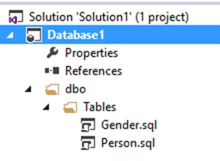
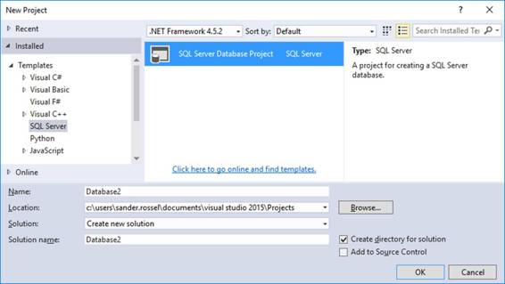
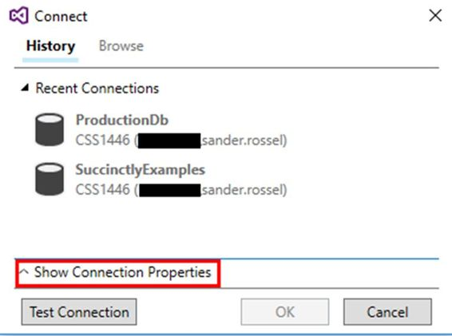
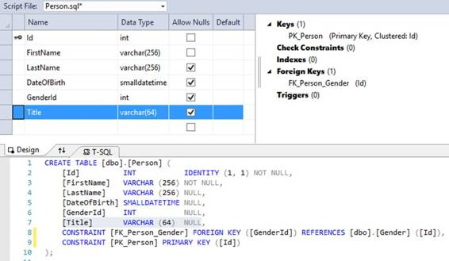
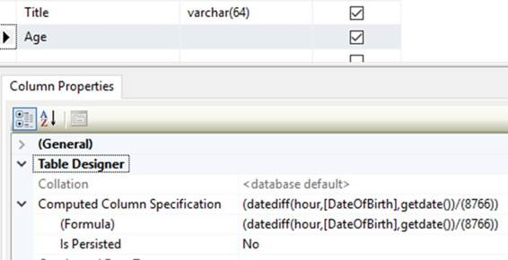
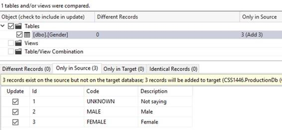

使用 Visual Studio SQL Server 数据工具，您可以像在 SQL Server 管理工作室中一样创建数据库。不过，它会变得更好—您可以轻松地比较和部署数据库。对于这一章，我已经撤消了我们在前面几章中对简明示例数据库所做的所有更改，因此我将重新开始。

如果您在安装 Visual Studio 的过程中遵循了我的所有步骤，那么您应该拥有 SQL Server 数据工具。如果还没有，可以通过进入 Windows 控制面板，然后**程序和功能**来更改安装。在程序列表中，查找**微软 Visual Studio X(带更新 Y)** 、**T5】选中，点击**更改**。现在确保选择了数据工具。**

我应该提到的是，在我写前几章和这一章之间，我得到了一台新的笔记本电脑，所以您将看到的不是拉普拉斯 23\SQLEXPRESS，而是 CSS1446。当然，以上所有仍然适用；只是改名而已。

启动 Visual Studio—您甚至不需要启动或打开项目。在菜单中，转到**查看**，然后转到 **SQL Server 对象资源管理器**。现在，您应该会在屏幕的右侧或左侧看到一个窗口(取决于您的设置)，显示两个节点，即 SQL Server 和 Projects。右键单击 **SQL Server** ，然后单击**添加 SQL Server** 。您现在应该会看到类似于 SSMS 的树视图。

当您右键单击对象时，您会注意到您可以添加表、列和其他对象。您可以生成对象脚本、执行脚本以及添加或更改数据。在 Visual Studio 中可以做到这一点非常酷，但是在 SSMS 也可以。

现在，令人敬畏的部分来了——右键单击**简洁示例**数据库，然后单击**创建新项目**。为你的项目选择一个名字，最好是你的数据库的名字(我很懒，保持默认的，**数据库 1** )。您可能会想要检查**创建新解决方案**，并且可能**为解决方案**创建目录；默认情况下，它们是关闭的，所以我将把它留给您。单击**开始**，将创建一个新的数据库项目。在新的解决方案中，您的解决方案资源管理器现在应该如下所示。



图 14:数据库项目解决方案资源管理器

创建数据库项目的另一种方法是，即使您没有现有的数据库，也只需启动一个新项目，然后从已安装的模板中选择 **SQL Server 数据库项目**。在新项目中，您可以创建对象并部署它们，或者通过在解决方案资源管理器中右键单击您的数据库项目，选择**导入**，然后选择**数据库**来导入现有数据库。



图 15:SQL Server 数据库项目模板

让我们继续数据库 1 项目。双击一个表格，你就可以找到设计者，它和 SSMS 的设计者非常相似。在这里你可以添加新的列和外键，改变列等。在屏幕的下部，您将看到该表的 SQL 脚本；它会随着你改变桌子而改变。

在您做任何事情之前，让我们假设简洁的示例数据库已经准备好生产，因此我们想要部署它。在解决方案资源管理器中右键单击您的数据库项目，然后选择**部署**。在**发布数据库**窗口中，选择一个数据库连接。下面的窗口有点混乱，因为您看到了一些最近的连接，但是您当前的连接是隐藏的。要显示您当前的连接详细信息，请单击**显示连接属性**。你现在可以选择**简洁示例**数据库。



图 16:连接窗口

回到“发布数据库”窗口，选择一个数据库名称。我们将创建一个新的数据库，所以让我们选择一个尚不存在的名称。我称之为**生产数据库**。在真实环境中，您可能有相同的数据库名称，但是有另一个服务器实例。由于我们周围没有备用服务器，我们将使用相同的服务器实例，但使用不同的数据库名称。您也可以为生成的脚本选择一个名称。您也可以在“高级”菜单下启用或禁用许多选项，尤其是在允许数据丢失的情况下。除非您取消选中**如果可能发生数据丢失阻止增量部署**，否则您将永远无法删除表中有行的列。有太多的选择可以全部讨论，但一定要看清楚。

现在，您可以查看、检查、更改和运行脚本(在左上角)，或者直接运行脚本。如果直接运行脚本，它将被放在项目的 bin 文件夹中。此外，还会打开一个数据工具操作窗口，允许您直接打开脚本。无论选择哪种方法，现在都应该有一个新的 ProductionDb 数据库，该数据库与简洁的示例数据库相同。太棒了！

现在我们已经部署了数据库，我们将获得变更请求。让我们在`Person`表中添加一列。双击 Visual Studio 解决方案资源管理器中的 **Person.sql** 脚本。您可以在表设计器的空白处单击鼠标右键来添加或删除设计器列，如`Length`、`Description`、`Identity`。现在简单增加一栏，比如`Title`。省省吧。



图 17:标题列

现在，再次发布数据库，但这一次，只需发布到简洁的示例数据库。Visual Studio 现在将生成一个`ALTER`脚本，而不是`CREATE`脚本。如果您运行它(直接或通过生成脚本然后运行)，您的数据库现在将有新的`Title`列。

更新表或列(即更改表或列)会导致重构日志文件(或更新日志文件)。对于 Visual Studio 来说，这个文件是必需的，因为它必须重命名表或列，而不是删除具有旧名称的表或列，并创建具有新名称的表或列。一旦您发布变更，一个名为`__RefactorLog`的系统表将在您的数据库中创建(注意两个下划线)。该表包含一列，指示哪些架构更改已发布。

数据工具的另一个很酷的特性是比较数据库。我们有几个选项:将数据库模式与其他数据库进行比较，将模式与数据库项目进行比较，以及比较数据库之间的数据。

让我们从比较数据库之间的模式开始。右键单击数据库项目，然后单击**模式比较**。在打开的窗口中，你现在可以选择一个源和一个目标。默认情况下，源是您当前的项目。将源更改为**简明示例**数据库，将目标更改为**生产数据库**数据库。现在只需点击左上角的**对比**，Visual Studio 会直观的给你展示差异。您现在可以再次自动更新目标，或者生成一个 SQL 脚本并手动运行它。您也可以在`Action`列中选择要从生成的脚本中排除的对象。所以现在，只要以任何你想要的方式更新生产数据库。

我们还可以将一个项目与一个数据库进行比较，这基本上是 Deploy 的一种替代方案(除了它不能识别重命名)。它的工作原理与数据库之间的比较完全相同，只是您的源现在是一个数据库项目。当您将数据库作为您的源，将项目作为您的目标时，事情会变得有趣起来(您可以使用按钮在源和目标之间轻松地切换它们)。这使您能够从外部来源对数据库进行更改，然后将其导入到项目中。

所以让我们打开 SSMS，改变一下`Person`表。Visual Studio 表设计器不支持计算列，因此我们将添加一个。在 SSMS，打开`Person`表的设计器并添加以下栏。



图 18:计算列

公式和我在实体框架一章`IQueryable<Person> OlderThan`扩展方法中使用的公式一样。现在返回到 Visual Studio，在简洁的示例数据库和您的数据库项目之间进行比较。该列显示为已添加。这次不能生成脚本，这是有意义的，因为您不是在更新(脚本化)数据库，而是在更新 Visual Studio SQL 数据库项目。只需点击**更新**，该栏目将被添加到您的项目中。

数据比较有点不同。让我们确保我们的数据库中有一些数据。在简明示例数据库上运行以下脚本以插入一些数据。

代码清单 71:插入数据

```cs
  INSERT INTO
  [dbo].[Gender] ([Id], [Code],
  [Description]) VALUES (1, N'UNKNOWN', N'Not
  saying')
  INSERT INTO
  [dbo].[Gender] ([Id], [Code],
  [Description]) VALUES (2, N'MALE', N'Male')
  INSERT INTO [dbo].[Gender] ([Id], [Code],
  [Description]) VALUES (3, N'FEMALE', N'Female')

```

这是您希望在数据库之间保持同步的数据类型。用户，甚至是管理员，可能无法在应用程序的任何地方输入这些数据，如果没有这些数据，您的应用程序将无法正常工作。所以让我们确保我们有所有我们需要的数据。由于某些原因，我们无法从数据库项目中进行数据比较，因此请转到 SQL Server 对象资源管理器。右键单击**简明示例**数据库或`Gender`表格，选择**数据比较**。将**简单示例**数据库设置为您的源(它可能已经是)，将**生产数据库**设置为您的目标。点击**下一步**选择想要比较的表格和视图，然后点击**完成**。现在，您可以大致了解所比较的表。只能比较具有匹配名称、列名、列类型和主键的表和视图。名称区分大小写。进行比较后，您可以(像往常一样)创建一个脚本并手动执行它，或者自动更新目标数据库。



图 19: SQL 数据比较

虽然我们在这里看到的东西非常有用，但这是有代价的，而且有一定的危险。有一段时间，我使用模式比较手动完成了所有部署。然后我不小心部署了一个还不打算投入生产的变更，导致整个工厂停工了大约五分钟。哎呀！如果你不小心，你可能会执行你并不想执行的脚本。生成了很多脚本，只需按一个按钮就可以执行，所以要小心。

最后，但同样重要的是，我想提到数据层应用程序(出于某种原因缩写为 DAC)。数模转换器基本上是一种数据库项目。这两者的区别主要在于发布的方式。在数据层应用程序中，发布包由开发人员创建，然后数据库管理员可以使用它们来执行更新。如果您右键单击 SSMS 对象资源管理器中的**数据库**节点，您会注意到选项“部署数据层应用程序…”和“导入数据层应用程序”可以将数据库项目转换为数模转换器，反之亦然。我必须承认我从未用过它，所以我不会多说什么。如果你想了解更多，我建议你在 [MSDN](https://msdn.microsoft.com/en-us/library/ee210546.aspx) 上看看，自己试试。