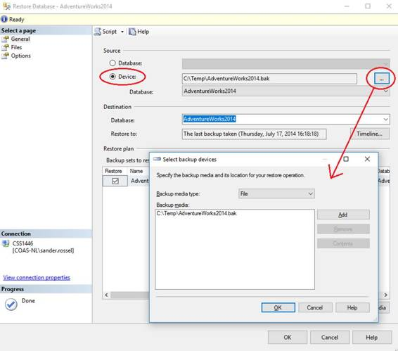
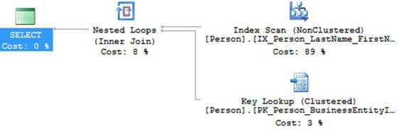
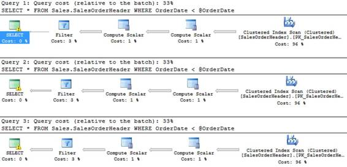

查询偶尔会出错。不幸的是，这可能有很多原因。也许您的数据库已经发展到了这样一个地步，一个一直运行良好的查询现在非常慢。可能您的某个环境缺少索引。可能查询使用的缓存查询计划对于当前参数值来说不是最佳的。在本章中，我们将了解如何识别麻烦的查询以及如何解决这些问题。

举几个例子，我们需要一个带有小主体的数据库。微软有一个我们可以使用的示例数据库，叫做 Adventure Works。可以从 [CodePlex](https://msftdbprodsamples.codeplex.com/releases/view/125550) 下载。或者，你可以在谷歌(或必应)上搜索 AdventureWorks2014，看看会出现什么。下载**冒险作品 2014 完整数据库备份. zip** 文件并解压缩。bak 文件。在 SSMS，右键单击对象资源管理器中的**数据库**节点，然后在上下文菜单中单击**恢复数据库…** 。在恢复数据库窗口中，启用**设备**，单击按钮“ **…** ”并添加。你刚解压的 bak 文件。然后只需点击**确定**，数据库现在应该可用了。



图 20:恢复冒险作品

首先，我们需要知道哪些查询运行缓慢。为此(以及更多)，我们可以使用 profiler。我建议在开发时经常使用 profiler，因为它向您展示了数据库中发生的所有事情。例如，您可能有一段性能良好的代码，但它可能只是因为您在本地用很少的数据进行测试而表现良好。探查器可能会显示您实际上向数据库发送了数千个查询(可能是因为 EF 延迟加载，或者是因为您在循环中执行查询)。我经常遇到这样的场景，它们在测试环境中顺利运行，但却让数据库在生产中陷入停滞(这一点也不好玩)。

要启动探查器，请启动 SSMS，在菜单中，转到**工具**，然后转到 **SQL Server 探查器**。您也可以从“开始”菜单(或安装它的任何地方)将其作为独立应用程序运行。如果您从 SSMS 启动它，它将自动启动一个新的跟踪。如果直接从 Windows 启动，可以在**文件**菜单下找到**新轨迹**。接下来，您必须登录到要跟踪的实例。跟踪生产环境时要小心，因为这会给系统带来负载。连接到本地实例，您应该会看到一个标题为“跟踪属性”的窗口在**常规**选项卡上，您可以命名跟踪、保存到文件或选择模板。我们将忽略此选项卡。转到**事件选择**选项卡。在此选项卡上，您可以找到数据库引发的各种事件。已经为你挑选了一些，但还有很多。勾选**显示所有事件**和**显示所有列**框，你就明白我的意思了。目前我们对以下事件感兴趣:“**存储过程**->**RPC:Completed**和 **SP:StmtCompleted** 和“**TSQL**->**SQL:BatchCompleted**”。现在点击**运行**运行跟踪。


图 21:跟踪的事件选择标签

如果您现在进入 SSMS 并查询一个表，或者运行我们在上一章中创建的应用程序，您将在探查器中看到查询。不幸的是，您可能会看到更多(我还看到来自我的报表服务器的查询和我运行的一些其他东西)。您可以暂停跟踪，并在适当的位置放置一些过滤器。


图 22:跟踪暂停和属性

在**事件选择**选项卡中，转到**列过滤器…** 并过滤应用程序名称，如“实体框架工作”。如果您没有在数据库上下文的连接字符串中手动更改应用程序，您现在将只能看到从应用程序中触发的查询。LoginName 和/或 NTUserName 上的过滤器也可以派上用场，尤其是当您每天有数百万个查询，并且只对一个用户感兴趣时。我经常使用的另一个过滤器是持续时间大于或等于；将其设置为 5000(毫秒)，您将获得至少需要五秒钟的所有查询。如果一个查询弹出很多，你可能需要看一下。无论如何，在应用程序名称过滤器就位后，从应用程序中运行一些查询，并在探查器中查找它。我跑了`context.People.Where(p => p.GenderId == 1).ToList();`。


图 23:分析器中的查询

可以看到，EF 有一些开销，只有第五行是我的实际查询。通过查看生成的查询，我可以看到`1 = [Extent1].[GenderId]`没有被参数化(正如我在查询中想要的那样)。进一步查看这些列，我们可以看到数据库需要 18 次读取、一次写入和 19 毫秒才能得出结果。当寻找麻烦的查询时，您可能希望关注这些值。更高并不一定是坏事，但它可能表明某些东西可以优化。现在，我们还可以复制和粘贴查询，并在 SSMS 手动运行它。

探查器可以用于许多事情，例如，跟踪死锁(事件“锁->死锁图”)。只要看看所有的事件和专栏，你就会发现我们需要另一本书来完全理解这一个工具。对于我的日常活动来说，`BatchCompleted`和`StmtCompleted`事件以及持续时间过滤器证明是无价的。

有时你可能只想运行一段时间的跟踪。幸运的是，您可以设置您的跟踪，然后在**文件**菜单中，转到**导出**，然后转到**脚本跟踪定义**和**对于 SQL Server 2005-2014……**将脚本保存在某个地方并打开它。一定要替换 **InsertFileNameHere** (例如 **C:\Traces\MyTrace** 就可以了，但要确定文件夹存在)并运行脚本。现在，探查器是否运行并不重要；所有内容都将保存到跟踪文件中。当然，您可以使用跟踪属性来实现这一点，但是我也想向您展示脚本。顺便说一下，如果您在打开文件时遇到问题，请尝试以管理员身份运行探查器。

要查看哪些跟踪正在运行，可以使用以下脚本。

代码清单 72:查看 SQL 跟踪

```cs
  SELECT * FROM fn_trace_getinfo(default)

```

要停止、启动和删除跟踪，可以使用以下方法。

代码清单 73:停止、启动和删除跟踪文件

```cs
  SELECT * FROM fn_trace_getinfo(default)
  --
  The file we created got traceid 3.
  --
  Yours may be different, check first.
  DECLARE @TraceId INT = 3

  --
  Stop the trace.
  EXEC sp_trace_setstatus @TraceId, 0

  --
  Start the trace.
  EXEC sp_trace_setstatus @TraceId, 1

  --
  To delete the trace, first stop it.
  EXEC sp_trace_setstatus @TraceId, 0
  EXEC sp_trace_setstatus @TraceId, 2

```

既然您知道了如何获取可能会引起麻烦的查询，那么您就想知道它们到底为什么会引起麻烦。最明显的方法是查看查询计划。在执行查询之前，SQL Server 会确定获取所有数据的近似最快方法。我说近似是因为 SQL Server 知道如何用不同的方式做一件事，所以比如一个`JOIN`可以通过一个`LOOP`、`MERGE`或者`HASH JOIN`在内部实现。以单个查询中的两个`JOINS`为例，我们可以有 3 * 3 = 9 种不同的方式来执行这个查询。加上一个`WHERE`从句，事情就成倍增长了。一个查询可以有数百甚至数千个不同的计划。SQL Server 对什么计划可能是最佳的进行了有根据的猜测。我们已经在参数化一章中谈到了这一点，但是现在我们要看一些实际的计划。

不幸的是，Syncfusion 没有一个简洁的关于查询计划的*电子书(还没有？)，但你可以随时通过 SimpleTalk 在查询计划上查看这本[免费电子书](https://www.simple-talk.com/books/sql-books/sql-server-execution-plans,-second-edition,-by-grant-fritchey/)。*

 *现在，打开 SSMS，浏览到 **AdventureWorks** 数据库，打开一个新的查询窗口。右键点击空的查询窗口，在上下文菜单中选择**包含实际执行计划**。有关更多信息，请在查询窗口中运行以下语句。

代码清单 74:启用统计

```cs
  SET STATISTICS IO ON
  SET STATISTICS TIME ON

```

运行查询后，这些统计信息将显示在“消息”选项卡中。您可以从窗口中删除这些语句；它们将在此窗口中处于活动状态，直到您关闭它或再次明确关闭它(`SET STATISTICS X OFF`)。现在运行以下查询(在同一个查询窗口中)。

代码清单 75:带有连接的 SQL 查询

```cs
  SELECT p.FirstName + ' ' + p.LastName AS FullName, *
  FROM Person.Person p
  JOIN Person.EmailAddress
  e ON
        e.BusinessEntityID
  = p.BusinessEntityID

```

现在，您将获得结果、消息和一个附加选项卡，即执行计划。


图 24:执行计划

你应该从右向左阅读执行计划(最后执行`SELECT`)。两个节点之间的箭头越粗，该节点处理的数据就越多。SQL Server 首先对`Person`表进行扫描(使用主键)。然后它计算标量`FullName`。它使用该表的主键在`EmailAddress`上进行另一次扫描。然后在`Person`和`EmailAddress`之间进行合并连接。最后，它选择数据。要解释这一点，您必须对 SQL Server 的内部工作原理有一点了解，而且很可能对算法有一点了解。了解替代方案是必须的。所以让我们仔细分析一下这个计划，看看有没有其他选择。

我们首先从索引扫描开始。另一种选择是索引搜索。索引扫描只是读取输入中的行(在本例中是索引表)，并取出符合查询条件的行。在这种情况下，我们想要所有的行，所以我们不能比像现在这样获取所有的行更快。假设我们只希望返回一行，因为我们过滤了一个标识，那么整个表扫描肯定会浪费资源。这就是 SQL Server 使用索引搜索的时候，它只搜索包含合格数据的页面和行。在所有行之间的某个地方，没有行或一行是转折点，其中一行比另一行快。

`MERGE JOIN`是周围最快的加入。只有当两组数据以相同的方式排序，并且两行必须在一个键上匹配时，它才起作用。在这种情况下，两个表都在`BusinessEntityID`上订购。`MERGE JOIN`从一个输入中读取一行，并将其与另一个输入中的一行进行比较。如果行不匹配，可以丢弃具有较小值的行，并读取下一行，直到所有行都被读取。此操作所需的最大读取次数是第一个输入中的行数加上第二个输入中的行数。

这里的选择是`LOOP JOIN`和`HASH JOIN`。`LOOP JOIN`遍历第一个输入的所有行，对于每一行，它遍历第二个输入的所有行，直到找到匹配。这比`MERGE JOIN`效率低，因为最大读取次数现在是输入一的行数乘以输入二的行数。

`HASH JOIN`可以要求最多的幕后处理，如果遇到，大概应该检查一下自己的设计。`HASH JOIN`算法为连接的较小输入创建哈希表(如果内存不足，可能会将其写入磁盘)，然后使用哈希匹配函数将它们与其他值进行比较。对于小的输入，这可能非常有效，但是如果您有更大的输入，这可能会大大降低您的查询速度。

我们可以看到，这个查询是最优的；我们有最优搜索算法和最优`JOIN`算法。下一个查询远远不是最优的，由于数据集相对较小，即使它没有给我们带来任何麻烦，我们也会为了实践而对其进行优化。

代码清单 76:一个带有次优计划的查询

```cs
  SELECT FirstName,
  MiddleName, LastName,
  Title
  FROM Person.Person
  WHERE MiddleName >
  'Z'
  OPTION
  (RECOMPILE)

```

我添加了`OPTION (RECOMPILE)`，这样我们就可以确定 SQL Server 总是会为这个查询生成一个新的计划(所以我们不会查看缓存的计划)。这是生成的计划。



图 25:一个次优的查询计划

这里我们看到我们正在进行索引扫描，但是当我们执行查询时，我们只得到一个结果。所以我们扫描整个表(将近 20，000 行)只为了一行。还要注意密钥查找。当使用的索引没有所有请求的值时，就会出现这种情况。在这种情况下，索引扫描是在`IX_Person_LastName_FirstName_MiddleName`上完成的，但是我们请求的字段比这三个更多，因为我们也想要`Title`。关键字查找搜索行索引并检索所有缺失的字段。当然，SQL Server 需要加入索引扫描和键查找的结果，这将花费更多的时间和资源。

|  | 提示:缓慢执行查询的问题是，有时它们运行得非常慢(比如一个小时或更长时间)。在这种情况下，“包含实际执行计划”不是一个选项，因为它需要您运行查询，但您不能等待几个小时才能完成，这会占用资源并可能阻塞其他查询。对于这种情况，SQL Server 在上下文菜单中有一个选项“显示预计执行计划”此选项不运行查询，仅创建估计计划。它可能不会给你实际的计划，但通常它相当准确，你至少可以检查计划并找出可能的瓶颈。 |

所以我们有一个使用索引的查询，但是仍然需要在主键索引中查找主行。当一个指数没有覆盖 T4 时就会发生这种情况。当表中所有请求的字段都包含在一个索引中时，这个索引称为覆盖索引。在这种情况下，索引中缺少`Title`。所以让我们把`Title`加入到索引中。我们可以做两件事:将`Title`添加到实际指数中，或者将其包含在指数中。

为了理解区别，我们必须理解索引是一个或多个字段的虚拟排序。`IX_Person_LastName_FirstName_MiddleName`依次排序为`LastName`、`FirstName`、`MiddleName`。这意味着 SQL Server 可以使用[二分搜索法算法](https://en.wikipedia.org/wiki/Binary_search_algorithm)快速找到具有特定`LastName`的所有行，然后对于具有该`LastName`的所有人，它可以快速找到具有特定`FirstName`的所有人。最后，对于有那个`LastName`和`FirstName`的人，可以找到所有有特定`MiddleName`的人。

如果我们将`Title`添加到索引中，我们可以找到具有特定名称和特定`Title`的人。不幸的是，索引是有代价的。每次更新其中一个字段时，索引也必须更新。将`Title`添加到索引中意味着当任何`LastName`、`FirstName`、`MiddleName`或`Title`被更新时，索引必须被更新。因此，对该表的插入、更新和删除将会影响性能。我们可能永远也不会用一个特定的标题来查询这样一个特定的名字，所以我们宁愿不这样做。

幸运的是，我们有第二个选择:包括`Title`作为一个包含字段。不包含在排序中，但包含在索引中，意味着每当`Title`更新时，索引就不必更新。我们唯一的成本是一些额外的内存使用，如果它加快了我们的查询速度，这是一个公平的代价。要在索引中包含字段，请在对象资源管理器中找到索引，右键单击，选择**属性**，并在**包含列**选项卡(而不是“索引键列”选项卡)上添加字段。现在让我们再次执行查询。

更改索引是有效的，因为我们的计划不再需要密钥查找。


图 26:消除了键查找

不幸的是，我们仍然有一个索引扫描，而不是索引搜索。显然，我们目前的指数没有削减它。现在，您不妨从包含的列中删除`Title`，因为我们将创建一个针对该查询完全优化的索引。只需添加一个索引，并将`MiddleName`放在索引键列中，将`FirstName`、`LastName`和`Title`放在包含列中。

代码清单 77:MiddleName 上的索引

```cs
  CREATE NONCLUSTERED INDEX IX_Person_MiddleName
  ON Person.Person
  (
        MiddleName
  )
  INCLUDE
  (FirstName,
  LastName, Title)

```

如果我们再次运行查询，我们将看到我们也消除了索引扫描，并且查询现在是最佳的。


图 27:最佳查询计划

在某些情况下，SQL Server 可能会为您建议索引。例如，运行以下查询并检查查询计划。

代码清单 78:非索引查询

```cs
  SELECT *
  FROM Sales.SalesOrderHeader
  WHERE OrderDate = '20120101'

```

显然，如果我们在`OrderDate`上有一个索引就好了。`SalesOrderHeader`表超过 3 万行，目前`OrderDate`没有索引，进行索引扫描。但是，特定的订单日期永远不会返回巨大的结果集，因此扫描整个索引对于该查询来说永远不是最佳选择。幸运的是，SQL Server 也看到了这一点，并给了您一个提示。可以右键选择**缺失索引明细**，会打开一个新的带有索引脚本的查询窗口。一定要好好看看它，因为它并不总是一个理想的指数！例如，`SELECT *`可能会导致索引中包含所有不属于排序一部分的列。在这种情况下，最好不要包含任何列，只保留索引列。


图 28:缺少索引提示

现在，您可能认为优化每个查询是个好主意，但事实并非如此。想象一下，一个查询需要五分钟才能完成，这肯定是需要优化的，对吗？如果查询一个月只运行一次呢？突然间那五分钟不再那么重要了。优化它可能需要几个小时的工作，而这些工作在运行查询数年后又会回来。如果五分钟是每天的例行公事，用户都在等待，那就一定要优化！例如，如果是夜间运行的自动化作业，即使一个需要一个小时的查询也可以。优化它可能意味着在生产过程中持续运行的其他流程可能会导致性能下降。最后，正如我们将在下一节中看到的，优化可能并不总是对所有情况都是最佳的。

有时候，当从 C#代码中执行查询时，它的运行速度非常慢，而其他时候，它会在几毫秒内完成。这里可以发生多种事情。首先，也是我们将要讨论的，是阻塞查询。另一个选项是参数嗅探。当 SQL Server 遇到使用参数的新查询时，它所做的是创建一个对参数的当前值(近似)最优的查询计划。请记住，如果再次执行相同的查询，查询计划将被缓存和重用。但是，如果同一个参数化查询现在有不同的参数值，则该计划现在可能不是最佳的。幸运的是，我们可以非常容易地复制这个问题(尽管我们不会看到性能受到影响，因为我们的数据库仍然太小)。

首先，我们需要一些参数化的查询。除非您使用`sp_executesql`，否则查询窗口中的临时查询不会被参数化，T0 是一个内置过程，它将字符串作为 SQL 运行，并且可以选择接受参数。如果运行参数化查询，这就是 C#发送给数据库的内容。然而，运行一个字符串并不容易键入(因为你必须自己转义它)，所以让我们使用另一种方法，一个存储过程。在 **AdventureWorks** 数据库中创建以下过程(不要介意这个过程非常无用，并且在大约一百万个订单后变得不可用)。

代码清单 79: SP GetOrdersByDate

```cs
  CREATE PROCEDURE
  GetOrdersByDate
      @OrderDate
  DATETIME
  AS
  BEGIN
      SET NOCOUNT ON;

      SELECT *
        FROM Sales.SalesOrderHeader
        WHERE OrderDate <
  @OrderDate
  END

```

在处理计划时，你必须知道一件关于 SQL Server 的事情。SQL Server 内部保存各种统计数据。当您要执行这个过程时，SQL Server 会检查`@OrderDate`，并根据它的统计数据做出一些假设。这也让我们的事情变得简单了一点。此时我们知道`OrderDate`上没有索引。因此，有了这么多行，SQL Server 可能只会扫描表中我们分配给`@OrderDate`的每个值。我们可以通过用几个值执行这个查询并检查计划来简单地测试这一点。

代码清单 80:同一查询的多个计划

```cs
  DBCC FREEPROCCACHE
  EXECUTE GetOrdersByDate @OrderDate
  = '20100101'
  DBCC FREEPROCCACHE
  EXECUTE GetOrdersByDate @OrderDate
  = '20120101'
  DBCC FREEPROCCACHE
  EXECUTE GetOrdersByDate @OrderDate
  = '20150101'

```

`DBCC FREEPROCCACHE`从缓存中清除所有查询计划，所以我们知道 SQL Server 没有重用任何计划。对于每个参数，我们得到相同的计划。



图 29:平等计划

这对我们的例子没有多大帮助。似乎，由于`@OrderDate = ‘20100101’`返回 0 行，表扫描不是最佳的。让我们也让 SQL Server 知道这一点。让我们在`OrderDate`上放一个索引。

代码清单 81:订单日期的索引

```cs
  CREATE NONCLUSTERED INDEX IX_SalesOrderHeader_OrderDate
  ON Sales.SalesOrderHeader
  (
        [OrderDate]
  ASC
  )

```

有了这个索引，用所有的`DBCC FREEPROCCACHE`再次运行上一个查询，第一个查询计划肯定会看起来有些不同！它现在在`IX_SalesOrderHeader_OrderDate`上进行索引搜索，这对于这个特定的查询来说要好得多。

不幸的是，我们不能在每次查询之前都绕过去执行`DBCC FREEPROCCACHE`。事实上，*永远不要在生产服务器上运行* `DBCC FREEPROCCACHE` ，除非你知道自己在做什么。运行以下查询，检查查询计划，您将看到参数嗅探的效果。

代码清单 82:参数嗅探

```cs
  DBCC FREEPROCCACHE
  EXECUTE GetOrdersByDate @OrderDate
  = '20100101'
  EXECUTE GetOrdersByDate @OrderDate
  = '20120101'
  EXECUTE GetOrdersByDate @OrderDate
  = '20150101'

```

现在，每次执行时，查询计划都是相同的。不幸的是，这远远不是 2012 年和 2015 年的最佳订单日期。在这一点上，你可能会想，“为什么它使用这样次优的计划？”或者“为什么我的查询这么慢？”当您将鼠标悬停在查询计划中的某个节点上时，您会看到各种统计数据，这些数据可能有助于找出问题所在。


图 30:计划步骤统计

这里真正有趣的数值是`Estimated Number of Rows`和`Actual Number of Rows`。当 SQL Server 预期不返回任何行时，估计数量将为 1，并且 SQL Server 将为此进行优化。但是，实际返回的行数是 31，465。这是一个巨大的差异，这表明您可能缺少一个索引，您的统计数据不同步，或者您已经成为参数嗅探的受害者。

参数嗅探本身并不是一件坏事，但它有它的怪癖。我们可以做一些事情来解决参数嗅探。首先，当您非常确定每个计划都不一样时，您可以重新编译查询。重新编译确保每次执行查询时都会创建一个新计划。您将获得订单日期为 2010 年、2012 年和 2015 年的最佳计划，但每次执行都会对添加计划的创建产生性能影响。您可以重新编译单个查询或整个过程。

代码清单 83:重新编译查询和过程

```cs
  ALTER PROCEDURE
  GetOrdersByDate
      @OrderDate
  DATETIME
  AS
  BEGIN
      SET NOCOUNT ON;

      SELECT *
      FROM Sales.SalesOrderHeader
      WHERE OrderDate <
  @OrderDate
      OPTION (RECOMPILE)
  END
  GO
  --
  OR
  ALTER PROCEDURE
  GetOrdersByDate
      @OrderDate
  DATETIME
  WITH RECOMPILE
  AS
  BEGIN
      SET NOCOUNT ON;

      SELECT *
      FROM Sales.SalesOrderHeader
      WHERE OrderDate <
  @OrderDate
  END

```

另一种选择是告诉 SQL Server 针对特定值进行优化。在这种情况下，我们非常确定调用这个过程的订单日期非常接近今天，因此我们期望 100 次中有 99 次能够获取数千行。

代码清单 84:优化价值

```cs
  ALTER PROCEDURE
  GetOrdersByDate
      @OrderDate
  DATETIME
  AS
  BEGIN
      SET NOCOUNT ON;

      SELECT *
      FROM Sales.SalesOrderHeader
      WHERE OrderDate <
  @OrderDate
      OPTION (OPTIMIZE FOR (@OrderDate = '20150101'))
  END

```

订单日期 2010 将有一个次优的查询，但 2012 年和 2015 年运行良好，不会因为创建计划而导致性能损失。如果你不确定一个理想值，你可以针对未知进行优化。SQL Server 将根据数据分布的统计平均值生成一个计划。当然，缺点是这种优化是不可预测的，并且仍然可能导致参数嗅探问题。

代码清单 85:针对未知进行优化

```cs
  OPTION (OPTIMIZE FOR UNKNOWN)

```

在某些情况下，考虑到要使用的索引，SQL Server 会进行错误的调用。或者也许这没有错，只是没有你希望的那样。前阵子我发现自己处于这样的境地。一位同事创建了一个相当长的存储过程，但执行并不像预期的那样。果然，我们遗漏了一个索引。我们添加了索引并清除了查询缓存，但什么也没发生。快速查看一下执行计划就可以发现，SQL Server 没有使用我们的索引！在这种情况下，我们只想让它使用我们的索引。

代码清单 86:强制索引

```cs
  ALTER PROCEDURE [dbo].[GetOrdersByDate]
      @OrderDate
  DATETIME
  AS
  BEGIN
      SET NOCOUNT ON;

      SELECT *
      FROM Sales.SalesOrderHeader
              WITH (INDEX(IX_SalesOrderHeader_CustomerID))
      WHERE OrderDate <
  @OrderDate
  END

```

当然，这个指数毫无意义！有趣的是，如果您现在运行它并查看查询计划，SQL Server 会提示您在`OrderDate`上缺少一个索引(包括所有其他字段，这是我们不想要的)。

还有一种选择是从输入参数中创建一个局部变量。其思想是，SQL Server 为给定的值优化查询:传递给存储过程的值。但是，当您使用局部变量时，在查询计划构建阶段，SQL Server 无法知道该变量的值。因此，使用局部变量将创建与`OPTION (OPTIMIZE FOR UNKNOWN)`相同的输出。

代码清单 87:使用局部变量

```cs
  ALTER PROCEDURE [dbo].[GetOrdersByDate]
      @OrderDate
  DATETIME
  AS
  BEGIN
      SET NOCOUNT ON;

      DECLARE @LocalOrderDate DATETIME
  = @OrderDate

      SELECT *
      FROM Sales.SalesOrderHeader
      WHERE OrderDate <
  @LocalOrderDate
  END

```

如您所见，在 SQL Server 中工作时，参数嗅探有一些解决方案。使用 ADO.NET 时，您可以在 C#中应用相同的方法。您正在构建查询，因此您还可以包含类似`OPTION (RECOMPILE)`、`OPTION (OPTIMIZE FOR …)`或`WITH (INDEX(…))`的提示。不幸的是，当使用实体框架时，您没有构建自己的查询。但是你有几个选择。您可以使用存储过程进行麻烦的查询(事实上，有些人*总是*对所有事情都使用存储过程，但那是另一个讨论)。对于麻烦的查询，也可以使用普通 ADO.NET。如果你坚持使用英孚，你可以使用英孚拦截器(仅限 EF6 及更高版本)，这将在下一章讨论。*