# 五、变量、表达式和参数

## 简介

如果集成服务包中指定的规则经常改变，那么可能很难维护它们。例如，设想对来自源数据库的特定值进行条件性拆分。在这种情况下，您需要将一个值定义为包中的一个条件，但是，如果这个值改变了，您需要在包中改变它并重新部署它。

Integration Services 的体系结构中有一些功能强大的部分，可以帮助您解决这些问题，而不必更改包的执行，包括变量、表达式、参数以及其他一些众所周知的函数、运算符和文字。本章将集中讨论前三个，因为它们是将抽象和动态添加到包运行时智能中的真正机制。

## 了解组件

变量使您能够在您的包中开发动态机制，这样，根据特定的条件，它们将重新配置自己，并且它们的执行逻辑将会改变——非常像任何。NET 语言。这样，您将创建通常称为动态包的东西。您将能够创建和使用两种类型的变量:系统变量和用户变量。用户变量由您创建。变量的范围也可以不同，默认范围是整个包。但是也可以将它们设置在包内的容器、任务或事件处理程序的范围内。这些变量可以用在更多的场景中，例如循环迭代，将多个值连接在一起以创建文件目录，或者在对象之间传递数组。因此，让我们进一步了解所有可以使用变量的适用场景:

*   在运行时更新包元素的属性，例如 Foreach 循环容器允许的并发可执行文件的数量。
*   包括内存中的查找表，例如运行一个执行 SQL 任务，该任务加载一个带有数据值的变量。
*   用数据值加载变量，然后使用它们在 WHERE 子句中指定搜索条件。例如，脚本任务中的脚本可以更新执行 SQL 任务中 Transact-SQL 语句使用的变量值。
*   用整数加载变量，然后使用该值来控制包控制流中的循环，例如使用 For 循环容器的计算表达式中的变量来控制迭代。
*   在运行时填充 Transact-SQL 语句的参数值，例如运行执行 SQL 任务，然后使用变量动态设置 Transact-SQL 语句中的参数。
*   构建包含变量值的表达式。例如，派生列转换可以用变量值乘以列值得到的结果填充列。

虽然变量是这个动态机制的关键概念之一，但是还有其他几个组件与变量交互，为您的包开发带来所需的灵活性。例如，表达式被用来计算一个值，以便决定包应该采取哪种执行路径。该值可以由变量或标识符、文字、函数和运算符的组合来定义。

SQL Server 2012 提供的另一个很好的特性是参数，乍一看，这些参数可能看起来像变量，因为它们也用在表达式中，以其存储数据中的某个逻辑为基础(更重要的是，在包内部，这些参数就像变量一样工作)。然而，有一个小细节造成了巨大的差异:参数是在包的外部定义的，并且不能在开发时更改，这与内部使用和定义的变量相反。这些参数可以在两个范围内定义:在包级，它们可用于特定的包；在项目级，项目的所有包都可以使用。

如果您需要一种简单的方法来决定是否需要变量或参数，请决定是要从包外部设置某个东西的值，还是只在包内创建或存储值。如果是第一种情况，使用参数；否则，使用变量。

## 创建新变量

使用 SSIS 设计器的“变量”窗口创建变量很容易。要创建一个新的变量，点击**添加变量**。给新变量一个名称、数据类型和值。这个变量值也可以来自表达式；如果要使用表达式，请将该值留空。


图 67:创建一个新变量

要调用包中的变量，可以使用以下语法:@[用户::VarName]用于用户变量，@[系统::VarName]用于系统变量。

## 创建新表达式

表达式与集成服务设计器中的许多组件一起使用。但是，用于创建它们的窗口在每个中是相同的。在这个示例中，我们要做的是创建一个具有以下模式的字符串:“Today is:”与一个动态 GETDATE()函数连接在一起。让我们从定义变量名和数据类型开始，如下图所示。


图 68:创建的变量

现在让我们通过点击**表达式**按钮在变量窗口内创建一个新的表达式。表达式生成器将会打开，您可以使用它来编写表达式。


图 69:编写表达式

## 创建新参数

在旧版本的 SSIS 中，您可以使用配置在运行时更新包属性值；在 SSIS 2012 中，这些配置被可应用于单个包或项目级别的参数所取代。缓慢变化维度(SCD)建模技术和仅从源系统中提取已更改记录的机制称为更改数据捕获(CDC)。

虽然我将简要介绍其中的每一个主题，但我的主要目标是确保您理解将这两个主题包含在您的 ETL 项目中的重要性，以及了解如何立即开始使用它们。

## 处理缓慢变化的维度

### 简介

缓慢变化维度(SCD)是一种特殊的数据仓库建模技术，它允许您管理 ETL 过程如何将更新和插入解析到维度中，以便您可以告诉包在属性值发生变化时该做什么。短链氯化石蜡最初是由拉尔夫·金博尔以三种可能类型的形式推出的，金博尔最近对此进行了回顾。他最近展示了更多类型的干细胞。但是，在本书中，我将只解释三种原始类型(请注意，SSIS SCD 组件不支持 SCD3):

*   SCD1，其中如果记录已更改，属性值将被覆盖(如果不需要历史数据，则使用)。
*   SCD2，其中每当属性值更改时都会创建一条新记录(用于保存所有历史更改)。
*   SCD3，其中在一个维度中创建 *N* 列以保留其中的 *N* 变化(仅记录最后的 *N* 变化)。
*   有些作者在属性(固定属性)没有变化时引用另一种类型；SCD 类型被称为 0。我将把这第四种类型称为“SCD0”。

一段时间以来，市场上可用的集成软件不支持任何类型的向导或自动化来开发 SCD ETL 包；这意味着，如果您想处理包中的 SCD，您必须创建整个数据流逻辑来处理它。

但是，SSIS 为您提供了数据流中的 SCD 组件，以便您可以使用向导来创建处理 SCD 的流。但是有两件重要的事情需要注意。

首先，SCD 组件不支持 SCD3，所以如果你想使用它，你需要自己开发流程。因为 SCD 会带来几个性能问题，所以最好总是三思而后行。

其次，如果要使用 SCD2，必须在维度中创建新的两列:记录生命周期的开始日期(例如 SCD_DT_BEGIN)和记录生命周期的结束日期。后者表示在您的 ETL 过程中识别具有不同属性值的新记录的时间(例如，SCD_DT_END)。

如果您不熟悉使用 SCD 维度，另一个需要注意的重要事项是，在同一个维度中，您可以拥有 SCD1 属性、SCD2 属性，甚至 SCD3 属性。这是因为当特定属性发生更改时，您可能不需要记录它(SCD2)，但您可能希望更新它的值。这些要求因企业而异。

### 演示:使用渐变维度组件

让我们从一个示例开始，该示例将演示在 SSIS 2012 中使用向导是多么容易。我将通过在一个维度中使用所有三种 SCD 类型，向您展示其中所有可用的选项。我的场景是基于一个足球裁判操作系统，该系统将导致一个名为“裁判”的 SCD 维度。两者都是非常简单的维度，几乎没有属性。源表如下图所示。


图 70: SCD2 源表

DimReferee 维度的结构如下。如您所见，我已经添加了 start_date 和 end_date 属性，这些属性将用于标记 SCD2 记录是否处于活动状态。SSIS SCD 组件还允许您使用状态列。

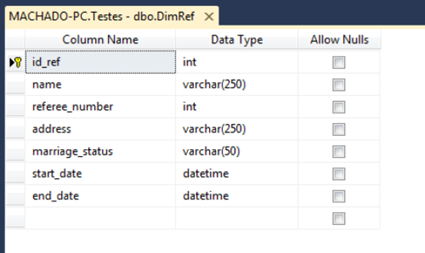

图 71: SCD2 目标表

现在两个列都已创建，让我们转到集成服务。第一个任务是将 SCD 组件添加到维度的数据流中。下图显示了它应该是什么样子。我们的示例包将非常简单:只是一个从源中读取引用数据的源组件，用 SCD 组件生成的流，以及一个将我们的数据发送到维度的目标组件。

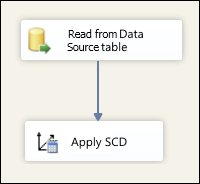

图 72:向数据流添加 SCD 组件

根据源表和目标表中的属性类型，可能需要也可能不需要中间步骤，该步骤是转换数据类型。如果您检测到您的属性类型不匹配，请将转换组件添加到数据流中，以便在 SCD 组件之前执行。您的数据流现在应该如下图所示。

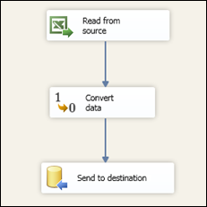

图 73: SCD 组件数据流—添加转换组件

要开始配置 SCD 组件，请双击它以打开一个向导，该向导将帮助您配置 SCD。在初始屏幕上，点击**下一步**。

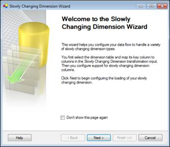

图 74: SCD 向导

这个屏幕非常重要。这是您定义源和目标属性与业务键之间的映射的地方，业务键将用于在源表中查找记录。如您所见，您需要为维度和要在 SCD 维度中转换的表定义连接管理器。

对于我们的示例，让我们如下图所示映射所有属性，并选择 id _ reference(reference 表的主键)作为我们的业务键。该业务密钥是一个密钥，它作为我们维度中记录的主键，并标识操作系统中的记录。它也通常被称为自然键。开始和结束日期将保持空白，因为它们将在以后配置。

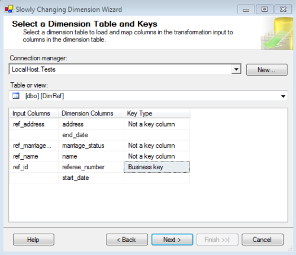

图 75:配置业务密钥

点击**下一步**将带我们进入 SCD 向导中最重要的画面。在此屏幕中，您可以为第一个屏幕中映射的每个属性定义 SCD 的类型。有三个可用选项:

*   固定属性(SCD0)
*   更改属性(SCD1)
*   历史属性(SCD2)

正如我之前解释的，SSIS 组件不支持 SCD3。在这个例子中，我将使用所有的类型。在设置了一个裁判的名字后，我不打算用它做其他事情，因为我假设名字不会改变，所以我把它做成一个固定属性(SCD0)。但是，当一个裁判的婚姻状况发生变化时，我想将其值覆盖为新值，所以我将其设置为一个变化属性(SCD1)。当裁判地址发生变化时，我想保存旧值，所以需要是历史属性(SCD2)。

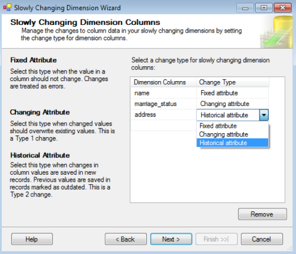

图 76:配置 SCD 属性的变更类型

下一个屏幕允许您选择当固定属性值更改时 SSIS 应该做什么，以及如果类型 SCD1 值更改，您是否想要更新 SCD2 历史记录。在第一种情况下，如果定义的 SCD0 属性改变了它的值并且检测到了改变，您可以告诉 SSIS 引发一个错误。在第二种情况下，如果 SCD 属性更改了它的值，您需要定义是只在最近的记录中覆盖它的值，还是在所有记录(历史记录)中覆盖它的值。

只有当维度中有一个 SCD2 属性时，最后一种情况才有意义。在我们的例子中，如果裁判的名字改变了，如果我们可能误解了业务，或者如果它可能需要调整，让我们提出一个错误。在第二个复选框中，我们将其留空，因为我们只想更新活动记录。


图 77:在非变化属性中检测到变化时配置行为

下一个屏幕是您定义是否使用状态列来指示当前(最近/活动/活动)记录，或者如果您愿意，使用时间间隔。我更喜欢使用日期，因为它们让我知道记录存在于哪个时期。这一次，让我们使用 start_date 和 end_date 属性作为当前记录的标志。我们还需要指出我们将使用哪种类型的变量来填充日期。为此，我们有三种选择:

*   容器开始时间—包所在的容器的开始时间。
*   creation date—包的创建日期。
*   开始日期—包执行的开始日期。

我更喜欢最后一个选项，因为它最接近包中的 SCD 流，反映了最近的日期。然而，对于这个例子，我使用了 CreationDate。选择变量后，点击**下一步**。

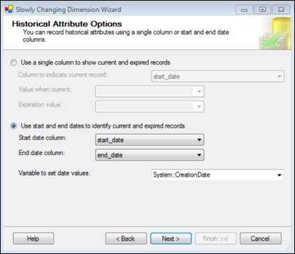

图 78:配置如何识别当前和过期记录

这个屏幕很精致。与使用 SSIS 和 SQL Server 的数据仓库相关的一个有趣的概念是推断成员；这是事实表引用的维度记录。但是，记录尚未加载到维度。这意味着特定记录可以在不存在的情况下被引用。

如果出于某种原因，您需要在还没有维度记录数据的情况下加载事实，可能会出现这种情况。因此，您在维度中创建了一个空白/null 记录，它没有任何数据，只有它的主键。下一个屏幕允许您告诉 SSIS 当推断成员的数据到达时该做什么。您可以更新记录或创建新记录。如果激活推断成员支持，您有两个选项:

*   所有更改类型的列都为空。这意味着，对于配置了 SCD 类型的推断成员记录中的每一列，SSIS 都会将其值设置为空。
*   使用布尔列来指示当前记录是否为推断成员。在这种情况下，SSIS 将使用您创建的列来标记当前记录是否是推断成员。

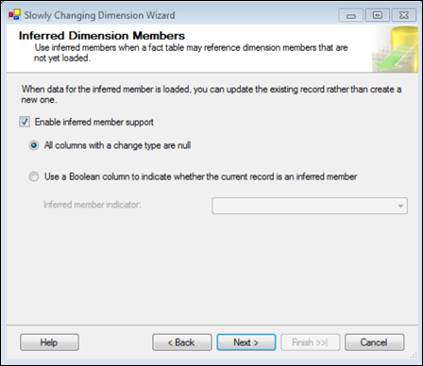

图 79:配置推断成员

配置好推理成员后，点击**下一步**，就完成了。SSIS 现在将自动为您创建流程，如下图所示，这代表了通过转换和组件配置节省的大量时间。但是，如果有进一步的转换(如数据类型转换)，您仍然需要执行它们。例如，在我们的例子中，我们仍然需要在运行包之前转换一些数据类型。

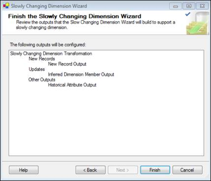

图 80:完成配置

一旦添加了转换组件以确保数据类型的一致性，您的数据流应该如下图所示。

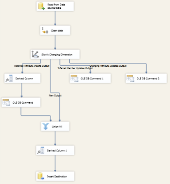

图 81:带有 SCD 组件的最终数据流

一切都结束了！您的维度“维度裁判”包现在将执行 SCD 评估，并根据 SCD 组件中指定的规则进行解决。现在，您可以运行该包并自己测试它。

## 变更数据捕获

### 简介

除了缓慢变化的维度(SCD)，变更数据捕获(CDC)是处理变更的最重要机制之一。虽然 SCDs 定义了您希望如何处理维度属性中的更改，但 CDC 允许您检测自上次提取过程以来操作系统中的更改，并且仅检索更改的数据。我所说的更改数据是指从操作源中更新、插入和删除。

可以想象，在使用集成服务或任何其他提供者的 ETL 操作中，从操作源提取数据是非常重要的。这是因为您不想在运行包时再次处理所有数据；您只想处理已更改的记录(插入、更新和删除)。如果您计划每天凌晨 2:00 执行 ETL 过程来处理一个四年的操作系统数据库，那么您就不想处理这四年的所有数据。你只是想处理从前一天晚上开始改变的记录。这样，您的 ETL 过程将会更快、更高效。

这个机制是在 SQL Server 2008 中引入的，从那以后，微软对它进行了许多改进。SSIS 2012 包含的新疾控中心组件就是证明。这不是唯一可用的选项；然而，它可能是最有效的。我会解释原因。

随着时间的推移，数据库开发人员已经创建了解决这个问题的机制。其中一些机制非常聪明；然而，它们带来了特殊的问题。为了理解这些问题，让我们看看在特定时间窗口内捕获已更改数据的所有可用选项。在这里，我解释最常用的替代方案:

*   审计列:这种技术要求您将日期时间列添加到每个要监视操作系统变化的表中。通过向您更改的表中添加开始日期和结束日期，您可以在每次记录更改时更改它们，然后只提取结束日期为空或高于上一轮 ETL 的记录。这项技术还要求您在源表或外部应用程序中创建触发器，以便使用数据源表结构中的最新更新更改来更新审核列。

*   触发器:这项技术要求您将触发器添加到要监视的每个源表中。每次发生插入或删除时，触发器都会将更改的记录业务密钥存储到日志表中。然后，您的 ETL 过程将只处理日志表中的记录。

现在又出现了 CDC 技术，解决了前面提到的问题。尽管您仍然需要在要跟踪更改的每个表中启用 CDC，但这不会影响表的模式。因此，与审计列或触发器相比，对操作系统的数据库模式的影响较小。

这项技术的另一个有趣的方面是它异步运行。我的意思是，从 SQL Server 日志中读取以检测更改的作业将仅在系统空闲时运行，从而消除进程的开销(与同步运行的触发器和审核列相比)。

SQL Server CDC 机制与集成服务 CDC 组件协同工作的方式也是一个巨大的好处，因为您能够将更改的记录提取到包控制流中，并且还知道该记录中发生了什么类型的操作。这样，您可以对插入、更新或删除的记录进行单独的开发。

最后但同样重要的是疾控中心应用编程接口的可用性。很容易将这种机制激活为一个 SQL Server 表，然后在 SSIS 包中处理它。这样做所需的步骤将在一个简短的演示中显示，以便您可以开始使用它来优化 ETL 项目中的提取阶段。

使用此疾控中心应用编程接口要求您执行以下步骤，以便开始仅处理 SSIS 包中已更改的记录:

1.  在数据库中启用疾控中心。

*   这将创建一个新的数据库模式( *cdc* )来记录管理该机制所需的信息。

1.  在疾控中心的服务器上启用 SQL 代理。

*   这将启用分析日志并将更改写入 CDC 表的作业(这些是记录更改的表，也称为影子表)。这个新表具有与源相同的模式，外加一些额外的列。

1.  在我们要监控其变化的表中启用疾控中心。

*   这将为您正在监视的特定表创建实例表。跟踪更改的 SQL 代理作业将更改的记录写入这些表中。然后，您的 ETL 过程将从这些表中读取数据，以便它只处理已更改的记录。默认情况下，有一个内部机制会在三天后清除其中的所有数据，但是您可以更改此限制。但是，在处理完数据之后，ETL 过程应该清理表，这样就不会再处理它们了。

1.  在 SSIS 处理更改的数据，并使用 SSIS 疾控中心的组件使其更容易。

*   有两个主要组件:

在您的 SSIS 软件包中，处理数据涉及以下算法:

1.  Check the CDC state.

    如果需要重新处理:

    1.  使用疾控中心源查询数据。
    2.  将数据发送到适当的路径(插入、删除或更新)。
    3.  在每个路径中根据您的需求处理数据。

如果数据更新了，什么都不要做。

就这样！通过遵循这些步骤，您能够创建和维护一个基于 CDC 的 ETL 解决方案。现在是时候向您展示这些步骤是如何完成的，您应该在 SQL Server 中运行哪些查询，以及在 SSIS 2012 中需要进行哪些开发。

## 演示:在 ETL 项目中使用 CDC

**场景**:我们将监控一张与足球比赛相关的桌子。每当插入、删除或更新新记录时，我们都希望跟踪该更改，并在日常的 ETL 过程中对其进行处理。数据将以我们的商业智能数据仓库为目的地，在这种特殊情况下，我们将重点更新与推荐人相关的维度(商业智能数据仓库架构中的分析视角)。

### 在数据库上启用疾控中心

让我们从打开 SQL Server 管理工具来运行一些查询开始，或者，如果您愿意，使用包中的执行测试任务来执行它们。虽然我喜欢集成服务，但第一个选项似乎不那么令人讨厌。

第一步是运行下面的 SQL 查询。在您的情况下，您只需要更改数据库名称。sp_cdc_enable_db 是 SQL Server 用来在当前数据库中启用 cdc 的存储过程。

```
    USE STG_FOOT_STAT; -- DATABASE_NAME
    GO
    --Enable CDC on the database
    EXEC sys.sp_cdc_enable_db;
    GO

```

运行前一个命令后，SQL Server 将创建一个特殊的模式 cdc，它将用于存储管理该机制所需的所有对象。在这些对象中，您将能够找到所有的影子表。您现在可以检查该特定数据库的疾控中心是否已正确启用。为此，您可以运行以下 SQL 查询，该查询将检索当前数据库的 is_cdc_enabled 属性的名称和值。

```
    USE STG_FOOT_STAT; -- DATABASE_NAME
    GO
    --Check if CDC is enabled on the database
    SELECT name, is_cdc_enabled
    FROM sys.databases WHERE database_id = DB_ID();

```

运行上一个查询将产生以下结果，其中 is_cdc_enabled 属性是两种可能性之一:

*   0—未启用
*   1—已启用


图 82:检查疾控中心是否启用的结果

### 启用疾控中心服务器中的 SQL 代理

下一个重要步骤是检查 SQL Server 代理是否正在您想要使用 CDC 的服务器上运行。这很重要，因为 CDC 使用 SQL 作业来爬网更改日志，以便写入影子表。

这意味着，如果代理没有运行，您将无法自动捕获更改。这项工作有趣的一点是，你可以安排它的执行周期(每天、每小时等)。).您有两个选项来激活 SQL Server 代理:使用 SQL Server 配置管理器或使用 SQL Server 管理工具。

让我们从第一个选项开始。打开 SQL Server 配置管理器，在左侧的浏览器中，选择 **SQL Server 服务**。当您这样做时，您将在右窗格中看到所有服务器的服务，这些服务指示它们是否正在运行。确定要激活的服务器的 SQL Server 代理，在我的例子中是 MSSQLSERVER 实例。右键点击并选择**启动**如果它还没有运行。如果一切正常，那么您应该看到代理正在运行。


图 83:在配置管理器中激活 SQL 代理

另一种选择是使用 SQL Server 管理工具。使用这个选项也很简单。连接到要在其中激活代理的 SQL Server 实例，然后在对象资源管理器中找到 SQL Server 代理。要启动它，只需右击它并选择**启动**。就这样！图标中的小状态指示器现在应该是绿色的。

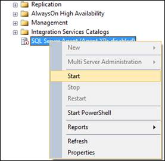

图 84:使用 SQL 服务器管理工具启动 SQL 代理

### 在我们要监控的表中启用疾控中心进行更改

现在是时候向您展示如何开始监控表的变化了。正如我已经解释过的，这将在 cdc 模式中用所有的源表列以及一些特殊的 CDC 列创建影子表。

该机制将在一个非常简单的算法中工作。当应用于该表的每个数据操作语言(DML)操作的记录被写入事务日志时，CDC 进程从日志中检索该信息，并将其写入这些影子表，这些影子表通过使用一组函数来访问。

要在表中启用它，您需要运行存储过程``sys`。`sp_cdc_enable_table`` 带有一些特殊参数如下面的代码示例所示。

```
    USE STG_FOOT_STAT;
    GO
    --Enable CDC on a specific table
    EXECUTE sys.sp_cdc_enable_table
    @source_schema = N'dbo'
    ,@source_name = N'STG_FOOT_STAT_TB'
    ,@role_name = N'cdc_Admin'
    ,@capture_instance = N'STG_FOOT_STAT_TB'
    ,@supports_net_changes = 0;

```

正如您在存储过程中看到的，我使用了五个参数。然而，还有一些可以帮助你使疾病预防控制中心符合你的要求。您需要理解所有这些，才能正确执行它。每一个的定义如下。

```
    sys.sp_cdc_enable_table
      [ @source_schema = ] 'source_schema',
      [ @source_name = ] 'source_name' ,
      [ @role_name = ] 'role_name'
      [,[ @capture_instance = ] 'capture_instance' ]
      [,[ @supports_net_changes = ] supports_net_changes ]
      [,[ @index_name = ] 'index_name' ]
      [,[ @captured_column_list = ] 'captured_column_list' ]
      [,[ @filegroup_name = ] 'filegroup_name' ]
      [,[ @allow_partition_switch = ] 'allow_partition_switch' ]

```

下表给出了您可以在``sys`中使用的参数的简短定义。`sp_cdc_enable_table`` 存储过程。

表 10:在表参数中启用 CDC

| 参数 | 定义 |
| --- | --- |
| @source_schema | 源表所属的架构的名称。 |
| @source_name | 在其中启用变更数据捕获的源表的名称。 |
| @角色名 | 用于控制对已更改数据的访问的数据库角色的名称。 |
| @capture_instance | 用于命名特定于实例的已更改数据捕获对象的捕获实例的名称。如果未指定，该名称将从源架构名称加上格式为 schema name _ source name . capture _ instance 的源表名称派生而来。 |
| @supports_net_changes | supports_net_changes 选项使您能够仅检索行的最终图像，即使它在您指定的时间窗口内被多次更新。只有在源表中定义了主键时，才能激活此参数，否则会收到以下错误:`Msg 22939, Level 16, State 1, Procedure sp_cdc_enable_table_internal, Line 194``The parameter @supports_net_changes is set to 1, but the source table does not have a primary key defined and no alternate unique index has been specified.` |
| @索引名 | 用于唯一标识源表中行的唯一索引的名称。 |
| @捕获 _ 列 _ 列表 | 要包含在变更表中的源表列。captured_column_list 为 nvarchar(max)，可以为 NULL。如果为空，则所有列都包含在更改表中。 |
| @filegroup_name | 要用于为捕获实例创建的更改表的文件组。 |
| @允许分区开关 | 指示是否可以对启用了更改数据捕获的表执行 ALTER TABLE 的 SWITCH PARTITION 命令。它的默认值是 1 |

如果执行中的所有内容都定义正确，您将在 SQL Server 的输出窗口中看到以下消息。


图 85:为 STG_FOOT_STAT 表创建了作业

现在，您可以使用几个命令来评估疾控中心是否正确地为您的表工作。第一种选择是使用 SQL Server 的“表”系统表中的``is_tracked_by_cdc`` 属性。要使用它，请运行以下命令，正如您所看到的，该命令仅显示 CDC 是否正在运行。

```
    --Check CDC is enabled on the table
    SELECT [name], is_tracked_by_cdc FROM sys.tables
    WHERE [object_id] = OBJECT_ID(N'dbo.STG_FOOT_STAT_TB');

```

下图显示了执行前一个命令的结果，如果没有跟踪该表，则结果为 0，如果跟踪该表，则结果为 1。在这种情况下，在运行 enable 存储过程后，表将按预期方式被跟踪。


图 86:为该表启用了 CDC

另一个可以提供更多跟踪信息的选项是使用内置的 CDC 存储过程``sp_cdc_help_change_data_capture`` 。它将为您提供更多信息，包括跟踪哪些列、可用的捕获实例(每个表可以有两个)以及您可以探索的一些其他信息。要运行它，请使用以下代码。

```
    --Use the built-in CDC help procedure to get more information
    EXECUTE sys.sp_cdc_help_change_data_capture
    @source_schema = N'dbo',
    @source_name = N'STG_FOOT_STAT_TB';
    GO

```

如你所见，结果更有趣。


图 87:疾控中心关于表格跟踪的信息

通过跟踪源表，您现在可以直接从 SQL Server 中利用影子表，因为它允许您查询它们并查看已经发生的更改。疾控中心机制将用标准的“源表名”+“_CT”来创建和命名这些影子表，例如“我的表 _ CT”。这意味着通过知道源表名，您也知道影子表名。要查询它，可以使用简单的 SQL SELECT 语句，如下面的代码示例所示。

```
    SELECT * FROM cdc.STG_FOOT_STAT_TB_CT

```

因为您没有对源表进行任何更改，所以影子表也是空的。但是，您可以在这个阴影表中看到特殊的列。


图 88:查询影子表

这些列对于集成服务非常重要，因为它将使用它们来知道，例如，对记录执行了什么操作。让我们仔细看看它们。 **__$start_lsn** 和 **__$seqval** 列标识原始事务和操作发生的顺序。 **__$operation** 列显示了导致更改的源操作(1 =删除，2 =插入，3 =更新(图像前)，4 =更新(图像后)，5 =合并)。 **__$update_mask** 列包含一个位掩码，指示在更新期间哪些特定列发生了变化。

现在，让我们执行一个 DML 操作，然后再次检查这个影子表。在这种情况下，我将使用**更新**。

```
    USE STG_FOOT_STAT;
    GO
    UPDATE stg_foot_stat_tb
    SET HomeTeam = 'MANCHESTER UNITED'
    WHERE HomeTeam = 'Man United';

```

如果重新查询影子表，您将看到其中跟踪的更改。


图 89:影子表中跟踪的变化

### 在 SSIS 处理更改的数据，并使用 SSIS 疾控中心组件使其更容易

现在您已经了解了疾控中心，让我们回到集成服务并利用它。如前所述，这是需要理解的最重要的概念之一。否则，如果您不理解它，在处理大数据的 ETL 时，您的过程将非常低效，因此速度很慢。当然，这只有在您有定期的 ETL 过程时才有意义。如果只运行一次执行，比如数据迁移，CDC 就没有用了。

### 过程初始负荷

第一步是向包数据流中添加一个新的疾控中心控制任务。此任务将评估是否有要处理的记录，并在 CDC 状态变量中标记初始加载状态。之后，我们需要添加我们的控制流逻辑，并在结束集合中添加初始加载结束状态。

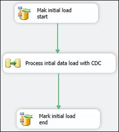

图 90:初始负载

我们现在将了解如何配置疾控中心控制任务。本章稍后将解释处理数据的数据流。

第一步是配置**标记初始加载开始**任务。因此，让我们双击它来打开它的配置选项。


图 91:配置初始负载启动疾控中心控制任务

在此窗口中，您需要进行几项配置:

*   **SQL Server CDC 数据库 ADO.NET 连接管理器**:从列表中选择一个现有的连接管理器，或者点击**新建**新建一个连接。该连接必须连接到为疾控中心启用的、所选变更表所在的 SQL Server 数据库。
*   **疾控中心控制操作**:选择该任务要运行的操作。所有操作都使用存储在 SSIS 包变量中的状态变量(存储状态并在包中的不同组件之间传递)。
*   **包含 CDC 状态的变量**:选择存储任务操作状态信息的 SSIS 包变量。
*   **自动将状态存储在数据库表中**:对于疾控中心控制任务，选中此复选框可自动处理加载疾控中心状态并将其存储在状态表中，该状态表包含在存储该状态的数据库的指定数据库连接管理器中。
*   **存储状态的数据库的连接管理器**:这个连接到一个包含状态表的 SQL Server 数据库。
*   **用于存储状态的表**:这是将存储 CDC 状态的 SQL 表。您不需要处理它，因为它是疾控中心机制使用的内部表。
*   **状态名称**:用于存储疾控中心状态的状态表名称。您可以使用**新建**按钮创建一个新的。


图 92:操作类型

如前图所示，疾控中心控制任务有几个控制操作选项:

*   **标记初始加载起点**—该选项记录第一个加载起点。当在没有快照的情况下从活动数据库执行初始加载时，将使用此操作。在初始加载包开始读取源表之前，它在初始加载包开始时被调用，以记录源数据库中的当前日志序列号(LSN)。这需要连接到源数据库。
*   **标记初始载荷终点**-该选项记录第一个载荷终点。当在没有快照的情况下从活动数据库执行初始加载时，将使用此操作。它在初始加载包结束时被调用，以便在初始加载包读取完源表后，在源数据库中记录当前的 LSN。该 LSN 是通过记录该操作发生的时间，然后查询疾控中心数据库中的`cdc.lsn_time_mapping`表，寻找该时间之后发生的变化来确定的。
*   **标记疾控中心开始**—该选项记录疾控中心范围的开始。当从快照数据库或静止数据库进行初始加载时，将使用此操作。它在初始加载包中的任何点被调用。该操作接受一个参数，该参数可以是快照 LSN、快照数据库的名称(快照 LSN 将从该名称自动导出)，也可以留空，在这种情况下，当前数据库 LSN 将用作变更处理包的起始 LSN。关于此操作的一个重要注意事项是，它可以用来代替标记初始加载开始和标记初始加载结束操作。
*   **获取处理范围**-该选项检索疾控中心值的范围。在调用使用疾控中心源数据流的数据流之前，此操作在变更处理包中使用。它建立了疾病控制中心源数据流在被调用时读取的一系列 lsn。该范围存储在一个 SSIS 包变量中，该变量由疾控中心源在数据流处理过程中使用。
*   **标记处理范围**—该选项记录处理值的范围。此操作用于疾控中心运行结束时的变更处理包中(在疾控中心数据流成功完成后)，以记录在疾控中心运行中完全处理的最后一个 LSN。下一次执行 GetProcessingRange 时，该位置决定下一个处理范围的开始。

保存并关闭此任务编辑器。打开**标记初始加载结束**任务，告知疾控机构该初始加载已经结束。如果你没有标记这个结束状态，而你试图处理下一个范围的数据，SSIS 会给你一个错误。此任务的配置仅在操作类型上与前一个不同。

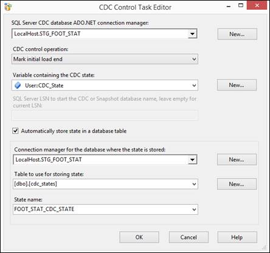

图 93:配置标记初始负载结束疾控中心控制任务

要处理增量更新，您只需要开发新的包或重用当前的包，并更改它们的操作类型，如下所示:

*   标记初始加载开始>获取处理范围
*   标记初始加载结束>标记处理范围

### 创建疾控中心数据流

在开发了控制流之后，我们需要开发处理变更数据的数据流。为此，首先打开数据流，然后将新的 CDC 源对象拖放到其中。


图 94:疾病预防控制中心来源

下一步是配置这个疾控中心源。此配置包括设置以下属性:

*   **ADO.NET 连接管理器**:连接必须连接到为疾控中心启用的并且所选变更表所在的 SQL Server 数据库。
*   **启用疾控中心的表**:选择疾控中心源表，该表包含您想要读取并馈送到下游 SSIS 组件进行处理的捕获更改。
*   **捕获实例**:选择或输入需要读取疾控中心表的疾控中心捕获实例的名称。一个捕获的源表可以有一个或两个捕获的实例，通过模式更改来处理表定义的无缝转换。如果为正在捕获的源表定义了多个捕获实例，请在此选择要使用的捕获实例。
*   **CDC 处理模式**:选择最能处理你的处理需求的处理模式。
*   **包含 CDC 状态的变量**:选择维护当前 CDC 上下文的 CDC 状态的 SSIS 字符串包变量。

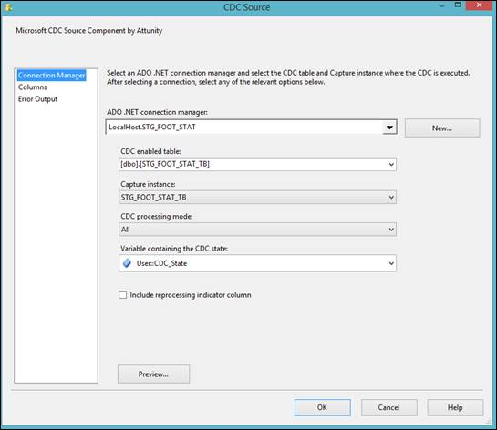

图 95:配置疾控中心源

通过选择此 CDC 源对象中的**列**选项卡，您可以看到正在添加到数据流中的列。

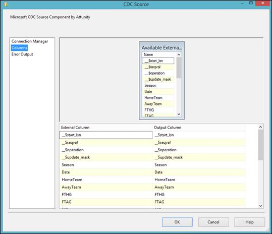

图 96:疾病预防控制中心来源栏

下一步是添加一个 CDC 拆分器，它将根据记录的更改操作类型(插入、更新或删除)创建三个不同的路径。在这个对象中，您不需要进行任何配置。只需将 CDC 源连接到这个对象，数据流引擎就会为您解析它。

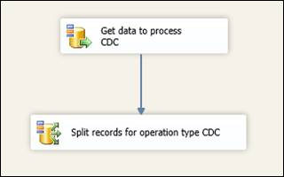

图 97:疾控中心分离器

现在，您可以通过使用正确的路径并在将疾控中心拆分器连接到另一个对象时更改其输出来制作所需的逻辑。


图 98:配置输出

在这个例子中，我使用了一个 **Union All** 对象，只是为了能够通过数据查看器查看数据。你可以随心所欲地发展。


图 99:发展你的逻辑

就这样！通过使用这些组件，您只能处理通过源系统传来的已更改记录。下图显示了我的最终结果。

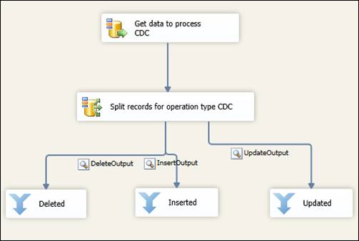

图 100:最终数据流

如果运行此数据流，结果将显示在我们配置的数据查看器中。

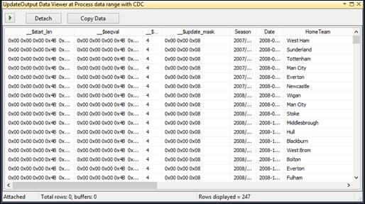

图 101:数据流结果