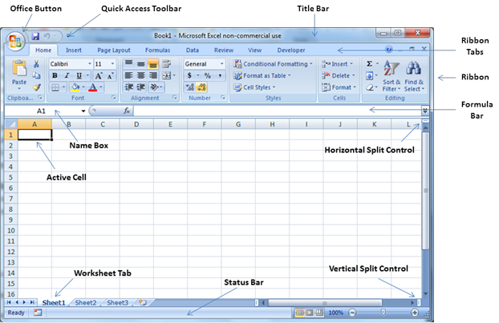
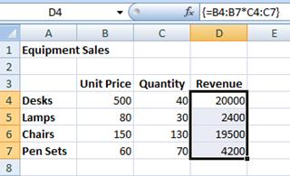
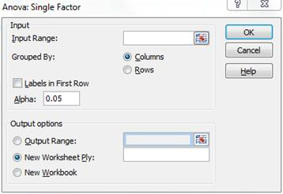

# 第二章 Excel 环境

## 基础

在很大程度上，我们将假设读者已经熟悉了 Excel。我们这里没有空间提供对 Excel 的回顾。相反，我们将涉及一些不常用但对在 Excel 中进行统计分析至关重要的功能。我们将重点介绍在 Windows 环境下的最新版本的 Excel，即 Excel 2007、2010 和 2013—尽管所写的大部分内容也将适用于 Windows 环境下的早期版本的 Excel 以及 Macintosh 环境下的 Excel(尤其是 Excel 2011)。

## 用户界面

Excel 处理名为**工作簿**的文件。每个工作簿包含一个或多个名为**工作表**的电子表格。每个工作表都由组织成矩形网格的**单元格**组成。工作表的行标有数字，列标有字母或一系列字母。第一行标记为 1，下一行标记为 2，依此类推。第一列标为 A，下一列标为 B，依此类推。Z 后面的列标为 AA，然后下一列标为 AB、AC，依此类推。AZ 后面的列是 BA，然后下一列标注 BB、BC 等等。ZZ 之后的列被标记为 AAA，然后下一列被标记为 AAB、AAC 等等。

Excel 2007/2010/2013 中的每个工作表最多可包含 1，048，578 行和 16，384 列(即从 A 列到 XFD 列)。每个单元格可以包含数字、文本、真值或公式。单元格既有**值**，又有**地址**(例如，地址为 B5 的单元格位于第五行第二列)。

单元格**区域**由工作表上矩形区域中的所有单元格组成(例如，区域 B6:C10 由矩形中的 10 个单元格组成，其对角是单元格 B6 和 C10。公式=SUM(B6:C10)的值是 B6:C10 范围内所有单元格的值之和。公式可以使用**绝对寻址**、**相对寻址**或两者的组合。

矩形网格只是 Excel 用户界面的一部分。整个用户界面如图 1 所示:

图 1: Excel 用户界面

这是 Excel 2007 中使用的布局。Excel 2010 和 Excel 2013 中使用的布局几乎相同。

**功能区选项卡**是顶级菜单项。在图 1 中，这些是**主页、插入、页面布局、公式**等。要访问 Excel 中的大多数功能，请单击这些功能区选项卡之一。对于每个选项卡，将显示不同的功能区。

每个**功能区**由一组 Excel 功能组成，这些功能被组织成与某个功能区选项卡相对应的**组**。例如，**首页**功能区(如图 1 所示)组织成**剪贴板、字体、对齐、编号**等。团体。每组由一个或多个**图标**组成，对应于 Excel 中的一些功能。例如，要将工作表中某个单元格的内容居中，请单击该单元格，然后在主页功能区的对齐组中单击居中图标。

我们对这一系列步骤使用以下缩写:**首页>校准|中心**。有些图标也有快捷方式(例如，要将单元格内容居中，可以单击该单元格，然后输入 **Ctrl+E** )。

## 阵列公式

Excel 中使用的大多数工作表公式都返回一个分配给包含该公式的单元格的值。Excel 还允许您定义一个公式，该公式同时为一系列单元格赋值。这些被称为**数组公式**，它们将在本书的其余部分中经常使用。

**示例**:计算图 2 工作表中每个项目的收入:

图 2:数组公式

假设每个项目的收入是单价乘以数量，我们可以在单元格 D4 中输入公式=B4*C4，然后将该公式复制到单元格 D5、D6 和 D7 中(例如，通过单击单元格 D4，按 **Ctrl+C** ，突出显示范围 D5:D7，然后按 **Ctrl+V** ，或者突出显示范围 D4:D7，然后按 **Ctrl+D** )。

另一种方法是通过数组公式，使用以下步骤:

1.  突出显示 D4 系列:D7
2.  输入数组公式=B4:B7*C4:C7
3.  按**Ctrl+Shift+回车**

普通配方一定要按**Ctrl+Shift+回车**(第三步)，不能简单的**回车**。请注意，出现在公式栏中的公式是{=B4:B7*C4:C7}。花括号表示这是一个数组公式。如果范围 B4:B7 被命名为单价，C4:C7 被命名为数量，那么数组公式可以被输入为=单价*数量(第二步)。

数组公式出现在 D4:D7 范围内的所有四个单元格中。要对公式进行更改，您必须编辑整个范围，而不仅仅是这些单元格中的一个、两个或三个。同样，您不能复制或删除范围的一部分，而是必须复制或删除整个范围。如果您试图修改范围的一部分，您将收到一条错误消息。如果卡住了，看到一系列错误信息，只需要按 **Esc** 即可恢复。

您可以通过高亮显示整个范围并按**删除**来擦除包含数组公式的范围。您可以重写数组函数，用一个值或另一个公式替换它。重要的是使用整个范围，而不是范围的一部分。

请注意，您也可以使用数组公式，如{=SUM(B4:B7*C4:C7)}。这将返回价值，即四种设备的总收入。即使此公式返回单个值，因此可以放在单个单元格中，如 D8，但它必须作为数组公式输入(因为该公式包含嵌入的数组公式)。这意味着你需要键入=SUM(B4:B7*C4:C7)，然后按 **Ctrl+Shift+Enter** 。如果忘记按**Ctrl+Shift+回车**，只按**回车**，会出现错误信息。

## 阵列功能

Excel 的一些内置函数是数组函数，其中函数的输出是数组(即范围)。这些函数的管理方式与前面对数组公式的描述相同。

**示例**:将图 3 中 A、B 列的数据范围改为等效的行范围:

图 3:数组函数

这可以通过 Excel 的转置数组函数完成，使用以下步骤:

1.  突出显示输出范围 D3:I4
2.  输入数组公式=转置(A3:B8)
3.  按**Ctrl+Shift+回车**

请注意，输出范围(第一步)必须大小合适。在这种情况下，输入范围是六行两列，因此输出范围必须是两行六列。至于数组公式，公式栏包含用花括号括起来的数组公式。再次强调，按 **Ctrl+Shift+Enter** 很重要。

## 数据分析工具

Excel 提供了许多数据分析工具，可通过**数据>分析|数据分析**访问。

如果此选项不可见，您可能需要首先安装 Excel 的分析工具包。这是通过选择 Excel 2007 中的**办公按钮> Excel 选项>加载项**或 Excel 2010/2013 中的**文件>帮助|选项>加载项**，然后单击窗口底部的**转到**来完成的。接下来，在出现的对话框中选择**分析工具箱**选项，点击**确定**。然后，您将能够访问数据分析工具。

选择**数据>分析|数据分析**后，会出现如图 4 所示的对话框:

图 4:数据分析对话框

现在，您可以选择以下任何一个对统计分析有用的选项:

*   单因素方差分析
*   方差分析:重复的双因素
*   方差分析:无重复的双因素
*   相互关系
*   协方差
*   描述统计学
*   指数平滑法
*   f 检验:方差的两个样本
*   柱状图
*   随机数生成
*   等级和百分位数
*   回归
*   抽样
*   t 检验:两个样本配对的平均值
*   t 检验:假设方差相等的双样本
*   t 检验:假设方差不相等的双样本
*   z 检验:均值的双样本

这些选项中的每一个都代表了将在本书中描述的数据分析工具。现在假设，例如，你选择**方差分析:单因素**。现在，您将看到如图 5 所示的对话框:

图 5:方差分析对话框:单因素

输入范围由存储要分析的数据元素的 Excel 范围组成。例如，假设该数据由一个 4×8 的数组组成，该数组表示四种待遇，如图 6 所示:

图 6:样本输入范围

在这种情况下，您可以在(图 5 对话框的)**输入范围**字段中插入范围 B2:E9，并选择**列**。如果您已经为范围 B2:E9 指定了一个名称(例如，研究 1)，那么您可以将此名称放在**输入范围**字段中，而不是 B2:E9。

或者，您可以在**输入范围**字段中插入 B1:E9，并在对话框中选择第一行中的**标签复选框，以指示您已经将列标题包括在数据范围中。请注意，没有使用参与者编号(在 A 栏中)。**

如果数据排列在按行而不是按列列出治疗的位置，那么您可以选择**行**，并且您可以选择第一列中的**标签复选框。**

**Alpha** 值(将在本书后面描述)默认设置为 0.05，尽管您可以选择将其更改为 0.01 或其他值。

您现在可以从**输出**选项中选择**新工作表层**(并将数据字段留空)。在这种情况下，将创建一个新的工作表(在当前工作表之前的选项卡中)，并且方差分析报告将从单元格 A1 开始放置在该工作表中。然后，您可以将结果复制到当前工作表(或您喜欢的任何其他位置)。

或者，您可以选择**输出范围**或**新工作簿**，并将报告放入您选择的特定输出范围或新工作簿中。