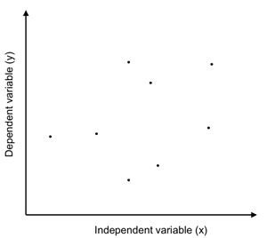
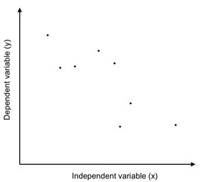
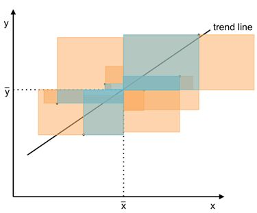
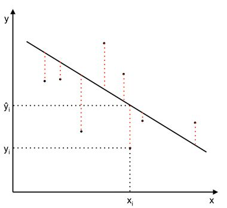

我们研究了确定两组或多组值是否显著不同或独立的测试。通过方差分析，您可以确定因变量在分类自变量的值之间是否有显著差异。

本电子书的剩余部分讲述了如何测试一个或多个独立变量和因变量之间的关联——换句话说，当一个独立变量改变 x，而所有其他变量保持不变时，如何预测因变量的变化量。这使我们能够外推——根据趋势预测未来——并根据另一个变量的值内插——估计一个变量的值。例如，鉴于世界人口在过去 10 年中的变化，我们对 2050 年世界人口的预期是什么(外推法)？或者，给定某个位置的房价和平方英尺之间的关系，我们可能期望 2000 平方英尺的房子的价格是多少(插值)？

我们通过找到一个符合数据趋势的模型来做到这一点，这个模型输入自变量的指定值，输出因变量的预测值。这个测试叫做**回归**，我们导出的模型就是**回归模型**。虽然有许多类型的回归模型(例如，逻辑回归、二次回归)，但我们将只讨论最简单的线性模型。

因为回归着眼于因变量的变化与自变量的变化，所以自变量和因变量都必须是数字。

#### 相互关系

当执行线性回归时，我们首先用散点图可视化数据趋势。(注意，我们只能用一个自变量来做这件事。)散点图显示 x 轴(水平轴)上的自变量值和 y 轴(垂直轴)上的因变量值。为此，我们将自变量称为“x”，因变量称为“y”，这种可视化可以快速告诉我们 x 和 y 之间的关系是强的(点形成更直的线)、弱的(点的变量更多)、正的(自变量的较大值与因变量的较大值相关联)还是负的(自变量的较大值与因变量的较小值相关联)。

 

图 41:左边的散点图显示了一种积极的、强有力的关系；右边的散点图显示了一种积极的、微弱的关系。

 

图 42:左边的散点图显示了一个负面的强关系；右边的散点图显示了一种消极的、微弱的关系。

我们可以用一个叫做**相关系数**的统计量来量化一个关系的强度和方向，这个统计量用 r 来表示，r 的符号表示方向，距离 r 从 0 开始表示关系的强度。

注意 r 的范围是-1 到 1，其中-1 是完美的负关系(即点形成一条直线)，1 是完美的正关系。当 r = 0 时，x 和 y 之间没有关系。

为了计算 r，我们首先找到 x 和 y 的**协方差**，通过从它们各自的平均值中找到每个 x 和 y 值的平均乘积，来测量 x 的变化与 y 的变化之间的关联。如果 x 和 y 之间没有关系，那么这些乘积有的是负的，有的是正的，它们会相互抵消，导致协方差更接近于 0。


从这个方程可以看出，x 和 y 的正关系意味着的大部分点都在的左下方和右上方，所以和通常要么都是正的，要么都是负的。这将导致产品大部分为正(因此总和也将为正)。同样，x 和 y 之间的负关系意味着大多数坐标位于的左上和右下，导致负协方差。

为了找到 r，我们用 x 的标准偏差和 y 的标准偏差的乘积除以协方差。


|  | 注意:因为标准差总是正的，协方差决定了 r 是正的还是负的，因此是负责描述方向的统计量。 |

产品(s <sub class="calibre24">x</sub> )(s <sub class="calibre24">y</sub> )将始终大于或等于覆盖 <sub class="calibre24">x，y</sub> 。如果把每一个形象化，可以看到(s <sub class="calibre24">x</sub> )(s <sub class="calibre24">y</sub> )是正方形的乘积，面积最大化，覆盖 <sub class="calibre24">x，y</sub> 是矩形的乘积。



图 43:协方差是平均蓝色矩形的面积，而(s <sub class="calibre24">x</sub> )(s <sub class="calibre24">y</sub> )是橙色方块的标准长度乘以橙色方块的标准高度(其中“标准”是平均橙色方块面积的平方根)。

当 r 等于 1 或-1 时，协方差等于标准差的乘积(r = 1)或标准差的负乘积(r = -1)。

和前几章一样，当我们计算相关性时，我们想要做一个显著性的假设检验。这个测试帮助我们决定——基于我们对 r 的计算——群体的真实相关性(表示为 r)是否与 0 显著不同。

H0: r = 0
哈:r 0(双尾检验)

同样，这是一种 t 检验。我们将不讨论如何计算 t 统计量；重要的是你理解原则，能够解读结果。

让我们根据 NCES 的数据在 R 中做一个 2011 年 SES 和收入的相关性测试。

代码清单 17

```
  >  plot(ses, income2011)  #creates
  a scatter plot with “ses” on the x-axis and “income2011” on the y-axis

  >  cor.test(ses, income2011) 

      Pearson's product-moment correlation

data:  ses and income2011

t = 13.4525, df = 8245, p-value < 2.2e-16

alternative hypothesis: true correlation is not
  equal to 0

95 percent confidence interval:

 0.1253655 0.1676048

sample estimates:

      cor 

0.1465519

```

从这个测试中可以看出，虽然 r 很小(0.15)，但结果是显著的，这意味着我们非常确定 r 与 0 有显著差异。还要注意，R 给出了 R 的 95%置信区间，整个区间都是正的。

#### 最佳匹配线

在确定自变量和因变量之间确实存在关系后，下一步是预测当一个或多个自变量改变一定量时，因变量将改变多少。我们使用**回归线**或**最佳拟合线**来实现这一点，之所以如此命名是因为它最小化了平方之和**残差**(每个观察到的 y 值( *y <sub class="calibre24">i</sub>* )与相应观察到的 x 值( *x <sub class="calibre24">i</sub>* )的预测值( *ŷ <sub class="calibre24">i</sub>* )之间的距离)。残差平方和等于∑(*y<sub class="calibre24">I</sub>*-*ŷ<sub class="calibre24">I</sub>*)<sup class="calibre57">2</sup>。我们先来过**简单线性回归**，只涉及一个自变量。



图 44:红色虚线显示了上升点(y <sub class="calibre24">i</sub> - ŷ <sub class="calibre24">i</sub> )。每个点可视化观察值(x <sub class="calibre24">i</sub> ，y <sub class="calibre24">i</sub> ，最佳拟合线显示任何 x 值的 y (ŷ)预测值。该线最小化残差平方和。

回归线的一般方程为ŷ<sub class="calibre24">I</sub>= b<sub class="calibre24">0</sub>+b<sub class="calibre24">1</sub>x<sub class="calibre24">I</sub>，其中 b <sub class="calibre24">0</sub> 和 b <sub class="calibre24">1</sub> 称为回归系数。系数 b <sub class="calibre24">0</sub> 为 x = 0 时 y 的预测值；系数 b <sub class="calibre24">1</sub> 是当 x 变化一个单位时，y 预计变化的量。

我们可以利用微积分最小化∑(*y<sub class="calibre24">I</sub>-ŷ<sub class="calibre24">I</sub>*)<sup class="calibre57">2</sup>、设置 *ŷ <sub class="calibre24">i</sub>* 等于 *b <sub class="calibre24">0</sub> + b <sub class="calibre24">1</sub> 来确定*b<sub class="calibre24">0</sub>T3】和*b<sub class="calibre24">1</sub>T7】的值***

**

因此，这是我们的线性回归方程:


我们不会费心手工计算这个；相反，我们将在 R 中进行。R 将执行另一个假设测试，以确定斜率 b <sub class="calibre24">1</sub> 是否明显不同于 0。换句话说，我们想知道 x 的变化是否确实与 y 的变化有关。

让我们首先执行线性回归分析，以 income2011 为因变量，仅 SES 为自变量。然后我们将进行多元回归分析，以预测多个独立变量的变化将如何导致 2011 年收入的变化。

代码清单 18

```
  > lm.income1 =  lm(income2011 ~ ses)  #assigns
  the name lm.income1 to the regression analysis
  >  summary(lm.income1)  #outputs
  the results of the regression analysis

Call:

lm(formula = income2011 ~ ses)

Residuals:

   Min     1Q Median     3Q    Max 

-35519 -16468  -2624  10514 230221 

Coefficients:

            Estimate Std. Error t value
  Pr(>|t|)    

(Intercept)  26693.0      271.1   98.48  
  <2e-16 ***

ses           4903.4      364.5   13.45  
  <2e-16 ***

---

Signif. codes:  0 ‘***’ 0.001 ‘**’ 0.01 ‘*’ 0.05
  ‘.’ 0.1 ‘ ’ 1

Residual standard error: 24270 on 8245 degrees
  of freedom

Multiple R-squared:  0.02148, Adjusted
  R-squared:  0.02136 

F-statistic:   181 on 1 and 8245 DF,  p-value:
  < 2.2e-16

```

该测试的结果显示，SES 的系数为 4，903.4，这意味着 SES 增加 1 与 2011 年工资增加 4，903.4 美元相关。这在α < 0.001 时非常显著，这意味着真实人口在 SES 和 2011 年收入之间可能具有相同的关联。

|  | 注意:由于 SES 的单位不包含太多的含义，所以分析平均值、标准差、范围和分布是有帮助的，这样我们就可以看到 SES 增加一个单位意味着什么。如果我们创建一个 SES 的直方图，我们可以看到增长近似正态分布，平均值为 0.12，标准差为 0.73。然后我们可以找到 1.12 的 z 分数(平均值加上 1 的 SES 增加值)，也就是 1.34。因此，一个单位的 SES 增长从平均水平移动到前 90%。 |

通过**多元回归**，我们有 n 个自变量，我们的一般模型是
ŷ= b<sub class="calibre24">0</sub>+b<sub class="calibre24">1</sub>x<sub class="calibre24">1</sub>+b<sub class="calibre24">2</sub>x<sub class="calibre24">2</sub>+…+b<sub class="calibre24">n</sub>x<sub class="calibre24">n</sub>。每个系数 b <sub class="calibre24">0</sub> …b <sub class="calibre24">n</sub> 告诉我们当对应的自变量变化一个单位时，y 预计会变化多少。我们的无效假设是，总体 B <sub class="calibre24">0</sub> 、B <sub class="calibre24">1</sub> 、… B <sub class="calibre24">n</sub> 的每个真实系数都等于 0(各自独立变量的变化与因变量的变化无关)，替代假设是该系数与 0 显著不同。

我们用 r 做一个例子，我们可以用 **cor.test()** 函数发现标准化考试成绩(“test”)与 2011 年收入有显著相关性(r = 0.17，p < 0.001)。也许我们想用考试成绩以及人口统计变量种族、性别和社会经济地位来预测 2011 年的收入。

代码清单 19

```
  > lm.income2 =  lm(income2011 ~ test + race + gender + ses)  #assigns the name lm.income2 to the regression analysis
  >  summary(lm.income2)  #outputs
  the results of the regression analysis

Call:

lm(formula = income2011 ~ test + race + gender +
  ses)

Residuals:

   Min     1Q Median     3Q    Max 

-42251 -15636  -2389  10599 237684 

Coefficients:

            Estimate Std. Error t value
  Pr(>|t|)    

(Intercept) 13357.78    1717.06   7.779 8.17e-15
  ***

test          332.02      31.26  10.621  <
  2e-16 ***

race         -285.83     141.05  -2.026   0.0427
  *  

gender      -6626.44     526.92 -12.576  <
  2e-16 ***

ses          2612.20     404.27   6.462 1.10e-10
  ***

---

Signif. codes:  0 ‘***’ 0.001 ‘**’ 0.01 ‘*’ 0.05
  ‘.’ 0.1 ‘ ’ 1

Residual standard error: 23860 on 8242 degrees
  of freedom

Multiple R-squared:  0.05444, Adjusted
  R-squared:  0.05399 

F-statistic: 118.6 on 4 and 8242 DF,  p-value:
  < 2.2e-16

```

该测试的结果显示所有系数都是显著的——p < 0.001 时为“测试”、“性别”和“ses ”, p < 0.05 时为“种族”。“测试”和“ses”与“income2011”之间的关联很容易解释，因为它们是数字和连续的——测试分数每增加一个单位，2011 年的工资就会增加 332.02 美元(其他一切不变)，SES 每增加一个单位，工资就会增加 2，612.20 美元。请注意，当我们执行简单线性回归时，SES 的系数是 4，903 美元。它现在变了，因为我们考虑了其他变量。

“种族”和“性别”的系数有点复杂，因为这些变量是绝对的。对于“种族”，我们主要关心符号(正的或负的)和参考值(“白色”，因为我们给它赋值为 0)。这意味着这一变量的任何增加(即从白人变为非白人)都与 2011 年收入的减少有关。

因为“男性”是变量“性别”的参考值(“男性”编码为 0，“女性”编码为 1)，从“男性”变为“女性”与 2011 年收入减少 6，626.44 美元有关。

请随意使用自变量测试其他多元回归，如标准化测试分数(“测试”)与变量(如学生是否参加体育运动、是否看电视、是否取得好成绩等)之间的关系。也许你会发现一些量化的证据，证明哪些行为会导致好成绩，这在说服一个顽抗的学生学习时可能会派上用场！