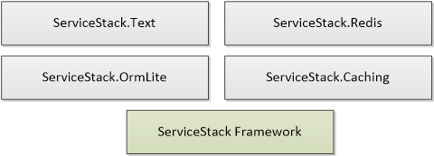

# 第 1 章服务堆栈概述

## 什么是 ServiceStack？

ServiceStack 是一个开源的微软。NET 和 Mono REST 网络服务框架，以及 WCF、ASP.NET MVC 和 ASP.NET 网络应用编程接口框架的替代。ServiceStack 特别适合 REST web 服务的开发。

服务堆栈的作者将其定义为:

*“深思熟虑的架构，令人作呕的快速，完全令人愉快的面向所有人的网络服务。”*

我同意。

简而言之，ServiceStack 支持以下功能:

*   REST 和 SOAP 端点。
*   自动配置数据格式，包括 XML、JSON、HTML、CSV 和 JSV。
*   作为输入和输出对象的普通旧 CLR 对象。
*   验证和聪明流畅的语法。
*   控制反转(IoC)容器。
*   对象关系映射。
*   缓存机制(支持 Memcached 和 Redis)。
*   日志框架。
*   独立—不需要外部库。

我们将在接下来的章节中了解这些特性中的大部分。

## 为什么要考虑使用 ServiceStack？

如果您对 ServiceStack 支持的功能列表还没有印象，下面的列表包含了一些您应该在下一个项目中使用 ServiceStack 的原因:

*   **极快**:基于[http://www.servicestack.net/benchmarks](http://www.servicestack.net/benchmarks)的基准测试，ServiceStack 在对象(去)序列化的真实速度方面表现出色。
*   **简单性**:与 WCF 或者 ASP.NET 的 Web API 相比，定义端点、托管、路由和配置更简单。
*   **Coherence** :它在不同风格的服务上遵循相同的理念，无论是 REST 还是 SOAP。
*   **干净配置**:没有 XML 配置文件，没有代码生成的代理。

## 服务堆栈组件

ServiceStack 由许多独立的模块组成(参见图 1)，这些模块可以在项目中单独使用，而无需使用 ServiceStack 框架本身。



图 1:服务堆栈组件

### 服务堆栈。文本

`ServiceStack.Text`是一个独立的、无依赖性的序列化库，由 ServiceStack 在内部使用，进行任何文本处理。`ServiceStack.Text`包含大量特征，其中一些最重要的特征是:

*   通过`JsonSerializer`进行 JSON 序列化和反序列化。
*   通过`TypeSerializer`进行 JSV 格式序列化和反序列化。
*   通过`CsvSerializer`进行 CSV 格式序列化和反序列化。
*   `StringExtensions`对于 XML、JSON、CSV 和 URL 编码，`BaseConvert`、Rot13、Hex 转义等。
*   支持的自定义生成。NET 3.5+，Mono，MonoTouch 和 MonoDroid，Silverlight 4 和 5，Xbox 和 Windows Phone 7。

如果您要在项目中使用`ServiceStack.Text`并需要 JSON 序列化程序，下面的代码示例显示了如何做到这一点。

```
     public static void  JsonSerializationExample()
    {
        var person = new {LastName = "Doe", Name = "John", Age = 36};

        var personJson = JsonSerializer.SerializeToString(person);

        Console.WriteLine(personJson);
    }
    // Output produced (JSON Format):
    // {"LastName":"Doe","Name":"John","Age":36}

```

#### TypeSerializer

`TypeSerializer`是. NET 可用的最快、最紧凑的文本序列化程序之一，在所有基准化的序列化程序中，它是唯一一个与 protobuf-net 非常快速实现的 Protocol Buffers 保持竞争力的，Protocol Buffers 是谷歌的高速二进制协议。[<sup>【2】</sup>](SS_0016.xhtml#_ftn2)

```
      public static void TypeSerializerExample()
    {
        var person = new { LastName = "Doe", Name = "John", Age = 36 };

        var personJsv = TypeSerializer.SerializeToString(person);

        Console.WriteLine(personJsv);
    }
    // Output produced (JSV Format):
    // {LastName:Doe,Name:John,Age:36}

```

`TypeSerializer`使用混合 CSV 和类似 JavaScript 的基于文本的格式，针对大小和速度进行了优化。作者称这种格式为 JSV，它是 JSON 和 CSV 的组合。

`TypeSerializer`的源代码可以在[https://github.com/ServiceStack/ServiceStack.Text](https://github.com/ServiceStack/ServiceStack.Text)下载，也可以使用 NuGet 用以下命令直接安装软件包:

```
    PM> Install-Package ServiceStack.Text

```

### 服务包。再说一遍

`ServiceStack.Redis`是 Redis([http://www . Redis . io](http://www.redis.io))内存数据库的开源客户端。`ServiceStack.Redis`大大简化了与 Redis 的接口，如前所述，它构建在 ServiceStack 上，但可以单独使用。

|  | 注意:Redis 是一个开源的，伯克利软件分发(BSD)许可的，先进的键值存储。它通常被称为数据结构服务器，因为关键字可以包含字符串、哈希、列表、集合和排序集合。为了获得出色的性能，Redis 使用内存中的数据集，该数据集可以偶尔保存到磁盘上，或者通过将每个命令附加到日志中来保存。 |

Redis 的源代码可以从[https://github.com/ServiceStack/ServiceStack.Redis](https://github.com/ServiceStack/ServiceStack.Redis)下载，也可以使用 NuGet 用以下命令直接安装包:

```
    PM> Install-Package ServiceStack.Redis

```

### 服务包。荷尔蒙！荷尔蒙

ServiceStack 包括自己的 ORM 库，它是一个基于约定、无配置的轻量级 ORM，使用标准的普通旧 CLR 对象(POCO)类和数据注释属性来推断其表模式。

`ServiceStack.OrmLite`目前支持几个关系型数据库:微软 SQL Server、MySQL、PostgreSQL、Oracle、Firebird、SQLite32、SQLite64、SQLite.Mono. `ServiceStack.OrmLite`兼容两个微软。NET 和 Mono。

`ServiceStack.OrmLite`的源代码可以从[https://github.com/ServiceStack/ServiceStack.OrmLite](https://github.com/ServiceStack/ServiceStack.OrmLite)下载。或者，可以通过使用 NuGet 和以下命令直接安装软件包。

Microsoft SQL Server 提供程序:

```
    PM> Install-Package ServiceStack.OrmLite.SqlServer

```

Oracle 提供程序:

```
    PM> Install-Package ServiceStack.OrmLite.Oracle

```

### ServiceStack。贮藏

ServiceStack 为多个不同的缓存提供者提供了 **ICacheClient** ，一个统一的缓存接口:

*   **内存中:**使用 RAM 作为缓存机制。
*   **Redis** :一个开源的，BSD 许可的，高级键值存储。
*   **Memcached**:Memcached 的接口，这是一个高性能、分布式内存、对象缓存系统，旨在通过减轻数据库负载来加速动态网络应用程序。
*   **Azure 客户端**:用于与微软 Azure AppFabric 缓存接口。
*   **AWS 缓存客户端**:用于与亚马逊 Web Services 上托管的亚马逊 DynamoDB 后端接口。
*   **磁盘**:硬盘上写。

## 服务堆栈理念

ServiceStack 受 Martin Fowler 的数据传输对象模式[<sup>【3】</sup>](SS_0016.xhtml#_ftn3)(DTO)的影响，促进**基于消息的通信**。这种模式简化了请求和响应数据的操作，并支持从域层实体中分离消息结构。


图 2:数据传输对象

公开 DTO，而不是应用程序域模型，可以在不破坏外部客户端的情况下自由重构服务的内部实现，并保持干净的接口。

根据定义，服务堆栈 web 服务至少具有以下内容:

表 2:基本的网络服务组件

| 班级 | 描述 |
| --- | --- |
| **请求 DTO 对象** | 服务方法的输入。它代表要执行的**动作**。通常类的名称包含一个**动词**(例如 **GetOrderRequest** ， **DeleteItem** )。 |
| **服务** | 实现内部逻辑并充当“控制器”。通常实现了以下部分或全部 HTTP 动词: **GET** 、 **POST** 、 **PUT** 、 **DELETE** 、 **PATCH** 、 **OPTIONS** 、 **HEAD** 或 **Any()** ，代表全部。 |
| **回应 DTO 对象** | 表示操作的结果。通常返回的数据应该用**名词**来命名(例如**电影响应**、**订单**、**产品响应**)。 |

## 请求和响应管道

服务堆栈建立在 ASP.NET`System.Web.IHttpHandler`接口之上。幸运的是，新的实现降低了复杂性(与 WCF 配置相比)，并且在框架本身的几乎每个方面都引入了 POCO 对象。

ServiceStack 实现了一个简单的工作框架，并支持基本功能的大量可扩展性。例如，您可以创建**请求和响应过滤器**，它可以是全局的或者只应用于一个服务，或者您可以扩展格式化程序。

下图显示了请求和响应管道。


图 3:请求和响应管道

## 作为应用状态引擎的超媒体(HATEOAS)

REST 服务要被认为是完整的，应该实现 HATEOAS[<sup>【4】</sup>](SS_0016.xhtml#_ftn4)约束。HATEOAS 的目标是客户端完全通过超媒体(即链接)与服务交互，超媒体由服务本身动态提供(在运行时)。在一个完美的世界里，客户不需要任何关于如何与服务交互的先验知识；它唯一需要知道的是如何跟随链接(或者，换句话说，理解超媒体本身)。

因此，这个原则使得客户端和应用程序松散耦合，这使得它与基于 SOAP 的服务非常不同，在基于 SOAP 的服务中，客户端和服务器之间的通信是通过一些固定的接口进行的。

当然，这本书不能涵盖完整的 HATEOAS 实现，但是正如我们将要看到的，我们将公开一些基本信息来启用超媒体约束。