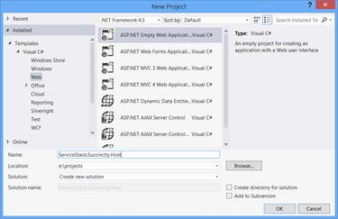

# 四、解决方案配置

终于到了开始编码的时候了。在本章中，我们将看到如何创建`ServiceStack.Succinctly.Host`项目并启用 ServiceStack 框架。

首先要做的是创建一个新的解决方案，并创建下表中指定的项目列表。

表 8:项目清单

| Visual Studio 项目名称 | Visual Studio 项目类型 |
| --- | --- |
| `ServiceStack.Succinctly.Host` | ASP.NET 空网页应用程序 |
| `ServiceStack.Succinctly.ServiceInterface` | Windows 类库 |
| `OrderManagement.Core` | Windows 类库 |
| `OrderManagement.DataAccessLayer` | Windows 类库 |

## 步骤 1:创建新的 ASP.NET 空 Web 应用程序

使用 Visual Studio 创建一个新的 ASP.NET 空 Web 应用程序项目，并将其称为`ServiceStack.Succinctly.Host`。



图 7:创建一个新的 ASP.NET 空 Web 应用程序项目

## 步骤 2:安装 ServiceStack 二进制文件并配置 web.config

为了运行我们的第一个 web 服务，我们需要添加 ServiceStack 作为项目引用。这可以手动完成，也可以使用 NuGet，在我看来这是最简单的方法。

通过在 Visual Studio 的包管理器控制台中运行以下命令，引用将自动添加到项目中:

```cs
    PM> Install-Package ServiceStack

```

默认情况下，将安装以下软件包:

*   ServiceStack
*   ServiceStack。普通的
*   ServiceStack。接口
*   保修服务包。荷尔蒙！荷尔蒙
*   保修服务包。ormulate . SQL server
*   保修服务包。再说一遍
*   保修服务包。服务接口
*   ServiceStack。文本

|  | 提示:如果您想将 ServiceStack 与现有的 ASP.NET 或 ASP.NET MVC 应用程序混合使用，有两个专门为帮助您自动安装 ServiceStack 而创建的包:

`PM> Install-Package ServiceStack.Host.Mvc
PM> Install-Package ServiceStack.Host.AspNet` |

将所需的二进制文件添加到项目中后，我们需要指示我们的应用程序使用 ServiceStack HTTP 处理程序，它将作为应用程序的入口点。这是通过将以下配置放入`web.config`文件来完成的。

```cs
    <configuration>
      <!-- Required for IIS 6.0 (and above) -->
      <system.web>
        <httpHandlers>
         <add path="*"
              type="ServiceStack.WebHost.Endpoints.ServiceStackHttpHandlerFactory, 
    ServiceStack"
              verb="*"/>
        </httpHandlers>
        <compilation debug="true"/>
      </system.web>

      <!-- Required for IIS 7.0 -->
      <system.webServer>
        <validation validateIntegratedModeConfiguration="false"/>
        <handlers>
         <add path="*"
              name="ServiceStack.Factory"
              type="ServiceStack.WebHost.Endpoints.ServiceStackHttpHandlerFactory, 
    ServiceStack"
              verb="*"
              preCondition="integratedMode"
              resourceType="Unspecified"
              allowPathInfo="true"/>
        </handlers>
      </system.webServer>
    </configuration>

```

## 步骤 3:创建应用程序主机

为了运行 ServiceStack web 服务，我们必须在 IIS 应用程序启动时启动应用程序主机。每个应用程序池只能有一个应用程序主机，因此不允许创建多个应用程序主机。以下代码表示最小`AppHostBase`实现。`Global`类指的是`Global.asax.cs`文件。

```cs
    public class Global : HttpApplication
    {
        public class  ServiceAppHost : AppHostBase
        {
            public ServiceAppHost()
                : base("Order Management", typeof(ServiceAppHost).Assembly)
            {
            }

            public override void Configure(Container container)
            {
            }
        }

        protected void Application_Start(object sender, EventArgs e)
        {
            new ServiceAppHost().Init();
        }
    }

```