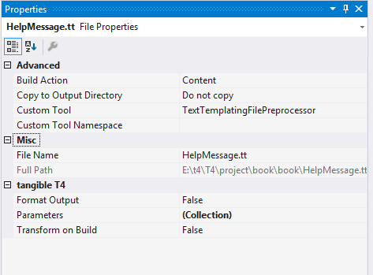
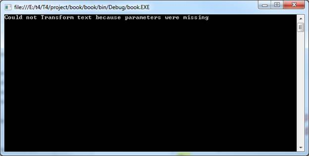
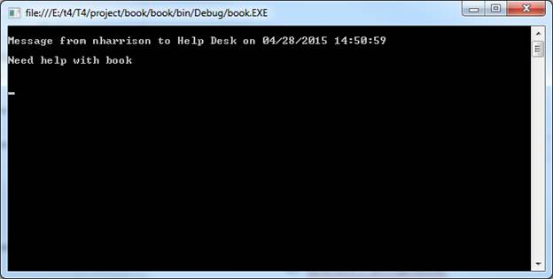

# 三、运行时模板

我们在第 2 章中学习的关于文本模板的大部分内容对于运行时模板仍然适用，但是有两个很大的区别。

第一个很大的区别是使用的定制工具。对于文本模板，自定义工具是 **`TextTemplatingFileGenerator`** 。对于运行时模板，自定义工具是 **`TextTemplatingFilePreProcessor`** 。

第二大区别是模板的输出。对于文本模板，输出是运行模板的结果。在幕后，我们看到 T4 创建了一个中介类，然后编译这个类。我们得到的输出来自于实例化这个类并调用 **`TransformText`** 方法。对于文本模板，T4 将所有这些作为一个步骤为我们完成，我们可以在嵌套的相关文件中看到输出。

对于运行时模板，我们的工作更复杂一点，而 T4 的工作更简单一点。在运行时模板上运行自定义工具的输出是中间类。我们需要在运行时实例化这个类，并直接调用 **`TransformText`** 方法来获得结果。这让我们对调用模板有了更多的控制。

让我们从创建一个新的模板开始，我们称之为**帮助消息。确保从**添加新项目**对话框中选择**运行时文本模板**:**


图 4:添加新的运行时模板

另外，通过查看解决方案资源管理器中该项目的属性，确认**自定义工具**已正确设置为 **`TextTemplatingFilePreprocessor`** :



图 5:运行时模板的属性

将以下文本添加到**帮助消息. tt** 模板中。

```cs
          <#@ template language="C#" #>
          <#@ assembly name="System.Core" #>
          <#@ assembly name="System.Reflection" #>
          <#@ import namespace="System.Linq" #>
          <#@ import namespace="System.Text" #>
          <#@ import namespace="System.Collections.Generic" #>
          <#@ import namespace="System.Reflection" #>

          Message from SENDER to RECEIVER on <#= DateTime.Now #>

          Need help with <#= Assembly.GetExecutingAssembly().GetName ().Name #>

```

代码清单 20:初始帮助消息

这个简单的模板显示了我们已经熟悉的指令，以及一个文本块和几个表达式块。我们将在未来的模板中看到，代码块和功能块也将按预期继续工作。

现在让我们看看运行自定义工具的输出:

```cs
          // --------------------------------------------------------
          // <auto-generated>
          //  This code was generated by a tool.
          //  Runtime Version: 12.0.0.0
          //
          // Changes to this file may cause incorrect behavior and will be lost if
          //  the code is regenerated.
          // </auto-generated>
          // --------------------------------------------------------
          namespace book
          {
           using System.Linq;
           using System.Text;
           using System.Collections.Generic;
           using System.Reflection;
           using System;

           /// <summary>
           /// Class to produce the template output
           /// </summary>

           #line 1 "E:\t4\T4\project\book\book\HelpMessage.tt"
           [global::System.CodeDom.Compiler.GeneratedCodeAttribute("Microsoft.VisualStudio.TextTemplating", "12.0.0.0")]
           public partial class HelpMessage : HelpMessageBase
           {
          #line hidden
            /// <summary>
            /// Create the template output
            /// </summary>
            public virtual string TransformText()
            {
            this.Write("\r\n\r\nMessage from SENDER to RECEIVER on ");

            #line 10 "E:\t4\T4\project\book\book\HelpMessage.tt"
            this.Write(this.ToStringHelper.ToStringWithCulture(DateTime.Now));

            #line default
            #line hidden
            this.Write("\r\n\r\nNeed help with ");

            #line 12 "E:\t4\T4\project\book\book\HelpMessage.tt"
            this.Write(this.ToStringHelper.ToStringWithCulture(Assembly.GetExecutingAssembly().GetName ().Name));

            #line default
            #line hidden
            this.Write("\r\n\r\n");
            return this.GenerationEnvironment.ToString();
            }
           }

```

代码清单 21:帮助消息的输出

从我们在第 2 章中看到的中间文件来看，这应该很熟悉。所以现在的问题是，我们如何获得模板的输出？从模板类型的名称中，答案可能已经很明显了:我们在运行时得到这个输出。

当我们在第 2 章开始时创建控制台应用程序项目时，我们还得到一个到目前为止被忽略的 **`Program`** 类。现在我们需要在 **Program.cs** 中添加以下代码:

```cs
          using System;
          using System.Collections.Generic;
          using System.Linq;
          using System.Text;
          using System.Threading.Tasks;

          namespace book
          {
           class Program
           {
            static void Main(string[] args)
            {
               var template = new HelpMessage();
               Console.WriteLine(template.TransformText());
               Console.ReadLine();
            }
           }
          }

```

代码清单 22:运行运行时模板

这将创建我们的模板实例，执行 **`TransformText`** 方法，并简单地将输出显示到屏幕上。目前为止，一切顺利。


图 6:运行运行时模板

现在我们可以控制设置运行模板的环境。这开启了很多可能性，也是一个关键问题。最重要的是，我们如何将数据传递给这个模板？

## 指令

我们在第 2 章中看到的指令继续按预期工作，但是现在我们有了一个只适用于运行时模板的新指令。

### 参数

**`Parameter`** 指令是专门为在调用模板时将数据传递给模板而创建的。

| 参数 | 描述 |
| 类型 | 传入的参数的数据类型。这应该是数据类型的完整类型名。如有必要，您可能需要汇编或导入指令，以便模板理解您指定的类型。 |
| 名字 | 传入的参数的名称。所用语言的所有标识符命名规则都适用于参数名。 |

对于我们的示例模板，如果能够传入几个参数来指定发送方和接收方就好了。让我们添加两个参数指令。

```cs
          <#@ template language="C#" #>
          <#@ assembly name="System.Core" #>
          <#@ assembly name="System.Reflection" #>
          <#@ import namespace="System.Linq" #>
          <#@ import namespace="System.Text" #>
          <#@ import namespace="System.Collections.Generic" #>
          <#@ import namespace="System.Reflection" #>
          <#@ parameter type="System.String" name="sender" #>
          <#@ parameter type="System.String" name="receiver" #>

          Message from <#= sender#> to <#= receiver #> on <#= DateTime.Now #>

          Need help with <#= Assembly.GetExecutingAssembly().GetName ().Name #>

```

代码清单 23:带有两个参数指令的帮助消息

我们现在可以用简单的表达式块访问这些参数，就像它们是局部变量一样。在实现我们的模板的生成类中，有几个关键项需要注意。我们指定的参数实际上现在是局部属性，我们有了一个新的 **`Initialize`** 方法。

让我们看看生成的文件中的相关部分。

```cs
          #line 1 "E:\t4\T4\project\book\book\HelpMessage.tt"

          private string _senderField;

          /// <summary>
          /// Access the sender parameter of the template.
          /// </summary>
          private string sender
          {
           get
           {
            return this._senderField;
           }
          }

          private string _receiverField;

          /// <summary>
          /// Access the receiver parameter of the template.
          /// </summary>
          private string receiver
          {
           get
           {
            return this._receiverField;
           }
          }

          /// <summary>
          /// Initialize the template
          /// </summary>
          public virtual void Initialize()
          {
           if ((this.Errors.HasErrors == false))
           {
            bool senderValueAcquired = false;
            if (this.Session.ContainsKey("sender"))
            {
            this._senderField = ((string)(this.Session["sender"]));
            senderValueAcquired = true;
            }
            if ((senderValueAcquired == false))
            {
            object data = global::System.Runtime.Remoting.Messaging
              .CallContext.LogicalGetData("sender");
            if ((data != null))
            {
             this._senderField = ((string)(data));
            }
            }
            bool receiverValueAcquired = false;
            if (this.Session.ContainsKey("receiver"))
            {
            this._receiverField = ((string)(this.Session["receiver"]));
            receiverValueAcquired = true;
            }
            if ((receiverValueAcquired == false))
            {
            object data = global::System.Runtime.Remoting.Messaging
              .CallContext.LogicalGetData("receiver");
            if ((data != null))
            {
             this._receiverField = ((string)(data));
            }
            }
           }
          }

```

代码清单 24:带有参数指令的帮助消息的实现

这里可以看到， **`Initialize`** 方法基于来自 **`Session`** 或 **`CallingContext`** 的数据显式设置这些局部属性。

让我们运行模板。

不幸的是，我们现在得到一个 **`ArgumentNullException`** ，因为我们的参数还没有初始化。


图 7:在没有初始化参数的情况下运行模板的错误消息

因此，我们需要改变模板，使其更具弹性。

在模板的文本块上方添加以下代码:

```cs
          <#
           if ((string.IsNullOrEmpty(sender))
            || (string.IsNullOrEmpty(receiver)))
           {
            return "Could not Transform text because parameters were missing";
           }
          #>

```

代码清单 25:使模板更有弹性

现在，当我们运行模板时，我们仍然不会得到预期的输出，但至少我们会得到一个有意义的消息，而不会抛出异常。



图 8:运行更具弹性的模板版本后的有用错误消息

因此，我们需要修改用于调用模板的代码，以创建一个参数值有效的会话。

将代码添加到 **Program.cs** 中，如下所示:

```cs
          using System;
          using System.Collections.Generic;
          using System.Linq;
          using System.Text;
          using System.Threading.Tasks;

          namespace book
          {
           class Program
           {
            static void Main(string[] args)
            {
               var template = new HelpMessage();
               template.Session = new Dictionary<string, object>();
               template.Session.Add("sender", Environment.UserName);
               template.Session.Add("receiver", "Help Desk");
               template.Initialize();
               Console.WriteLine(template.TransformText());
               Console.ReadLine();
            }
           }
          }

```

代码清单 26:正确调用帮助消息模板

如您所见， **`Session`** 只是一个我们可以显式设置的字典，然后我们必须调用 **`Initialize`** 方法，以便对 **`Session`** 进行评估以初始化本地属性。

现在，当我们运行模板时，我们得到了预期的结果:



图 9:正确调用帮助消息模板的输出

## 更改基类

到目前为止，我们已经为作为运行时模板的一部分生成的类掩饰了基类。如果我们没有在模板指令中指定 **`inherits`** 属性，T4 将为我们生成一个基类，它拥有我们需要的一切，这样当我们用运行时模板分发代码时就不会依赖于 T4。我不会在这里列出这个生成的基类的代码，因为它很长，并且实现的细节与我们当前的讨论无关，但是我们可能仍然可以使用它。

向项目中添加一个新类，并将其称为 **`HelpMessageBase`** 。将整个基类区域从**帮助消息 1.cs** 复制到这个新类。

现在我们要对这个类做一些调整。将其包装在一个名称空间中，并添加几个虚拟方法。

```cs
            public virtual string TransformText() { return ""; }
            public virtual void Initialize(){ }

```

代码清单 27:基类所需的更改

现在我们可以在模板指令上设置 **`inherits`** 属性:

```cs
          <#@ template language="C#" inherits="book.HelpMessageBase"#>

```

当我们运行自定义工具时，生成的输出将不再包括生成的基类。

如果我们现在运行该程序，我们将获得与以前相同的输出。

此时，我们已经控制了基类，并且可以根据需要操纵它，因为它不再是一个生成的工件。

我们想做一些改变。首先删除两个参数指令。相反，我们将这些定义为新基类中的常规属性。

在**帮助消息基础. cs** 的顶部添加以下代码:

```cs
            public string sender { get; set; }
            public string receiver { get; set; }

```

现在我们可以回到**程序. cs** 并修改它以使用这些新属性。

```cs
            static void Main(string[] args)
            {
               var template = new HelpMessage();

               template.sender = Environment.UserName;
               template.receiver = "Help Desk";
               Console.WriteLine(template.TransformText());
               Console.ReadLine();
            } 

```

代码清单 28:用新的基类调用帮助消息模板

当我们运行程序时，我们得到相同的结果，而不必去惹 **`Session`** 或者调用 **`Initialize`** 方法。

|  | 注意:您也可以扩展构造函数以接受这些值作为参数，而不是显式设置属性。这样做的好处是，如果不设置这些临界值，就无法创建模板。 |

根据您的具体要求，这可能是一种更有用的将数据传递给模板的方式。

## 总结

在本章中，我们探讨了运行时模板。正如我们所看到的，这些不同于文本模板，因为输出是一个新的类，我们需要调用它来从模板中获得我们期望的输出。

我们探索了一些不同的场景，通过 **`parameter`** 指令，以及通过控制基类和添加我们自己的属性，将数据传递给这些模板。

控制基类为扩展可重用性打开了许多可能性，我们将在第 4 章中更详细地介绍。