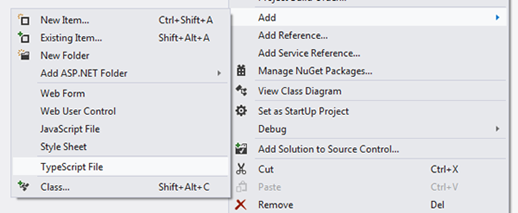
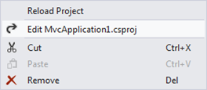

# 第二章 Visual Studio

本章介绍如何为 TypeScript 设置 Visual Studio 2012。如果您使用的是不同的开发环境，可以跳过这一章。在[附录 A“替代开发工具”中有更多关于使用 TypeScript 和其他工具的细节](09.html#sigil_toc_id_106)

## Visual Studio 扩展

第一个任务是从位于[http://www.typescriptlang.org/](http://www.typescriptlang.org/)的 TypeScript 语言网站下载并安装 Visual Studio 2012 的 *TypeScript 插件。*

这将添加 TypeScript 语言支持以及新的项目和文件模板。您可以将 TypeScript 文件添加到现有项目中，但是对于本书中的示例，您可以简单地使用带有 TypeScript 的*HTML Application*模板创建一个新项目，该模板可以在 Visual C# Templates 下找到—这有点用词不当，因为该项目不包含 C#或 VB.NET。


图 Visual Studio 中的新项目类型

可以通过“添加新项”菜单访问 TypeScript 文件模板，一旦将 TypeScript 文件添加到项目中，该模板也会作为快捷方式出现在项目上下文菜单中。默认模板包含一个示例接口、模块和类，但是您可以通过导航到扩展名 zip 文件并编辑名为 *file.ts* 的文件来更改该模板。粗体显示的路径部分可能在您的计算机上有所不同，但是如果您遇到困难，您可以在扩展文件夹中搜索 *f.zip* 。

c:\程序文件(x86)\ Microsoft Visual Studio 11.0 \ common 7 \ IDE \ Extensions \**msfz1q 5 . OCA \ ~ IC**\ IT \ CSharp \ 1033 \ f . zip



图 4:添加类型脚本文件快捷方式

该插件还安装了 TypeScript 编译器，可以从命令行、Visual Studio 和构建服务器使用该编译器。

c:\程序文件(x86)

也可以使用 *Web Essentials 2012* 扩展，它为 Visual Studio 增加了并排编辑功能。

## 预构建事件

如果您正在使用一个具有自动类型脚本支持的项目，例如带有类型脚本的 *HTML 应用程序*项目模板，那么您的所有类型脚本文件将在每次构建项目时自动编译成一个成对的 JavaScript 文件，如果您使用的是最新版本的 Visual Studio 扩展，则每次保存文件时都会自动编译成一个成对的 JavaScript 文件。

如果您想将 TypeScript 添加到现有项目中，例如添加到*ASP.NET MVC 网络应用程序*中，您可以将所需的部分添加到项目文件中。要编辑项目文件，从上下文菜单中选择**卸载**。然后重新打开上下文菜单，选择**编辑**。



图 5:项目上下文菜单

有两个部分需要添加。``ItemGroup`` 元素定义了要编译的文件(项目中所有文件的扩展名都是. ts)。``Target`` 元素包含针对这些文件运行 TypeScript 编译器的构建步骤。确切的条目如下所示，可以直接粘贴到您的项目中。

```ts
      <ItemGroup>
        <TypeScriptCompile Include="$(ProjectDir)\**\*.ts" />
      </ItemGroup>
      <Target Name="BeforeBuild">
        <Exec Command="&quot;$(PROGRAMFILES)\Microsoft SDKs\TypeScript\tsc&quot; @(TypeScriptCompile ->'&quot;%(fullpath)&quot;', ' ')" />
      </Target>

```

如果希望编译器以 ECMAScript 5 为目标，可以调整此示例以包含``--target`` 标志，如下例所示。只有当您确定不需要支持旧的浏览器时，才应该使用它。

```ts
      <ItemGroup>
        <TypeScriptCompile Include="$(ProjectDir)\**\*.ts" />
      </ItemGroup>
      <Target Name="BeforeBuild">
        <Exec Command="&quot;$(PROGRAMFILES)\Microsoft SDKs\TypeScript\tsc&quot; --target ES5 @(TypeScriptCompile ->'&quot;%(fullpath)&quot;', ' ')" />
      </Target>

```

## 尝试一下

一旦执行了这些步骤，Visual Studio 就可以使用了。构建解决方案，确保对项目文件所做的任何更改都没有问题。