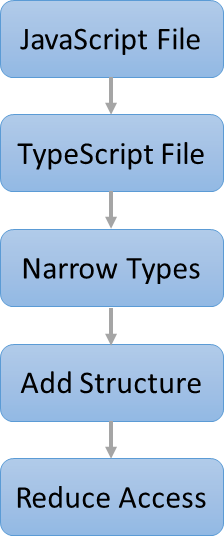

# 第 6 章使用现有的 JavaScript

不可避免的是，在某些时候，您将需要在您的 TypeScript 程序中使用现有的 JavaScript 库，无论它是您自己的还是来自第三方的。好消息是，TypeScript 有一种机制来提供外部脚本的定义，这允许您获得所有类型安全和自动完成，如果它是用 TypeScript 编写的话。描述外部资源的文件称为环境声明，TypeScript 预加载了文档对象模型和本机 JavaScript APIs 的定义。

如果您正在引用一个流行的开源库或框架，您可能会发现它已经有了一个 TypeScript 定义，但是对于您自己的现有代码或不太常见的外部脚本，您可能必须滚动自己的定义。如果您计划将您的 JavaScript 转换为 TypeScript，您可能会发现创建环境声明有助于逐步迁移您的代码库。

## 创建环境声明

环境声明的构造块是``declare`` 关键字。TypeScript 使用声明提供的信息来添加设计时支持和编译时检查，但不会为声明发出任何 JavaScript。您可以从简单地告诉 TypeScript 某个变量是由外部源提供的开始。这将防止为变量生成错误和警告，但暂时不会收到任何额外的类型检查。

示例 41 .简单环境声明

```
    declare var externalLogger;

    externalLogger.anything();

```

通过使用``declare`` 关键字，TypeScript 将允许您调用`externalLogger`上的任何变量或函数，这使得它成为在程序中集成现有 JavaScript 文件的理想的第一步。没有检查`anything`函数是否存在，或者您是否传递了正确的参数，因为 TypeScript 无法知道这些——但是作为一个快速的解决方案，现在可以使用`externalLogger`变量，而不会在程序中出现任何设计时或编译时错误。

使用环境声明时，如果您使用的是捆绑包，则需要手动引用 JavaScript 文件。如果您使用的是 CommonJS 或 AMD 模块，环境声明应该与实际库位于同一位置。如果您正在使用捆绑，您可以将其添加到与您的 TypeScript 输出相同的捆绑中。

理想情况下，您应该创建一个更具描述性的环境声明，这将为您提供所有与 TypeScript 相关的工具支持。您可以显式定义外部脚本支持的函数和变量。

示例 42.ts 环境等级定义

```
    declare class ExternalLogger {
        log(message: string): void;
    }

    declare var externalLogger: ExternalLogger;

    externalLogger.anything();

```

您会注意到``declare`` 关键字允许您将`ExternalLogger`类的主体视为一个接口，并且`log`函数不需要实现，因为这是在外部 JavaScript 文件中。通过从外部脚本中显式定义您需要的一切，您将在开发工具中拥有自动完成和类型检查。

使用这种技术可以让您在移植现有脚本时更有策略，因为您可以将它们隐藏在环境声明后面，并且您可以选择转换最常更改的文件，将其余的文件留到以后。您也可以选择只声明您想在程序中使用的外部类的部分，从而隐藏您不需要或不想要的部分。

样本 43 .完整的环境声明

```
    declare module ExternalUtilities {
        export class ExternalLogger {
            public totalLogs: number;
            log(message: string): void;
        }
    }

    var externalLogger = new ExternalUtilities.ExternalLogger();

    externalLogger.log("Hello World");
    var logCount = externalLogger.totalLogs;

```

您可以将环境声明放在单独的文件中。如果这样做，应该使用. d.ts 文件扩展名，例如*ExternalAgger . d . ts*。该文件可以像任何其他类型的脚本文件一样被引用或导入。

示例 44 . t 引用环境声明文件

```
    /// <reference path="ExternalUtilities.d.ts" />
    var externalLogger = new ExternalUtilities.ExternalLogger();
    externalLogger.log("Hello World");

```

|  | 注意:TypeScript 语言规范指出，扩展名为. d.ts 的文件中的任何代码都将被隐式视为具有 declare 关键字，但是在编写时，Visual Studio 要求 declare 关键字存在。 |

通过在代码块前加上``declare`` 关键字并省略实现，可以声明模块、类、函数和变量。您使用的名称应该与 JavaScript 实现中的名称完全匹配。

## 将 JavaScript 移植到 TypeScript

我不会试图规定将遗留 JavaScript 移植到 TypeScript 中的策略，甚至不会告诉您必须这样做。我将简要解释一些可用的选项，并给出移植代码的候选计划，但是您选择的方法将完全取决于您的独特情况。

我将假设您已经决定对新代码使用 TypeScript，但是有许多现有的库。您的第一步是为要从新的 TypeScript 程序中调用的现有代码部分创建环境声明。首先，只定义您正在使用的现有代码的部分——这是您删除冗余代码以及转换您需要的类型脚本的机会。

要选择要开始重写的文件，请查找变化最频繁的 JavaScript 文件。进行的更改越多，从设计时工具和编译时检查中获得的好处就越多。如果一个文件是稳定的，暂时把它放在原来的地方。移动代码顺序的另一个潜在驱动因素是依赖链。您可能会发现移动代码片段和它所依赖的代码更容易。

理想情况下，您应该确保从 TypeScript 中调用遗留的 JavaScript，而不是相反。如果您重写现有的 JavaScript 来调用 TypeScript 编译器生成的代码，您会发现很难进行更改，因为 TypeScript 中微妙的结构更改很容易破坏依赖它的旧代码。当您的所有代码都转换为 TypeScript 时，进行这些更改将是微不足道的，因为编译器将验证调用代码，并且您将可以访问所有标准的重构工具。

移植 JavaScript 文件的过程相对简单。首先将 JavaScript 直接放入一个 TypeScript 文件中。您需要修复任何错误以使代码有效。一旦有了工作文件，就要寻找使用``any`` 类型的情况，并通过显式指定来缩小类型。在某些情况下，您将无法缩小类型，因为变量在运行时用于存储不同的类型，或者因为函数在不同的逻辑分支中返回不同的类型。如果你能重新考虑这些用法，那就这样做。如果他们是动态类型的真正候选人，你可以把他们留在。如果需要为代码中的自定义对象提供一个契约，可以在这个阶段开始添加接口。

下一步是使用模块和类向文件添加结构。最后，你应该寻找不太容易接近的候选人；例如，通过尝试移除任何不必要的``export`` 关键词，并将``public`` 变量转换为``private`` 变量，这些变量不会被外部访问。

如果您已经有了针对您的 JavaScript 的单元测试，所有这些都要容易得多，因为您可以更加确信这些更改不会破坏预期的行为——但是如果您没有单元测试，这可能是开始将它们添加到您的项目中的理想时机。我将在[第 7 章“用 TypeScript 进行单元测试”中更详细地讨论这个话题](07.html#sigil_toc_id_86)



图 8:转换过程

## 转移设计模式

除了将您的 JavaScript 转换成 TypeScript 之外，您还可以将许多东西从。NET 代码，例如你的好习惯、最佳实践和设计模式。

每当你读一本关于面向对象编程、SOLID 原则、设计模式和干净代码的书或文章时，你现在可以想到 TypeScript 以及 C#、about 和 Java。

当你把你的 JavaScript 转换成 TypeScript 时，不要留下你遇到的坏习惯。应用你的。NET 编程技巧，将其转换为干净、可维护的代码。