# 二、安装Ubuntu 服务器

Ubuntu 15.10 可用于三大架构:英特尔 x86、AMD64 和 ARM。下表列出了推荐的硬件规格。

表 1:推荐的最低要求

| 安装类型 | 中央处理器 | 随机存取存储 | 硬盘空间 |
| 基础系统 | 已安装的所有任务 |
| 服务器(标准) | 1 千兆赫 | 512 兆字节 | 1 千兆字节 | 1.75 千兆字节 |
| 服务器(最小) | 300 兆赫 | 192 兆字节 | 700 兆字节 | 1.4 千兆字节 |

|  | 注意:根据用户的需求，Ubuntu 可能用比建议的更少的东西来管理。然而，如果大多数用户忽视这些建议，他们可能会感到沮丧。 |

Ubuntu 可以从 [Ubuntu 网站](http://releases.ubuntu.com/15.10/ubuntu-15.10-server-amd64.iso)下载为 ISO 图像文件。

下载完成后，必须将文件刻录到光盘上。此外，用户需要确保将光盘驱动器设置为系统中用于安装的第一个引导设备。

|  | 注意:设置引导设备优先级取决于每个设备中嵌入的 BIOS 类型，但通常该功能被标识为引导优先级或引导顺序。 |

首先，包含 Ubuntu Sever 安装的光盘必须插入系统的光盘驱动器。然后，系统需要重新启动。完成后，将出现以下屏幕。

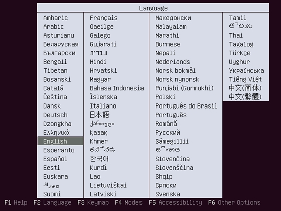

图 1:选择安装语言的屏幕

如上图所示，Ubuntu 安装程序要求提供将用于整个安装过程的语言。选择**英文**，按回车键显示安装菜单。

该菜单显示了一组允许在系统中安装 Ubuntu 服务器的选项，包括一个用于修复损坏系统的替代方案。还包括检查硬盘缺陷和测试系统内存的选项。

以下是菜单中出现的每个选项的简要说明:

*   **安装 Ubuntu 服务器**:开始 Ubuntu 服务器安装过程。
*   **多台服务器安装 MAAS** :允许使用 MAAS(金属即服务)安装多台服务器。
*   **检查光盘是否有缺陷**:运行实用程序检查目标硬盘是否有坏扇区或物理缺陷。
*   **测试内存**:运行实用程序检查系统内存完整性。
*   **从第一个硬盘启动**:退出安装过程，尝试从第一个硬盘启动系统。
*   **修复损坏的系统**:启动系统修复实用程序，修复之前安装中发现的问题。

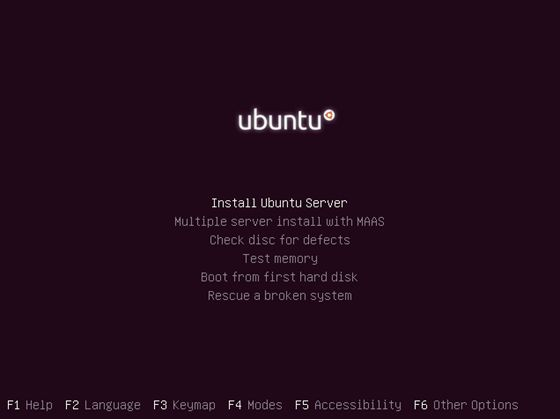

图 2:安装菜单屏幕

选择**安装 Ubuntu 服务器**开始安装过程，如下节所述。

这个过程的第一步是选择 Ubuntu 将使用的默认语言，既用于安装，也用于 Ubuntu 安装后的用户界面。

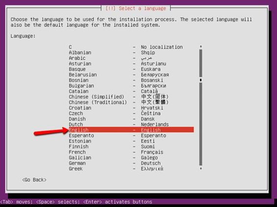

图 3:语言选择屏幕

下表描述了使用安装界面时需要使用的键。

表 2:安装界面导航键

| 钥匙 | 行动 |
| --- | --- |
| 标签 | 在屏幕上显示的界面元素之间移动。 |
| 空格键 | 选择一个接口元素并执行与之关联的操作。 |
| 进入 | 激活屏幕上的任何按钮，或从列表中选择一个元素。 |

要继续该过程，请按回车键。

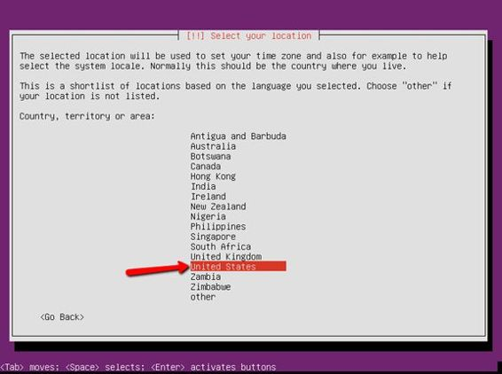

图 4:选择地理位置

此屏幕允许您选择系统将安装的地理位置，就本书而言，我们将选择**美国**。

现在必须选择键盘布局，以确保它在安装过程中和系统安装后正常工作。可以自动进行配置(通过按下一系列键)或从列表中选择键盘类型。这取决于**是**还是**否**的选择，如下图截图所示。

图 5:配置键盘

要手动选择键盘类型，按回车键选择**否**。

图 6:配置键盘:原产国

接下来，安装程序会询问连接到计算机的键盘的原产国。选择**英语(美国)**作为原产国，以匹配之前选择的地理位置。

键盘配置的最后一步包括根据连接到计算机的键盘的物理分布选择合适的键盘布局。根据之前选择的地理位置和原籍国，屏幕上将显示一组英语变体。将假设英语(美国)是插入计算机的键盘的匹配布局。

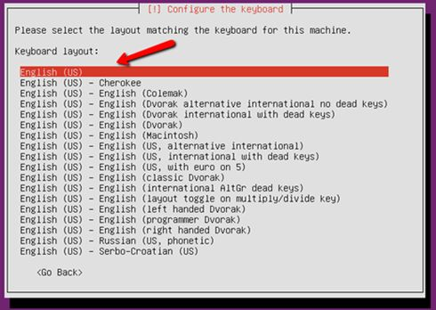

图 7:配置键盘:键盘布局

此时，安装程序继续检查系统，以检测安装的所有硬件组件。这包括光盘驱动器、通用串行总线接口、中央处理器时钟信息、主板芯片组和网络硬件。这部分流程在下面的截图中显示。

图 8:检测光驱

图 9:检测附加组件

图 10:检测网络硬件

#### 设置主机名

出于联网的目的，每台计算机都必须用一个名称来标识。该名称称为主机名，对于连接到网络的每台计算机来说必须是唯一的。安装程序建议咨询网络管理员，为系统分配正确的主机名。在构建家庭网络的情况下，建议使用一个名称来标识要设置的计算机的主要用途(例如邮件服务器)。

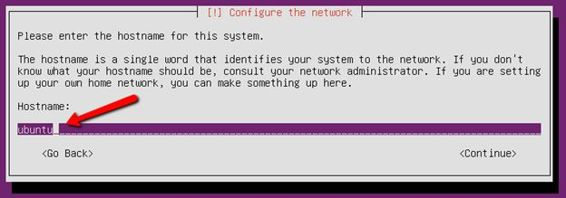

图 11:为系统分配主机名

#### 设置用户帐户

从 UNIX 派生的所有操作系统(所有 Linux 发行版，包括 Ubuntu，都属于这个定义)都有一个根帐户。此帐户是系统上最有特权的帐户，它使使用它的人能够执行系统管理的所有方面，如添加帐户、更改用户密码、浏览文件、安装软件等。然而，系统假设用户知道他或她正在做什么，并且将精确地执行用户请求的每个任务。如果处理不当，用户可能会清除一些关键的系统文件，从而导致系统崩溃。

幸运的是，Ubuntu 安装程序考虑到了这一点，并要求设置一个用户帐户来代替根帐户。因此，每次用户登录服务器时，他们都将拥有非管理权限，从而避免了系统致命事故的可能性。

用户帐户设置过程有两个步骤。首先，安装程序要求用户的真实姓名。任何需要显示用户全名的程序(如电子邮件客户端)都将使用该名称。然后，这个过程要求一个普通的用户名，可以是全名的缩写，也可以是其他容易记住的名字。

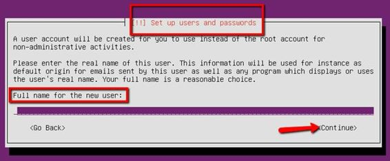

图 12:用户帐户:输入全名

图 13:用户帐户:输入普通用户名

第二步是为用户帐户分配密码。建议混合使用字母、数字和标点符号，并定期更改密码。

键入密码，然后按回车键。完成后，将出现第二个对话框，要求确认先前输入的内容。如果两个条目匹配，该过程将继续。

图 14:用户帐户:输入密码

图 15:用户帐户:重新输入密码进行验证

现在，安装程序想知道用户的主目录是否应该加密，以使其内容对其他人保密。主目录是存储文档、图片、音乐和几乎所有其他内容的地方。用户的应用程序设置也存储在这里。

建议保持主目录不加密，以便可以轻松地从可能的损坏中恢复数据。

图 16:要求主目录加密

#### 配置时钟

此时，安装程序要求进行时钟配置。将出现一个对话框，用于根据系统部署的物理位置选择适当的时区。用箭头键选择适当的时区，然后按回车键继续该过程。

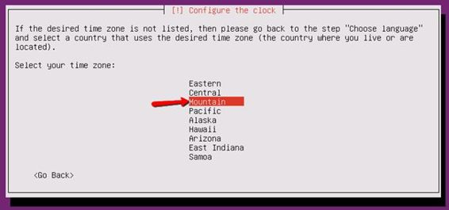

图 17:时区选择对话框

#### 硬盘分区

磁盘分区是在硬盘或其他类型的存储上创建一个或多个区域，以便操作系统可以分别管理每个区域中的数据。在创建任何文件或目录之前，分区是准备磁盘的第一步。创建分区后，磁盘会将有关分区位置和大小的信息存储在一个称为分区表的特殊区域中。该分区表在磁盘的任何其他部分之前被操作系统读取。每个分区在操作系统中显示为使用部分实际磁盘的独特“逻辑”磁盘。

#### 在 Ubuntu 中识别硬盘

对于一个正在从 Windows 过渡的用户来说，首先要了解的是，在 Ubuntu 中没有字母(例如 C 或 D)来标识硬盘。硬盘的命名惯例以斜线和`dev`缩写开头。这个缩写代表“设备”然后，`dev`后面是另一个斜线和`sd`缩写，代表 SCSI(小型计算机系统接口)设备。

硬盘识别的一个例子是`/dev/sd`，但是如果电脑有多个硬盘呢？这个问题通过在硬盘标识的末尾增加一个字母来解决，从`a`开始。因此，对于在计算机中发现的第一个驱动器，其识别名称将是`/dev/sda`。这相当于 Windows 中的硬盘 0。对于第二个磁盘，它将是`/dev/sdb`，以此类推。

#### Ubuntu 中的文件系统和分区

创建磁盘分区后，需要对其进行格式化，然后才能用于存储数据。这个过程包括用文件系统格式化分区。文件系统是一种文件命名和逻辑放置的方式，用于存储和检索。这种方式还考虑了命名约定，包括名称中的最大字符数、可用于命名文件的字符以及通过存储结构指定文件路径的格式。

Ubuntu 有几个可用的文件系统(事实上，每个 Linux 发行版都有)。使用最多的是 Ext4、Ext3 和 Ext2。

除了这些文件系统，还有另一种称为交换的类型。它用于增加总内存量(物理内存加虚拟内存)。

|  | 注意:对于那些从 Windows 迁移过来的人:Windows 使用的文件系统被命名为 NTFS(新技术文件系统)。Ubuntu 只能为存储和检索目的处理 NTFS 分区。 |

#### 挂载点

装载点是硬盘正在使用的当前可访问文件系统中的一个目录(通常为空)，用于在其上装载附加文件系统(逻辑连接)。该装载点成为新添加的文件系统的根目录，并且可以从该目录访问文件系统。

下表总结了 Ubuntu 上最常见的挂载点。

表 Ubuntu 中常见的挂载点

| 挂载点 | 目的 |
| --- | --- |
| / | 根；相当于 Windows 中的 c 盘。 |
| /boot | 存储引导加载程序文件的分区。 |
| /home | 将存储用户文件和目录的分区。 |
| 交换 | 用于增加内存(虚拟内存)的数量。 |

#### 分区和挂载点创建

完成此任务的最佳方法是从分区菜单中选择**引导分区**选项。在这种情况下，将自动创建所有公共分区，并设置 LVM(逻辑卷管理器)。按回车键，将弹出硬盘选择菜单，要求使用磁盘进行分区。

选择所需磁盘后，将显示一个对话框，要求保存安装程序创建的分区方案。

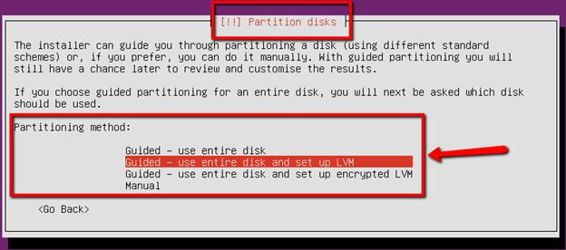

图 18:引导分区选项的选择

图 19:硬盘选择

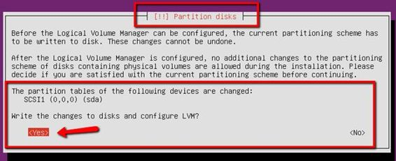

图 20:保存更改的对话框

在硬盘上保存分区方案之前，安装程序会在一个对话框中显示它。按回车键选择**是**，更改将被写入磁盘。

图 21:分区方案对话框

现在，安装程序复制配置系统和安装设备所需的文件。

#### 配置包管理器

软件包管理器是一个管理系统，负责安装、升级、配置和删除软件。除了提供对超过 45，000 个软件包的有组织的基础的访问之外，它还促进了功能依赖性解决能力和软件更新检查。

软件包管理器需要互联网连接来下载安装所需的可能升级和附加软件。此时，出现一个对话框，要求 HTTP 代理访问外部。最常见的场景不需要代理，所以这个条目应该是空的。

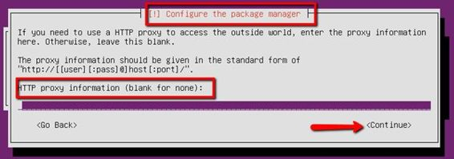

图 22:代理配置对话框

#### 配置更新管理

Ubuntu 在不断进化。软件的更新可从其网站上获得，通常需要使用管理工具手动应用。但是，您可以选择自动安装这些更新。在这种情况下，系统将安装它在 Ubuntu 网站上找到的任何软件更新。

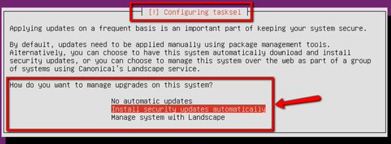

图 23:更新配置对话框

#### 安装附加软件

这时，系统的核心软件安装完毕。可以在安装过程结束之前安装一个或多个预定义的软件集合。你可以在以后的任何时候安装软件，所以我建议在这一点上不要做任何选择。

图 24:软件选择对话框

#### 安装 GRUB 引导加载程序

引导加载程序是将计算机操作系统放入内存的一个小软件。当计算机加电或重启时，基本输入/输出系统(BIOS)执行一些初始测试，然后将控制转移到主引导记录(MBR)，在那里可以找到引导加载程序。应该安装 GRUB 来管理 Ubuntu 的引导过程。

图 25:选择 GRUB 引导加载程序安装

#### 完成安装

这是安装过程的最后一步。一旦安装了 GRUB 引导加载程序，一系列系统文件将被复制到磁盘，并出现一个对话框。它表示用于该过程的所有安装介质都必须从计算机中删除。完成后，必须重新启动计算机。现在，您可以使用安装过程中创建的用户名和密码登录 Ubuntu 服务器。

图 26:完成安装对话框

本章重点介绍了 Ubuntu 服务器的安装过程。它首先解释了正确安装 Ubuntu 的硬件要求。我们讨论了磁盘分区、挂载点和引导加载程序等概念，并逐步解释了安装过程。此外，还简要讨论了关于根用户的信息。如果你已经完成了这一章，现在应该部署一个有用的 Ubuntu 服务器工作副本。