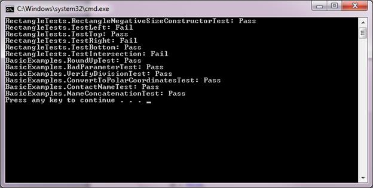

# 第六章单元测试是如何工作的？

反射语言(如任何。NET 语言)有三个部分:

*   加载包含测试的程序集。
*   利用反射寻找测试方法。
*   调用方法并验证结果。

本章提供了如何工作的代码示例，将一个简单的单元测试引擎放在一起。如果你对单元测试引擎的幕后调查不感兴趣，请随意跳过这一章。

这里的代码假设我们正在根据微软。visual studio . QualityTools . UniTestFrame 程序集。其他单元测试引擎可能出于同样的目的使用其他属性。

## 装载组件

在体系结构上，您的单元测试应该驻留在与被测试代码分开的程序集中，或者至少应该只包含在以“调试”模式编译的程序集中。将单元测试放在单独的程序集中的好处是，您还可以对代码的非调试优化生产版本进行单元测试。

也就是说，第一步是加载程序集:

```
    static bool LoadAssembly(string assemblyFilename, out Assembly assy, out string issue)
    {
      bool ok = true;
      issue = String.Empty;
      assy = null;

      try
      {
        assy = Assembly.LoadFile(assemblyFilename);
      }
      catch (Exception ex)
      {
        issue = "Error loading assembly: " + ex.Message;
        ok = false;
      }

      return ok;
    }

```

请注意，专业的单元测试引擎将程序集加载到单独的应用程序域中，这样就可以卸载或重新加载程序集，而无需重新启动单元测试引擎。这也允许在不首先关闭单元测试引擎的情况下重新编译单元测试程序集和依赖程序集。

## 利用反射寻找单元测试方法

下一步是对程序集进行反思，以识别被指定为“测试夹具”的类，并在这些类中识别测试方法。一组基本的四种方法支持最小单元测试引擎需求、测试装置的发现、测试方法和异常处理属性:

```
    /// <summary>
    /// Returns a list of classes in the provided assembly that have a "TestClass" attribute.
    /// </summary>
    static IEnumerable<Type> GetTestFixtures(Assembly assy)
    {
      return assy.GetTypes().Where(t => t.GetCustomAttributes(typeof(TestClassAttribute), false).Length == 1);
    }

    /// <summary>
    /// Returns a list of methods in the test fixture that are decorated with the "TestMethod" attribute.
    /// </summary>
    static IEnumerable<MethodInfo> GetTestMethods(Type testFixture)
    {
      return testFixture.GetMethods().Where(m => m.GetCustomAttributes(
          typeof(TestMethodAttribute), false).Length == 1);
    }

    /// <summary>
    /// Returns a list of specific attributes that may be decorating the method.
    /// </summary>
    static IEnumerable<AttrType> GetMethodAttributes<AttrType>(MethodInfo method)
    {
      return method.GetCustomAttributes(typeof(AttrType), false).Cast<AttrType>();
    }

    /// <summary>
    /// Returns true if the method is decorated with an "ExpectedException" attribute while exception type is the expected exception.
    /// </summary>
    static bool IsExpectedException(MethodInfo method, Exception expectedException)
    {
      Type expectedExceptionType = expectedException.GetType();

      return GetMethodAttributes<ExpectedExceptionAttribute>(method).
                Where(attr=>attr.ExceptionType == expectedExceptionType).Count() != 0;
    }

```

## 调用方法

一旦这些信息被编译，引擎就调用 try-catch 块中的测试方法(我们不希望单元测试引擎本身崩溃):

```
    static void RunTests(Type testFixture, Action<string> result)
    {
      IEnumerable<MethodInfo> testMethods = GetTestMethods(testFixture);

      if (testMethods.Count() == 0)
      {
        // Don't do anything if there are no test methods.
        return;
      }

      object inst = Activator.CreateInstance(testFixture);

      foreach (MethodInfo mi in testMethods)
      {
        bool pass = false;

        try
        {
          // Test methods do not have parameters.
          mi.Invoke(inst, null);
          pass = true;
        }
        catch (Exception ex)
        {
          pass = IsExpectedException(mi, ex.InnerException);
        }
        finally
        {
          result(testFixture.Name + "." + mi.Name + ": " + (pass ? "Pass" : "Fail"));
        }
      }
    }

```

最后，我们可以将这段代码放入一个简单的控制台应用程序中，该应用程序将单元测试程序集作为参数，得到一个可用但简单的引擎:

```
    using System;
    using System.Collections.Generic;
    using System.IO;
    using System.Linq;
    using System.Reflection;
    using System.Text;

    using Microsoft.VisualStudio.TestTools.UnitTesting;

    namespace SimpleUnitTestEngine
    {
      class Program
      {
        static void Main(string[] args)
        {
          string issue;

          if (!VerifyArgs(args, out issue))
          {
            Console.WriteLine(issue);
            return;
          }

          Assembly assy;

          if (!LoadAssembly(args[0], out assy, out issue))
          {
            Console.WriteLine(issue);
            return;
          }

          IEnumerable<Type> testFixtures = GetTestFixtures(assy);

          foreach (Type testFixture in testFixtures)
          {
            RunTests(testFixture, t => Console.WriteLine(t));
          }
        }

        static bool VerifyArgs(string[] args, out string issue)
        {
          bool ok = true;
          issue = String.Empty;

          if (args.Length != 1)
          {
            issue = "Usage: SimpleUnitTestEngine <assembly filename>";
            ok = false;
          }
          else
          {
            string assemblyFilename = args[0];

            if (!File.Exists(assemblyFilename))
            {
              issue = "The filename '" + args[0] + "' does not exist.";
              ok = false;
            }
          }

          return ok;
        }

    ... the rest of the code ...

```

运行这个简单测试引擎的结果显示在控制台窗口中，例如:



图 3:我们简单的测试引擎控制台结果