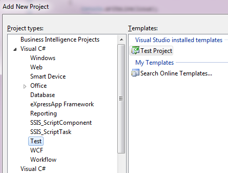
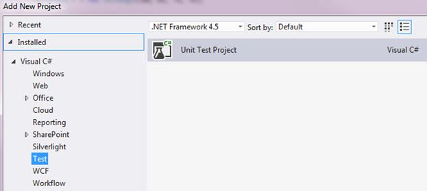
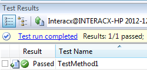
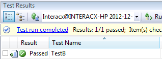
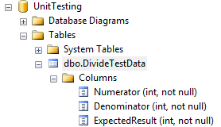
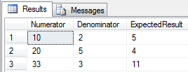

# 第九章用 Visual Studio 进行单元测试

本章将讨论编写单元测试，涵盖单元测试类和方法中常见的属性和断言形式。

## 基本单元测试结构

单元测试由两件事组成:

*   表示测试设备的类。
*   类中表示单元测试的方法。

Visual Studio 将自动为测试项目创建一个存根，这就是我们要开始的地方。

### 在 Visual Studio 中创建单元测试项目

单元测试通常放在与应用程序代码分开的项目中(产生一个不同的程序集)。在 Visual Studio 2008 或 2012 中，您可以通过右键单击解决方案并从弹出菜单中选择**添加**，然后选择**新项目**来创建单元测试项目:


图 6:添加新项目

从出现的对话框中，选择一个**测试**项目:



图 7: VS2008 新测试项目



图 8: VS2012 新测试项目

Visual Studio 2008 将创建一个存根文件“UnitTest1.cs”(如果您选择了 C#语言)，在存根中包含各种有用的注释。Visual Studio 2012 创建了一个更加简洁的存根:

```
    using System;
    using Microsoft.VisualStudio.TestTools.UnitTesting;

    namespace VS2012UnitTestProject1
    {
      [TestClass]
      public class UnitTest1
      {
        [TestMethod]
        public void TestMethod1()
        {
        }
      }
    }

```

### 面向 Visual Studio 2008 用户

Visual Studio 2008 还将创建一个 TestContext 类——该类在 VS2012 中不再存在，我们将忽略它——而是使用 VS2012 中以前的存根。

此外，删除“ManualTest1.mht”文件，否则将提示您选择测试结果并手动输入测试说明。

### 测试夹具

请注意，该类是用属性 TestClass 修饰的。这定义了测试夹具——测试方法的集合。

### 试验方法

请注意，该方法是用属性 TestMethod 修饰的。这定义了一个方法，测试设备将运行该方法。

## 断言类

assert 类定义了以下静态方法，可用于验证方法的计算:

*   areequal/areotequal
*   名字/名字不一样
*   IsTrue/IsFalse
*   isno null/isno null
*   is instanceoftype/is notificationeoftype

这些断言中有许多是重载的，建议您查看微软提供的完整文档。

### 断言的基础

请注意，以下示例使用了 VS2008。

断言是每个测试的支柱。关于测试结果，可以有多种说法。首先，我们将写一个简单的断言，声明“一等于一”，换句话说，一个真理:

```
    [TestClass]
    public class UnitTest1
    {
      [TestMethod]
      public void TestMethod1()
      {
        Assert.IsTrue(1 == 1);
      }
    }

```

运行测试，结果应为“通过”:



图 9:简单断言

### 面积相等/砂岩

AreEqual 和 AreNotEqual 方法比较:

*   目标
*   双打
*   挑选
*   用线串
*   类型化数据

它们的形式是将预期值(第一个参数)与实际值(第二个参数)进行比较。对于单值和双值，可以指定“在一定精度内”。最后，如果断言失败，所有重载都可以选择显示一条消息(可选格式化)。

关于对象相等性，此方法比较实例是否相同:

```
    public class AnObject
    {
    }

    [TestMethod]
    public void ObjectEqualityTest()
    {
      AnObject object1 = new AnObject();
      AnObject object2 = new AnObject();

      Assert.AreNotEqual(object1, object2);
    }

```

前面的测试通过了，因为对象 1 和对象 2 不相等。但是，如果类重写了 Equals 方法，则相等是基于类中实现的 Equals 方法所做的比较。例如:

```
    public class AnObject
    {
      public int SomeValue { get; set; }

      public override bool Equals(object obj)
      {
        return SomeValue == ((AnObject)obj).SomeValue;
      }
    }

    [TestMethod]
    public void ObjectEqualityTest()
    {
      AnObject object1 = new AnObject() { SomeValue = 1 };
      AnObject object2 = new AnObject() { SomeValue = 1 } ;

      Assert.AreEqual(object1, object2);
    }

```

### aresame/arenas name

这两种方法验证*实例*是否相同。例如:

```
    [TestMethod]
    public void SamenessTest()
    {
      AnObject object1 = new AnObject() { SomeValue = 1 };
      AnObject object2 = new AnObject() { SomeValue = 1 };

      Assert.AreNotSame(object1, object2);
    }

```

即使类 AnObject 覆盖了 Equals 运算符，前面的测试还是通过了，因为两个对象的*实例*是不一样的。

### IsTrue/IsFalse

这两种方法允许您测试值比较的真实性。从可读性的角度来看，IsTrue 和 IsFalse 方法通常用于*值*的比较，而 AreEqual 和 AreSame 通常用于比较*实例*(对象)。

例如:

```
    [TestMethod]
    public void IsTrueTest()
    {
      AnObject object1 = new AnObject() { SomeValue = 1 };

      Assert.IsTrue(object1.SomeValue == 1);
    }

```

这将验证属性值。

### IsNull/IsNotNull

这两个测试验证对象是否为空:

```
    [TestMethod]
    public void IsNullTest()
    {
      AnObject object1 = null;

      Assert.IsNull(object1);
    }

```

### isinstancetype/isnotinstancetype

这两种方法验证对象是否是特定类型的实例。例如:

```
    public class AnotherObject
    {
    }

    [TestMethod]
    public void TypeOfTest()
    {
      AnObject object1 = new AnObject();

      Assert.IsNotInstanceOfType(object1, typeof(AnotherObject));
    }

```

### 不确定

断言。不确定的方法可以用来指定测试或者测试背后的功能还没有实现，因此测试是不确定的。

### 当断言失败时会发生什么？

关于 Visual Studio 单元测试，当断言失败时，Assert 方法会抛出一个 AssertFailedException。测试代码永远不应该处理这个异常。

## 其他断言类

还有另外两个断言类:

*   CollectionAssert
*   StringAssert

顾名思义，这些断言分别对集合和字符串进行操作。

### 集合断言

这些方法是在微软实现的。visual studio . testtools . unittesting . collectionassert 类。请注意，这些方法中的集合参数期望集合实现 ICollection(与预期 IEnumerable 的 NUnit 形成对比)。

#### AllItemsAreInstanceOfType

此断言验证集合中的对象属于同一类型，包括预期类型的派生类型，如下所示:

```
    public class A { }
    public class B : A { }

    [TestClass]
    public class CollectionTests
    {
      [TestMethod]
      public void InstancesOfTypeTest()
      {
        List<Point> points = new List<Point>() { new Point(1, 2), new Point(3, 4) };
        List<object> items = new List<object>() { new B(), new A() };

        CollectionAssert.AllItemsAreInstancesOfType(points, typeof(Point));
        CollectionAssert.AllItemsAreInstancesOfType(items, typeof(A));
      }
    }

```

#### AllItemsAreNotNull

此断言验证集合中的对象不为空。

#### AllItemsAreUnique

该测试确保集合中的对象是唯一的。如果比较结构:

```
    [TestMethod]
    public void AreUniqueTest()
    {
      List<Point> points = new List<Point>() { new Point(1, 2), new Point(1, 2) };
      CollectionAssert.AllItemsAreUnique(points);
    }

```

这些结构是按值而不是按实例进行比较的——前面的测试失败了。但是，即使类重写了 Equals 方法:

```
    public class AnObject
    {
      public int SomeValue { get; set; }

      public override bool Equals(object obj)
      {
        return SomeValue == ((AnObject)obj).SomeValue;
      }
    }

```

该测试通过:

```
    [TestMethod]
    public void AreUniqueObjectsTest()
    {
      List<object> items = new List<object>()
      {
        new AnObject() { SomeValue = 1 },
        new AnObject() { SomeValue = 1 }
      };

      CollectionAssert.AllItemsAreUnique(items);
    }

```

#### areequal/areotequal

这些测试断言两个集合是相等的。这些方法包括允许您提供比较器方法的重载。如果对象重写了 Equals 方法，则该方法将用于确定是否相等。例如:

```
    [TestMethod]
    public void AreEqualTest()
    {
    List<object> itemList1 = new List<object>()
      {
        new AnObject() { SomeValue = 1 },
        new AnObject() { SomeValue = 2 }
      };

      List<object> itemList2 = new List<object>()
      {
        new AnObject() { SomeValue = 1 },
        new AnObject() { SomeValue = 2 }
      };

      CollectionAssert.AreEqual(itemList1, itemList2);
    }

```

这两个集合是相等的，因为类 AnObject 重写了 Equals 方法(参见前面的示例)。

请注意，要传递断言，列表必须具有相同的长度，如果列表除了顺序不同之外都相同，则认为它们不相等。将此与下面描述的 AreEquivalent 断言进行比较。

#### 等价/不等价

这个断言比较了两个列表，并认为无论顺序如何，相等项目的列表都是相等的。不幸的是，在实现中似乎有一个错误，因为这个测试失败了:

```
    [TestMethod]
    public void AreEqualTest()
    {
    List<object> itemList1 = new List<object>()
      {
        new AnObject() { SomeValue = 1 },
        new AnObject() { SomeValue = 2 }
      };
      List<object> itemList2 = new List<object>()
      {
        new AnObject() { SomeValue = 2 },
        new AnObject() { SomeValue = 1 }
      };

      CollectionAssert.AreEquivalent(itemList1, itemList2);
    }

```


图 10: Visual Studio 的等效 Bug

带有错误消息:

```
    CollectionAssert.AreEquivalent failed. The expected collection contains 1 occurrence(s) of <UnitTestExamplesVS2008.AnObject>. The actual collection contains 0 occurrence(s).

```

鉴于 NUnit 对该断言的实现通过了:


图 11:无等效电路工作正常

#### 包含/不包含

此断言验证对象是否包含在集合中:

```
    [TestMethod]
    public void ContainsTest()
    {
      List<object> itemList = new List<object>()
      {
        new AnObject() { SomeValue = 1 },
        new AnObject() { SomeValue = 2 }
      };

      CollectionAssert.Contains(itemList, new AnObject() { SomeValue = 1 });
    }

```

使用 Equals 方法(如果被重写)执行相等测试。

#### issubestof/isnotsubtof

这个断言验证第一个参数(子集)包含在第二个参数的集合(超集)中。

```
    [TestMethod]
    public void SubsetTest()
    {
      string subset = "abc";
      string superset = "1d2c3b4a";

      CollectionAssert.IsSubsetOf(subset.ToCharArray(), superset.ToCharArray());
    }

```

请注意，子集测试不测试顺序或顺序，它只是测试子集列表中的项目是否包含在超集中。

### 字符串断言

这些方法是在微软实现的。VisualStudio . TestTools . unitTesting . stringGassert 类:

*   包含
*   匹配/不匹配
*   开始于/结束于

这些将在下面讨论。

#### 包含

Contains 方法断言子集(注意这是第二个参数)包含在字符串(第一个参数)中。例如，该测试通过:

```
    [TestClass]
    public class StringTests
    {
      [TestMethod]
      public void ContainsTest()
      {
        string subset = "abc";
        string superset = "123abc456";

        StringAssert.Contains(superset, subset);
      }
    }

```

#### 匹配/不匹配

此方法断言字符串(第一个参数)与第二个参数中提供的正则表达式模式匹配。

#### 开始于/结束于

此方法断言字符串(第一个参数)以另一个字符串(第二个参数)开始或结束。

## 异常

可以测试异常，而无需围绕测试方法编写 try-catch 块。例如，您可以这样写:

```
    [TestMethod]
    public void CatchingExceptionsTest()
    {
      try
      {
        Divide(5, 0);
      }
      catch (ArgumentOutOfRangeException)
      {
        // Silently accept the exception as valid.
      }
    }

```

在测试方法上使用 ExpectedException 属性可读性更好:

```
    [TestMethod]
    [ExpectedException(typeof(ArgumentOutOfRangeException))]
    public void BadParameterTest()
    {
      Divide(5, 0);
    }

```

## 其他有用属性

有一些附加属性对于运行一套测试以及提高单元测试代码库的可重用性和可读性的单独测试是有用的。

### 设置/拆卸

Visual Studio 的单元测试引擎提供了四个额外的方法属性:

*   类初始化
*   类清理
*   测试化
*   测试清理

这些属性在夹具(类)内所有测试的执行之前和之后，以及夹具中每个测试的前后。

请注意，用该属性修饰的方法必须是静态的。

#### 类初始化

如果一个方法用这个属性修饰，那么该方法中的代码会在运行夹具中的所有测试之前执行。请注意，该方法需要一个 TestContext 参数。

这个方法对于分配资源或者实例化夹具中所有测试所依赖的类非常有用。在夹具初始化期间创建的资源和对象的一个重要考虑是，这些资源和对象应该被认为是只读的。测试不建议更改其他测试所依赖的资源和对象的状态。这包括与数据库和 web 服务等服务的连接，由于测试中的错误，这些服务的连接可能会进入无效状态，从而使所有其他测试无效。此外，测试运行的顺序没有保证。根据测试运行的顺序，改变在夹具初始化中创建的资源和对象的状态可能会导致副作用。

#### 类清理

用该属性修饰的方法负责取消资源分配、关闭连接等。，它们是在类初始化期间创建的。无论测试本身是成功还是失败，该方法总是在夹具内运行测试后执行。

#### 测试化

类似于 ClassInitialize 属性，在运行测试之前，将为每个测试执行一个用该属性修饰的方法*。此属性的目的之一是确保由类初始化代码分配的资源或对象在运行每个测试之前被初始化为已知状态。*

#### 测试清理

作为对 TestInitialize 属性的补充，用 TestCleanup 修饰的方法将在每个测试完成时*执行。*

#### 设置和拆卸流程

以下代码演示了与实际测试相关的夹具和测试设置和拆卸流程:

```
    [TestClass]
    public class SetupTeardownFlow
    {
      [ClassInitialize]
      public static void SetupFixture(TestContext context)
      {
        Debug.WriteLine("Fixture Setup.");
      }

      [ClassCleanup]
      public static void TeardownFixture()
      {
        Debug.WriteLine("Fixture Teardown.");
      }

      [TestInitialize]
      public void SetupTest()
      {
        Debug.WriteLine("Test Setup.");
      }

      [TestCleanup]
      public void TeardownTest()
      {
        Debug.WriteLine("Test Teardown.");
      }

      [TestMethod]
      public void TestA()
      {
        Debug.WriteLine("Test A.");
      }

      [TestMethod]
      public void TestB()
      {
        Debug.WriteLine("Test B.");
      }
    }

```

运行此装置会产生以下调试输出跟踪:

```
    Fixture Setup.
    Test Setup.
    Test A.
    Test Teardown.
    Test Setup.
    Test B.
    Test Teardown.
    Fixture Teardown.

```

如前面的例子所示，夹具被初始化——然后对于每个测试，测试设置和拆卸代码被执行，紧接着夹具在最后被拆卸。

## 不常用的属性

下一节描述不常用的属性。

### 组装初始化/组装清理

用该属性修饰的方法必须是静态的，并且在加载程序集时执行。这就引出了一个问题——如果组件有多个测试夹具会怎样？

```
    [TestClass]
    public class Fixture1
    {
      [AssemblyInitialize]
      public static void AssemblyInit(TestContext context)
      {
        // ... some operation
      }
    }

    [TestClass]
    public class Fixture2
    {
      [AssemblyInitialize]
      public static void AssemblyInit(TestContext context)
      {
        // ... some operation
      }
    }

```

如果您尝试这样做，测试引擎将无法运行任何单元测试，并报告:

" uta 013:unittestexamplevs2008。Fixture2:不能在一个程序集中使用 AssemblyInitialize 属性定义多个方法。

因此，一个组件只能有一个 AssemblyInitialize 和一个 AssemblyCleanup 方法，而与该组件中的测试夹具数量无关。因此，建议不要将实际测试放入定义这些方法的类中:

```
    [TestClass]
    public class AssemblyFixture
    {
      [AssemblyInitialize]
      public static void AssemblySetup(TestContext context)
      {
        Debug.WriteLine("Assembly Initialize.");
      }

      [AssemblyCleanup]
      public static void AssemblyTeardown()
      {
        Debug.WriteLine("Assembly Cleanup.");
      }
    }

```

导致以下执行顺序:

```
    Assembly Initialize.
    Fixture Setup.
    Test Setup.
    Test A.
    Test Teardown.
    Test Setup.
    Test B.
    Test Teardown.
    Fixture Teardown.
    Assembly Cleanup.

```

请注意附加的程序集初始化和清理调用。

### 忽略

这种方法可以装饰特定的方法或整个装置。

#### 忽略测试方法

如果这个属性修饰了一个测试方法:

```
    [TestMethod, Ignore]
    public void TestA()
    {
      Debug.WriteLine("Test A.");
    }

```

测试将不会运行。不幸的是，Visual Studio“测试结果”窗格并不表示当前有被忽略的测试:



图 12:未显示忽略的测试

将此与 NUnit 进行比较，它清楚地显示了被忽略的测试:


图 13:无信息显示被忽略的测试

当一个或多个测试方法被标记为“忽略”时，NUnit 显示将整个测试树标记为“未知”

#### 忽略测试夹具

通过在类级别使用忽略属性，可以忽略整个装置的方法:

```
    [TestClass, Ignore]
    public class SetupTeardownFlow
    {
    ... etc ...

```

#### 清除测试缓存

如果将忽略属性添加到方法中，您可能会注意到 Visual Studio 仍在运行测试。需要清除测试缓存，以便 Visual Studio 获取更改。一种方法是清理解决方案并重建它。

### 所有者

出于报告目的，此属性描述负责单元测试方法的人员。

### 部署项目

如果单元测试在单独的部署文件夹中运行，则此属性可用于指定测试类或测试方法运行所需的文件。您可以指定要复制到部署文件夹的文件或文件夹，也可以指定相对于部署文件夹的目标路径。

### 描述

用于报告，该属性提供测试方法的描述。奇怪的是，这个属性只在测试方法上可用，而在测试类上不可用。

### 主机类型

对于测试方法，此属性用于指定单元测试将在其中运行的主机。

### 优先级

测试引擎不使用这个属性，但是您自己的测试代码可以通过反射来使用这个属性。这个属性的用处值得怀疑。

### 工作项目

如果您使用的是 Team Foundation Server (TFS)，则可以在测试方法中使用此属性来指定由 TFS 分配给特定单元测试的工作项 ID。

### CSS iteration/CSS projectstructure

这两个属性用于团队构建和测试管理服务，允许您指定测试方法对应的项目迭代。

## 使用数据源属性进行参数化测试

微软的单元测试引擎支持参数化测试的 CSV、XML 或数据库数据源。这并不是真正的参数化测试(请参见 NUnit 如何实现参数化测试)，因为参数不会传递给单元测试方法，而是必须从数据源中提取并传递给被测方法。然而，从各种来源将测试数据加载到数据表中的能力对于驱动测试自动化是有帮助的。

### CSV 数据源

逗号分隔值文本文件可用于数据源:

```
    Numerator, Denominator, ExpectedResult
    10, 5, 2
    20,5, 4
    33, 3, 11

```

并且在测试方法中使用:

```
    [TestClass]
    public class DataSourceExamples
    {
      public TestContext TestContext { get; set; }

      [TestMethod]
      [DataSource("Microsoft.VisualStudio.TestTools.DataSource.CSV", "C:\\temp\\csvData.txt", "csvData#txt",
         DataAccessMethod.Sequential)]
      public void CsvDataSourceTest()
      {
         int n = Convert.ToInt32(TestContext.DataRow["Numerator"]);
         int d = Convert.ToInt32(TestContext.DataRow["Denominator"]);
         int r = Convert.ToInt32(TestContext.DataRow["ExpectedResult"]);

         Debug.WriteLine("n = " + n + " , d = " + d + " , r = " + r);
      }
    }

```

它产生以下输出:

```
    n = 10 , d = 5 , r = 2
    n = 20 , d = 5 , r = 4
    n = 33 , d = 3 , r = 11

```

请注意，测试结果窗口不显示参数运行(与 NUnit 形成对比):


图 14:参数化测试结果

但是，不显示每个测试组合有明显的优势，尤其是对于大型数据集。

### XML 数据源

给定一个 XML 文件，例如:

```
    <Data>
    <Row Numerator = "10" Denominator = "5" ExpectedResult = "2"/>
    <Row Numerator = "20" Denominator = "5" ExpectedResult = "4"/>
    <Row Numerator = "33" Denominator = "3" ExpectedResult = "11"/>
    </Data>

```

使用 XML 数据源进行单元测试的一个例子是:

```
    [TestMethod]
    [DataSource("Microsoft.VisualStudio.TestTools.DataSource.XML", "C:\\temp\\xmlData.xml", "Row",   
        DataAccessMethod.Sequential)]
      public void XmlDataSourceTest()
      {
        int n = Convert.ToInt32(TestContext.DataRow["Numerator"]);
        int d = Convert.ToInt32(TestContext.DataRow["Denominator"]);
        int r = Convert.ToInt32(TestContext.DataRow["ExpectedResult"]);

        Debug.WriteLine("n = " + n + " , d = " + d + " , r = " + r);

```

注意，除了数据源属性参数之外，测试代码是相同的。

### 数据库数据源

数据库表也可以用作数据源。给定一个表，如:



图 15:作为数据源的数据库表

和数据:



图 16:数据库测试数据

使用这些数据的示例测试方法如下所示:

```
    [TestMethod]
    [DataSource("System.Data.SqlClient", "Data Source=INTERACX-HP;Initial Catalog=UnitTesting;Integrated Security=True", "DivideTestData", DataAccessMethod.Sequential)]
      public void XmlDataSourceTest()
      {
        int n = Convert.ToInt32(TestContext.DataRow["Numerator"]);
        int d = Convert.ToInt32(TestContext.DataRow["Denominator"]);
        int r = Convert.ToInt32(TestContext.DataRow["ExpectedResult"]);

        Debug.WriteLine("n = " + n + " , d = " + d + " , r = " + r);
    }

```

再次注意，测试方法代码本身是相同的——我们在这里唯一做的事情是更改数据源定义。

### 测试属性属性

这个属性的 [MSDN 文档](http://msdn.microsoft.com/en-us/library/microsoft.visualstudio.testtools.unittesting.testpropertyattribute(v=vs.110).aspx)说明了声明一个 TestProperty 名称-值对，然后使用反射获取名称和值。这似乎是创建参数化测试的一种迟钝的方式。此外，在[克雷格·安德拉的博客](http://craigandera.blogspot.com/2010/02/on-utility-of-testpropertyattribute_24.html)中描述的使用 TestProperty 属性来参数化测试初始化过程的代码并不影响 TestContext。Visual Studio 2008 或 Visual Studio 2012 上的属性集合。