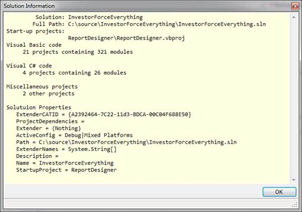

# 八、解决方案

在本章中，我们将创建一个附加程序模块来探索当前在 IDE 中打开的解决方案，并呈现关于该解决方案的一些关键统计信息的摘要屏幕。它提供了一个如何以编程方式访问解决方案各个方面的基本示例。

## 解决方案信息向导

使用向导和以下设置启动解决方案信息附加程序:

*   Visual C#(或您喜欢的语言)。
*   应用主持人:只有 Visual Studio，因为它在宏中没有意义。
*   名称/描述:关于解决方案的解决方案信息、信息和统计*。*
*   创建用户界面菜单，不要在启动时加载。

在**汇总**屏幕验证设置，如果看起来没问题，生成代码。

## 更新菜单图标

为了帮助区分我们的插件，我们将把默认图标改为灯泡符号。您可以将常量添加到您的 **connect.cs** 类文件的顶部:

```cs
    const int LIGHTBULB_ICON = 1000;

```

修改 **OnConnection** 方法，使用这个常量，而不是向导生成的硬代码 59。

```cs
        Command command = commands.AddNamedCommand2(_addInInstance, "SolutionInfo",
               "Solution Info", "Info & Statistics about solution", true,
               LIGHTBULB_ICON,
               ref contextGUIDS,
               (int)vsCommandStatus.vsCommandStatusSupported + 
               (int)vsCommandStatus.vsCommandStatusEnabled,           
               (int)vsCommandStyle.vsCommandStylePictAndText,
               VsCommandControlType.vsCommandControlTypeButton);

```

## Exec()方法

**Exec()** 方法将收集各种解决方案信息并呈现给用户。但首先，我们需要确保解决方案是开放的。

```cs
    // Only makes sense if a solution is open.
    if (_applicationObject.Solution.IsOpen==false)
        {
           MessageBox.Show("No solution is open","ERROR");
           handled = true;
           return;
        }

```

|  | 注意:请务必添加对系统的引用。项目的窗体。 |

### 解决方案信息

我们现在可以使用**解决方案**对象来探索当前开放解决方案的一些方面。我们将使用类似的方法在字符串生成器变量中构建信息，然后将文本传输到我们的图形用户界面表单。在下面的代码示例中，我们获取并显示了解决方案对象的一些简单属性:

```cs
    StringBuilder sb = new StringBuilder();
    Solution theSol = _applicationObject.Solution;

    sb.AppendLine("         Solution: " + Path.GetFileName(theSol.FullName.ToString()));
    sb.AppendLine("        Full Path: " + theSol.FullName.ToString());
    sb.AppendLine("Start-up projects: ");
    foreach (String s in (Array)theSol.SolutionBuild.StartupProjects)
         {
             sb.AppendLine("                   " + s);
         }

```

### 汇总项目信息

我们还想报告解决方案包含的项目和代码文件的数量。为此，我们需要迭代与解决方案相关的项目。

```cs
    Project theProj;                        // Generic project item.
    int NumVBprojects = 0;
    int NumVBmodules = 0;
    int NumCSprojects = 0;
    int NumCSmodules = 0;
    int NumOtherProjects = 0;

    // Iterate through the projects to determine number of each kind.
    for (int x = 1; x <= theSol.Count; x++)
    {
        theProj = theSol.Item(x);
        switch (theProj.Kind)
        {
           case PrjKind.prjKindVBProject :
              {
                 NumVBprojects++;    // Increment number of VB projects.
                 NumVBmodules += theProj.ProjectItems.Count;
                 break;
              }
           case PrjKind.prjKindCSharpProject :
              {
                 NumCSprojects++;    // Increment number of C# projects.
                 NumCSmodules += theProj.ProjectItems.Count;
                 break;
              }
           default:
             {
                NumOtherProjects++;
                break;
             }
        }
    }

```

项目对象的 **Kind** 属性是一个 GUID 字符串，所以我们在确定项目类型时需要一点帮助。为此，我们需要在附加程序项目中添加对 **VSLangProj** 的引用。

当您试图引用项目种类时，您可能会看到一个编译器错误，指出不能嵌入 prjKind。要解决此错误，右键单击 **VSLangProj** 参考并调出**属性**对话框。将**嵌入互操作类型**设置为**假**以防止类型嵌入到程序集中。

现在我们已经收集了信息，我们需要格式化它以显示给用户，下面的代码示例显示了这一点:

```cs
    sb.AppendLine("Visual Basic code");
    sb.AppendLine("     " + NumVBprojects.ToString() + " projects containing " +
                            NumVBmodules.ToString() + " modules");
    sb.AppendLine("");
    sb.AppendLine("Visual C# code");
    sb.AppendLine("     " + NumCSprojects.ToString() + " projects containing " +
                            NumCSmodules.ToString() + " modules");
    sb.AppendLine("");
    sb.AppendLine("Miscellaneous projects");
    sb.AppendLine("     " + NumOtherProjects.ToString() + " other projects");
    sb.AppendLine("");

```

项目 GUIDS 存储在注册表项 HKLM \软件\微软\VisualStudio\ <vers>项目中。如果在**解决方案**附加程序期间需要报告其他项目类型，您可以将 GUID 复制到其他常量中。以下是 VS 项目的一些示例常数:</vers>

```cs
    // Constants for additional project types.
         const string WEB_APPLICATION_PROJECT = "{E24C65DC-7377-472b-9ABA-BC803B73C61A}";
         const string DEPLOYMENT_PROJECT = "{54435603-DBB4-11D2-8724-00A0C9A8B90C}";

```

### 属性

在我们收集了一些解决方案信息之后，我们可以遍历与解决方案相关联的属性，并将它们附加到我们的字符串生成器变量中。

```cs
    // Get properties.
    sb.AppendLine("Solutuion Properties");
    Properties props = theSol.Properties;
    foreach (Property prop in props)
          {
             sb.Append("   " + prop.Name + " = ");
               try
                  {
                      sb.AppendLine(prop.Value.ToString());
                   }
               catch
                   {
                      sb.AppendLine("(Nothing)");
                  }
            }

            // Put built string onto form.
            SolInfoForm theForm = new SolInfoForm();
            theForm.SOLINFO.Text = sb.ToString();
            theForm.ShowDialog();

            handled = true;
            return;

```

## 显示结果

在我们构建了字符串构建器变量之后，我们需要创建一个表单来向最终用户显示它们。



图 12:解决方案信息表单

您可以下载项目代码或者创建类似于图 12 中的表单。附加程序代码假定文本框控件名为 SOLINFO。请确保名称相同，并将其修饰符标记为 PUBLIC，以便附加程序可以将解决方案信息放在表单上。

## 解决方法

除了显示关于解决方案的信息，您还可以对解决方案执行某些操作，就像 IDE 一样。其中包括:

### 关闭

此方法关闭解决方案，使用可选的布尔参数首先保存解决方案。

### FindProjectItem

此方法搜索项目空间，按文件名查找项目。如果找到该项，该方法将返回对您正在搜索的文件的项目项引用。

### 保存

此方法允许您以不同的文件名保存解决方案。

## 解决方案构建

解决方案对象还提供了有关活动配置和上次生成状态的信息。您可以使用解决方案的**解决方案构建**对象来执行解决方案级别的操作，例如:

### 建造

使用可选参数生成解决方案，以等待生成完成。作为测试周期的一部分，您可能会决定在后台进行自动化的解决方案构建。

### 清洁

此方法清理解决方案使用的额外文件，并提供了一个在继续之前等待完成的选项。

### 跑

此选项运行与解决方案关联的启动项目。

### 建筑状态

此属性报告生成的当前状态，并且是以下列表中的枚举类型:

*   vsBuildStateDone:构建完成。
*   vsBuildStateInProgress:当前正在构建的解决方案。
*   vsBuldStateNotStarted:尚未生成解决方案。