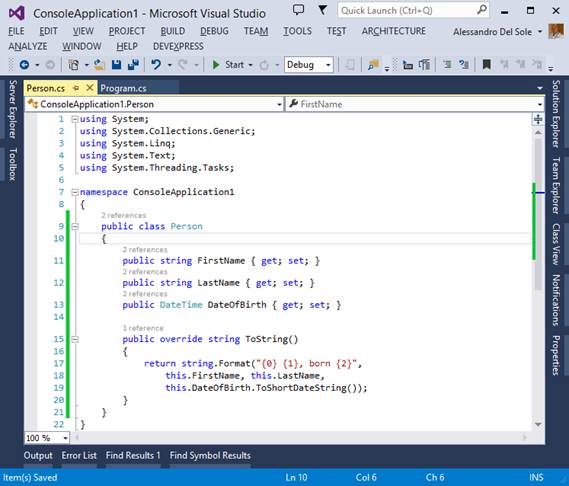
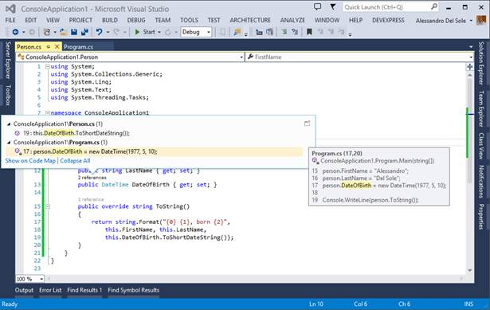
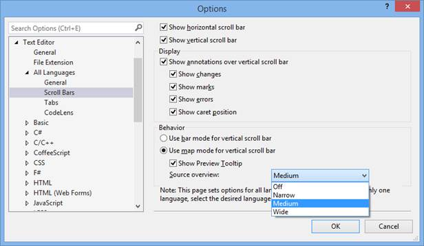
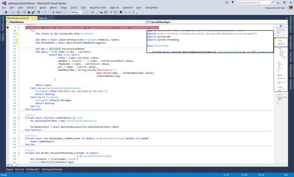
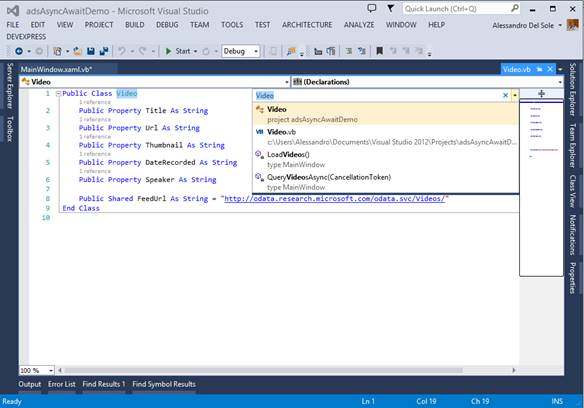

# 第 3 章代码编辑器改进

Visual Studio 2013 中的代码编辑器是 Microsoft 进行了大量投资的 IDE 领域之一。目标是让开发人员继续专注于他们正在编写的代码，帮助他们更快地执行常见任务并节省时间。本章介绍代码编辑器中的新功能，这些功能将帮助您在编写代码时提高工作效率。

## 查看定义

**查看定义**是一个新特性，您可以使用它在活动代码编辑器窗口中显示的弹出窗口中查看和编辑类或类成员的定义。这有助于避免为了打开包含需要编辑的代码块的代码文件而离开活动窗口。为了理解它是如何工作的，创建一个新的控制台应用程序，然后添加一个`Person`类，如下所示。

*Visual C#*

```
    public class Person
    {
    public string FirstName { get; set; }
    public string LastName { get; set; }
    public DateTime DateOfBirth { get; set; }

    public override string >ToString()
    {
    return string.Format("{0} {1}, born {2}",
    this.FirstName, this.LastName,
    this.DateOfBirth.ToShortDateString());
    }
    }

```

*Visual Basic*

```
    Public Class Person
    Public Property FirstName As String
    Public Property LastName As String
    Public Property DateOfBirth As Date

    Public Overrides Function >ToString() As String
    Return String.Format("{0} {1}, born {2}",
    Me.FirstName, Me.LastName,
    Me.DateOfBirth.ToShortDateString())
    End Function
    End Class

```

示例应用程序的`Main`方法只是创建一个`Person`类的新实例，并分配一些值，如下面的代码所示。

*Visual C#*

```
    class Program
    {
    static void Main(string>[] args)
    {
    Person person = new Person();

    person.FirstName = "Alessandro";
    person.LastName = "Del Sole";
    person.DateOfBirth = new DateTime(1977, 5, 10);

    Console.WriteLine(person.ToString());
    Console.ReadLine();
    }
    }

```

*Visual Basic*

```
    Module Module1
    Sub Main()
    Dim person As New Person

    person.FirstName = "Alessandro"
    person.LastName = "Del Sole"
    person.DateOfBirth = New DateTime(1977, 5, 10)

    Console.WriteLine(person.ToString())
    Console.ReadLine()
    End Sub
    End Module

```

现在假设您想对`Person`类进行一些编辑，比如重命名成员或添加新成员。右键单击类型名称(在我们的示例中为`Person`)并选择**查看定义**。从图 8 中可以看到，弹出窗口显示了`Person`类的代码和定义它的代码文件的名称。


图 8:使用 Peek 定义编辑代码

Peek Definition 提供了一个全功能编辑器，因此您可以根据需要更改您的类(或成员)定义，而无需离开活动窗口。如果进行任何更改，这些更改将立即在使用该类的代码中可见。完成后，您可以简单地单击通常的“关闭”按钮来隐藏“查看定义”内容。这个工具是一个非常有用的补充，因为它不仅允许您在对类型进行更改时停留在活动的编辑器窗口中，而且它还使您更容易在数百万行代码和数千个代码文件中找到类型定义。

## 码透镜

|  | 注意:此功能仅在终极版中可用。 |

在许多情况下，您可能需要知道一个对象在代码中被使用了多少次以及在哪里使用。Visual Studio 的早期(和当前)版本提供了一个名为**查找所有引用**的工具，该工具在一个名为“查找符号结果”的工具窗口中显示了一个对象的引用列表，您可以通过在代码编辑器中右键单击一个对象的名称，然后选择**查找所有引用**来调用该工具。Visual Studio 2013 向前迈进了一步，提供了一个额外的代码引用集成视图，称为 **CodeLens** 。请看图 9，它显示了代码编辑器中的`Person`类定义。



图 9: Visual Studio 2013 显示了每个类型和成员的引用数量。

如您所见，在每个类型和成员名称的上方，Visual Studio 显示了引用的数量。如果您单击该数字，工具提示将显示对象的使用位置；如果将鼠标指针放在包含引用的代码行上，另一个工具提示将显示包含引用的完整代码块(参见图 10)。



图 10:从代码编辑器中查找对象引用

CodeLens 还显示每个引用的包含代码文件和使用该对象的行号，并允许通过双击工具提示中的代码行快速导航到该引用。事实上，当您的解决方案处于 Team Foundation Server 的源代码控制之下时，CodeLens 也做了一项令人惊叹的工作；事实上，它可以显示关于单元测试、通过测试、失败测试以及其他团队成员所做编辑的信息。

## 增强滚动条

在大多数现实世界的项目中，代码文件由数百行代码组成，因此在文件中查找特定的代码块会变得很困难。为了更容易浏览非常长的代码文件，Visual Studio 2013 在代码编辑器窗口中提供了一个改进的滚动条，称为增强滚动条。基本上，滚动条可以显示代码的映射(映射模式)，这样，当您上下移动鼠标指针时，放大镜会显示代码块的预览。这对于长代码文件非常有用，如果你想看到一些代码定义而不需要在代码文件中从一个位置跳到另一个位置。

要启用地图模式，右键单击滚动条，然后选择**滚动条选项**。在**选项**对话框中，找到**行为**组，然后选择**垂直滚动条使用地图模式**选项，如图 11 所示。



图 11:启用滚动条的地图模式

|  | 注意:启用代码预览是可选的，但我建议您保持选中状态。毕竟，这是这个工具的真正好处。 |

您也可以通过更改**来源概述**框的值来选择地图的大小。默认值为“中”，这在大多数情况下是一个不错的选择。点击**确定**启用地图模式。当您回到代码编辑器时，您可以看到滚动条的新外观。图 12 显示了一个例子。



图 12:在地图模式下使用滚动条浏览代码

当您将鼠标指针移到滚动条上时，工具提示会显示地图上当前位置的代码预览。蓝线表示光标位置，黄点表示编辑过的代码行，红点表示断点。您只需返回滚动条选项，选择**垂直滚动条使用滚动条模式**选项，即可恢复到经典滚动条。

|  | 提示:增强的滚动条适用于 Visual Studio 2013 支持的所有语言。这意味着当您启用映射模式时，滚动条将以任何语言显示每个代码文件的映射，直到您再次禁用它。 |

## 导航至

Visual Studio 2013 在代码编辑器中的另一个关键功能叫做**导航到**。使用此功能，您可以通过将光标放在类型或成员上，然后按下 **CTRL +，**，轻松找到类型或成员的定义。图 13 演示了 Visual Studio 2013 如何显示包含代码编辑器中所选名称的类型和成员。



图 13:使用导航到

如图 13 所示，显示了与类型或成员名称匹配的对象列表。您可以按键盘上的向上和向下箭头来查看代码编辑器中的每个定义，而无需实际激活窗口。正如您很容易理解的那样，如果您的解决方案中有相同类型的多个定义，并且您希望快速转到其定义，导航到将变得特别有用。

## 章节总结

Visual Studio 2013 中的代码编辑器通过新功能得到了显著增强，这些新功能使完成常见任务变得更加容易，从而提高了开发人员的工作效率。Peek Definition、集成引用、增强的滚动条和 Navigate To 为使新的 IDE 成为编写代码的好地方做出了贡献。