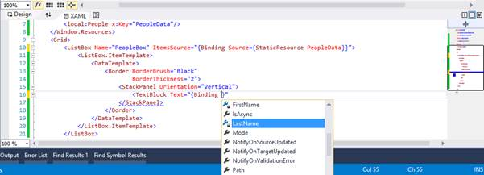
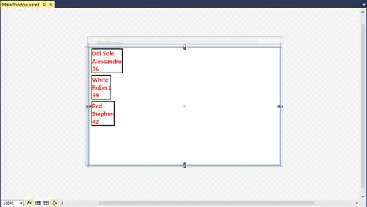
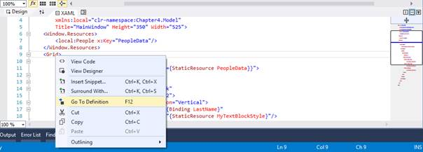
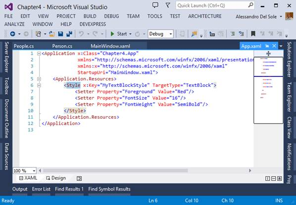
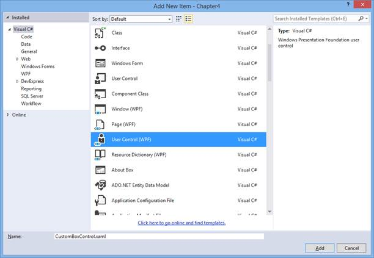
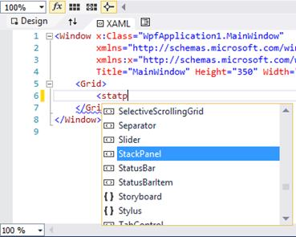
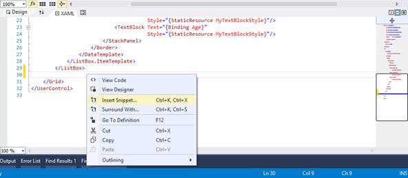

# 第四章 XAML 智能感知的改进

XAML ( *可扩展应用程序标记语言*)是一种标记语言，用于在 Windows Presentation Foundation(WPF)、Silverlight、Windows Phone 和 Windows 8 的 Windows 商店应用程序等技术中设计用户界面。如果你至少对其中一种技术有经验，我想你也有，你知道 Visual Studio，尤其是最新版本，提供了一个非常好的设计者。此外，微软还提供了另一个名为 Expression Blend 的工具，该工具专门用于专业设计人员，允许使用专业工具在用户界面上工作，而不会干扰后面的托管代码。作为一名开发人员，大多数情况下您将使用 Visual Studio。虽然设计师已经达到了非常好的生产力水平，但很多时候你需要手动编写 XAML 代码；这是一种非常常见的做法，例如，当您需要以精确的比例调整 UI 中元素的大小时，或者当您需要为控件分配样式或设置数据绑定时。当您手动编辑 XAML 时，您使用 XAML 代码编辑器，它实现了智能感知技术，允许您更快地编写代码。然而，IntelliSense for XAML 一直缺少一些要点，例如在使用数据绑定或分配样式时识别可用的数据源和资源。最后，Visual Studio 2013 解决了这个问题，并在 XAML 代码编辑器中引入了许多新功能。基于 XAML 的所有技术都可以使用所有这些新功能。

|  | 注意:在 Visual Studio 2013 的第一次预览中，XAML 代码编辑器中的新功能仅适用于 Windows 商店应用程序。此限制已在 Visual Studio 2013 版本候选中删除。 |

## XAML 智能感知用于数据绑定和资源

在 Visual Studio 2013 中，现在可以在将数据源分配给绑定表达式或分配资源(如样式)时利用智能感知。

|  | 注意:此功能仅适用于您在 XAML 声明的数据源和资源。如果在托管代码中创建集合的实例(在运行时)，则智能感知无法识别这一点。它还可以处理通过 d: XML 命名空间声明的设计时信息。 |

让我们用一个例子来看看这个特性是如何工作的。

该示例的目标是声明一个对象集合，并使用新的智能感知功能将该集合绑定到用户界面。数据将显示在`ListBox`控件中。为了一致性，创建一个名为*第四章*的新 WPF 应用项目。向项目中添加一个新文件夹，并将其称为模型。在文件夹中添加一个新的类，叫做`Person`。新类的代码如下所示。

*Visual C#*

```cs
    namespace Chapter4.Model
    {
    public class Person
    {
    public string FirstName { get; set; }
    public string LastName { get; set; }
    public int Age { get; set; }
    }
    }

```

*Visual Basic*

```cs
    Namespace Model
    Public Class Person
    Public Property FirstName As String
    Public Property LastName As String
    Public Property Age As Integer
    End Class
    End Namespace

```

|  | 注意:虽然 Visual C#会自动为您在项目中创建的每个子文件夹添加命名空间定义，但 Visual Basic 不会；它只是识别根命名空间下的对象。为了两种语言的一致性，我们在 Visual Basic 中添加了一个名称空间声明，这样我们就可以对两种语言使用相同的 XAML。 |

这是一个非常简单的类，只有三个属性，但是我们现在关注的是新工具，而不是编写复杂的代码。下一步是向模型文件夹添加一个新的`Person`对象集合，称为`People`。代码如下。

*Visual C#*

```cs
    using System.Collections.Generic;
    using System.Collections.ObjectModel;

    namespace Chapter4.Model
    {
    //add a using System.Collections.ObjectModel; directive
    public class People>: ObservableCollection<Person>>
    {
    public People()
    {
    Person one = new Person {LastName="Del Sole",
    FirstName="Alessandro", Age=36};
    Person two = new Person { LastName = "White",
    FirstName = "Robert", Age = 39};
    Person three = new Person { LastName = "Red",
    FirstName = "Stephen", Age = 42 };

    this.Add(one);
    this.Add(two);
    this.Add(three);
    }
    }
    }

```

*Visual Basic*

```cs
    Imports System.Collections.ObjectModel
    Namespace Model
    Public Class People

    Inherits ObservableCollection(Of Person>)
    Public Sub New()
    Dim one As New Person() With {.LastName = "Del Sole",
    .FirstName = "Alessandro",
    .Age = 36}
    Dim two As New Person() With {.LastName = "White",
    .FirstName = "Robert", .Age = 39}
    Dim three As New Person() With {.LastName = "Red",
    .FirstName = "Stephen",
    .Age = 42}

    Me.Add(one)
    Me.Add(two)
    Me.Add(three)
    End Sub
    End Class
    End Namespace

```

`People`类继承自`ObservableCollection<Person>`。`People`集合的构造函数创建三个`Person`类的实例，并用样本数据填充它们。我们以这种方式创建集合的原因是，XAML 的智能感知不支持在运行时创建的集合。相反，使用这种方法，我们可以在应用程序的资源中声明集合；每次在 XAML 资源中声明一个类时，都会调用该类的构造函数，因此在我们的例子中，当添加到 XAML 资源中时，会自动创建并填充集合的一个实例。这样的实例可以被数据绑定到用户界面中的控件。为此，双击解决方案资源管理器中的**主窗口. xaml** 文件。当设计器和 XAML 编辑器出现时，首先在`Window`标签中添加以下名称空间声明。

```cs
    <Window x:Class="Chapter4.MainWindow"

            xmlns:x="http://schemas.microsoft.com/winfx/2006/xaml"
            xmlns:local="clr-namespace:Chapter4.Model"
            xmlns:controls="clr-namespace:Chapter4"
            Title="MainWindow" Height="350" Width="525">

```

为了引用`People`和`Person`类，这是必要的。下一步是将数据源声明为资源，如下面的代码所示。

```cs
    <Window.Resources>
    <local:People x:Key="PeopleData"/>
    </Window.Resources>

```

这是`People`集合的一个实例被声明的地方，所以我们准备将数据绑定到一个`ListBox`控件。如您所知，为了呈现来自集合的信息，所谓的项目控件(如`ListBox`)需要实现一个`DataTemplate`。让我们在不指向任何数据源的情况下，通过在`Window`标签中编写以下代码来添加一个`ListBox`及其`DataTemplate`。

```cs
    <Grid>
    <ListBox Name="PeopleBox" >
    <ListBox.ItemTemplate>
    <DataTemplate>
    <Border BorderBrush="Black"
    BorderThickness="2">
    <StackPanel Orientation="Vertical">
    <TextBlock />
    <TextBlock />
    <TextBlock />
    </StackPanel>
    </Border>
    </DataTemplate>
    </ListBox.ItemTemplate>
    </ListBox>
    </Grid>

```

数据模板只是用一个设置在`StackPanel`容器中的`TextBlock`控件呈现`Person`类的每个属性值。`Border`装饰器用于在设计器内部更好地突出显示，但它是可选的。为了全面展示新的智能感知功能，我们还可以为`TextBlock`控件添加新的样式。在解决方案资源管理器中，双击 **App.xaml** 文件。在`the` `Application.Resources`标签中，添加以下样式，该样式允许以红色呈现当前字体的不同大小和粗细的文本。

```cs
    <Application.Resources>
    <Style x:Key="MyTextBlockStyle" TargetType="TextBlock">
    <Setter Property="Foreground" Value="Red"/>
    <Setter Property="FontSize" Value="16"/>
    <Setter Property="FontWeight" Value="SemiBold"/>
    </Style>
    </Application.Resources>

```

现在，您已经准备好为 XAML 测试新的惊人的智能感知。

### 智能感知进行数据绑定

切换回 MainWindow.xaml 文件定位`ListBox`控件。如您所知，项控件是通过在设计时(使用 XAML 代码)或运行时(在托管代码中)用集合的实例分配它们的`ItemsSource`属性来填充的。我们之前将数据源声明为资源，因此需要一个源绑定表达式来将其指定为`ListBox`的`ItemsSource`属性。要了解 XAML 智能感知在这一点上的优势，请键入以下代码(不仅仅是复制/粘贴)。

```cs
    <ListBox Name="PeopleBox"
    ItemsSource="{Binding Source={StaticResource PeopleData}}">

```

键入`StaticResource`后，您将看到智能感知将如何显示可用于数据绑定的可用对象列表，如图 14 所示。


图 14:数据绑定的智能感知

选择`PeopleData`对象完成数据绑定。与编写代码的其他场景一样，智能感知将在您键入时帮助您完成表达式。您也可以用键盘上的箭头选择数据源，然后按下**选项卡**。

|  | 提示:如果窗口中有多个数据绑定控件，您可能希望绑定父容器的数据上下文属性(在本例中为网格)，然后使用{Binding}表达式分配 ItemsSource 属性。 |

同样，您可以在智能感知的帮助下将`TextBlock`控件绑定到集合的属性，如图 15 所示。



图 15:智能感知显示了可以数据绑定的属性。

这是一个巨大的好处，原因有几个。首先，您可以更快地编写代码。其次，您不需要记住属性的名称或大小写，从而将错别字的风险降至最低。`ListBox`数据模板的完整代码如下。

```cs
    <DataTemplate>
    <Border BorderBrush="Black"
    BorderThickness="2">
    <StackPanel Orientation="Vertical">
    <TextBlock Text="{Binding LastName}"/>
    <TextBlock Text="{Binding FirstName}"/>
    <TextBlock Text="{Binding Age}"/>
    </StackPanel>
    </Border>
    </DataTemplate>

```

### 智能感知获取资源

下一步是使用智能感知来分配资源。我们之前定义了一个样式，现在必须分配给窗口中的每个`TextBlock`控件。第一个`TextBlock`的代码如下。您可能需要手动键入样式分配，以便查看 XAML 智能感知功能的运行情况。

```cs
    <TextBlock Text="{>Binding LastName}"
    Style="{StaticResource MyTextBlockStyle}"/>

```

就像数据绑定一样，当您分配`StaticResource`表达式时，智能感知将显示可用的资源，如图 16 所示。


图 16:智能感知显示了指定控件的可用资源。

值得一提的是，在样式的情况下，智能感知将只显示对您正在处理的控件有效的样式，这些样式可以是在应用程序中定义的，也可以是在。NET 框架或软件开发工具包扩展。这是一个额外的好处，因为您不仅可以避免错误，并且可以更快地编写代码，而且还可以只获取用户界面中所选元素的特定资源。为了完整起见，图 17 显示了设计者如何看待这一点。



图 17:数据和样式分配后的设计者

您可以通过按下 **F5** 来运行应用程序，以查看它如何显示数据。

## 转到定义

**转到定义**是您已经从托管代码编辑器中知道的功能。使用此功能，您可以右键单击对象的名称，从上下文菜单中选择**转到定义**，并查看对象是如何在对象浏览器窗口中定义的(如果它是中的内置对象)。. NET Framework，或者如果它是您编写的对象，则放在适当的代码文件中。XAML 编辑器现在也可以使用这个特性，如图 18 所示。



图 18:进入定义现在可以在 XAML 代码编辑器中使用。

|  | 提示:在 XAML 代码编辑器中，转到定义的快捷键也是 F12。 |

“转到定义”可用于以下对象:

*   资源
*   系统类型
*   本地类型(自定义控件)
*   绑定表达式

让我们遍历每个对象，看看“转到定义”的不同行为。

### 资源

在基于 XAML 的应用程序中，资源可以有两种类型:在程序集中定义的资源(来自。NET，来自 SDK，或者来自第三代<sup>第三代</sup>党的图书馆)和当前应用程序中定义的资源。在第一种情况下，转到定义将打开指向指定资源定义的对象浏览器窗口。例如，在之前创建的示例应用程序中，将光标放在任何一个`TextBlock`控件中的`MyTextBlockStyle`赋值上，然后右键单击并选择**转到定义**(参见图 19)。


图 19:转到示例应用程序中定义的样式的定义

此时，代码编辑器将在适当的代码文件中的确切位置打开资源的定义；在我们的例子中，App.xaml 文件中的样式定义。如您所见(图 20)，光标放在定义的开头，选择`Style`标签。



图 20:转到定义在准确的位置打开资源定义。

### 系统类型

“转到定义”适用于中定义的类型。NET 框架和软件开发工具包扩展。由于这些类型的源代码不可用，Visual Studio 会在对象浏览器窗口中显示定义。例如，如果在示例应用程序的 MainWindow.xaml 文件中选择`Grid`控件上的“转到定义”，将打开对象浏览器，显示控件的定义(参见图 21)。


图 21:用对象浏览器查看控件的定义

### 本地类型

转到定义对本地类型有特定的行为；这些是由开发人员创建的用户控件和自定义控件。

|  | 注意:这不是一本关于 WPF 和其他基于 XAML 的技术的书，所以我不会详细介绍用户控件和自定义控件之间的区别。作为提示，用户控件是现有控件组合的结果；自定义控件通过代码中的附加功能扩展现有的内置控件，并提供模板化、主题化和样式化入口点。欲了解更多信息，请阅读 MSDN 图书馆的[控件创作概述](http://msdn.microsoft.com/en-us/library/ms745025.aspx)。 |

为了理解它是如何工作的，让我们对示例应用程序进行一些编辑。在**解决方案资源管理器**中，右键单击项目名称，选择**添加新项目**。然后，在**添加新项目**对话框中，选择**用户控件(WPF)** 模板，并命名新控件 **CustomBoxControl.xaml** (见图 22)。



图 22:添加新的用户控件

将 MainWindow.xaml 中的`ListBox`定义剪切粘贴到新控件中，对`local` XML 命名空间声明重复此步骤。最后，添加一个指向`People`集合的本地资源，就像您在 MainWindow.xaml 中所做的那样。

```cs
    <UserControl x:Class="Chapter4.CustomBoxControl"

    xmlns:x="http://schemas.microsoft.com/winfx/2006/xaml"
    xmlns:mc="http://schemas.openxmlformats.org/markup-compatibility/2006"
    xmlns:d="http://schemas.microsoft.com/expression/blend/2008"
    mc:Ignorable="d" xmlns:local="clr-namespace:Chapter4.Model"
    d:DesignHeight="300" d:DesignWidth="300">
    <UserControl.Resources>
    <local:People x:Key="PeopleData"/>
    </UserControl.Resources>
    <Grid>
    <ListBox Name="PeopleBox"
    ItemsSource="{Binding
    Source={StaticResource PeopleData}}">
    <ListBox.ItemTemplate>
    <DataTemplate>
    <Border BorderBrush="Black"
    BorderThickness="2">
    <StackPanel Orientation="Vertical">
    <TextBlock Text="{>Binding LastName}"
    Style="{StaticResource
    MyTextBlockStyle}"/>
    <TextBlock Text="{>Binding FirstName}"
    Style="{StaticResource
    MyTextBlockStyle}"/>
    <TextBlock Text="{>Binding Age}"
    Style="{StaticResource
    MyTextBlockStyle}"/>
    </StackPanel>
    </Border>
    </DataTemplate>
    </ListBox.ItemTemplate>
    </ListBox>
    </Grid>
    </UserControl>

```

在 MainWindow.xaml 中，添加以下 XML 命名空间以包含用户控件。

```cs
    xmlns:controls="clr-namespace:Chapter4"

```

然后，按如下方式添加用户控件:

```cs
    <Grid>
    <controls:CustomBoxControl/>
    </Grid>

```

如果您做的一切都是正确的，那么设计器现在应该还是如图 17 所示。现在，右键单击`Grid`内的`CustomBoxControl`，选择**转到定义**。如您所见(图 23)，Visual Studio 2013 打开了“查找符号结果”窗口，并显示了两个结果，一个用于 XAML，一个用于托管代码。


图 23:添加新的用户控件

原因是用户控件(以及自定义控件)由两个组件组成，定义用户界面的 XAML 文件和代码隐藏文件。然后，您可以双击所需的文件并查看适当的定义。“查找符号结果”是一个不错的选择，因为您还可以看到定义开始的行号。

### 绑定表达式

“转到定义”也适用于绑定表达式。例如，您可以右键单击数据源的名称或`Binding`表达式内的绑定属性的名称，然后选择转到定义。将数据源(集合)定义为静态资源后，转到定义会将您移至资源的定义；在托管代码中定义数据源后，“转到定义”会尝试在代码中进行完整的符号搜索，并在“查找符号结果”窗口中显示搜索结果。在数据绑定属性的情况下，“转到定义”会将您移至公开此类属性的类的代码。

## 自动关闭标签

在 XAML 添加项目时，代码编辑器会自动添加结束标记。例如，当您添加一个`<Button>`标签时，Visual Studio 会添加匹配的`</Button>`标签。这并不新鲜，因为这是早期版本中的正常行为。新功能是，如果您在第一个标签中的`>`符号前添加斜线，结束标签将自动移除。换句话说，在这段代码中:

```cs
    <Button Width="100" Height="50" Click="Button_Click" Name="Button1" Content="Click me!"></Button>

```

如果在`>`符号前输入斜线，会自动变成如下代码。

```cs
    <Button Width="100" Height="50" Click="Button_Click" Name="Button1" Content="Click me!"/>

```

这是编辑器可以帮助您更快地编写代码的另一种方式。

## 智能感知匹配

Visual Studio 2013 继续致力于改善您的编码体验，为 XAML 代码编辑器添加了另一项功能，称为智能感知匹配。基本上，当您开始键入控件或资源的名称时，即使您输入了错误的字符，智能感知也会在您键入时帮助您找到合适的控件。例如，图 24 显示了智能感知如何理解你需要一个`StackPanel`，即使你输入错误。



图 24:智能感知匹配使您在键入时选择控件变得容易。

智能感知做得很好，这取决于有多少标识符可以匹配您正在键入的内容。例如，在一个 Windows 商店应用程序中，如果您键入`Abbb`，它将提示`AppBar`控件，这可能是您的选择。

## 更好的支持评论

Visual Studio 早期版本中的一个常见问题是，当您向包含另一个注释的代码块添加注释时，它会导致代码编辑器显示错误消息。图 25 显示了 Visual Studio 2012 如何处理这种情况。


图 25: Visual Studio 2012 无法正确识别嵌套注释。

问题是代码编辑器无法正确识别注释结束标记。Visual Studio 2013 解决了这个问题，因此当您向包含另一个注释的代码块添加注释时，整个代码块都会被注释，如图 26 所示。


图 26: Visual Studio 2013 正确识别嵌套注释。

## 可重用的 XAML 代码片段

[用于 IntelliSense 的可重用代码片段](http://msdn.microsoft.com/en-us/library/ms165392.aspx)自 Visual Studio 2005 以来一直是非常受欢迎的功能，但在 2012 版中一直仅限于托管语言、XML 和 HTML/JavaScript。有了代码片段，您可以利用 Visual Studio 提供的庞大代码库，或者创建自己的代码片段，以便在智能感知的支持下更容易重用您的代码。XAML 对代码片段的需求一直非常强烈，因此许多开发人员使用不同的技术来存储他们的可重用代码。我自己为 Visual Studio 2010 编写了一个扩展[来支持 XAML 代码片段。Visual Studio 2013 又向前迈进了一步，在 XAML 代码编辑器中引入了对代码片段的内置支持。](https://xamlcodesnippets.codeplex.com/)

要使用代码片段，只需在代码编辑器中右键单击并选择**插入片段**或**用**包围，如图 27 所示。



图 27: Visual Studio 2013 为 XAML 代码片段提供了支持。

此时，将出现可用代码片段的列表。您可以从列表中选择您需要的代码片段，相关的代码将放在那里(参见图 28)。


图 28:从列表中选择一个代码片段

|  | 注:本章基于 2013 年 10 月向 MSDN 用户发布的 Visual Studio 2013 RTM。在这个版本中，只提供了一个 XAML 片段。在撰写本文时，我们无法预测是否会提供额外的代码片段，或者您是否只能导入自己的自定义代码片段。本章不解释如何构建自定义代码段文件，这超出了它的范围。但是，您可以阅读蒂姆·豪雅的这篇有趣的文章，它解释了 XAML 从创建到部署的代码片段。 |

您可以使用“代码片段管理器”工具(可从“工具”菜单中获得)来管理代码片段文件，就像您已经对其他语言所做的那样。在这里，您可以导入、删除和查看有关代码片段文件的详细信息。通过添加 XAML 代码片段，Visual Studio 2013 弥补了与其他语言的代码编辑器之间的差距。

## 章节总结

毫无疑问，在任何基于 XAML 的技术中，包括 WPF、Silverlight、Windows Phone 和 Windows Store Apps，在 XAML 代码中手动调整用户界面和提供数据绑定是一项非常常见的任务，尽管存在专门的设计工具。Visual Studio 2013 最终为 XAML 代码编辑器提供了重要的改进，例如用于识别数据源和样式的 IntelliSense 转到系统类型、本地类型、自定义和用户控件的定义；注释嵌套代码块；更好地处理结束标记，以及 IntelliSense 匹配，帮助您快速选择控件；和可重用的代码片段，最终添加到 XAML，使该工具在所有支持的语言中都可用。