# 第五章 Visual Studio 2013 for Web 和 Windows Azure

网络编程是许多公司和开发者的核心业务。创建网站意味着通过互联网向全球潜在客户提供应用程序，或者通过本地内部网提供内部门户或部门应用程序。由于 web 在程序员生活中的重要性，云计算平台每天都变得越来越重要。借助 Windows Azure，微软发布了有史以来最强大、最完整的云基础设施之一。有了像 Windows Azure 这样的平台，您不再需要内部数据中心，不再需要购买物理服务器和支付维护费用；使用 Windows Azure，您只需为实际使用的服务付费。本章没有解释什么是 ASP.NET 和 Windows Azure，也没有解释如何为这两个平台创建应用程序；这是其他资源的目标。相反，这里我们关注的是 Visual Studio 2013 中提供的新工具如何通过与 IDE 的更深入集成，使网络和云编程成为一种更令人惊叹的体验。

|  | 注:该。NET Framework 4.5.1 为 ASP.NET 引入了一些新功能。如果您想了解最新动态，可以访问 MSDN 图书馆的[相关页面](http://www.asp.net/visual-studio/overview/2013/release-notes)。在这里，您将了解 ASP.NET 集成开发环境中的新特性，而不是运行时。 |

## ASP.NET IDE 有什么新功能

Visual Studio 2013 引入了新工具，并利用 ASP.NET 更新了现有的网络开发环境。本章重点介绍您必须了解的最重要的特性，因为它们将改变您创建 web 应用程序的方式。

### 一个 ASP。NET:一种新的、统一的体验

过去，微软发布了几种创建网络应用程序的技术，如网络表单、ASP.NET 动态数据和 MVC。同样，发布了许多框架和库，如 jQuery、jQuery Mobile、Web API 和 Windows Identity Foundation。您可以在几种项目模板中进行选择，以便稍后构建 web 应用程序并添加对所需框架的引用。Visual Studio 2013 通过引入所谓的**One ASP.NET**极大地简化了这一过程，它提供了统一的开发体验，使使用任何可用平台变得容易，并使库可以互换。但是“一个 ASP.NET”在实践中意味着什么？要了解是什么，打开 Visual Studio 2013，选择**文件**、**新项目**。选择**网页**模板文件夹。如图 29 所示，现在只有一个项目模板。

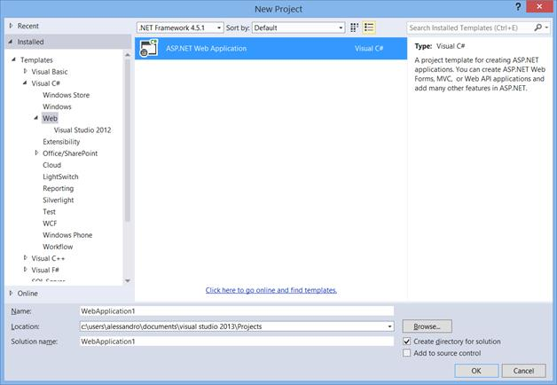

图 29:一个 ASP.NET 也意味着简化项目的创建。

与过去不同，过去您必须在多个项目模板中进行选择，现在您只有一个模板。不要害怕这个；在接下来的步骤中，您将了解该功能背后的原因以及如何利用它。为了向后兼容，您仍然可以使用从 Visual Studio 2012 继承的模板创建 web 应用程序。只需展开**网页**模板文件夹，选择 **Visual Studio 2012** 子文件夹(如图 29 所示)。您将看到基于网络表单、MVC 和 Ajax 的可用项目模板的经典列表。让我们关注一个 ASP.NET，双击单个项目模板。此时，Visual Studio 2013 将显示一个新的对话框，如图 30 所示。

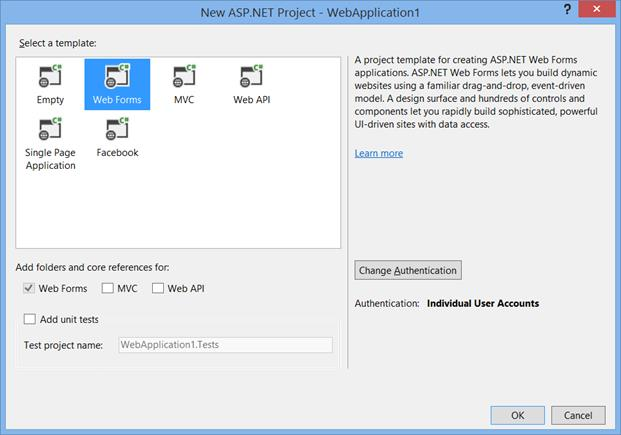

图 30:选择表示框架、认证、参考

为什么新方法被称为“一个 ASP.NET”越来越清楚了。在一个地方，您可以:

*   选择表示框架，如网络表单或 MVC。
*   选择一个现成的应用程序存根，如单页应用程序或脸书应用程序模板。
*   选择身份验证模式:匿名、个人(ASP。NET)、Windows(适用于 Windows 域)、组织(基于活动目录、Office 365 和 Windows Azure 活动目录)。
*   添加单元测试。
*   添加文件夹和对特定于其他框架的库的引用；例如，在网络表单应用程序中，您可以使用 MVC 库，反之亦然。

这种创建 web 应用程序的新方法让您有机会使用多种类型的库，充分利用 ASP.NET 4 . 5 . 1 中的所有库。此外，One ASP.NET 通过为您添加推荐人简化了流程。对网络表单、MVC 和其他项目模板的实验留给您作为练习。现在让我们仔细看看集成开发环境的新特性。

### 网络表单支架

脚手架是关于数据的。基本上，使用支架，集成开发环境可以基于建模的数据源(如 ADO.NET 实体框架)生成视图模型和视图；借助支架，Visual Studio 为您生成无需编写一行代码就可以读取、插入、删除或更新数据的页面。从技术上讲，Visual Studio 生成一个**控制器**，这是一个包含对数据执行 C.R.U.D(创建、读取、更新、删除)操作所需代码的类，以及处理数据的页面(**视图**)，每个 C.R.U.D .操作一个。脚手架在 ASP.NET 发展中不是一个新概念；它最初是与 ASP.NET MVC 一起引入的。好消息是，Visual Studio 2013 也为网络表单带来了脚手架。这是可能的，因为一个 ASP.NET 的经验；事实上，Visual Studio 将适当的 MVC 依赖项注入到 Web Form 项目中，然后为您完成大部分工作。如果您已经在 MVC 项目中使用了这种技术，您将熟悉大多数概念。

|  | 注意:使用 Visual Studio 2008 和。NET Framework 3.5 Service Pack 1，微软引入了 ASP.NET 动态数据，这是一种为 web 创建现代的、以数据为中心的应用程序的创新方式。动态数据在以后的版本中仍然可用。支架的概念是 ASP.NET 动态数据的基础，但是我们今天所说的支架是完全不同的，它是基于新的框架、库和实现不同的代码隐藏。为此，请确保您已经清楚，在本章中，我们通过指出 MVC(以及现在的网络表单)实现来引用支架。 |

为了理解支架是如何工作的，我们现在将创建一个基于 Web Forms 的示例 ASP.NET 应用程序，然后我们将添加一个对数据库的引用。然后我们将使用 Visual Studio 2013 中的新工具来生成数据绑定页面，而无需编写一行代码。继续之前，请确保您已经下载并安装了以下先决条件:

*   微软 SQL Server 2012 快速版，作为数据访问所需的数据库引擎。我建议您下载“带工具”或“带高级服务”版本，它们也将安装用于数据库管理的 SQL Server Management Studio Express。
*   微软的冒险工作示例数据库。可以从 CodePlex 网站的[本页](http://msftdbprodsamples.codeplex.com/)免费下载。
*   我们假设您已经知道如何将像 Adventure Works 这样的数据库安装到 SQL Server，那么让我们继续。

#### 创建一个示例项目

首先，您将创建一个示例项目。这也是你第一次看到一个 ASP.NET 工具在行动。要创建项目，请执行以下步骤:

1.  选择**文件**、**新项目。**
2.  选择**网页**模板文件夹(见图 1)。
3.  选择一个**ASP.NET Web 应用**并调用新项目**scaffoldemo。**
4.  点击**确定。**
5.  在**新 ASP.NET 项目**对话框中(以图 30 为参考)，选择**网页表单**作为展示框架，然后选择 **MVC** 复选框。
6.  为了简单起见，将身份验证模式更改为匿名。这只是为了测试的目的；在现实场景中，您必须根据需要选择合适的身份验证类型。要更改认证，点击**更改认证**，然后在**更改认证**对话框中，选择**无认证**(见图 31)。
7.  点击**确定**创建项目。

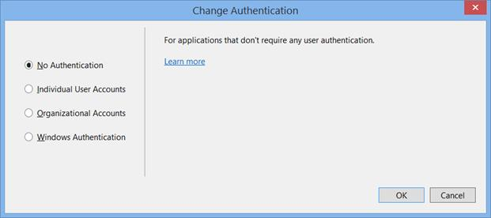

图 31:更改身份验证类型

|  | 提示:出于您的好奇心或实际需求，当您处于“更改身份验证”对话框中时，请尝试单击每个选项，查看如何实现不同的身份验证类型，以及每种类型如何满足特定的平台要求。 |

#### 添加数据连接和实体数据模型

项目完成后，在**解决方案浏览器**中，右键单击项目名称，选择**添加新项**，选择**数据**模板文件夹。这是添加数据连接的地方，如图 32 所示。选择**ADO.NET 实体数据模型**项目模板；调用新型号 **AdventureWorks.edmx** 点击**添加**。

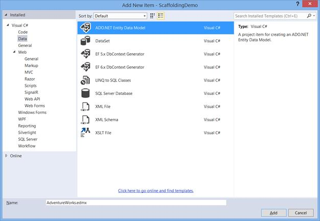

图 32:添加新的实体数据模型

如您所知，实体数据模型基于 ADO.NET 实体框架。在**实体数据模型**向导中，首先选择**从数据库生成**选项，然后点击**下一步**。单击**新建连接**按钮，然后添加指向 **AdventureWorks** 数据库的新连接。图 33 显示了此时连接属性窗口的样子；当然，您的机器上可以有不同的服务器名称。

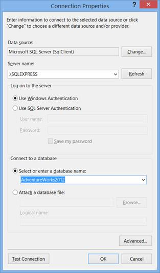

图 33:添加新的实体数据模型

此时，实体数据模型向导将显示新创建的连接的概要信息(参见图 6)。您绝对可以保持连接设置的标识符不变，或者提供一个不同的标识符(在图 34 的底部)。


图 34:新实体数据模型的概要信息

当您单击**下一步**时，Visual Studio 会要求您指定要使用的实体框架版本，介于 5.0 和 6.0 之间(默认选项)。保持 6.0 版本的选择不变，点击**下一步**。此时，您需要指定要添加到模型中的表或视图。只需选择**人物**表格，因为我们希望在没有复杂数据结构的情况下轻松演示概念。图 35 显示了如何进行这样的选择。


图 35:选择数据库对象

点击**完成**。几秒钟后，实体数据模型设计器显示。所选表的 NET 表示(见图 36)。

|  | 提示:如果您看到一条消息说“运行此模板可能会损害您的计算机”，请忽略它。Visual Studio 总是分析针对本地资源(如数据库)执行操作的代码段，包括自动生成的代码段，但当然此时执行此类操作是安全的。 |

在做任何其他事情之前，重建项目(**CTRL**+**Shift**+**B**)以便更新所有引用。

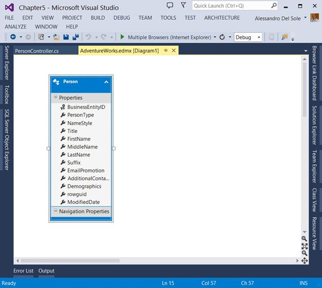

图 36:实体数据模型设计器显示了表的表示。

根据您安装的数据库版本，您可能会在设计器中看到其他实体。事实上，2008 和 2012 版本之间存在一些差异。您可以忽略这些额外的实体，专注于您在图 36 中看到的实体。在设计器中，右键单击`Demographics`属性并选择**从模型**中删除。原因是`Demographics`属性包含长的 XML 标记，这使得很难为这本电子书提供可读的数字。现在您已经连接到数据源，您需要呈现数据并给用户一个编辑数据的机会。所以，让我们深入脚手架。

#### 使用支架生成数据绑定页面

支架的好处是无需编写一行代码就能生成数据绑定视图。Visual Studio 2013 为每个实体集生成一个控制器，每个操作生成一个页面，这意味着一个页面用于列出项目集合，一个页面用于添加项目，一个页面用于编辑，一个页面用于删除。由于脚手架会生成视图，因此在**解决方案资源管理器**中，右键单击**视图**文件夹，然后选择**添加**、**新脚手架项目**。出现**添加脚手架**对话框，允许指定您需要的项目，如图 37 所示。

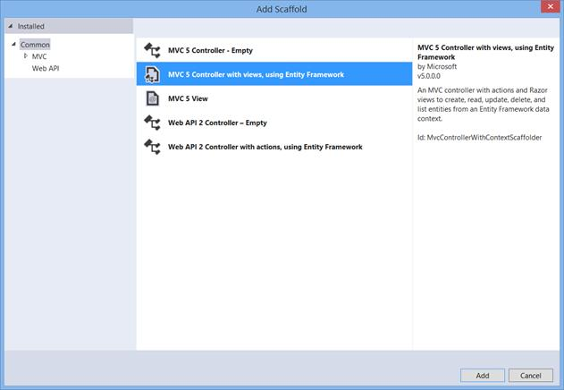

图 37:为脚手架选择合适的控制器

如您所见，您可以在不同种类的控制器中进行选择。在这种情况下，您正在使用实体框架，因此适当的控制器是使用实体框架的带视图的 MVC 5 控制器。您也可以选择空控制器或视图。还要注意如何利用网络应用编程接口框架来创建可以向其他消费者公开的控制器。当您单击添加时，Visual Studio 会显示添加控制器对话框(参见图 38)。

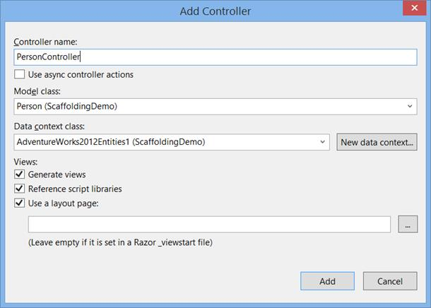

图 38:指定新控制器的属性和设置

在这里，您可以为新控制器指定许多设置。下表描述了这些设置，并指出如何重命名项目。

表 1:添加控制器对话框的成员和设置

| 物品的名称 | 描述 | 价值 |
| 控制器名称 | 将生成以与数据交互的控制器类的名称 | 人员控制器 |
| 模型类 | 将由控制器管理的实体类 | 人 |
| 数据上下文类 | 实体框架生成的上下文类，以建模的方式表示数据库 | AdventureWorks2012Entities 实体 |
| 生成视图 | 选中此复选框可使 Visual Studio 为您生成视图(页面) | 真实的 |
| 参考脚本库 | 选择此复选框以导入脚本库 | 真实的 |
| 使用布局页面 | 如果要为布局使用自定义页面，请选中此复选框；不需要这个例子 | 错误的 |

点击**添加**。几秒钟后，Visual Studio 2013 生成了`PersonController`类和多个。cshtml 文件(在“视图\人员”子文件夹下)；每个文件都是一个名称不言而喻的页面，比如 Create.cshtml 或者 Delete.cshtml，双击解决方案资源管理器中的`PersonController`类，会看到与数据模型交互的代码。图 39 显示了在解决方案资源管理器中搭建控制器和生成文件的结果。

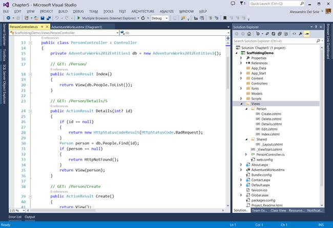

图 39:解决方案资源管理器中支架的结果

`PersonController`类的完整代码如下。

*Visual C#*

```cs
    public class PersonController >: Controller
    {
    private AdventureWorks2012Entities1 db = new AdventureWorks2012Entities1();

    // GET: /Person/
    public ActionResult Index()
    {
    return View(db.People.ToList());
    }

    // GET: /Person/Details/5
    public ActionResult Details(int? id)
    {
    if (id == null)
    {
    return new HttpStatusCodeResult(HttpStatusCode.BadRequest);
    }
    Person person = db.People.Find(id);
    if (person == null)
    {
    return HttpNotFound();
    }
    return View(person);
    }

    // GET: /Person/Create
    public ActionResult Create()
    {
    return View();
    }

    // POST: /Person/Create
    // To protect from overposting attacks, please enable the specific properties you want to bind to, for
    // more details see http://go.microsoft.com/fwlink/?LinkId=317598.
    [HttpPost]
    [ValidateAntiForgeryToken]
    public ActionResult Create([Bind(Include=>"BusinessEntityID,PersonType,NameStyle,Title,FirstName,MiddleName,LastName,Suffix,EmailPromotion,AdditionalContactInfo,rowguid,ModifiedDate")] Person >person)
    {
    if (ModelState.IsValid)
    {
    db.People.Add(person);
    db.SaveChanges();
    return RedirectToAction(>"Index">);
    }

    return View(person);
    }

    // GET: /Person/Edit/5
    public ActionResult Edit(int? id)
    {
    if (id == null)
    {
    return new HttpStatusCodeResult(HttpStatusCode.BadRequest);
    }
    Person person = db.People.Find(id);
    if (person == null)
    {
    return HttpNotFound();
    }
    return View(person);
    }

    // POST: /Person/Edit/5
    // To protect from overposting attacks, please enable the specific properties you want to bind to, for
    // more details see http://go.microsoft.com/fwlink/?LinkId=317598.
    [HttpPost]
    [ValidateAntiForgeryToken]
    public ActionResult Edit([Bind(Include=>"BusinessEntityID,PersonType,NameStyle,Title,FirstName,MiddleName,LastName,Suffix,EmailPromotion,AdditionalContactInfo,rowguid,ModifiedDate")] Person >person)
    {
    if (ModelState.IsValid)
    {
    db.Entry(person).State = EntityState.Modified;
    db.SaveChanges();
    return RedirectToAction(>"Index">);
    }
    return View(person);
    }

    // GET: /Person/Delete/5
    public ActionResult Delete(int? id)
    {
    if (id == null)
    {
    return new HttpStatusCodeResult(HttpStatusCode.BadRequest);
    }
    Person person = db.People.Find(id);
    if (person == null)
    {
    return HttpNotFound();
    }
    return View(person);
    }

    // POST: /Person/Delete/5
    [HttpPost, ActionName>("Delete")]
    [ValidateAntiForgeryToken]
    public ActionResult DeleteConfirmed(int id)
    {
    Person person = db.People.Find(id);
    db.People.Remove(person);
    db.SaveChanges();
    return RedirectToAction(>"Index">);
    }

    protected override void Dispose(bool disposing)
    {
    if (disposing)
    {
    db.Dispose();
    }
    base.Dispose(disposing);
    }
    }

```

*Visual Basic*

```cs
    Imports System
    Imports System.Collections.Generic
    Imports System.Data
    Imports System.Data.Entity
    Imports System.Linq
    Imports System.Net
    Imports System.Web
    Imports System.Web.Mvc

    Namespace ScaffoldingDemo
    Public Class PersonController
    Inherits System.Web.Mvc.Controller

    Private db As New AdventureWorks2012Entities

    ' GET: /Person/
    Function Index() As ActionResult
    Return View(db.People.ToList())
    End Function

    ' GET: /Person/Details/5
    Function Details(ByVal id As Integer?) As ActionResult
    If IsNothing(id) Then
    Return New HttpStatusCodeResult(HttpStatusCode.BadRequest)
    End If
    Dim person As Person = db.People.Find(id)
    If IsNothing(person) Then
    Return HttpNotFound()
    End If
    Return View(person)
    End Function

    ' GET: /Person/Create
    Function Create() As ActionResult
    Return View()
    End Function

    ' POST: /Person/Create
    'To protect from overposting attacks, please enable the specific properties you want to bind to, for
    'more details see http://go.microsoft.com/fwlink/?LinkId=317598.
    <HttpPost()>
    <ValidateAntiForgeryToken()>
    Function Create(<Bind(Include := >"BusinessEntityID,PersonType,NameStyle,Title,FirstName,MiddleName,LastName,Suffix,EmailPromotion,AdditionalContactInfo,rowguid,ModifiedDate")> ByVal >person As Person>) As ActionResult
    If ModelState.IsValid Then
    db.People.Add(person)
    db.SaveChanges()
    Return RedirectToAction(>"Index">)
    End If
    Return View(person)
    End Function

    ' GET: /Person/Edit/5
    Function Edit(ByVal >id As Integer>?) As ActionResult
    If IsNothing(id) Then
    Return New HttpStatusCodeResult(HttpStatusCode.BadRequest)
    End If
    Dim person As Person = db.People.Find(id)
    If IsNothing(person) Then
    Return HttpNotFound()
    End If
    Return View(person)
    End Function

    ' POST: /Person/Edit/5
    'To protect from overposting attacks, please enable the specific properties you want to bind to, for
    'more details see http://go.microsoft.com/fwlink/?LinkId=317598.
    <HttpPost()>
    <ValidateAntiForgeryToken()>
    Function Edit(<Bind(Include := >"BusinessEntityID,PersonType,NameStyle,Title,FirstName,MiddleName,LastName,Suffix,EmailPromotion,AdditionalContactInfo,rowguid,ModifiedDate")> ByVal >person As Person>) As ActionResult
    If ModelState.IsValid Then
    db.Entry(person).State = EntityState.Modified
    db.SaveChanges()
    Return RedirectToAction(>"Index">)
    End If
    Return View(person)
    End Function

    ' GET: /Person/Delete/5
    Function Delete(ByVal id As Integer?) As ActionResult
    If IsNothing(id) Then
    Return New HttpStatusCodeResult(HttpStatusCode.BadRequest)
    End If
    Dim person As Person = db.People.Find(id)
    If IsNothing(person) Then
    Return HttpNotFound()
    End If
    Return View(person)
    End Function

    ' POST: /Person/Delete/5
    <HttpPost()>
    <ActionName("Delete")>
    <ValidateAntiForgeryToken()>
    Function DeleteConfirmed(ByVal id As Integer) As ActionResult
    Dim person As Person = db.People.Find(id)
    db.People.Remove(person)
    db.SaveChanges()
    Return RedirectToAction(>"Index">)
    End Function

    Protected Overrides Sub Dispose(ByVal disposing As Boolean)
    If (disposing) Then
    db.Dispose()
    End If
    MyBase.Dispose(disposing)
    End Sub
    End Class
    End Namespace

```

虽然冗长，但代码并不难；你有很多方法负责心肺复苏术的操作，比如`Create`、`Edit`、`Details`、`Delete`和`Index`。后者返回模型类映射的表中记录的完整列表。每个方法都返回一个类型为`ActionResult`的对象，它是由 MVC 框架公开的(请记住您在这里使用的是网络表单)。它封装了上述方法的结果，并用于代表该方法执行框架级操作。当然，如果您愿意，您可以对控制器类进行额外的编辑。在这个特殊的例子中，限制`Index`方法返回的人数是一个好主意，以加快过程。假设您只想检索表中的前十个人。您可以按如下方式编辑`Index`方法:

*Visual C#*

```cs
    // GET: /Person/
    public ActionResult Index()
    {
    return View(db.People.Take(10).ToList());
    }

```

*Visual Basic*

```cs
    ' GET: /Person/
    Function Index() As ActionResult
    Return View(db.People.Take(10).ToList())
    End Function

```

您可以使用任何 LINQ 运算符以最适合您需要的方式编辑查询。在这种情况下，代码使用`Take`来检索前 10 条记录。值得一提的是，对于代码中的每个方法，您会发现一些注释，解释如何在浏览器中调用相关页面。例如，如果您想要查看表中的记录列表，您将使用/Person 相对 URL(参见前面列表中的代码)。你很快就会看到演示。

#### 测试应用程序

按 **F5** 开始调试应用程序。您的默认 web 浏览器将打开并显示应用程序的默认页面。在地址栏中，键入末尾的/Person 相对 URL(参见图 40 中的高亮部分)。此时，应用程序将显示表格中的前十个人，如图 40 所示。

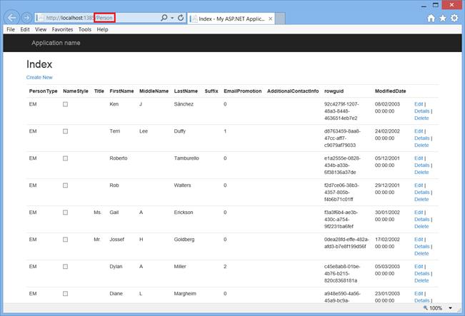

图 40:应用程序显示了一个项目列表。

请注意数据操作页面的快捷方式。例如，您可以单击**编辑**来查看和更改项目的详细信息。这对于理解应用程序如何调用控制器中的适当方法也很有用。看看图 41，它显示了如何编辑一个现有的项目。

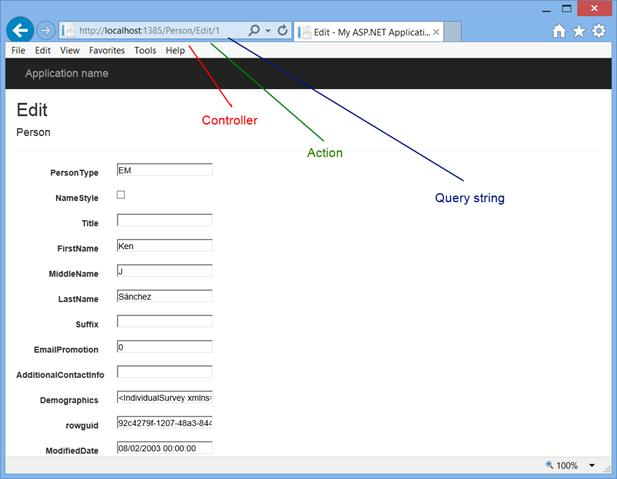

图 41:编辑项目和地址的剖析

除了看到在不编写任何代码的情况下编辑一个项目是多么容易之外，请注意地址栏。该地址由以下元素组成:

*   应用程序的网址
*   控制器的名称(在本例中为人员)
*   控制器中方法的名称(在本例中为编辑)
*   被调用的方法将用来检索特定项的查询字符串的值

您可以返回到上一页，选择**新建**查看向数据库中添加新人员有多容易(见图 42)。


图 42:添加新项目

图 42 还突出显示了控制器名称和方法名称在地址中的用法。由于新的 One ASP.NET 体验，您已经看到了如何在 Web Forms 应用程序中利用脚手架。Visual Studio 生成的页面可以进行编辑，以提供不同的布局，但是很明显，您可以通过最少的努力创建强大的以数据为中心的应用程序。

### 浏览器链接仪表板

您已经知道，使用 Visual Studio，您可以用不同的浏览器测试您的 web 应用程序。在 Visual Studio 2013 中，如果您的应用程序在不同的浏览器中运行，并且您在 IDE 中进行了更改，则只需单击一下，这些更改就可以刷新到每个浏览器。这是可能的，因为 Visual Studio 2013 和。NET Framework 4.5.1 使用 SignalR 2.0，这是一个流行的库，允许发送实时通知。

要了解它是如何工作的，首先创建一个名为 BrowserLinkDemo 的新 ASP.NET 项目。根据上一节中的经验，选择**网络表单**模板和匿名身份验证。当然，这个特性不仅适用于网络表单，也适用于 ASP.NET MVC。

|  | 注意:在完成本章之前，不要删除新项目。稍后在讨论 Windows Azure 的新工具时，将再次使用它。 |

下一步是告诉 Visual Studio 使用多个浏览器运行应用程序，所以如果您之前没有这样做，请选择工具栏上“开始”按钮附近的箭头(见图 43)，然后**用**浏览。

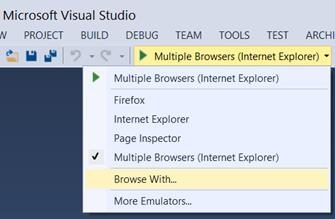

图 43:访问命令来更改测试的默认浏览器

在“浏览方式”对话框中，选择两个或多个网络浏览器。在我的机器上，我安装了 Internet Explorer 和 FireFox，所以我的选择包括这两者(见图 44)。

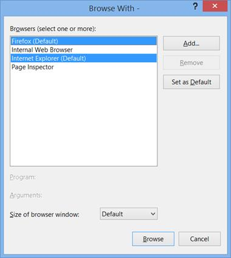

图 44:选择两个或多个网络浏览器进行测试

按下 **CTRL** 并点击您想要使用的每个浏览器，然后选择**设置为默认**并关闭对话框。现在不用 F5 调试通常的方式，按 **CTRL + F5** 开始不调试。这样，应用程序将在您选择的所有浏览器中启动。图 45 显示了运行在互联网浏览器中的应用程序。

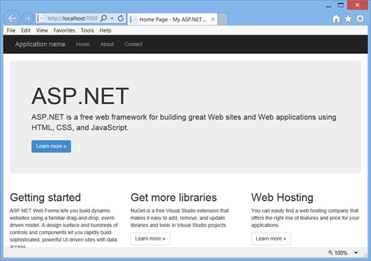

图 45:运行的示例应用程序

现在让我们在 Visual Studio 中进行一个非常简单的编辑。在设计器中打开 Default.aspx 页面，将 ASP.NET 字符串替换为 **Visual Studio 2013 简洁地**。在**标准**工具栏上，点击**刷新**按钮，可以看到图 46 中高亮显示，或者按**CTRL+ALT+回车**。


图 46:链接浏览器的刷新按钮

现在切换回两种浏览器；您将看到它们如何显示更新后的字符串。使用这种技术，您不需要停止应用程序、进行编辑和重新启动调试。通过单击“刷新”按钮附近的箭头，您可以访问其他快捷方式，包括启用浏览器链接仪表板工具窗口的快捷方式。使用浏览器链接仪表板，您可以看到解决方案中每个应用程序的连接，并且可以对每个链接的浏览器采取特定的操作，例如只刷新一个浏览器。图 47 显示了浏览器链接仪表板在包含本章中描述的两个示例项目的解决方案中的样子。

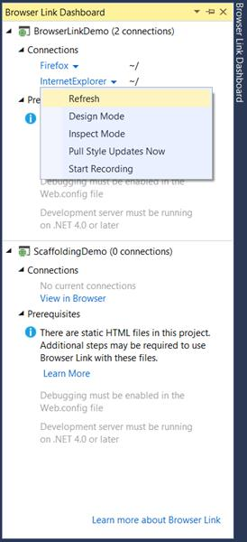

图 47:浏览器链接仪表板允许管理单个连接的操作。

使用支架和浏览器链接，您已经在 Visual Studio 2013 中看到了两个相关的功能。但是这个新版本非常关注云。这将在下一节中讨论。

## Windows Azure 有什么新功能

[Windows Azure](http://www.windowsazure.com) 是来自微软的热门云计算平台，于 2008 年在专业开发者大会(PDC)上首次亮相。多年来，Windows Azure 通过引入成吨的服务发生了巨大的演变，云已经成为我们日常生活的重要组成部分。许多网站、移动设备和应用程序都使用 Windows Azure 的服务。如果您以前为 Windows Azure 开发过应用程序，您知道您必须在 Visual Studio 之外做大多数事情，使用 web 上的 Windows Azure 开发人员门户或特殊的客户端应用程序；事实上，Visual Studio 缺乏与平台的良好集成。至于其他平台，Visual Studio 2013 解决了这个问题，并提供了与 Windows Azure 的深度集成，使得从 IDE 内部管理许多服务变得非常容易。本章提供了有关 Visual Studio 2013 如何与 Azure 集成以及如何利用这种集成来更快地构建应用程序的指导。

### 阅读本节前需要什么

因为我们关注的是 Visual Studio 2013 中针对 Windows Azure 的新工具，所以我们假设您至少已经对该平台有了基本的了解，包括关于付费服务和定价的信息。事实上，这一章既不能总结 Windows Azure 提供的所有服务，也不能解释 Azure 的编程，因为这需要一整本书。如果您在阅读本章之前需要了解 Windows Azure 的编程概述，请参考位于[http://www.windowsazure.com/en-us/documentation/](http://www.windowsazure.com/en-us/documentation/)的官方文档。为了完成本章中描述的步骤，您必须安装 [Windows Azure SDK](http://www.windowsazure.com/en-us/downloads/?sdk=net) 2.2 或更高版本。

|  | 注意:本章从开发人员的角度描述了 Windows Azure，并将描述只有当您拥有当前订阅时才能访问的服务。但 Windows Azure 是付费服务。幸运的是，您可以在[http://www.windowsazure.com/en-us/pricing/free-trial/](http://www.windowsazure.com/en-us/pricing/free-trial/)启用 30 天的试验。如果您想完全理解本章的其余部分，我们鼓励您订阅试用版。 |

### 服务器浏览器窗口

您可能已经在 Visual Studio 中多次使用服务器资源管理器工具窗口，用于不同的目的，例如管理与数据库或 web 服务器的连接。在 Visual Studio 2013 中，服务器资源管理器提供了一个名为 Windows Azure 的新节点，它允许从 IDE 中连接到您的订阅并管理服务。图 48 显示了 Windows Azure 节点的外观。


图 48:服务器资源管理器窗口中新的 Windows Azure 工具

如您所见，您可以在不离开 Visual Studio 的情况下管理大多数服务。您需要做的第一件事是将有效的 Windows Azure 订阅关联到 Visual Studio 2013。为此，右键单击 **Windows Azure** 并选择**连接到 Windows Azure** 。您将被要求输入当前订阅的微软帐户。如果您有多个与您的 Microsoft 帐户相关联的订阅，您将能够管理订阅。只需再次右键单击 **Windows Azure** 并选择**管理订阅**。此时，将出现管理 Windows Azure 订阅，如图 49 所示。


图 49:管理 Windows Azure 订阅

此时，您需要在 Visual Studio 2013 中导入订阅设置。点击**证书**，然后**导入**。在出现的导入 Windows Azure 订阅对话框中(见图 50)，点击**下载订阅文件**超链接。

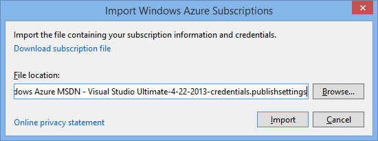

图 50:管理 Windows Azure 订阅

此时，将打开 Windows Azure 网站中的一个页面，一个包含您的订阅设置的文件将自动可供下载。下载设置文件后，点击**浏览**，在对话框中搜索下载的设置文件，选择，最后点击**导入**。按照这些步骤，您的订阅将被添加到 Visual Studio 中的订阅列表中。如果您添加了多个订阅，在“管理 Windows Azure 订阅”对话框中，您将能够选择要使用的订阅。做出选择后，点击**关闭**。现在让我们更详细地看看您可以使用服务器资源管理器做什么。

#### 与移动服务的集成

移动服务可以用作移动应用程序的后端。移动服务的一个非常常见的用途是将数据存储在表中。在 Visual Studio 2013 中，您现在可以直接创建移动服务，添加表，并查看服务的日志。要创建新服务，右键单击**移动服务**，然后选择**创建服务**。在创建移动服务对话框中，您必须指定新服务的细节，如图 51 所示。


图 51:创建新的移动服务

您需要指定以下信息:

*   将在其中创建服务的订阅。如果希望在当前订阅中创建服务，可以保持选择不变。
*   服务名称。Visual Studio 2013 将在您键入时检查服务名称的可用性。
*   该地区。记得选择离你最近的地区。
*   要与新服务关联的新的或现有的 SQL Azure 数据库(可选)。如果您之前没有在管理门户中创建 SQL Azure 数据库，您可以使用**创建免费的 SQL 数据库**选项或**创建收费的 SQL 数据库**。当然，我强烈建议创建一个免费的 SQL Azure 数据库(最大 20 MB)，而不是收费的数据库。
*   用于访问数据库的 SQL Azure 服务器的用户名和密码。

|  | 注意:我假设您已经配置了一个 SQL Azure 服务器，因为我说的是访问云上的数据库所需的服务器用户名和密码。如果您没有配置您的 SQL Azure 服务器，您可以通过阅读[官方文档](http://www.windowsazure.com/en-us/manage/services/sql-databases/how-to-configure-a-sqldb/)开始。 |

完成后，点击**创建**。新服务将出现在服务器资源管理器的“移动服务”节点下。您也可以直接向服务添加表。右键单击服务名称，选择**创建表格**。在“创建表”对话框中(见图 52)，您可以为每个循环冗余校验操作指定表名和权限。

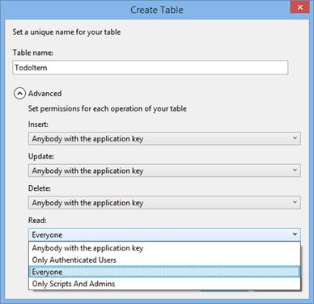

图 52:创建新的移动服务

现在创建一个名为**到**的新表。我们将在下一章演示 Windows 8 对移动服务的支持时使用此表。请注意您对权限的深度控制；您可以允许每个人、经过身份验证的用户、管理员或拥有应用程序密钥的用户(管理应用程序密钥仅在管理门户中可用)。准备好之后点击**创建**。您将能够看到新表作为移动服务名称下的节点。此外，如果您展开表名，您将看到许多 JavaScript 代码文件，它们负责对数据执行操作，如读取、插入、更新和删除。图 53 显示了此时服务器资源管理器窗口是如何出现的。


图 53:服务器资源管理器中出现的移动服务、表格和 JavaScript 文件。

只需几个步骤，您就创建了一个可以在移动应用程序中用作后端的移动服务。您可以在以下应用程序中使用移动服务:

*   适用于 Windows 8.x 的 Windows 商店应用程序
*   视窗手机应用程序
*   ASP.NET 网络应用
*   您需要在解决方案资源管理器中右键单击项目名称，然后选择**添加连接的服务**。这将在第 7 章中进一步讨论。

#### 与 Azure 网站和云服务的集成

在 Windows Azure 中，您可以通过网站或云服务发布您的网络应用程序。网站是一个简化的预配置环境，便于部署。相反，云服务是一个高度可定制的环境，需要您在部署前进行一些配置，并且您可以在系统上采取许多操作。你可以在 Windows Azure 文档的[这一页](http://www.windowsazure.com/en-us/manage/services/web-sites/choose-web-app-service/)找到这两个环境的完整描述(我建议你看一下)。无论您选择什么，Visual Studio 2013 都支持向网站和云服务发布应用程序。

|  | 注意:您可以从服务器资源管理器连接到虚拟机，但只能直接发布到网站和云服务。 |

例如，假设您想要部署本章前面创建的示例应用程序来演示浏览器链接功能。在服务器资源管理器中，右键单击**网站**节点，然后选择**添加新网站**。将出现一个名为“在 Windows Azure 上创建站点”的新对话框。在这里，您必须指定新网站的细节，如图 54 所示。

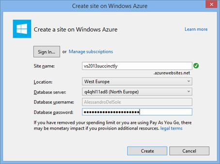

图 54:创建新网站

需要以下信息:

*   网站名称，用于构建网站网址的标识符。Visual Studio 将在您键入时检查名称的可用性。
*   地点:微软在世界各地有几个数据中心，所以请确保选择离您最近的地点。
*   数据库服务器、数据库用户名和数据库密码。这些是可选字段；只有当您的应用程序将使用 SQL Azure 数据库时，您才需要提供它们。

|  | 提示:示例应用程序不使用任何数据库。为了完整起见，图 54 显示了如何填充数据库相关的字段。 |

输入所有所需信息后，点击**创建**。创建网站后，在服务器资源管理器中双击它的名称，这样 Visual Studio 就会显示一个配置窗口(见图 55)。


图 55:新网站的配置窗口

该窗口分为四个主要区域:

*   操作:在这里，您可以找到常见任务的快捷方式，如在 Azure 的管理门户中打开网站、停止或重新启动网站。
*   网站设置:在这里你可以为你的网站微调配置，包括错误管理和跟踪。
*   连接字符串:在这里，您可以管理应用程序用来连接数据源的连接字符串。
*   应用程序设置:这允许为您的网站列出和添加环境变量。您永远不应该更改或删除由 Visual Studio 添加的设置。
*   现在，您想要将 BrowserLinkDemo 示例应用程序发布到新创建的网站。首先，在解决方案资源管理器中右键单击项目名称，然后选择转换，转换为 Windows Azure 云服务项目。此操作将向解决方案中添加一个具有 Windows Azure 角色的新项目。默认情况下，新项目的名称与原始项目的名称相同，加上。Azure 后缀，在我们的示例中是 BrowserLinkDemo.Azure。现在，在解决方案资源管理器中，右键单击原始项目(BrowserLinkDemo)，然后单击发布。

|  | 提示:如果要将应用程序部署到网站，请使用“发布”命令。因为这是我们目前的情况，我们正在使用这个选项。如果要部署到云服务，请右键单击项目名称，然后选择发布到 Windows Azure。特定的对话框将允许创建新的云服务并轻松部署应用程序。 |

*   出现发布网站对话框，没有预先配置的设置，需要点击**导入**按钮指定目标网站。Visual Studio 此时会显示“导入发布设置”对话框，如图 55 所示。


图 56:选择发布网站

*   由于集成开发环境仍然连接到您的 Azure 订阅，您可以简单地从第一个组合框中选择目标网站。您也可以通过单击**登录**或导入现有的发布配置文件来选择不同的订阅。

|  | 提示:Visual Studio 2013 使您可以轻松地从 Windows Azure 订阅中下载和发布配置文件。只需右键单击服务器资源管理器中的网站，然后单击下载发布配置文件。 |

*   准备好之后，点击**确定**。“发布网站”对话框中的“配置文件”表单将填充来自您刚刚选择的发布配置文件的信息。进入**连接**表单(见图 57)。


图 57:应用程序的连接设置

*   Visual Studio 2013 会自动为此表单提供信息，因此您不需要更改任何字段。请注意目标网址字段的内容，该字段包含应用程序发布后的网址。点击**下一步**进入设置表单(见图 58)。


图 58:发布应用程序的设置

*   在这种形式的发布网站对话框中，您可以在**发布**(默认)和**调试**之间更改配置，或者决定是要删除目标位置的其他文件、在发布过程中预编译托管代码，还是从 App_Data 文件夹中排除文件。如果您也在使用数据库，您将能够在这里设置一个默认的连接字符串。当您单击**下一步**时，您可以通过单击**开始预览**来访问预览表单，您可以选择查看将发布到网站的文件的完整列表。按下该按钮的结果如图 59 所示。

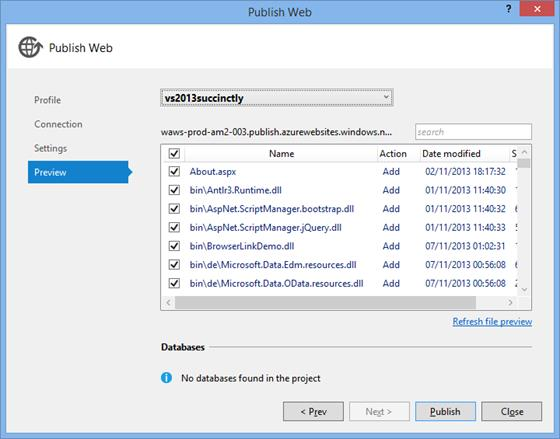

图 59:将发布到网站的文件列表

*   最后可以点击**发布**。发布进度将显示在“输出”窗口中，速度可能会因您的互联网连接而异。当应用程序已发布并处于联机状态时，您将在“输出”窗口中看到一条消息，您将能够使用适当的网址启动应用程序。图 60 显示了在先前创建的网站上运行的示例应用程序。

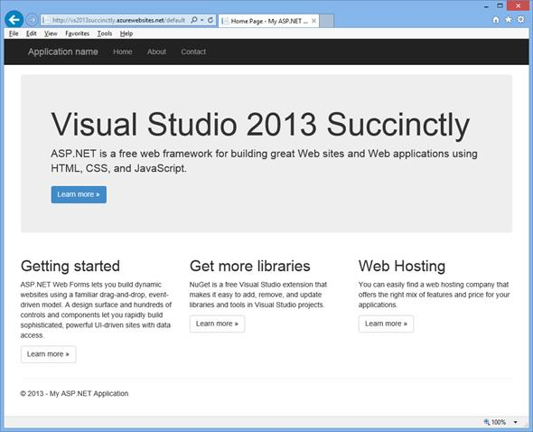

图 60:在网站上运行的示例应用程序

*   如您所见，只需很少的步骤，您就可以将 ASP.NET 应用程序发布到 Windows Azure，而不需要内部服务器和托管基础架构。

|  | 注意:如果您像当前场景一样为了测试目的创建网站，请记住在完成后删除该网站，即使您启用了支出限制。网站即使离线也会消耗资源，所以确保它们不消耗任何不需要的资源的唯一方法就是删除它们。 |

#### 与 Azure 存储的集成

|  | 注意:对于本章中描述的 Azure 服务的其余部分，我们重点关注 IDE 中的新工具。如果您需要关于如何从应用程序访问 Azure Storage 中的资源的指导，请务必阅读[相关文档](http://www.windowsazure.com/en-us/documentation/services/storage/)。 |

Windows Azure 存储是您可以为基于云的应用程序存储数据和文件的地方。例如，如果您的应用程序需要显示一些图片或允许下载文件，这些图片将首先保存到存储中，然后通过它们的网址(HTTP)进行访问。Windows Azure 存储提供以下服务:

*   Blob 存储:在这里可以上传非结构化的二进制数据，比如文件。
*   队列存储:用于保存和检索工作流和通信的消息。
*   表存储:在这里，您可以存储支持查询的非关系数据和非主题数据。

Blob Storage 还可以识别 VHD 文件，并允许将这些文件装载为云上的虚拟硬盘。Visual Studio 2013 最终从集成开发环境中提供了与 Windows Azure 存储的集成。这是一项巨大的优势，也是向前迈出的重要一步，因为在 Visual Studio 2013 之前，上传或管理存储上的信息的唯一方法是使用第三方客户端应用程序。现在，您肯定可以使用 Visual Studio 来执行操作，例如将文件上传到 Blob 存储。任何 Windows Azure 订阅都支持多个存储。对于每个存储，您需要创建一个存储帐户。由于任何交易(下载、上传、登录)都是有成本的，因此微软提供了开发帐户，该帐户由 Windows Azure 模拟器和其他允许在您的开发机器上模拟生产环境的组件组成。这样，您可以在本地自由测试事务，并且只有在准备好投入生产时才能迁移到云。请记住查看 MSDN 文档，了解存储可编程性以及如何从应用程序访问存储信息。

#### 创建存储帐户

在服务器资源管理器中，展开 Windows Azure 下的**存储**节点。默认情况下，将显示本地开发存储。如果尚未运行，Visual Studio 将启动 Windows Azure 存储模拟器。开发存储的工作方式与在线存储完全一样；然而，看看如何使用在线帐户是一个好主意。很遗憾，您无法从 Visual Studio 创建新的存储帐户；相反，您可以连接到现有帐户。所以，在你最喜欢的网络浏览器中打开 [Windows Azure 管理门户](https://manage.windowsazure.com/)。登录后，点击左侧仪表盘中的**存储**。图 61 显示了此时管理门户是如何出现的，还没有可用的帐户。


图 Windows Azure 订阅目前没有存储。

点击**创建存储账户**。管理门户将打开一个新页面，您可以通过提供帐户名和位置轻松创建新的存储帐户。图 62 显示了此时管理门户是如何出现的。

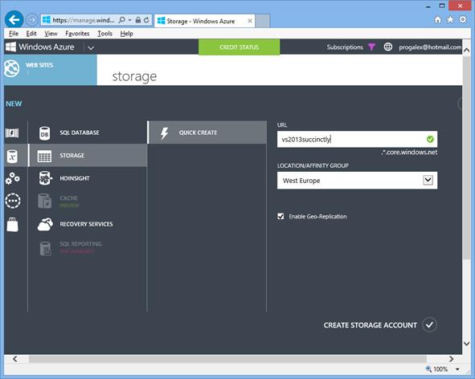

图 62:创建新的存储帐户

永远记得选择离你住的地方最近的地方。您可能知道，帐户名成为存储公开的服务的 URL 前缀。表 2 显示了每个服务的 URL(其中 storagename 是您在创建存储帐户时输入的名称)。

表 2:添加控制器对话框的成员和设置

| 储存；储备 | 统一资源定位器 |
| 斑点存储 | http://storagename.blob.core.windows.net |
| 表格存储 | http://storagename.table.core.windows.net |
| 队列存储 | http://storagename.queue.core.windows.net |

表 2 中显示的地址非常重要，因为它们是您访问每个存储的方式。点击**创建存储账户**。大约一分钟后，您将能够在管理门户中在线查看存储帐户。现在关闭管理门户，返回 Visual Studio 2013。在服务器资源管理器中，右键单击**存储**节点，然后单击**刷新**。现在，您将看到新创建的存储帐户(参见图 63)。

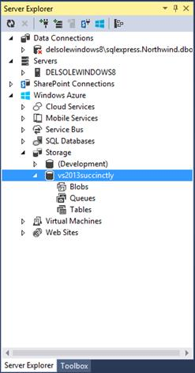

图 63:新的存储帐户在服务器资源管理器中可见。

现在，您将看到如何与存储交互。

#### 管理斑点存储

假设您想要上传一个图像文件到 Blob 存储。Blobs 被组织在称为容器的文件夹中，因此您首先需要创建一个容器。请遵循以下步骤:

1.  单击您感兴趣的存储帐户(在本例中为 vs 2013 成功)，并将其展开以使 Blobs 节点可见。
2.  选择**创建斑点容器**。
3.  在“创建 Blob 容器”对话框中(参见图 64)，指定新容器的名称，所有名称都是小写。比如输入**图片**。
4.  新容器将在服务器资源管理器中可见。右键单击并选择**查看斑点容器**。您将看到一个名为容器的新窗口，其目的是显示和过滤容器中的 blobs 列表。它还允许上传和/或删除博客(见图 65)。
5.  单击**上传斑点**按钮(带黑色箭头的按钮)。在文件选择对话框中，选择一个图像文件(可能是 Jpeg 类型的，因为这种格式的尺寸较小，所以可以节省空间和时间)。Visual Studio 将开始将您的文件上载到存储中，显示操作的进度。如图 66 所示，该窗口显示了文件的元数据信息，最重要的是，显示了访问它的网址。

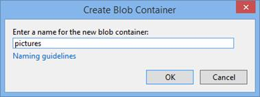

图 64:创建一个新的斑点容器

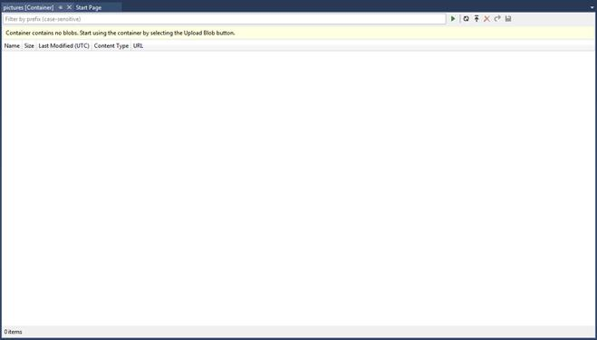

图 65:当前容器的斑点列表是空的。


图 blob 已经上传，您可以看到它的元数据和网址。

如果您右键单击 blob，您将获得一个弹出菜单，其中显示了感兴趣的命令列表。您可以将 blob 下载到磁盘(另存为)，打开 blob(打开)，删除 blob(删除)，在属性窗口(属性)中查看更详细的属性，并将 blob 的网址复制到剪贴板(复制网址)。为了在代码中访问 blob，您需要为您的 Windows Azure 订阅提供连接字符串和凭据。编写代码来实现这一点超出了本章的范围，因此为此请阅读 Windows Azure 文档中的[本页](http://www.windowsazure.com/en-us/develop/net/how-to-guides/blob-storage/)。你真正需要了解的是如何在 Visual Studio 2013 中使用新工具上传 blob(以及如何管理 blob 和容器)，而不需要 3 <sup>rd</sup> 第三方客户端应用程序。

#### 创建和查询表

Windows Azure 存储支持创建表来存储非关系数据。右键单击您的存储帐户中的**表格**，并选择**创建表格**。在**创建表格**对话框中(见图 67)，输入表格的名称，例如 **mydata** 。


图 67:创建新表

创建新表时，双击它:您将看到一个类似于容器窗口的窗口。窗口的工具栏(见图 68)有一个名为“添加实体”的按钮，由三个抽屉和一个绿色的添加符号表示。


图 68:表的设计器工具栏

点击**添加实体**输入新数据。图 69 显示了如何为新实体输入数据。

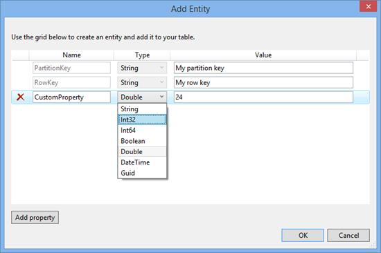

图 69:为新实体和属性定制输入数据

每个实体都有一些预定义的属性，例如 PartitionKey 和 RowKey，它们都是 String 类型，可以用您的值来分配。此外，您可以添加不同类型的自定义属性(参见图 69)。准备好后点击**确定**。新的实体现在将在窗口中可见，如图 70 所示。


图 70:在您的存储帐户中列出表格

工具栏上还有一个名为查询生成器的按钮(右边的按钮由两个重叠的方块表示，如图 68 所示)，它允许对表执行查询。您可以针对不同的属性指定一个或多个过滤器，如图 71 所示。


图 71:用查询生成器定义查询

请注意，自定义属性在属性名称下拉列表中不可用。但是，您可以在设计器工具栏内的文本框中键入查询并通过自定义属性添加过滤器(参见图 68)。定义完所有需要的过滤器后，点击**确定**。您将在文本框中看到查询语法；如果您单击**执行**，将执行查询，并且仅显示符合指定标准的实体。

#### 创建消息队列

Visual Studio 2013 支持在存储中创建队列。有了队列，基于云的应用程序可以轻松共享消息。要创建队列，在服务器资源管理器中展开**存储**，然后展开您选择的存储帐户(您可以使用**开发**，然后右键单击**队列**。在**创建队列**对话框中，输入新队列的名称，同样是小写(见图 72)。

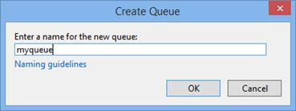

图 72:创建新队列

当新队列在服务器资源管理器中可见时，双击它以打开队列窗口。这里是您添加和管理邮件的地方。要添加一条，点击工具栏上的**添加消息**(带有字母图标和绿色+符号的按钮)。在出现的**添加消息**对话框中，输入文本消息并定义消息何时过期(见图 73)，然后点击**确定**。

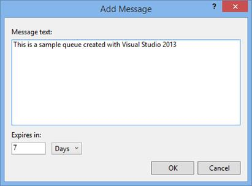

图 73:创建新消息

新消息将被添加到队列中，并且在队列窗口中可见，如图 74 所示。

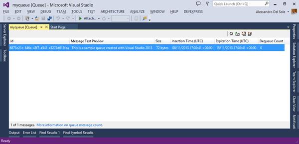

图 74:创建新队列

会显示有趣的信息，例如插入时间、到期时间和 ID。通过使用工具栏上的适当按钮，您还可以取消邮件排队或删除邮件。如果您不熟悉在应用程序中使用队列，请查看 [Windows Azure 文档](http://www.windowsazure.com/en-us/develop/net/how-to-guides/queue-service/)关于使用队列编程。至于其他存储类型，Visual Studio 2013 使创建和管理队列变得非常容易，避免了使用 3 <sup>rd</sup> 第三方应用程序的需要。

## 章节总结

为了提供有史以来最高效的环境，Visual Studio 2013 引入了许多新的网络开发工具，包括为 Windows Azure 构建应用程序。在 ASP.NET 方面，Visual Studio 2013 引入了 One ASP.NET 体验，它为 web 开发提供了一种统一的方法，使得在一个应用程序中使用不同框架的库变得非常容易。这包括在网络表单应用程序中使用支架(以前只适用于 MVC 应用程序)。借助支架，您可以轻松构建以数据为中心的应用程序，并利用自动生成的代码进行数据访问和数据绑定，随时可用的页面。此外，Visual Studio 2013 通过新的浏览器链接功能使在不同的网络浏览器中测试应用程序变得更加容易，该功能允许一键刷新所有浏览器。对于 Windows Azure，Visual Studio 2013 增强了服务器资源管理器工具窗口，该窗口现在提供了您在 IDE 中使用平台公开的大多数服务所需的一切。