# 第 3 章代码编辑器的改进

继续实现 Visual Studio 2013 的相同目标，微软对 IDE 的一个基本领域进行了额外的重要改进:代码编辑器。本章描述了所谓的以代码为中心的集成开发环境体验中的新功能，这将最大限度地提高工作效率，并真正有助于编写高质量、快速和高效的代码。

|  | 注意:除了明确说明的地方，本章中描述的所有新特性都适用于 C#和 Visual Basic。 |

## 触摸手势

代码编辑器得到了增强，支持触摸屏上的常见手势。Touch 在以前的版本中已经工作，但是 IDE 没有优化；由于硬件功能的原因，触控支持以前是唯一可用的。在 Visual Studio 2015 中，您可以:

*   双击一个单词或标识符来选择它。
*   按住屏幕以打开上下文菜单。
*   轻按代码编辑器的边距以选择相应的代码行。
*   轻按并按住代码编辑器表面上的任意位置，以上下滚动。
*   “捏和缩放”用两个手指放大和缩小。

如果您在平板电脑或笔记本电脑等支持触摸的设备上使用 Visual Studio 2015，您会发现这些功能非常有用。

## 彩色工具提示

代码编辑器自动为许多语言构造创建可折叠区域，例如(但不限于)类定义、结构定义和方法体。从 Visual Studio 2013 开始，当一个区域折叠时，您可以通过将鼠标指针放在折叠的构造上来获得完整代码的预览。Visual Studio 2015 通过提供彩色工具提示和完整的对象或成员声明提供了增强的体验，如图 19 所示。


图 19:彩色工具提示。

如果与 Visual Studio 2013 相比，这要好得多，在 Visual Studio 2013 中，您没有对象/成员声明，工具提示的颜色只有黑色。

## 灯泡和快速行动

你可能知道，在 Visual Studio 2015 和。NET Framework 4.6 中，托管编译器已经被完全重写，作为开源项目发布，并带来了由。NET 编译器平台(以前称为罗斯林项目)。

|  | 注:谈论。NET 编译器平台不在本书的讨论范围之内。您可以在[罗斯林](https://roslyn.codeplex.com/)获取具体信息并学习如何创建自定义代码分析器。 |

在其他好处中，编译器公开了 API，与代码编辑器和 IDE 的其他部分有更好的集成，并且它们提供完整的、实时的、静态的代码分析，以便在您键入时发现问题并提供建议。改进主要集中在冗余代码、在您键入时查找和修复错误以及重构代码上。

当 Visual Studio 2015 检测到冗余代码、错误或应该重构的代码时，它会显示“灯泡”。灯泡是一个行动的容器，叫做快速行动，你可以用它来解决一个特定的问题。图 20 显示了一个灯泡的例子，以及当您调用一个代码中没有声明的方法时可用的操作。


图 20:灯泡提供了快速行动来建议错误的修复或者重构你的代码。

通常，当您将光标放在一段需要修复的代码上，或者当您将鼠标悬停在错误曲线上时，灯泡会自动出现；但是，您可以通过按下 **CTRL + <周期>** 来手动启用灯泡。您刚刚快速了解了灯泡和快速动作，但在接下来的段落中，您将了解更多关于这一强大新功能的信息。

### 查找并修复冗余代码

实时静态代码分析能够检测冗余代码，例如未使用的`using`指令(对于 Visual Basic 为`Imports`)或不需要的对象调用。冗余代码是灰色的，这样您就可以很容易地在代码中看到它。图 21 显示了一个冗余代码的例子，由未使用的`using`指令和`this`对象调用组成。


图 21:检测冗余代码。

如果您单击其中一个`using`指令，灯泡会出现。您可以展开它，看看 Visual Studio 如何通过用红色突出显示将要删除的代码来建议快速删除不必要的指令(参见图 22)。


图 22:灯泡建议删除不必要的代码。

您还可以将这些更改应用于当前项目或整个解决方案，而不仅仅是当前的代码文件。如您所见，您可以选择预览更改。这将在下一段中详细解释。现在，点击**删除不必要的使用**建议，看看 IDE 如何删除多余的`using`指令。您也可以在`this`对象上重复相同的步骤。

|  | 提示:通过在代码编辑器中右键单击，导航到“组织使用”，然后选择“删除不必要的使用”，也可以使用删除不必要的使用的选项。在 Visual Basic 中，组织导入>删除不必要的导入下也有相同的选项。 |

### 修复错误

实时静态代码分析和灯泡使您在键入时更容易检测和修复错误。例如，考虑图 23 所示的类定义。

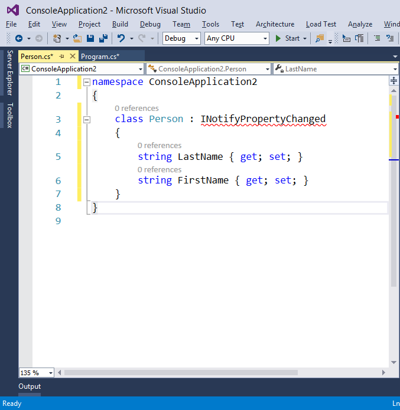

图 23:一个有错误的样本类。

该代码有几个错误，因为它缺少一个`using System.ComponentModel`指令，并且该类实际上没有实现`INotifyPropertyChanged`接口，如错误曲线所示。

|  | 提示:在 Visual Studio 2015 中，您不再需要将光标放在一行代码之外来获取错误曲线。事实上，新的实时静态代码分析将立即显示它们。 |

您可以使用灯泡来修复错误。在这种情况下，灯泡首先建议快速行动来解决`INotifyPropertyChanged`界面，如图 24 所示。

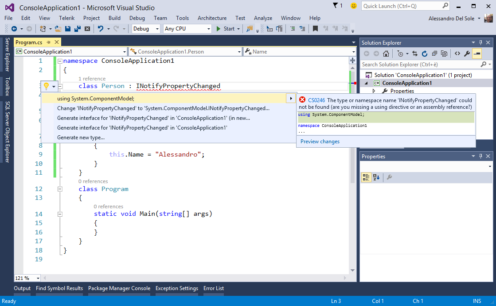

图 24:缺失名称空间的快速操作。

工具提示提供了有关错误消息的详细描述，并在您将鼠标悬停在建议的快速操作之一上时显示代码更改的预览。此时一个很好的选择是增加一个`using`指令；选择第一个解决方案。此时，编译器检测到类还没有实现接口，因此 Light Bulb 提供了特定的快速操作来修复这个错误，如图 25 所示。

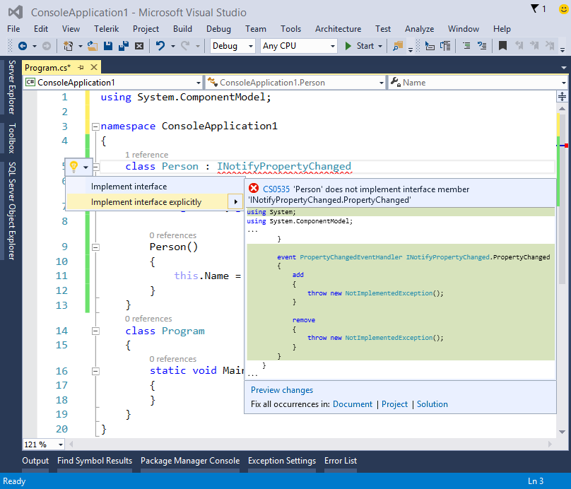

图 25:未实现接口的快速操作。

假设您想要隐式实现接口；选择第一个解决方案(**实现界面**)并在预览中点击**预览修改**超链接。此时，**预览更改**对话框出现，显示一个或多个将要应用更改的代码文件，以及包含更改的代码的完整预览。这些更改被突出显示，以便您可以立即看到，如图 26 所示。


图 26:编辑前预览更改。

如果您对更改没有意见，只需单击**应用**，或者如果您想选择不同的快速操作，单击**取消**。编译器足够智能，可以根据您要使用的对象提出其他解决方案。例如，如果您想要一个对象实现`IDisposable`界面，灯泡将显示特定于 Dispose 模式的附加快速动作，如图 27 所示。

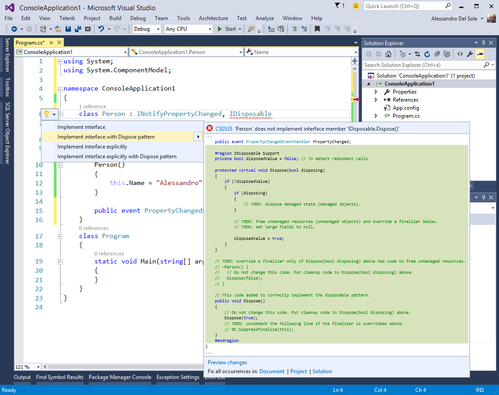

图 27:建议实现模式的不同方法的快速行动。

灯泡和快速行动非常强大，不仅因为它们可以帮助您快速修复错误，还因为它们通常为当前环境提供最合适的解决方案。

### 应用重构

重构是一种以更高效、更简洁的方式重写代码片段，同时保持现有代码行为和结果的技术。多年来，Visual Studio 一直为 C#的某些重构技术提供内置支持，而 Visual Basic 开发人员不得不使用第三方 IDE 扩展。在 Visual Studio 2015 中，重构在几个方面得到了显著增强。重构技术现在是灯泡快速行动的一部分；此外，还增加了新的功能，最后 Visual Basic 还支持重构。在接下来的几个段落中，您将了解到更多这方面的信息。

#### 提取方法

考虑下面的代码，它简单地计算圆的面积，给定半径。

```cs
              static void Main(string[] args)
              {
                  double radius = 4;
                  double circleArea = radius * radius * Math.PI;
                  Console.WriteLine(circleArea);
                  Console.ReadLine();        }

```

数学运算发生在方法内部，但是分离逻辑并使代码可重用是很有用的。如果选择方法体的前两行，按 CTRL+ <period>启用灯泡，会看到一个名为**提取方法**的选项，如图 28 所示。</period>

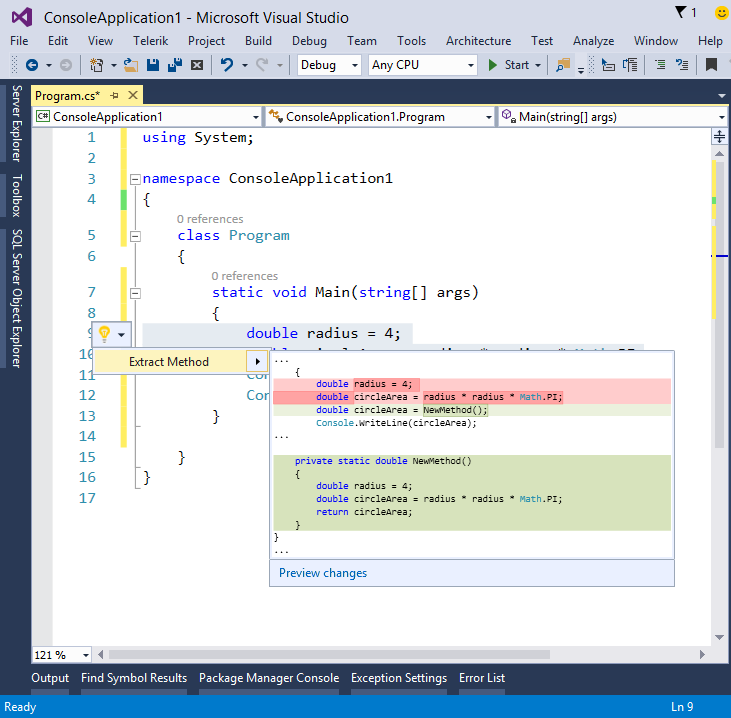

图 28:建议提取新方法的快速操作。

像往常一样，您将获得变更的内联预览，您可以单击**预览变更**超链接以获得更详细的视图。如果您点击**提取方法**，Visual Studio 会将您的代码更改为以下内容:

```cs
              static void Main(string[] args)
              {
                  double circleArea = NewMethod();
                  Console.WriteLine(circleArea);
                  Console.ReadLine();
              }

              private static double NewMethod()
              {
                  double radius = 4;
                  double circleArea = radius * radius * Math.PI;
                  return circleArea;
              }

```

不仅代码组织得更好，而且新方法是可重用的。当然，最好的选择是让新方法接受一个参数并使用它，而不是硬编码`radius`变量值。生成新方法时，您可以替换绿色突出显示的默认名称；这是通过一个名为**内联重命名**的新功能来实现的，它值得一些更详细的信息。

|  | 提示:在 C#中，“提取方法”重构在“重构”下的上下文菜单中仍然可用。 |

#### 内嵌重命名

编写代码时最常见的任务之一是重命名标识符，如方法名或变量名。过去，您只需右键单击标识符，选择**重命名**，并在模态对话框中重命名标识符。在 C#中，您也可以通过按 Ctrl + R 来重命名光标所在的变量或方法来实现这一点。此功能在 Visual Studio 2015 中已完全重新设计:当您右键单击某个标识符并选择**重命名**时，您可以在代码编辑器中直接重命名，更改将反映到该标识符的所有其他事件中。使用这种方法，您永远不会失去对代码的关注。此外，您可以自动重命名注释和字符串文字中的引用。继续前面基于提取方法重构的示例，图 29 显示了 Visual Studio 2015 如何允许您重命名新生成的方法。

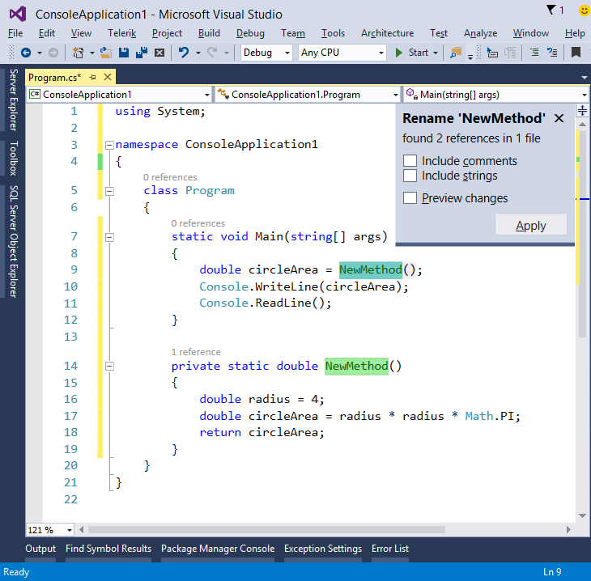

图 29:用新的内联重命名来重命名对象。

右上角的非模态弹出窗口显示了 IDE 找到的标识符的出现次数以及包含该标识符的代码文件的总数。要重命名对象，只需在突出显示的某个位置键入新名称。更改将立即反映到所有其他事件中。如果您对更改满意，请单击**应用**，否则只需关闭弹出窗口或按 **ESC** 。请注意，您仍然可以像修复错误时一样预览更改(参见本章前面的*修复错误*部分)。好消息是，您可以自动重命名注释和字符串文字中出现的内容。图 30 显示了在`Console.WriteLine`语句中用注释和字符串扩展的相同代码。


图 30:内联重命名可以替换注释和字符串文字中的出现。

如果在**重命名**框中同时选择**包含注释**和**包含字符串**选项，您将看到如何自动选择注释和字符串中标识符的出现。如果您键入一个新名称并点击**应用**，所有出现的内容都将被替换，如图 31 所示，该图显示了`NewMethod`标识符是如何被重命名为`CalculateCircleArea`的。

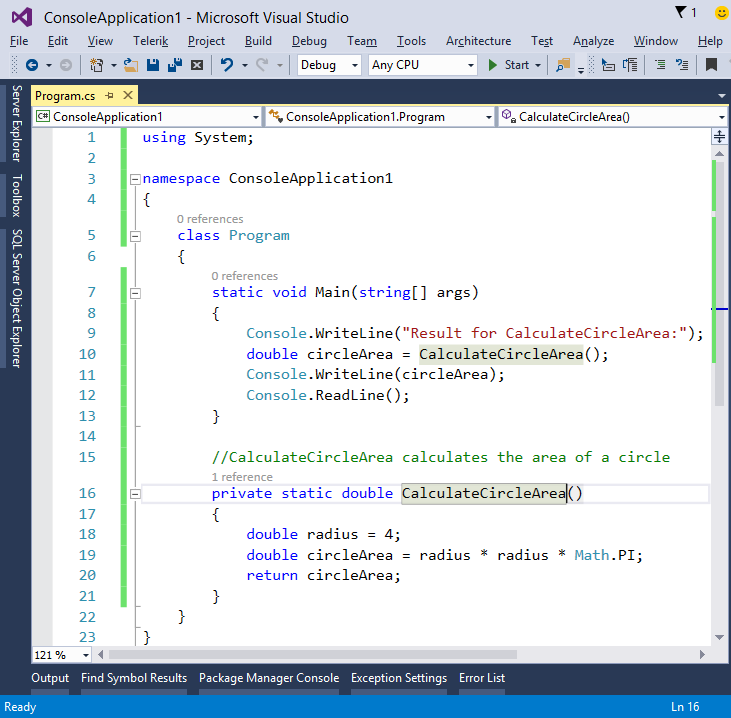

图 31:用内联重命名重命名的标识符的所有出现。

内联重命名是另一个有用的特性，它将帮助您在重构代码时节省大量时间。

#### 引入常数和引入局部常数

引入常量和引入局部常量重构技术允许用常量替换硬编码值；这些可以在类级别，也可以在方法体内。例如，考虑下面的代码。

```cs
          class Program
          {
              static void Main(string[] args)
              {
                  double circleArea = CalculateCircleArea(4.2);
              }

              private static double CalculateCircleArea(double radius)
              {
                  double circleArea = radius * radius * Math.PI;
                  return circleArea;
              }    }

```

这是非常简单的代码:`CalculateCircleArea`方法向调用者返回给定半径的圆的面积，该半径作为参数传递。方法调用传递值的`CalculateCircleArea`。如果您现在选择`4.2`并启用灯泡，您将看到四个选项:

1.  为' 4.2 '引入常数，
2.  为“4.2”的所有出现引入常数(见图 32)
3.  为“4.2”引入局部常数
4.  为‘4.2’的所有出现引入局部常数(见图 33)


图 32:在类级别引入一个常数。

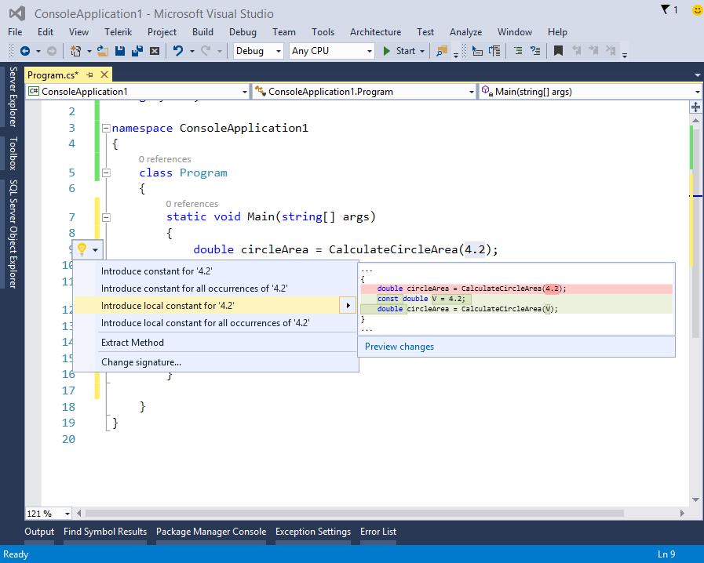

图 33:在方法体中引入局部常数。

前两个选项将在类级别引入一个常量声明，赋值 4.2；特别是，第二个选项将对代码中 4.2 的所有事件(如果有的话)做同样的事情。另一个选项将在方法体中引入一个局部常数，分别用于当前事件或所有事件。无论您选择哪一个选项，Visual Studio 都将应用该更改，并将启用**内联重命名**，以便您有机会选择不同的标识符，如图 34 所示，该图显示了应用的常量和正在运行的内联重命名。

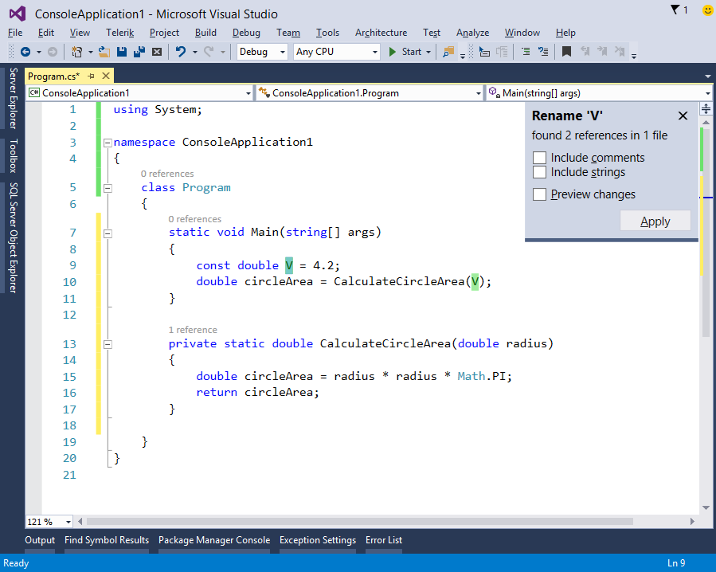

图 34:应用和重命名一个常量。

#### 内联临时变量

内联临时变量是一种新的重构技术，它允许通过删除不必要的变量声明来简化代码。要了解它是如何工作的，请考虑上一段中描述的`CalculateCircleArea`方法。如果您在方法体中选择`circleArea`变量，然后启用灯泡，Visual Studio 将显示一个简化的解决方案，如图 35 所示。


图 35:内联临时变量。

在预览中，Visual Studio 用红色突出显示当前代码，然后在下面显示新结果。应用此快速操作会产生以下代码。

```cs
              private static double CalculateCircleArea(double radius)
              {
                  return radius * radius * Math.PI;
              }

```

这段代码当然更简单，可读性更强。

#### 介绍本地

引入局部是一种新的重构技术，通过引入局部变量来简化复杂的表达式。例如，考虑下面的代码。

```cs
      private static double CalculateCircleArea(object radius)
      {
          double circleArea =
          Convert.ToDouble(radius) * Convert.ToDouble(radius) * Math.PI;
          return circleArea;}

```

这个新版本的`CalculateCircleArea`方法接受类型为`object`的参数，然后执行两次相同的转换。使用“引入本地”，您绝对可以改进这段代码。选择`Convert.ToDouble(radius)`，然后启用灯泡。您将获得两个快速操作:第一个允许为所选代码引入局部变量，而第二个允许为所选代码的所有其他出现引入局部变量(参见图 36)。

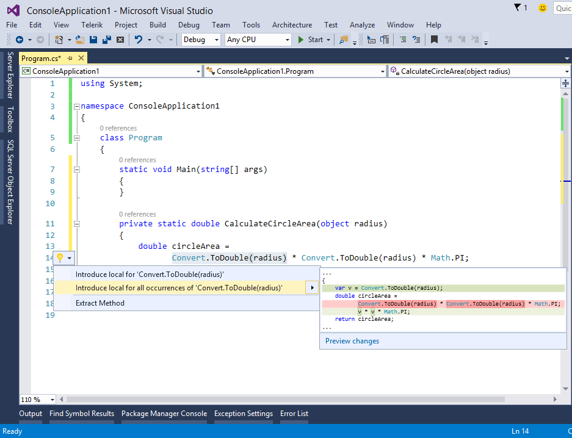

图 36:引入局部变量来简化代码。

应用更改时，内联重命名仍会出现，以便您可以为局部变量选择不同的标识符。应用第二个快速操作将产生以下代码。

```cs
      private static double CalculateCircleArea(object radius)
      {
           var v = Convert.ToDouble(radius);
           double circleArea = v * v * Math.PI;     return circleArea; }

```

正如您所看到的，代码现在变得更加简单和易读。通常使用“引入局部”来分隔嵌套在其他表达式中的复杂表达式。

#### Visual Basic 支持

在 Visual Studio 的历史上，重构支持首次被添加到 Visual Basic 中。这意味着本章中描述的所有重构技术对 VB 都是可用的，包括修复错误和冗余代码的快速操作。作为例子，图 37 显示了如何提取方法，图 38 显示了如何引入内联临时变量。

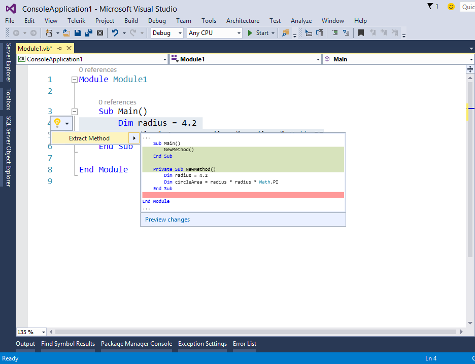

图 37: Visual Basic 对重构的支持:提取一个方法。

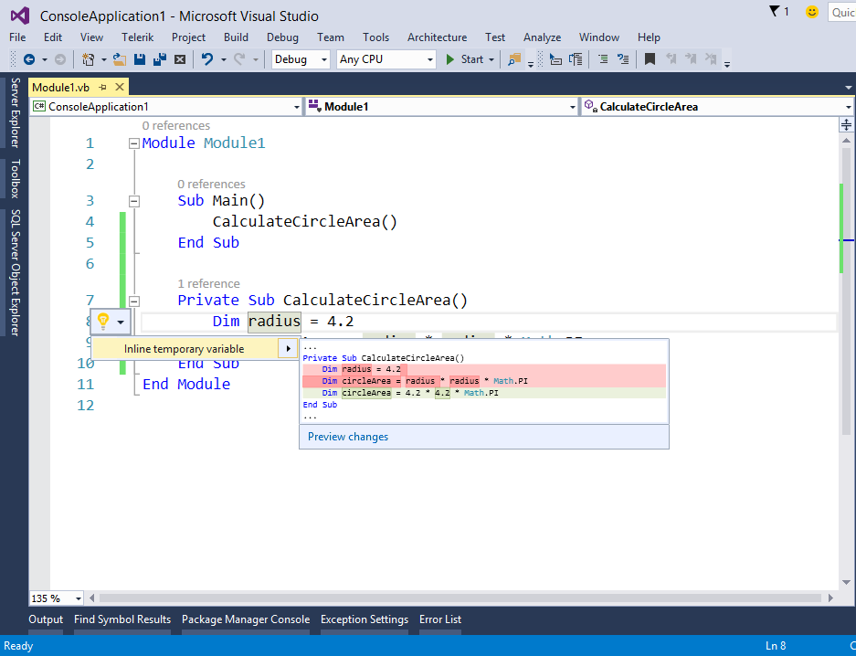

图 38: Visual Basic 对重构的支持:引入一个内联临时变量。

## 章节总结

本章介绍了代码编辑器中的一些新的关键特性。您遇到了彩色工具提示，它显示折叠代码区域的酷预览。您学习了如何在触摸屏设备上成功地与代码编辑器进行交互。最重要的是，您了解了灯泡和快速操作，这将帮助您在键入时修复错误，并使用新的和增强的重构选项编写更好的代码，现在 Visual Basic 也提供了这些选项。