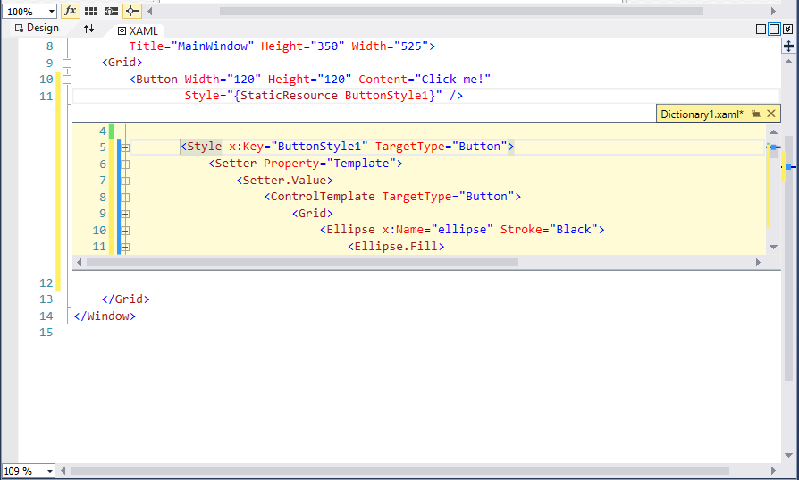

# 四、XAML 编辑改进

许多重要的开发平台都基于 XAML 标记语言，包括 Windows Presentation Foundation、Windows Store 应用程序和 Windows Phone 应用程序。因此，对于成千上万的开发者来说，XAML 扮演着关键角色。此外，尽管有专门的设计工具，手动编写、编辑和调整 XAML 代码是一项非常常见的任务。正因为如此，微软仍在投资改进 Visual Studio 中的 XAML 代码编辑器；2015 版本带来了你肯定会喜欢的新东西，尤其是如果你需要编辑部分用户界面。

## 在 XAML 代码编辑器中查看定义

你记得 Peek Definition 吗？我在我的书*中简洁地谈到了这个惊人的特性，描述了如何在出现在代码上下文中的交互式弹出窗口中显示和编辑 C#或 Visual Basic 代码。Visual Studio 2015 将 Peek Definition 引入 XAML 代码编辑器，迈出了重要的一步。*

|  | 注意:在本章中，我将提到几个与 XAML 相关的概念，例如资源字典、样式和控制模板。我想你对这些概念和 XAML 都很熟悉。如果没有，请参考 [MSDN 文档](https://msdn.microsoft.com/en-us/library/ms752059(v=vs.100).aspx)。 |

这是一个重要的补充，因为它使编辑外部资源字典中的样式、控制模板和数据模板变得更加容易。要了解 XAML 代码编辑器如何帮助您节省时间，请创建一个新的 WPF 项目。当然，本章中描述的技术适用于其他环境，如视窗商店应用程序和视窗电话应用程序，而不仅仅是 WPF。新项目准备就绪后，添加新的资源字典。您已经在第 2 章中学习了如何将资源字典添加到 WPF 项目中，因此我将不再描述这一点。假设您想为`Button`控件提供一个自定义控件模板。下面的代码演示了如何定义一个用椭圆表示按钮的控制模板，其中每个状态(正常、鼠标悬停、按下)用`Trigger`截取，并通过`LinearGradientBrush`对象用不同的渐变背景表示。

```cs
      <ResourceDictionary 
                          xmlns:x="http://schemas.microsoft.com/winfx/2006/xaml"
                          xmlns:local="clr-namespace:WpfApplication1">

             <Style x:Key="ButtonStyle1" TargetType="Button">
                 <Setter Property="Template">
                     <Setter.Value>
                         <ControlTemplate TargetType="Button">
                             <Grid>
                                 <Ellipse x:Name="ellipse" Stroke="Black">
                                     <Ellipse.Fill>
                                         <LinearGradientBrush
                                          EndPoint="0.5,1" StartPoint="0.5,0">
                                             <GradientStop Color="DarkBlue"
                                              Offset="0"/>
                                             <GradientStop Color="Violet"
                                              Offset="1"/>
                                         </LinearGradientBrush>
                                     </Ellipse.Fill>
                                 </Ellipse>
                                 <ContentPresenter HorizontalAlignment="{TemplateBinding HorizontalContentAlignment}"
                                                   VerticalAlignment="{TemplateBinding VerticalContentAlignment}"
                                                   SnapsToDevicePixels="{TemplateBinding SnapsToDevicePixels}"
                                                   RecognizesAccessKey="True"/>
                             </Grid>
                             <ControlTemplate.Triggers>
                                 <Trigger Property="IsMouseOver" Value="True">
                                     <Setter Property="Fill"
                                             TargetName="ellipse">
                                         <Setter.Value>
                                             <LinearGradientBrush
                                              EndPoint="0.5,1"
                                              StartPoint="0.5,0">
                                                 <GradientStop Color="Violet"
                                                  Offset="0"/>
                                                 <GradientStop Color="DarkBlue"
                                                  Offset="1"/>
                                             </LinearGradientBrush>
                                         </Setter.Value>
                                     </Setter>
                                 </Trigger>
                                 <Trigger Property="IsPressed" Value="True">
                                     <Setter Property="Fill"
                                             TargetName="ellipse">
                                         <Setter.Value>
                                             <LinearGradientBrush  
                                              EndPoint="0.5,1"
                                              StartPoint="0.5,0">
                                                 <GradientStop Color="#FF290664"
                                                  Offset="0"/>
                                                 <GradientStop Color="#FF290664"
                                                  Offset="1"/>
                                                 <GradientStop Color="Violet"
                                                  Offset="0.483"/>
                                             </LinearGradientBrush>
                                         </Setter.Value>
                                     </Setter>
                                 </Trigger>
                                 <Trigger Property="IsEnabled" Value="False"/>
                             </ControlTemplate.Triggers>
                         </ControlTemplate>
                     </Setter.Value>
                 </Setter>
             </Style></ResourceDictionary>

```

在使用字典中的资源之前，您必须告诉应用程序您将使用哪些字典以及它们的位置。这是在 App.xaml(或其他项目类型中的 Application.xaml)文件中完成的，更具体地说，您使用一个名为`ResourceDictionary.MergedDictionaries`的集合来收集所需的字典。

```cs
          <Application.Resources>
              <ResourceDictionary>
                  <ResourceDictionary.MergedDictionaries>
                      <ResourceDictionary Source="/Dictionary1.xaml"/>
                  </ResourceDictionary.MergedDictionaries>
              </ResourceDictionary>    </Application.Resources>

```

现在，您可以在用户界面元素中使用资源字典提供的资源。例如，在项目的主窗口中，您可以绘制一个按钮，并像这样应用自定义`ButtonStyle1`。

```cs
          <Grid>
              <Button Width="120" Height="120" Content="Click me!"
                      Style="{StaticResource ButtonStyle1}" />
           </Grid>

```

|  | 提示:智能感知将帮助您根据您正在处理的用户界面元素分配适当的资源。例如，如果您有按钮和文本框的样式，智能感知将只显示按钮的样式。这已经在 Visual Studio 2013 中引入，当您有十几种样式或模板时特别有用。 |

该任务的结果在设计器上立即可见，其中出现一个椭圆形的彩色按钮。您现在可以右键单击`ButtonStyle1`标识符，并从弹出菜单中选择**查看定义**。图 39 显示了此时代码编辑器是如何出现的。



图 39:XAML 代码编辑器中的 Peek 定义。

如您所见，出现了一个方便的弹出编辑器，允许您在其使用的上下文中编辑控件模板。弹出窗口是交互式的，这意味着您可以直接更改代码，而不需要打开指向指定文件的外部窗口。设计器会立即反映您在“查看定义”窗口中所做的更改。完成后，您可以用通常的方式关闭弹出窗口。这个特性在 XAML 编辑器中的工作原理与在 C#和 Visual Basic 中完全一样。您也可以针对托管代码调用 Peek 定义。例如，如果您的按钮有一个`Click`事件处理程序，在 XAML 编辑器中右键单击事件处理程序的名称并选择“查看定义”将导致 Visual Studio 在事件处理程序的 C#/VB 代码上打开查看窗口。

### XAML Peek 定义的其他注意事项

Peek Definition 不仅仅适用于资源字典；它也适用于您在解决方案中定义的样式和模板。它允许您快速编辑样式、控制模板、数据模板和任何其他可定义为资源的元素。这个特性对现实世界的应用程序非常有帮助，在现实世界中，你可能有很多字典和资源，其中很多都存储在外部库中。毫无疑问，它有助于节省时间，因为它避免了搜索资源定义、在外部编辑器窗口中打开资源、进行更改以及返回资源使用上下文的需要。

## 章节总结

由于手动编辑 XAML 代码很常见，Visual Studio 2015 将 Peek Definition 引入了 XAML 代码编辑器。此功能使开发人员能够直接从使用上下文中编辑样式、控件模板、数据模板和任何其他类型的资源，编辑内容会立即反映在设计器表面上。