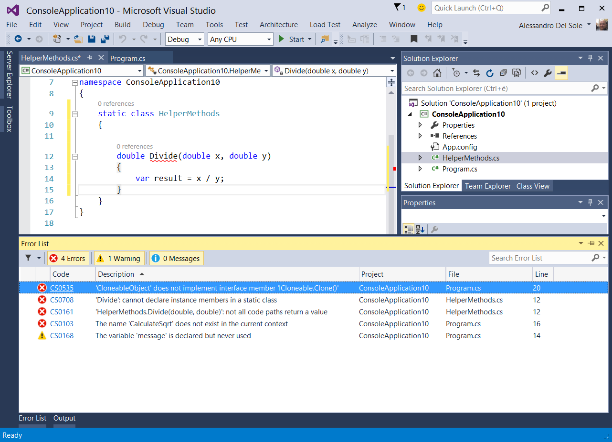
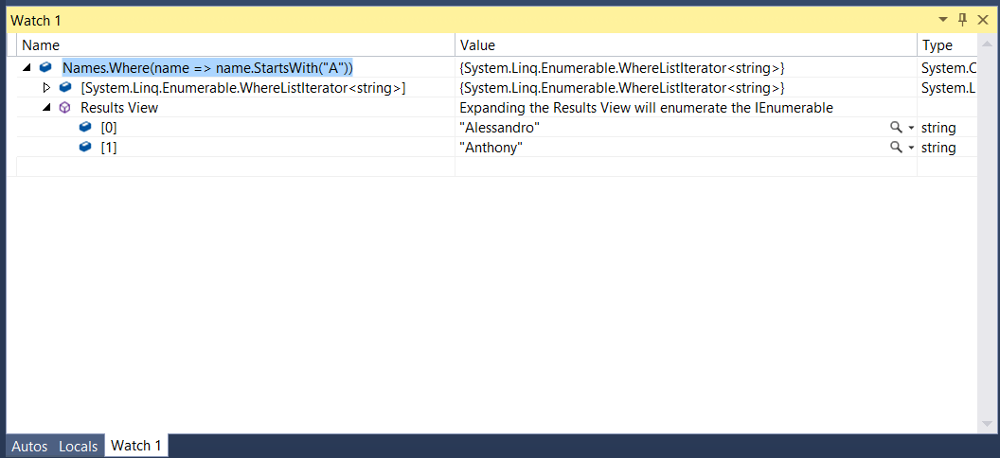
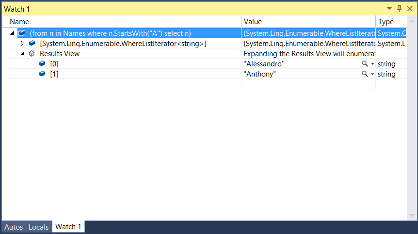
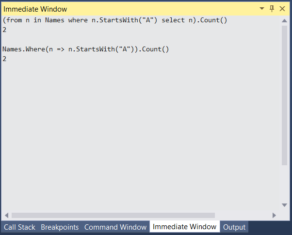
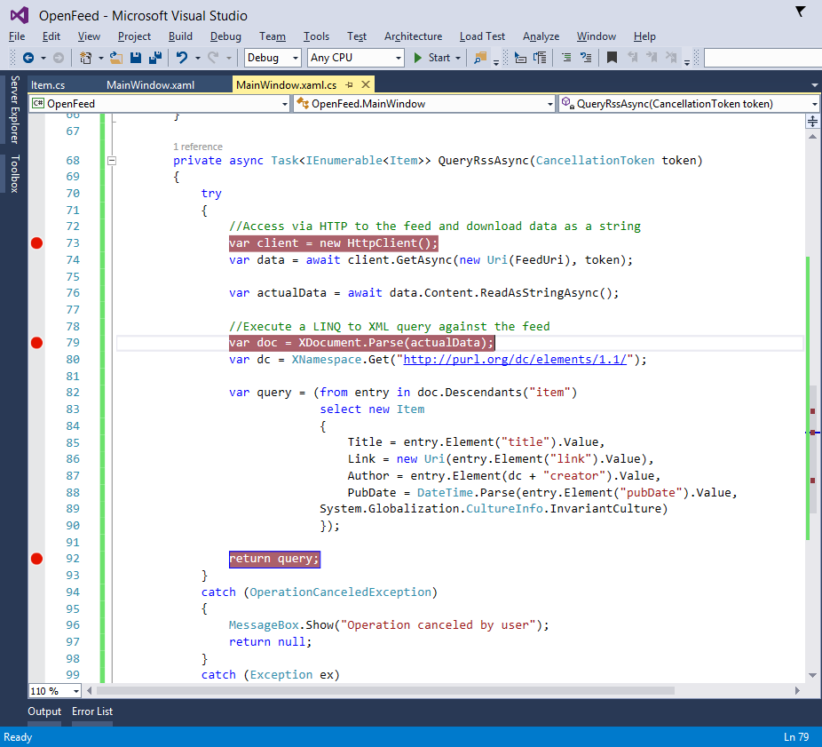
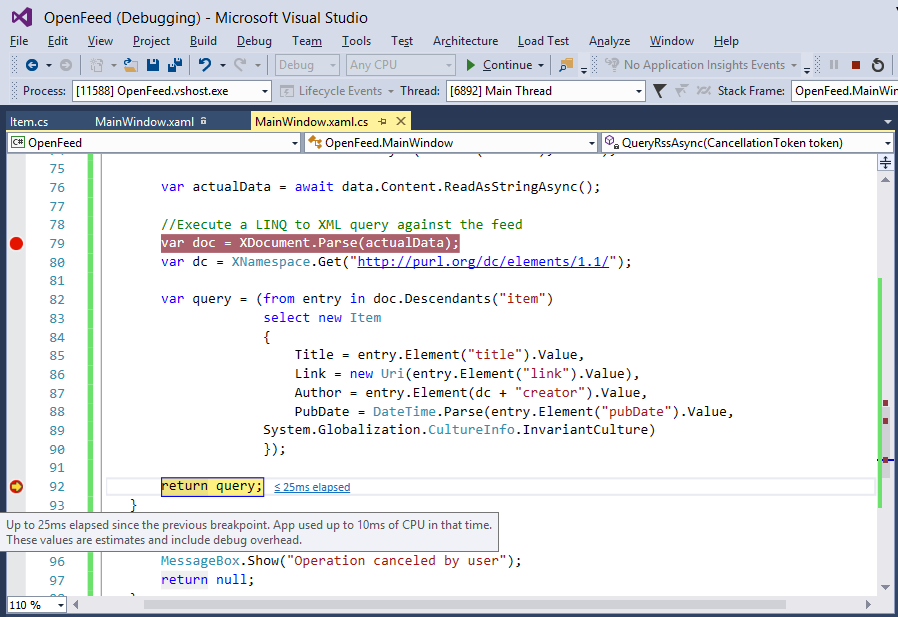
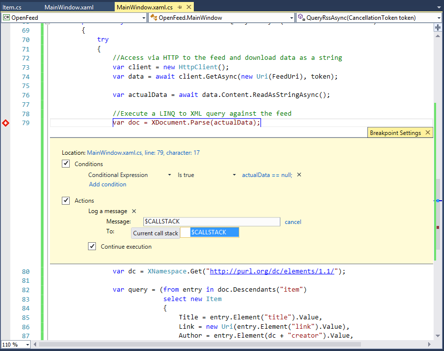

# 六、回顾错误列表和调试改进

发现和修复错误和编写代码一样重要。Visual Studio 一直提供复杂的调试工具；“错误列表”窗口是编写或编译代码时检查错误的好伙伴。诊断和调试错误是微软为 IDE 的每个新版本改进工具的一个领域。本章介绍了全新外观的“错误列表”窗口，并介绍了改进的调试和诊断工具，这些工具将帮助您以更高效的方式解决问题。

## 再次回顾错误列表

“错误列表”工具窗口显示 Visual Studio 在编写代码或编译解决方案时检测到的编译时错误列表。在 Visual Studio 2015 中，错误列表已经过重新访问，现在提供了更多有用的功能。

|  | 提示:当编译器遇到任何错误时，错误列表窗口应该会自动打开。但是，您可以通过选择“视图”>“错误列表”或按 CTRL+\，e 随时打开它 |

100 条消息的限制已被删除，现在窗口显示了错误的完整列表。要理解其他新特性，首先考虑图 45 和图 46 中表示的代码，其中包含不同代码文件中的一些错误。错误出现在两个不同文件中的原因很快就会清楚。


图 45:模拟一些错误——第 1 部分。



图 46:模拟一些错误——第 2 部分。

关注错误列表；图 47 显示了此时的放大图。


图 47:错误列表窗口的更具体视图。

您首先会注意到的是每条消息的错误代码。这样的错误代码代表特定的编译器错误；如果由 C#编译器引发，则以 **CS** 开头；如果由 Visual Basic 编译器引发，则以 **BC** 开头。

|  | 注意:如果您安装(或创建)其他分析器，可能会显示其他错误代码，如第 8 章中描述的 Azure 代码分析。 |

错误代码以超链接的形式出现，因此如果您单击任何错误代码，Visual Studio 2015 将打开您的默认网络浏览器，并使用 Bing 搜索互联网，以查找有关错误代码和错误消息的信息。另一个新功能是过滤器。您基本上可以按以下几列过滤错误列表:代码、项目和文件。例如，假设您只想查看某些特定文件中的错误；点击**文件**列上的过滤符号，选择想要的代码文件，如图 48 所示。


图 48:按代码文件过滤错误。

同样，您可以按错误代码或项目过滤错误列表；后者对于大型解决方案非常有用。错误列表窗口左上角的过滤器符号提供了过滤列表的其他方法，如图 49 所示。使用此选项，您可以浏览当前文档、所有打开的文档或当前项目的错误，这也是默认筛选器。


图 49:仅查看当前文档中的错误。

您也可以通过在搜索框中输入短语来过滤列表，但这是在 Visual Studio 2013 中引入的。

## 调试改进

当您拥有正确的工具时，调试效率会更高。微软一直特别注重提供精密先进的调试工具，Visual Studio 2015 也不例外。本章介绍 Visual Studio 2015 调试体验的新内容。

### 支持λ表达式调试

Visual Studio 2015 引入了对调试 lambda 表达式的支持。社区对这一功能的要求如此之高，以至于微软努力使其在新版本的集成开发环境中可用。该功能允许使用**观察**和**即时**窗口来计算λ表达式；它还允许您使用适当的调试命令(如单步执行(F11))单步执行 lambda 表达式的代码。为了理解它是如何工作的，请考虑下面的代码。

```cs
          class Program
          {
              static void Main(string[] args)
              {
                  List<string> Names = new List<string>();
                  Names.Add("Alessandro");
                  Names.Add("Renato");
                  Names.Add("Anthony");
                  Names.Add("Diego");

                  Debugger.Break();
              }
          }

```

该代码示例是包含一些名称的字符串的简单集合。如果运行代码，执行将在`Debugger.Break();`中断。右键单击`Names`变量，选择**添加手表**。此时，**观察**调试窗口打开，所选对象的实例可供评估。好消息是，您可以在对象实例上键入 lambda 表达式，并对其进行评估，以发现它是否如预期的那样工作。图 50 显示了一个例子，其中 lambda 表达式提取所有以“a”开头的名称



图 50:调试 lambda 表达式。

IntelliSense 也将在您键入时工作，这使得在 Watch 窗口中编写 lambda 成为一项非常简单的任务。不限于此，您还可以针对支持的数据源编写 LINQ 查询，如。NET 对象、实体数据模型、LINQ 到 SQL 等等。图 51 提供了一个基于前面代码的例子。



图 51:调试 LINQ 查询。

同样，您可以在**即时窗口**中计算表达式，包括 lambdas 和 LINQ 查询，如图 52 所示。



图 52:在即时窗口中评估 lambdas 和 LINQ 查询。

大多数开发人员会喜欢这个新特性，因为当您需要调试这些类型的表达式时，它可以节省时间。

### 可视化性能工具提示:性能提示

Visual Studio 2015 引入了一个名为 PerfTips(性能工具提示)的新功能，它显示了调试时运行特定代码需要多长时间。为了理解性能提示是如何工作的，您需要一个更好的示例。为此，创建一个 WPF 应用程序，从互联网上加载一个 RSS 源，然后测量执行特定代码需要多长时间。

#### 创建示例应用程序

在 Visual Studio 2015 中，使用 C#或 Visual Basic 创建一个新的 WPF 应用程序。示例应用程序的目标是从官方的 [Visual Studio 博客](http://blogs.msdn.com/b/visualstudio/)下载 RSS 提要，并在用户界面中呈现一些信息。您要做的第一件事是在 RSS 提要中添加一个表示单个项目的类；我们称这样的类为`Item`。

C#代码示例

```cs
          public class Item
          {
              public string Title { get; set; }
              public Uri Link { get; set; }
              public string Author { get; set; }
              public System.DateTime PubDate { get; set; }    }

```

Visual Basic 代码示例

```cs
      Public Class Item
          Public Property Title As String
          Public Property Link As Uri
          Public Property Author As String
          Public Property PubDate As DateEnd Class

```

如您所见，这是一个简单的类，它存储了博客文章作者、标题、链接和发布日期等信息。接下来是为用户界面编写 XAML 代码，它提供了一个取消操作的按钮和一个`ListBox`控件，其`ItemTemplate`的`DataTemplate`在一个`StackPanel`容器内垂直排列了一些`TextBlock`控件。`TextBlock`控件绑定到`Item`类的属性。

```cs
      <Window x:Class="OpenFeed.MainWindow"

              xmlns:x="http://schemas.microsoft.com/winfx/2006/xaml" Loaded="Window_Loaded"
              xmlns:d="http://schemas.microsoft.com/expression/blend/2008"
              xmlns:mc="http://schemas.openxmlformats.org/markup-compatibility/2006"
              xmlns:local="clr-namespace:OpenFeed"
              mc:Ignorable="d"
              Title="MainWindow" Height="350" Width="525">
          <Grid>
              <Grid.RowDefinitions>
                  <RowDefinition Height="40"/>
                  <RowDefinition/>
              </Grid.RowDefinitions>
              <Button Width="120" Height="30" Name="CancelButton"
                      Content="Cancel" Click="CancelButton_Click"/>
              <ListBox Name="ContentBox" Grid.Row="1"
                       ItemsSource="{Binding}">
                  <ListBox.ItemTemplate>
                      <DataTemplate>
                          <StackPanel>
                              <TextBlock Text="{Binding Title}"
                               TextWrapping="Wrap" FontSize="16"
                                          Grid.Row="1" Tag="{Binding Link}"
                                          Foreground="Blue"
                                          FontWeight="Bold"

                                MouseLeftButtonUp="TextBlock_MouseLeftButtonUp"/>
                              <TextBlock Text="{Binding PubDate,
                               StringFormat=d}" Foreground="Red"
                                          Grid.Row="2"/>
                              <TextBlock Text="{Binding Author}" Grid.Row="3"/>
                          </StackPanel>
                      </DataTemplate>
                  </ListBox.ItemTemplate>
              </ListBox>
          </Grid>
      </Window>

```

现在，您需要一些代码来下载 RSS 提要内容，解析相应的 XML，并用适当的信息填充用户界面(参见注释)。

|  | 注意:为了使用 HttpClient 类，您需要添加对 System.Net.Http.dll 的引用。 |

C#代码示例

```cs
              //The RSS feed URL.
              private const string FeedUri =
                  "http://blogs.msdn.com/b/visualstudio/rss.aspx";

              //Cancellation token required to cancel the operation.
              private CancellationTokenSource cancellationToken;

              private void CancelButton_Click(object sender, RoutedEventArgs e)
              {
                  if (this.cancellationToken != null)
                  {
                      //Cancellation request.
                      this.cancellationToken.Cancel();
                  }
              }

              //Open the selected post in the default browser.
              private void TextBlock_MouseLeftButtonUp(object sender,
                  MouseButtonEventArgs e)
              {
                  var content = (TextBlock)sender;
                  var link = (Uri)content.Tag;
                  Process.Start(link.AbsoluteUri);
              }

              private async void Window_Loaded(object sender,
                  RoutedEventArgs e)
              {
                  //Create an instance of the cancellation token.
                  this.cancellationToken = new CancellationTokenSource();

                  //Load and assign data to the Window's DataContext.
                  this.DataContext = await QueryRssAsync(this.cancellationToken.Token);
              }

              private async Task<IEnumerable<Item>> QueryRssAsync(CancellationToken token)
              {
                  try
                  {
                      //Access via HTTP to the feed and download data as a string.
                      var client = new HttpClient();
                      var data = await client.GetAsync(new Uri(FeedUri), token);

                      var actualData = await data.Content.ReadAsStringAsync();

                      //Execute a LINQ to XML query against the feed.
                      var doc = XDocument.Parse(actualData);
                      var dc = XNamespace.Get("http://purl.org/dc/elements/1.1/");

                      var query = (from entry in doc.Descendants("item")
                                   select new Item
                                   {
                                       Title = entry.Element("title").Value,
                                       Link = new Uri(entry.Element("link").Value),
                                       Author = entry.Element(dc + "creator").Value,
                                       PubDate = DateTime.Parse(entry.Element("pubDate").Value,
                                   System.Globalization.CultureInfo.InvariantCulture)
                                   });

                      return query;
                  }
                  catch (OperationCanceledException)
                  {
                      MessageBox.Show("Operation canceled by user");
                      return null;
                  }
                  catch (Exception ex)
                  {
                      MessageBox.Show(ex.Message);
                      return null;
                  }        }

```

Visual Basic 代码示例

```cs
      Imports System.Net.Http
      Imports <xmlns:dc="http://purl.org/dc/elements/1.1/">
      Imports System.Threading
      …

          Private Const FeedUri As String = _
              "http://blogs.msdn.com/b/visualstudio/rss.aspx "

          'Cancellation token required to cancel the operation.
          Private cancellationToken As CancellationTokenSource

          Private Async Function QueryRssAsync(token As CancellationToken) As  _
              Task(Of IEnumerable(Of Item))
              Try
                  'Access via HTTP to the feed and download data as a string.
                  Dim client As New HttpClient

                  Dim data = Await client.GetAsync(New Uri(FeedUri), token)

                  Dim actualData = Await data.Content.ReadAsStringAsync

                  'Execute a LINQ to XML query against the feed.
                  Dim doc = XDocument.Parse(actualData)

                  Dim query = From feed In doc...<item>
                            Select New Item With {
                                  .Title = feed.<title>.Value,
                                  .Author = feed.<dc:creator>.Value,
                                  .Link = New Uri(feed.<link>.Value),
                                  .PubDate = Date.Parse(feed.<pubDate>.Value,                                              
                                   Globalization.CultureInfo.InvariantCulture)}

                  Return query

              Catch ex As OperationCanceledException
                  MessageBox.Show("Operation canceled by user.")
                  Return Nothing
              Catch ex As Exception
                  MessageBox.Show(ex.Message)
                  Return Nothing
              End Try
          End Function

          Private Async Sub MainWindow_Loaded(sender As Object,
              e As RoutedEventArgs) Handles Me.Loaded
              'Create an instance of the cancellation token.
              Me.cancellationToken = New CancellationTokenSource

              'Load and assign data to the Window's DataContext.
              Me.DataContext = Await QueryRssAsync(Me.cancellationToken.Token)
          End Sub

          Private Sub CancelButton_Click(sender As Object, e As RoutedEventArgs)
              If Me.cancellationToken IsNot Nothing Then
                  'Cancellation request.
                  Me.cancellationToken.Cancel()
              End If
          End Sub

          'Open the selected post in the default browser.
          Private Sub TextBlock_MouseLeftButtonUp(sender As Object,
              e As MouseButtonEventArgs)
              Dim content = CType(sender, TextBlock)
              Dim link = CType(content.Tag, Uri)

              Process.Start(link.AbsoluteUri)    End Sub

```

图 53 显示了如何在用户界面中检索和显示数据的例子。


图 53:下载并呈现 RSS 源内容。

#### 使用性能提示进行调试

为了理解性能提示，在下面放置三个断点(见图 54):

*   `HttpClient`类的实例声明。
*   调用`XDocument.Parse`的行。
*   返回查询结果的行。

|  | 注意:为了简单起见，从现在开始，所有的图都将基于示例应用程序的 C#版本。然而，同样的概念、步骤和结果也适用于 Visual Basic。 |



图 54:添加一些断点。

按 **F5** 开始调试。调试器将在访问 RSS 源之前中断。使用性能提示，您现在可以测量从源下载数据到应用程序开始分析下载数据之间需要多长时间。再次按下**F5**；当调试器遇到第二个断点时，它会中断执行，并显示一小段关于经过时间的信息(以毫秒为单位)。如果您将鼠标悬停在该信息上，将显示更详细的工具提示。图 55 显示了这两个特性。


图 55:使用性能提示测量代码执行时间。

如果您现在通过按下 **F5** 继续执行，您将能够测量代码执行直到下一个断点(见图 56)。在这种特殊情况下，您可以看到对下载的提要数据执行 LINQ 查询花费了多长时间。

|  | 注意:请记住，经过的时间还包括一些调试器开销。这是因为调试器执行会以某种方式影响性能，所以运行时间总是比实际执行时间稍长一些。 |



图 56:用性能提示测量另一段代码。

您不限于使用带断点的性能提示。其实你可以通过其他的调试选项来获取性能信息，比如用**逐行执行代码，按 **F11** 进入**，或者用**单步执行代码时用**(F10)**单步执行** (Shift + F11)，或者**运行到光标** (CTRL+F10)。

### 诊断工具

Visual Studio 2015 企业版包括一个名为“诊断工具”的新工具，它允许分析应用程序消耗资源的位置和方式。诊断工具是一个工具窗口，当您开始调试应用程序时，它会自动显示出来。其中，您可以分析 CPU 利用率、内存使用情况和调试器事件。图 57 显示了一个例子。


图 57:使用诊断工具分析应用程序性能。

“诊断工具”窗口有一个时间线，随着应用程序的执行，时间线中会填充信息。它显示调试器事件，如异常和断点，但它也与 IntelliTrace 事件集成。您也可以通过选择**内存使用**选项卡(见图 57 底部)并拍摄内存快照来执行高级内存分析。当你得到一些时，你可以点击在某个时间实例化的对象总数来查看对象的完整列表以及每个对象有多少实例是活动的。通过选择**工具>选项>调试** **>诊断工具**，可以随时禁用(或启用)诊断工具窗口。此外，您可以通过**调试>显示诊断工具**手动打开诊断工具。在撰写本章时，诊断工具不支持 ASP.NET 5 核心项目、JavaScript 64 位 Windows Store 应用程序和远程调试。

### 使用断点设置管理断点

在预览示例应用程序中放置断点时，您可能注意到红色字形附近出现了一个小工具栏。这个小工具栏允许以全新的体验访问断点设置，如图 58 所示。


图 58:断点设置的新工具栏。

这个工具栏有一个用于禁用断点的按钮，但最重要的是，它提供了另一个用于快速自定义断点的按钮。断点设置现在作为一个非模态的 peek 窗口直接出现在代码编辑器中，如图 59 所示。


图 59:断点设置现在显示为一个查看窗口。

可以编辑的设置基本相同，但 Visual Studio 2015 改变的是访问和编辑设置的方式，直接在代码编辑器内部；这是一种新的非阻塞方法，允许您在断点设置打开的情况下编写代码。您仍然可以设置**条件**和**动作**。条件控制何时必须命中断点；默认条件是，当代码执行到达其位置时，断点被命中。动作控制调试器在满足所有条件时应该做什么。默认操作是调试器停止代码执行。例如，您可能希望仅在从 RSS 源下载数据的结果为空时停止示例应用程序的执行，如果发生这种情况，您可能希望向输出窗口发送调用堆栈。您可以使用如图 60 所示的条件，其中`actualData == null`表达式必须等于`true`。值得一提的是，在编写条件时，您将拥有可用的智能感知。您可以设置一个调用`$CALLSTACK`函数的动作，该函数将整个调用堆栈打印到输出窗口中。



图 60:指定条件和动作。

|  | 提示:在提供操作时，专门的智能感知将帮助您在可用的功能中进行选择，工具提示将描述每一个功能。 |

关于条件，您可以从条件表达式、命中数和筛选中选择一个。顾名思义，条件表达式只有在指定表达式的计算结果为“真”或“已更改”时，才会命中断点。如果您有迭代(例如`for`循环)，并且您希望断点仅在指定的迭代中命中，则可以使用命中计数并指定迭代次数必须比指定值多 **=** 、**倍**或 **> =** 。当您发现错误仅发生在应用程序执行的某个点时，这很有用。相反，您可以使用筛选器来指定断点在其上执行的设备、进程或线程。

|  | 注意:断点设置与以前的版本没有区别。不同之处在于您访问和编辑设置的方式。在本书中，我们将重点关注开发人员体验中的新内容，因此您可能需要查看 [MSDN 文档](http://msdn.microsoft.com/en-us/library/5557y8b4.aspx)以了解可用设置和条件的更多详细信息。 |

条件和动作可以一起工作，也可以分开工作。毫无疑问，新体验非常棒，因为您可以轻松管理断点设置，而不会失去对代码的关注。

## 章节总结

在本章中，您学习了如何使用错误代码、超链接和高级筛选选项重新访问错误列表工具窗口。然后您看到了对调试工具进行了多少投资，包括在 Watch 和 Immediate 窗口中调试 lambda 表达式和 LINQ 查询的选项；您还学习了如何使用性能提示和诊断工具来测量代码性能，以及如何使用新的非阻塞、非模式和基于 peek 窗口的体验来控制断点设置。所有这些重要的特性都将提高您的工作效率，并且肯定会帮助您编写更好、更有性能的代码。