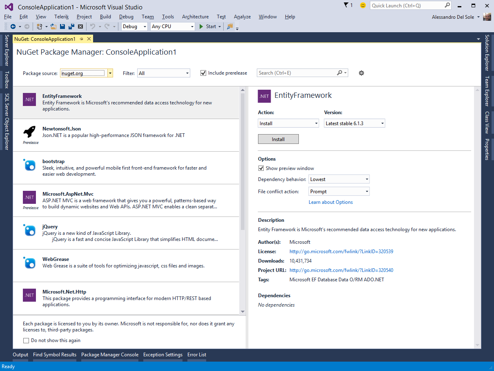
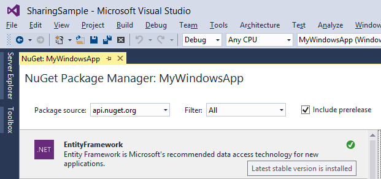
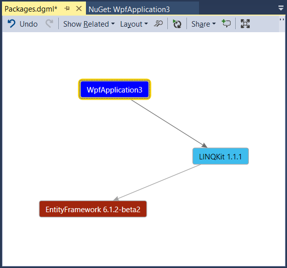
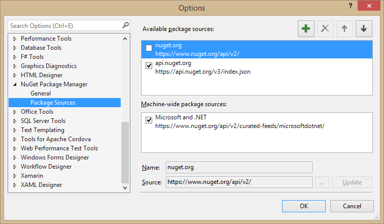

# 七、管理 NuGet 包

[NuGet](https://www.nuget.org/) 是微软 Visual Studio 的包管理器。使用 NuGet，您可以轻松搜索应用程序可能需要的库。NuGet 的 IDE 工具会自动将包下载到您的解决方案中，添加引用，并解决所有必需的依赖关系。NuGet 也是一个巨大的资源库，您可以使用它，但是您也可以将自己的库发布到 NuGet，其他开发人员可以在他们的项目中使用。NuGet 已经存在了几年，从一个独立的项目开始，然后成为 Visual Studio 2012 的一个基本部分。对于微软来说，NuGet 是如此重要，以至于许多库只能通过 NuGet 获得，比如实体框架或 ASP.NET 5 可组合堆栈。更准确地说，在。NET Core 5 所有必需的库都来自 NuGet，IDE 不再从。NET 框架。Visual Studio 2015 增强了对 NuGet 的支持，使其成为一个更好的工具。

## 一个新的数字

Visual Studio 2015 提供了一种重新访问 NuGet 的体验。现在，NuGet 工具出现在一个可停靠的工具窗口中，采用非模态和非阻塞的方法。为了理解新的 NuGet，假设您有一个 WPF 项目，并且您想要安装实体框架库。在 Visual Studio 2015 中，您可以通过选择**工具** > **NuGet 包管理器** > **管理解决方案的 NuGet 包**或右键单击**解决方案资源管理器**中的项目名称并选择**管理 NuGet 包**来访问 NuGet 工具。出现如图 61 所示的“获取”窗口。

图 61:新的 NuGet 窗口。

如您所见，您不再有模态对话框；相反，您可以在工具窗口和代码编辑器窗口之间自由切换。窗口左侧显示可用包列表，基于**包源**、**过滤器**和**包含预发行**框。**包源**框允许选择搜索包的在线存储库。默认值为**nuget.org**，其他可用选项为**微软和。NET** 、**preview.nuget.org**；后面的选项专门搜索预览版本。**过滤器**框过滤软件包列表，以防您想查看**所有**软件包(默认值)、**已安装的**软件包以及具有可用**更新的软件包**。您可以通过**搜索**文本框轻松地通过关键词搜索包裹。在窗口的右侧，您可以获得关于所选包的详细信息(参见图 61)。您可以获得包描述、作者、许可证和下载数量等信息，还可以选择多个版本。如果您的包依赖于其他库，那么这些库也会列在窗口的底部。还有一点很有意思，你如何指定文件冲突时要采取什么动作(**提示**、**全部忽略**、**全部覆盖**)。准备好后，只需点击**安装**。接受软件包所有者要求的任何许可协议，并等待几秒钟以安装软件包。如果安装成功，Visual Studio 会在包名附近显示一个绿色复选框，如图 62 所示。

图 62:软件包安装成功。

|  | 提示:除了许可协议接受(这是一个模态对话框)之外，NuGet 窗口从不阻塞 UI，因此您可以在安装软件包时切换到其他窗口，包括代码编辑器。 |

在解决方案资源管理器中，您可以在项目的**参考**节点中看到下载的包。Visual Studio 2015 中对 NuGet 支持的一个很好的补充是可以看到包的依赖图。选择**工具** > **获取软件包管理器** > **软件包可视化工具**获取已安装软件包及其依赖项的可视化表示。图 63 显示了一个例子，其中您有一个安装了两个包的主项目，一个包依赖于另一个包。

图 63:包可视化工具。

依赖图基于[代码图](http://msdn.microsoft.com/en-us/library/jj739835.aspx)工具，在 Visual Studio 2012 中引入 IDE，在 Visual Studio 2013 中进行了增强。它继承了它的所有功能，例如将图形导出为图像、对项目进行分组、选择不同的颜色、添加注释等等。

### 设置获取首选项

新的 NuGet 窗口在搜索框附近有一个快捷方式(见图 61)来调用 NuGet 的**选项**对话框。当然，仍然可以使用**工具** > **NuGet 包管理器** > **包管理器设置**打开 NuGet 设置。毫无疑问，最有趣的选项是您可以指定额外的包源，这也意味着您可以创建基于 NuGet 的存储库。图 64 显示了**包源**选项。

图 64:包源选项。

虽然您不能编辑**机器范围的包源**内容，该内容通常指向的包。NET Framework，你绝对可以通过点击绿色的 **+** 符号来添加自定义源码。将启用**名称**和**来源**文本框，接受您的存储库和网址的友好名称。值得一提的是，您还可以在计算机上指定一个本地文件夹，而不仅仅是一个在线存储库。

|  | 注意:如果你有兴趣创建定制的 NuGet 包和存储库， [NuGet 基金会有特定的文档](http://docs.nuget.org/create/hosting-your-own-nuget-feeds)。 |

## 章节总结

在本章中，您看到了如何重新访问 NuGet 工具，以便在管理解决方案中的包时不阻塞。您还看到了如何为包创建依赖图，以及如何指定附加设置。重要的是要记住，NuGet 工具实际上是由 Visual Studio 扩展提供的，微软经常为此扩展提供更新。