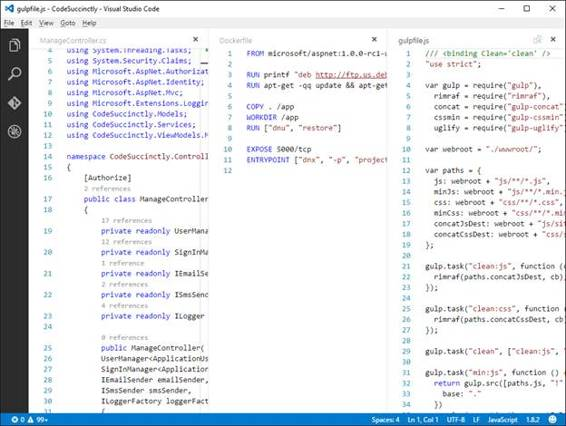
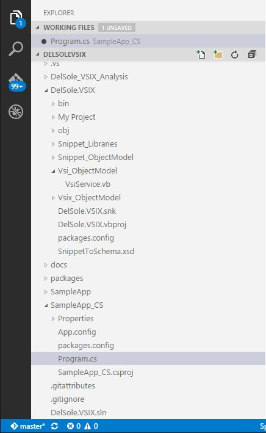
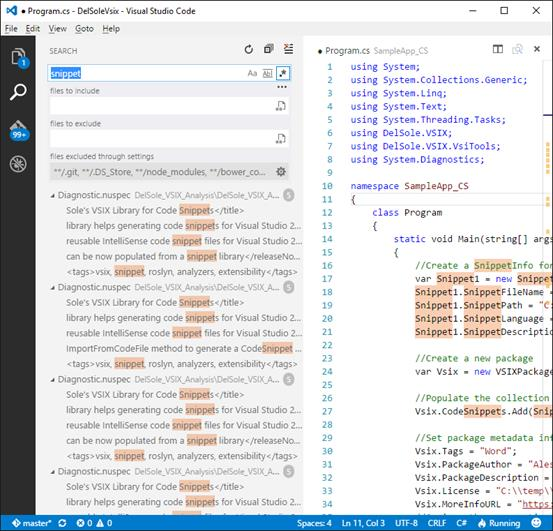
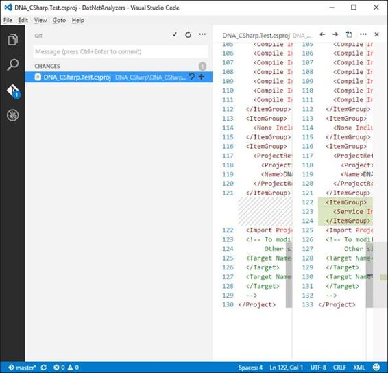
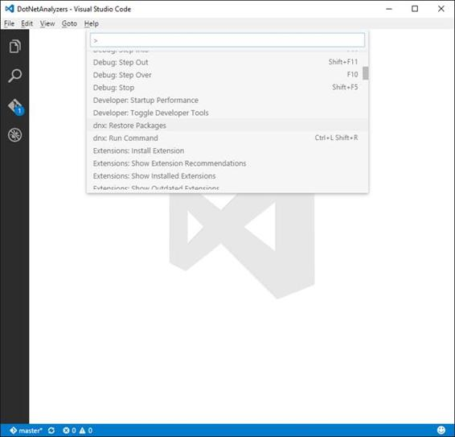

# 二、工作空间和用户界面

VSCode 中的用户界面和布局进行了优化，以最大化代码编辑的空间。此外，它提供了简单的快捷方式来快速访问您在给定环境中需要的所有附加工具，提供了令人敬畏的体验。更具体地说，用户界面分为四个区域:代码编辑器、状态栏、视图栏和侧栏。本章解释了用户界面是如何组成的，以及如何使用它来最大限度地提高工作效率。

|  | 提示:本章描述的大多数工具都有按钮，只有图标，没有文本。但是，按钮的名称可以通过指针悬停在按钮上来查看。 |

代码编辑器绝对是你花费大部分时间的地方。您可以一次编辑一个文件，就像您在[第 1 章](1.html#_Working_with_files)中看到的那样，但是您也可以并排打开多达三个代码文件。图 42 显示了一个例子。

图 42:代码编辑器允许打开三个代码文件。

为此，您有几个选择:

*   右键单击浏览器栏中的文件名，然后选择**打开至侧面**。
*   按住 Ctrl 键并在资源管理器中单击文件名。
*   按 Ctrl+\将编辑器一分为二。

请注意，如果您已经打开了三个文件，并且想要打开另一个文件，则活动的编辑器将显示该文件。您可以通过按 Ctrl+1、Ctrl+2 和 Ctrl+3 在编辑器之间快速切换。

编辑器可以调整大小和重新排序。当指针显示为一对左右箭头时，可以通过在编辑器边框上单击鼠标左键来调整编辑器的大小。通过单击显示文件名的编辑器标题，并将其移动到不同的位置，可以重新排序编辑器。

分别按下 **Ctrl** + **加号**和 **Ctrl** + **连字符**即可轻松放大和缩小活动编辑器。也可以选择**查看** > **放大****查看** > **缩小**。请注意，这是一个辅助功能，因此当您缩放代码编辑器时，视图栏和侧栏也会被缩放。

状态栏包含有关当前文件或文件夹的信息，并允许您执行一些快速操作。图 43 显示了状态栏的一个示例。

图 43:状态栏

从左到右，您可以找到以下信息:

*   Git 版本控制信息和选项，如当前分支和同步更改按钮。
*   错误和警告。您已经在第 1 章的[代码问题和重构](1.html#_Code_Issues_and)部分看到了这一点。
*   缩进。这是图 43 中的空格:4 项。您可以单击此处更改缩进大小，并将缩进转换为制表符或空格。
*   用行号和列号表示的光标位置。
*   当前文件编码。
*   当前行终止符。
*   打开文件的语言。
*   打开包含受支持项目系统的文件夹时的项目名称。值得注意的是，如果文件夹包含多个项目文件，单击此项将允许在项目之间切换。
*   反馈按钮，允许在推特上分享你对 VSCode的反馈。

如果您打开一个文件夹，状态栏是蓝色的；如果您打开一个文件，状态栏是紫色的。

视图栏位于用户界面的左侧，提供对四个工具的快速访问。图 44 显示了视图栏。

图 44:视图栏

视图栏可以看作是侧栏的折叠容器，它提供了以下工具的快捷方式:资源管理器、搜索、Git 和调试，这些将在下一节中介绍。

侧栏是代码编辑器最重要的伙伴。它由以下段落中描述的四种工具组成。每一个都可以通过单击相应的图标来启用。

您已经在第 1 章中遇到了浏览器栏。它提供了您正在使用的文件夹或文件的结构化、有组织的视图。“工作文件”子视图包含活动文件列表，包括不属于项目、文件夹或已修改文件的打开文件。这些显示在名称为文件夹或项目名称的子视图中。图 45 提供了一个浏览器的增强示例。

图 45:浏览器栏

显示文件夹结构的子视图从左到右提供了四个按钮:“新建文件”、“新建文件夹”、“刷新”和“折叠”。每个的功能不言自明。工作文件子视图有两个按钮:保存所有和关闭所有文件。在资源管理器中右键单击文件夹或文件名会提供一个上下文菜单，该菜单提供常见命令，例如本章开头提到的“打开到侧面”选项。一个非常有趣的命令是“显示给资源管理器”(或在 Mac 上显示给 Finder，在 Linux 上打开包含文件夹)，它会打开选定项目的包含文件夹。请注意，视图栏中的资源管理器图标会报告已修改文件的数量。

搜索工具允许跨文件进行搜索。您可以搜索一个或多个单词，包括特殊字符，如*和？，甚至可以基于正则表达式进行搜索。图 46 显示了展开高级选项的搜索工具(包含的文件和排除文本框的文件)。

图 46:跨文件搜索

搜索结果以分层视图的形式提供，该视图将包含指定搜索关键字的所有文件分组，并显示包含该关键字的代码行的摘录。事件会在文件列表和代码编辑器中突出显示。完成后，点击**清除搜索结果**按钮，即可清理搜索结果。

侧栏还提供了对 VSCode 中两个特殊而重要的工具的访问:用于版本控制的 Git 集成和集成调试器。因为这两者都在后面的专门章节中进行了描述，所以我不会在这里介绍它们。然而，为了完整起见，图 47 提供了 Git 的一瞥，也显示了文件差异，图 48 显示了一个空的调试区域。

图 47: Git 和文件差异工具

图 48:调试区域

VSCode提供了两种在文件之间导航的方式。如果您按 Ctrl+Tab，您将能够浏览自代码启动以来已经打开的文件列表，并且您将能够选择一个进行编辑，如图 49 所示。

图 49:浏览最近打开的文件列表

释放 Tab 键时，选定的文件将被打开进行编辑。第二种方法是按 Alt+左箭头键或 Alt+右箭头键在活动文件之间切换。

命令面板是一个允许执行特殊命令的重要工具。您可以通过点击**查看** > **命令面板**或按 F1 或 Ctrl+Shift+P 来启用命令面板。图 50 显示了命令面板。

图 50:命令面板

命令面板基本上是一种通过键盘访问 VSCode所有功能的简单方法。这不仅与菜单命令或用户界面工具有关，还与其他地方无法访问的其他操作有关。例如，命令面板允许在当前项目或文件夹上安装扩展以及恢复 NuGet 包。您可以在列表中上下移动以查看所有可用的命令，也可以键入字符来过滤列表。您会注意到菜单中有许多命令映射动作。其他命令，如扩展、调试和 Git 命令，将在接下来的章节中讨论，所以在这一点上开始使用命令面板是很重要的。

VSCode中的用户界面进行了优化，以最大化可用的编辑空间。工作区分为四个区域。代码编辑器是您编写代码的地方，在这里您可以同时打开三个文件。状态栏报告文件或文件夹的摘要信息。视图栏是侧栏的折叠容器，它提供了四个重要的工具:资源管理器、搜索、Git 和调试。资源管理器提供了文件和文件夹的组织视图，而搜索允许使用高级选项跨文件进行搜索。Git 和 Debug 将在接下来的章节中讨论。VSCode 提供了另一个重要的工具，即命令面板，您可以在其中浏览可用命令的列表，包括直接针对项目、文件夹和文件执行的命令。