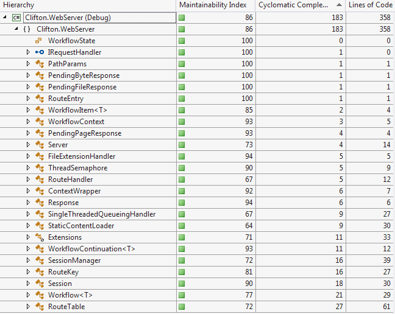

# 简介

1990 年，蒂姆·伯纳斯·李编写了第一个网络服务器，被称为 CERN httpd，和第一个浏览器，他称之为*万维网*。想象一下没有万维网的世界。没有谷歌，没有脸书，没有网飞；一个不是去维基百科了解一些外国的世界，你必须拿出一本百科全书或去你当地的图书馆。忘掉短信和所有其他我们习以为常的社交媒体。

然后在 1990 年圣诞节，第一台网络服务器上线了。谁能想象这意味着什么，即使是十年后？想想看，访问该网络服务器的唯一途径是通过一个名为 *WorldWideWeb* 、[【2】](Web_Servers_Succinctly_0018.htm#_ftn2)的浏览器程序，这是多么奇怪啊，现在浏览器市场上至少有三个主要竞争对手，可能还有五六个次要竞争对手——更不用说你的智能设备、电器甚至手表上的网络可访问性了。

万维网(不要与第一个浏览器相混淆，万维网)的动机可以追溯到更远的 1980 年，当时伯纳斯-李在欧洲核子研究中心工作。[【3】](Web_Servers_Succinctly_0018.htm#_ftn3)在大约有 1 万人工作的欧洲核子研究中心，众多不同系统之间的信息交换几乎是不可能的。[【4】](Web_Servers_Succinctly_0018.htm#_ftn4)为了解决这个问题，Berners-Lee 编写了一个名为 ENQUIRE 的软件项目，这是一个简单的超文本程序，类似于苹果的 HyperCard[【5】](Web_Servers_Succinctly_0018.htm#_ftn5)，但优势在于它是可移植的，可以在不同的系统上运行。ENQUIRE 有点像现代维基。

然而，对 ENQUIRE 内内容的管理仅限于用户——用户有责任保持信息的最新，这最终成为一个相当耗时的过程。1984 年，伯纳斯-李意识到一个不同的系统是必要的，一个每个人都可以访问的系统，一个允许人们独立于他人创建内容的系统。此外，一个人可以链接到其他人创建的内容，而不必更新链接的内容。这种联系可以被认为是一张“网”。

1989 年，Berners-Lee 提出了一个基于互联网的超文本系统，称为 HTML，[【6】](Web_Servers_Succinctly_0018.htm#_ftn6)，由 18 个元素组成，这些元素受到欧洲核子研究中心标准通用标记语言(SGML)文档格式的强烈影响。有趣的是，HTML 4 中仍然存在其中的 11 个元素。

大约 25 年后，万维网变得无处不在，生活在我们的电脑、电话、娱乐盒和自动售货机上。2014 年 4 月，网络服务器负责服务几乎 10 亿个网站的内容。[【7】](Web_Servers_Succinctly_0018.htm#_ftn7)在 1990 年的一份超文本使用列表中，伯纳斯-李将百科全书作为该列表的第一个条目。如今，随着社交媒体、电子邮件和日历事件的不断通知，万维网变得更加实时、动态，有些人会说是入侵性的。随着聊天室、YouTube、网飞的出现，它也变得更像是一种娱乐工具，而不是一种研究工具，任何其他非研究性的活动都是造成这种变化的原因。

所有这些媒体的丰富性都是从蒂姆·伯纳斯·李最初的设想发展而来的，并且依赖于我们称之为“网络服务器”的东西今天的网络服务器比 20 世纪 90 年代早期基本上静态的文件系统内容服务器要复杂得多。今天的网络服务器支持多种功能，例如用户身份验证、安全和加密的数据传输、生成动态内容的服务器端脚本、从一个 IP 地址为多个网站提供服务的虚拟主机，以及带宽限制，以便能够为更多客户端提供服务。[【8】](Web_Servers_Succinctly_0018.htm#_ftn8)此外，网络服务器存在于许多设备上，包括路由器、打印机，甚至相机，并且可能只局限于内部网，不接触网络的其他部分。

网站开发人员不再简单地开发静态内容，其他人可以在自己的静态内容“页面”中用超链接引用这些内容。今天，为了开发 web *应用*——网站(或“web 应用”)，有必要了解整个技术“栈”，这些应用实现了过去作为桌面应用实现的功能。我们现在可以使用“网络应用”实时编写和共享文档，在日历中预约，在电子表格中平衡我们的支票簿，甚至整合我们的营销演示文稿。

结果，“web 服务器”的概念变得模糊，因为服务器现在与 web 应用的动态需求纠缠在一起。处理请求不再是“发回该文件的内容”的简单过程，而是涉及将请求路由到 web 应用，该应用确定内容来自哪里(数据库、文件、股票行情服务等)。).

此外，web 应用现在还做许多其他事情；例如，验证浏览网站的人是否拥有查看页面的正确权限，或者管理信用卡号等安全信息。

这些问题很复杂，谁来处理什么的界限也很模糊——web 服务器相对于 web 应用提供了什么功能，两者如何交互？这些是我们将在本书中进一步研究的问题，因为我们构建了一个高度灵活的 web 服务器，有望与前面(和其他)的问题划清界限。

## 关于术语

这本书里有很多专业术语和缩写。如果你不熟悉网络服务器是如何工作的，所有这些新术语可能会有点令人生畏。当遇到引用时，我试图为术语提供尾注，以了解更多关于术语、技术等的信息。建议所有观众使用尾注中的引用！

## 关于标的物

虽然我在第二章中有一节叫做“写一个网络服务器很容易”，但事实并非如此，而且因为我已经尽可能地保持材料的简洁(双关语)，这本书涵盖的许多主题本身就值得一个简洁的电子书。所以我强烈建议读者用其他信息补充这本书，尤其是读者不熟悉正在讨论的话题的地方。

# 源代码

这本书的源代码可以在 [Syncfusion Bitbucket 账号](https://bitbucket.org/syncfusiontech/web-servers-succinctly)上找到。

如果您熟悉 Bitbucket，请使用您最喜欢的方法来克隆存储库。如果不熟悉 Bitbucket，可以在这里了解更多[。](https://bitbucket.org/)

无论如何，代码存储库的主页在左侧有两个选项，您可以将存储库克隆到您的桌面，或者下载存储库的 zip 文件。

## 关于本书的代码

我经常在文章中使用的写作风格是:

1.  要求
2.  设计
3.  研究/实现
4.  实现/分析
5.  重构

这五个步骤或多或少总是被重复。因为这本书基本上引导你通过开发过程，我曾经研究过的问题，以及在我继续前进和增加额外需求时必须进行的重构，事情确实必须改变。每个“功能性”更改都被放在存储库中一个单独的文件夹中，这样当我继续开发服务器时，您可以轻松地查看、构建和浏览代码。在每一节中，我将指出哪个文件夹具有当前正在讨论的功能的代码库。我希望这个过程对你和我来说都一样有趣，因为我觉得它给了读者软件开发过程的整个格式塔，而不仅仅是(本该)完成的、完美的版本。

## 单元测试在哪里？

您还会注意到单元测试的明显遗漏，这很讽刺，因为我为 Syncfusion 写了一整本关于单元测试的电子书。他们从书中消失的原因仅仅是空间限制。代码存储库中缺少它们，因为在这个实现中，实际上只有很少的代码片段足够复杂，可以进行单元测试。其实在我看来，一个都没有。虽然听起来很奇怪，但核心 web 服务器程序集中实际上只有不到 400 行代码，而且几乎所有类的圈复杂度都低于 25 的阈值——根据微软[【9】](Web_Servers_Succinctly_0018.htm#_ftn9)的说法，圈复杂度大于 25 将是“违规”——当然没有函数超过 8。

图 1:核心组件分析

因此，尽管看起来很讽刺，但这里真的没有什么值得花时间和麻烦去做单元测试，这是我在书中写过的限定词之一， [*单元测试简洁地*](http://www.syncfusion.com/resources/techportal/details/ebooks/unittesting) 。