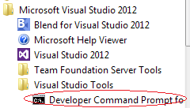
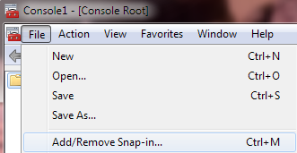
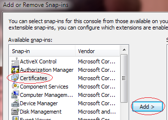
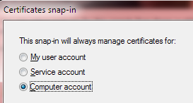
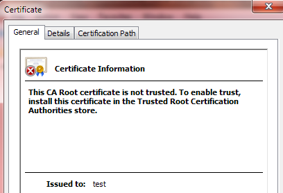
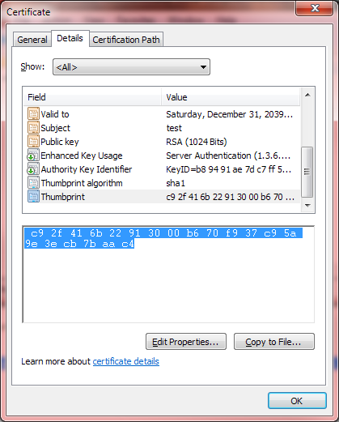
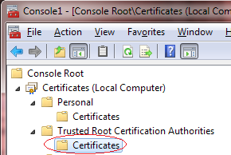
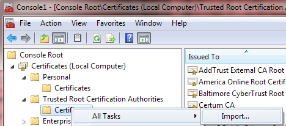
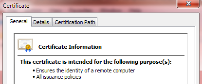

# 第七章 HTTPS

第 7 章在存储库中没有源代码示例，因为本章主要涉及设置 SSL 证书。

HTTPS 是今天所有网络服务器的一个要求。出于这个原因，我把关于 HTTPS 的章节放在这里，这样它就不会被忽略，也不会作为“可选阅读”留在书的最后。本章将向您展示如何创建自己的证书，以使 HTTPS 能够与您的 web 服务器通信。创建您自己的证书需要用户接受一个未知的发行者证书，但是，对于如何设置您的 web 服务器来处理 HTTPS，这仍然是有帮助的。

请注意，这些说明是为 Visual Studio 2012 和 Windows 7 编写的。

SSL 证书有三个级别:

*   域验证
*   组织验证
*   扩展验证

除其他外，证书提供的验证越多，获得证书的成本就越高。

## 域验证

域验证(DV)建立了对网站的基线信任级别，确保您正在访问的网站确实是您打算访问的网站。这是我们将在这里创建的证书。该证书的缺点是很容易获得，并且只能保证浏览器和服务器之间的通信。

## 组织验证

组织验证(OV)是一种更安全的证书，因为它需要验证一些公司信息以及域和所有者信息。除了加密数据之外，你还对运营网站的公司增加了信任度。

## 扩展验证

扩展验证(EV)级别的认证要求公司经历一个审查过程，在这个过程中，公司的所有细节都得到验证。只有通过彻底审查的公司才能使用这种级别的证书。

## 如何制作域级证书

在这个过程中，我们将制作自己的证书。因为我们不是证书颁发机构，浏览器还是会质疑证书是否合法。当你第一次访问你的网页服务器上的一个页面时，它会这样做。创建您自己的证书对测试很有用，并且可以启用 SSL，这样至少可以加密客户端的数据。

这里描述的步骤看起来令人望而生畏，但已经过彻底的测试，如果您精确地遵循它们，您应该不会有任何问题。

首先，启动 Visual Studio 命令行提示符。例如，如果您在 Windows 7 中使用 VS2012，请单击**开始**菜单上的**所有程序**。选择**微软 Visual Studio 2012** ，点击 **Visual Studio 工具**，选择**vs 2012**开发者命令提示符。



图 15:开发人员命令提示符

在控制台窗口中，键入以下内容(全部在一行中)，但用您的计算机名或域名替换`[computername]`。您可以在 [MSDN](http://msdn.microsoft.com/en-us/library/bfsktky3.aspx) 上阅读更多关于`makecert`选项的信息。

```
    Makecert -r -pe -n CN="[computername]" -eku 1.3.6.1.5.5.7.3.1 -ss my -sr localmachine -sky exchange -sp "Microsoft RSA SChannel Cryptographic Provider" -sy 12

```

代码清单 57

例如(我用的是`"test"`和电脑名称):


图 16: Makecert 示例

### 使证书可信

在控制台窗口中，创建证书后，键入 **MMC** 启动微软管理控制台。

### 添加证书管理单元

从**文件**菜单中，选择**添加/删除管理单元**。



图 17:添加证书管理单元

选择**证书**，点击**添加**。



图 18:选择**证书**

选择**电脑账号**。



图 19:选择**电脑账号**

然后点击**下一步** > **完成** > **确定**。

### 验证证书创建

双击**个人**文件夹，然后双击**证书**文件夹。

双击证书，您应该会看到一个对话框，说明“此 CA 根证书不受信任。”



图 20:证书信息

如果您收到任何其他消息，证书将无法正常工作。

### 获取证书指纹

点击**详情**选项卡，向下滚动选择**指纹**字段。将该值复制到记事本中，因为这将在以后使用:



图 21:证书指纹

使用记事本的搜索和替换功能删除所有空白:


图 22:删除空白

### 将证书复制到受信任的根证书颁发机构文件夹

1.  在同一**详细信息**选项卡中，单击**复制到文件**。
2.  点击**下一步**。
3.  点击**下一步**(不要导出私钥)。
4.  点击**下一步** (DER 编码二进制 X.509)。
5.  输入您的证书的文件名，如**c:\ temp \迈锡特. cer** 。
6.  点击**完成**。
7.  点击**确定**关闭证书对话框。

现在，打开**可信根证书颁发机构\证书**文件夹。



图 23:证书文件夹

右键单击**证书**文件夹，选择**所有任务** > **导入**。



图 24:进口证书

1.  点击**下一步**。
2.  输入刚刚导出的证书的文件名。
3.  点击**下一步**。
4.  单击**下一步**(将所有证书放入以下存储:可信根证书颁发机构)。
5.  点击**完成**。

### 验证证书现在可信

回到**个人/证书**文件夹，双击您之前创建的证书。确认您现在看到“**本证书用于以下目的:**”。



图 25:验证证书是否可信

### 将证书绑定到机器上的所有 IP 地址和端口

在我们之前打开的 VS2012 命令行控制台窗口中，使用`netsh`(您可以在 [MSDN](https://msdn.microsoft.com/en-us/library/cc307236(VS.85).aspx) 上了解更多信息)，将证书绑定到所有 IP 地址和 SSL 端口，用我们获得的指纹替换`[yourhash]`:

```
    netsh http add sslcert ipport=0.0.0.0:443 certhash=[yourhash] appid={[your app ID]}

```

代码清单 58

`[your app ID]`的值应该是与您的应用程序相关联的 GUID。例如，我使用了**属性\AssemblyInfo.cs** 文件夹中的 GUID 作为`assembly: Guid`键。

因此，您的`netsh`命令，使用我们从应用程序获取的指纹和 GUID，看起来像这样(都在一行上):

```
    netsh http add sslcert ipport=0.0.0.0:443 certhash=‎c92f416b22913000b670f937c95a9e3ecb7baac4 appid={1a1af1ff-1663-4e58-915a-6ea844508a33}

```

代码清单 59

### 仅此而已

您的计算机现在已经准备好响应 HTTPS 的网络请求(假设您设置了网络服务器来监听 HTTPS)。第一次浏览页面时，Windows 会提示您接受来自未知机构的证书。例如，Opera 会给你这样的信息:


图 26:证书警告

为了避免此警告，您必须从可信机构获得证书，例如 [Verisign](http://www.verisign.com) 。有各种各样的权威机构，证书的价格差异很大，所以调查这些差异是值得的。此外，您的主机提供商也可能提供 SSL 证书。

## 使网络服务器能够接收端口 443 请求

但是，我们必须设置我们的 web 服务器来侦听 SSL 请求，这些请求默认位于端口 443:

```
    listener.Prefixes.Add("https://localhost:443/");

```

代码清单 60

## 结论

正如本章开头所述，HTTPS 是当今所有网络服务器的一项要求——不仅仅是处理信用卡信息(例如，如果你正在建立一个商家网站)，而且是处理浏览器和服务器之间所有数据交易的理想选择。然而，在保护用户数据的安全方面，使用 HTTPS 并不是最终目的:例如，您可能会考虑加密敏感数据，或者如果数据永远不需要解密(密码就是一个很好的例子)，您可能会使用单向哈希。根据您的网站处理的数据类型，您还需要熟悉一些法律要求。

安全应该是网站的首要考虑因素，这一点怎么强调都不为过，因为网站包括所有可以拦截数据的级别，从浏览器开始，到传输层，再到服务器和任何敏感信息的持久存储。