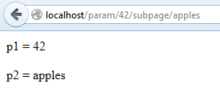

# 第九章参数化路线

本节介绍的源代码位于[比特桶存储库](https://bitbucket.org/syncfusiontech/web-servers-succinctly)的文件夹**示例\第 9 章**中。Visual Studio 解决方案文件位于**第 9 章\克利夫顿。WebServer** 文件夹。

常见的做法是在路线中添加参数。您会看到这在 Ruby on Rails 应用程序中经常使用，尽管我更喜欢将参数放在 URL 的参数部分。无论如何，没有理由制造一个“马克·克利夫顿”的固执己见的服务器，所以我们应该支持这个功能。

什么是参数化路线？可能是这样的:

`localhost/items/1/subitems`

其中`1`是物品集合中某个物品的 ID。

或者，另一个例子:

`localhost/items/groceries/subitems`

其中`groceries`是 items 集合中某个项目的名称。路由器会对第二种形式做出各种假设，用标识值替换“杂货”。以下是一些可能的假设:

*   有一张桌子叫“物品”。
*   有一个模型叫做单数形式的“项目”。
*   模型可以(也可以不)定义一种将非数字参数映射到查找字段的方法。
*   路由器能够直接从数据库或通过模型间接从非数字参数中查找标识。

这个问题可能要复杂得多。考虑 [NancyFx](https://github.com/NancyFx/Nancy/wiki/Defining-routes) 支持的路由选项:

*   文字段(如`mypage/mystuff/foobar`)。
*   捕捉像`/tasks/{tasked}`这样的片段(我称之为参数化 URL)。
*   可选捕获段。
*   用默认值捕获段。
*   RegEx 段。
*   贪婪的片段。
*   贪婪的 RegEx 段。
*   多个捕获段。

这些都是在路由处理程序上匹配网址的潜在有用方法。这应该会让你感觉到路由的复杂性。为了本章的目的，我们将保持它相当简单，并专注于简单地捕获参数并将其传递到`PathParams`集合中的路由处理程序。但是它确实建议有一种方法可以针对非常特殊的路由需求回调应用程序。

## 商定语法

我们可以使用任何我们想要的语法来指定路径中的参数。例如，我们可能需要这样一个表单(由 Rails 使用):

```cs
    param/:p1/subpage/:p2

```

代码清单 68

然而，我们将使用 ASP.NET MVC 和 NancyFx 形式:

```cs
    param/{p1}/subpage/{p2}

```

代码清单 69

## 处理身份证

回想一下我们在`RouteHandler`中进行的调用，试图获取路由处理器:

```cs
    if (routeTable.TryGetRouteEntry(context.Verb(), context.Path(), out entry))

```

代码清单 70

它目前被实现为这两个名称的一些重载方法:

```cs
    public RouteEntry GetRouteEntry(RouteKey key)
    {
    return routes.ThrowIfKeyDoesNotExist(key, "The route key " + key.ToString() + " does not exist.")[key];
    }

    public bool TryGetRouteEntry(string verb, string path, out RouteEntry entry)
    {
      return routes.TryGetValue(NewKey(verb, path), out entry);
    }

```

代码清单 71

在这里，我们期望请求路径和路由定义完全匹配。我们需要重构这段代码(以及代码中的一些其他区域，因为它们很小，所以我不会显示)，以匹配参数化的 URL，我们希望这些参数在键值字典中返回，我只是为它们导出了一个特定的类型:

```cs
    public class PathParams : Dictionary<string, string>
    {
    }

```

代码清单 72

我们将`GetRouteEntry`方法重构为类似的形式(未显示所有重载):

```cs
    public RouteEntry GetRouteEntry(RouteKey key, out PathParams parms)
    {
      parms = new PathParams();
      RouteEntry entry = Parse(key, parms);

      if (entry == null)
      {
        throw new ApplicationException("The route key " + key.ToString() + " does not exist.");
      }

      return entry;
    }

```

代码清单 73

我们实现了一个简单的解析器，它遍历路由，找到第一个匹配的。这个方法有两个部分:迭代器和匹配器。首先，迭代器:

```cs
    /// <summary>
    /// Parse the browser's path request and match it against the routes.
    /// If found, return the route entry (otherwise null).
    /// Also if found, the parms will be populated with any segment parameters.
    /// </summary>
    protected RouteEntry Parse(RouteKey key, PathParams parms)
    {
      RouteEntry entry = null;
      string[] pathSegments = key.Path.Split('/');

      foreach (KeyValuePair<RouteKey, RouteEntry> route in routes)
      {
        // Above all else, verbs must match.
        if (route.Key.Verb == key.Verb)
        {
          string[] routeSegments = route.Key.Path.Split('/');

          // Then, segments must match.
          if (Match(pathSegments, routeSegments, parms))
          {
            entry = route.Value;
            break;
          }
        }
      }

      return entry;
    }

```

代码清单 74

接下来是匹配器(请注意，如果我们愿意，我们可以在这里添加额外的行为来匹配捕获片段):

```cs
    /// <summary>
    /// Return true if the path and the route segments match. Any parameters in the path
    /// get put into parms. The first route that matches will win.
    /// </summary>
    protected bool Match(string[] pathSegments, string[] routeSegments, PathParams parms)
    {
      // Basic check: # of segments must be the same.
      bool ret = pathSegments.Length == routeSegments.Length;

      if (ret)
      {
        int n = 0;

        // Check each segment.
        while (n < pathSegments.Length && ret)
        {
          string pathSegment = pathSegments[n];
          string routeSegment = routeSegments[n];
          ++n;

          // Is it a parameterized segment (also known as "capture segment")?
          if (routeSegment.BeginsWith("{"))
          {
            string parmName = routeSegment.Between('{', '}');
            string value = pathSegment;
            parms[parmName] = value;
          }
          else // We could perform other checks, such as regex.
          {
            ret = pathSegment == routeSegment;
          }
        }
      }

      return ret;
    }

```

代码清单 75

## 测试一下！

让我们编写一个路由处理程序，它需要两个参数，并在浏览器中返回我们的参数值。实现看起来是这样的(注意，`RouteHandler`也被重构以添加一个`PathParams`参数):

```cs
    routeTable.AddRoute("get", "param/{p1}/subpage/{p2}", new RouteEntry()
    {
      RouteHandler = (continuation, context, session, parms) =>
      {
        context.RespondWith("<p>p1 = " +
          parms["p1"] + "</p><p>p2 = " +
          parms["p2"] + "</p>");
        return WorkflowState.Done;
      }
    });

```

代码清单 76

现在，当我们访问该页面并将一些参数直接替换到 URL 中时，我们看到服务器回显我们捕获的参数:



图 31:路径参数

请注意，我们并不关心参数类型:它可以是整数、浮点数或字符串，只要它包含 URL 路径部分的有效字符。

## 结论

虽然相对容易实现，但参数化路由增加了解析路由的复杂性，因此降低了应用程序的性能，尤其是当您有数百条路由和数千个并发请求时。这就是为什么，在本章的开始，我声明我不喜欢参数化的网址。

虽然支持参数化路由很有用，但我们仍然应该支持之前实现的更优化的查找。这是通过首先用路径“原样”检查路由表来实现的这里没有显示它的实现，但是在本书的源代码 repo 中。