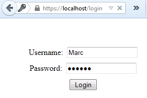

# 第十章表单参数和 AJAX

本节介绍的源代码位于[比特桶存储库](https://bitbucket.org/syncfusiontech/web-servers-succinctly)的文件夹**示例\第 10 章**中。Visual Studio 解决方案文件位于**第 10 章\克利夫顿。WebServer** 文件夹。

让我们来看一个常见客户端实践的路由处理程序:将数据输入表单。我们可以采取一些方法。我们将首先看一个表单回发，接下来我们将看一篇 AJAX 帖子并比较不同之处。

## 表单参数

我们将从一个基本的登录 HTML 表单开始:

```cs
    <!DOCTYPE html>

    <html lang="en" >
    <head>
        <meta charset="utf-8" />
        <title>Login</title>
        <link type="text/css" rel="Stylesheet" href="/CSS/demo.css"/>
    </head>
    <body>
        <form name="myform" action="/login" method="post">
            <div class="center-inner top-margin-50">
                Username:&nbsp;
                <input name="username"/>
            </div>
            <div class="center-inner top-margin-10">
                Password:&nbsp;
                <input type="password" name="password"/>
            </div>
            <div class="center-inner top-margin-10">
                <input type="submit" value="Login"/>
            </div>
        </form>
    </body>
    </html>

```

代码清单 77

它由一个简单的路由处理程序支持(这里我们实际上并没有验证用户):

```cs
    // Test a form post
    routeTable.AddRoute("post", "login", "application/x-www-form-urlencoded", new RouteEntry()
    {
      RouteHandler = (continuation, context, session, pathParams) =>
      {
        string data = new StreamReader(context.Request.InputStream,
                      context.Request.ContentEncoding).ReadToEnd();
        context.Redirect("welcome");
        return WorkflowState.Done;
      }
    });

```

代码清单 78

注意这里我们是如何用内容类型限定相同的路径的。在接下来的 AJAX 示例中，我们将使用相同的路径，但是针对 JSON 内容。

当我们点击**登录**按钮时:



图 32:登录

我们看到表单参数是通过请求输入流传入的:


图 33:表单参数

注意每个键值对中的键是如何与 HTML 控件的`name`属性相关联的。

## AJAX Post

在本例中，我们将使用 jQuery，其中我们将用户名和密码作为 AJAX POST 请求发送:

```cs
    <!DOCTYPE html>

    <html lang="en" >
    <head>
        <meta charset="utf-8" />
        <title>AJAX Login</title>
        <script type="text/javascript" src="/Scripts/jquery-1.11.2.min.js"></script>
        <link type="text/css" rel="Stylesheet" href="/CSS/demo.css"/>

        <script type="text/javascript">
            $(document).ready(function () {
                $("#btnLogin").click(function () {
                    $.ajax({
                        url: "/login",
                        async: true,
                        cache: false,
                        type: "post",
                        data: {
                            username: $("#username").val(),
                            password: $("#password").val()
                        },
                        success: function (data, status) {
                            alert(data);
                        }
                    });
                });
            });
        </script>

    </head>
    <body>
        <div class="center-inner top-margin-50">
            Username:&nbsp;
            <input id="username"/>
        </div>
        <div class="center-inner top-margin-10">
            Password:&nbsp;
            <input type="password" id="password"/>
        </div>
        <div class="center-inner top-margin-10">
            <input type="submit" value="Login" id ="btnLogin"/>
        </div>
    </body>
    </html>

```

代码清单 79

这里，输入流的参数与来自 POST 请求中的参数完全相同，并且由相同的路由处理程序处理。

但是让我们将数据转换为 JSON 格式，并指定内容类型:

```cs
    contentType: "application/json",
    data: JSON.stringify({
        username: $("#username").val(),
        password: $("#password").val()
    }),

```

代码清单 80

我们现在需要一个新的路由处理程序来处理相同的路径(因为我们在 AJAX 命令中声明了网址)，但是针对不同的内容类型:

```cs
    // Test a form post with JSON content.
    routeTable.AddRoute("post", "login", "application/json; charset=UTF-8", new RouteEntry()
    {
      RouteHandler = (continuation, context, session, pathParams) =>
      {
        string data = new StreamReader(context.Request.InputStream, context.Request.ContentEncoding).ReadToEnd();
        context.RespondWith("Welcome!");
        return WorkflowState.Done;
      }
    });

```

代码清单 81

这里我们注意到我们收到了一个 JSON 字符串:


图 34: JSON 字符串

提出这个问题的意义在于，诸如使用表单帖子与 AJAX 帖子或帖子数据格式之类的问题，虽然独立于服务器实现，但确实会影响您的 web 应用路由处理程序。此外，内容类型和路径作为路由处理程序的限定符，在处理表单、AJAX 和内容时会使设计决策更加复杂。