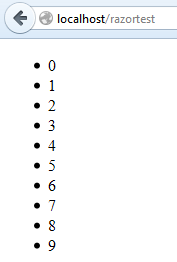

# 第 11 章查看引擎

本节介绍的源代码位于[比特桶存储库](https://bitbucket.org/syncfusiontech/web-servers-succinctly)的文件夹**示例\第 11 章**中。Visual Studio 解决方案文件位于**第 11 章\克利夫顿。WebServer** 文件夹。

我不是视图引擎的支持者，而是更喜欢将渲染逻辑放入客户端。当我开发 web 应用程序时，我得出结论，服务器端开发的很大一部分应该只是支持客户端的 REST APIs。这通常是单页应用程序的理想方法。[<sup>【44】</sup>](Web_Servers_Succinctly_0018.htm#_ftn44)如果您使用视图引擎进行页面渲染，那么您很可能会进行大量服务器端刷新，这会降低用户体验。事实上，ASP.NET 和 Rails 所倡导的 MVC 方法“固执己见”到了如此程度，以至于人们很容易陷入创建服务器端呈现的多页 web 应用程序的范式中，并且更新需要回发。这与 SPA 网络应用形成鲜明对比。这也是为什么我认为 MVC 概念在很大程度上不适用于服务器端*。*有趣的是，你可以在谷歌上找到很多关于如何将 ASP.NET MVC 应用程序转换成 SPA 应用程序的文章。

也就是说，我不想把我的意见强加给用户，所以在网络服务器中支持像 Razor[<sup>【45】</sup>](Web_Servers_Succinctly_0018.htm#_ftn45)这样的视图引擎应该是绝对可能的。现在，Razor(像其他视图引擎一样，如 nHaml[<sup>【46】</sup>](Web_Servers_Succinctly_0018.htm#_ftn46)和 Spark[<sup>【47】</sup>](Web_Servers_Succinctly_0018.htm#_ftn47))有些重要，因为它们实际上会创建一个动态代码文件，必须在运行时编译该文件才能生成要发送到客户端的 HTML。很多时候，比如 CSRF 替换，甚至使用母版页，这都是不必要的——简单的关键字替换就足够了。我们将研究这两种方法，首先使用基于微软 Razor 解析引擎的开源模板引擎 RazorEngine，[<sup>【48】</sup>](Web_Servers_Succinctly_0018.htm#_ftn48)。其次，我们将看看简单字符串替换的 CSRF 处理。如果你对剃刀引擎感兴趣，看看里克·斯特拉尔的西风吧。[<sup>【49】</sup>](Web_Servers_Succinctly_0018.htm#_ftn49)也是如此。

请注意，像@Html 和@Url 这样的特殊关键字实际上不是 Razor 的一部分，而是 MVC 和网页框架的实现细节，因此它们实现的功能在模板引擎中不可用。

为了构建本章的代码，我建议从[位桶站点](https://bitbucket.org/syncfusiontech/web-servers-succinctly)克隆存储库，直接构建代码。从 NuGet 包安装可能会导致剃刀引擎版本和系统之间的冲突。网络版。剃刀版。**第 11 章**文件夹中的代码示例包含了 RazorEngine.Core.dll 的预构建版本，但同样取决于的版本。NET 的系统。我为本章构建的版本可能会在您尝试构建代码时导致“不同版本”的编译器错误。因此，请始终参考从源代码构建的 RazorEngine，而不是 NuGet 包。

## 首先，一些重构

在前面介绍的代码中，一旦加载了页面文件或调用了路由处理程序，工作流就会有效地停止。这是一个设计缺陷，因为它不允许在数据被发送到响应流之前对其进行任何进一步的处理。为了解决这个问题，`HttpListenerContext`实例需要一个包装器，这样我们就可以包含挂起的响应:

```cs
    public class ContextWrapper
    {
      public HttpListenerContext Context { get; protected set; }
      public Response PendingResponse { get; set; }

      public ContextWrapper(HttpListenerContext context)
      {
        Context = context;
      }

      /// <summary>
      /// Text or HTML response, suitable for input to a view engine.
      /// </summary>
      public void SetPendingResponse(string text)
      {
        PendingResponse = new PendingPageResponse() { Html = text };
      }
    }

```

代码清单 82

这需要接触很多文件来用`ContextWrapper`替换对`HttpListenerContext`的引用，但是现在它允许我们定义一个显式的响应者工作流步骤:

```cs
    public static void InitializeWorkflow(string websitePath)
    {
      StaticContentLoader sph = new StaticContentLoader(websitePath);
      workflow = new Workflow<ContextWrapper>(AbortHandler, OnException);
      workflow.AddItem(new WorkflowItem<ContextWrapper>(LogIPAddress));
      workflow.AddItem(new WorkflowItem<ContextWrapper>(WhiteList));
      workflow.AddItem(new WorkflowItem<ContextWrapper>(sessionManager.Provider));
      workflow.AddItem(new WorkflowItem<ContextWrapper>(requestHandler.Process));
      workflow.AddItem(new WorkflowItem<ContextWrapper>(routeHandler.Route));
      workflow.AddItem(new WorkflowItem<ContextWrapper>(sph.GetContent));
      workflow.AddItem(new WorkflowItem<ContextWrapper>(Responder));
    }

```

代码清单 83

响应器的实现如下:

```cs
    /// <summary>
    /// The final step is to actually issue the response.
    /// </summary>
    public static WorkflowState Responder(WorkflowContinuation<ContextWrapper>
                     workflowContinuation, ContextWrapper wrapper)
    {
      wrapper.Context.Response.ContentEncoding = wrapper.PendingResponse.Encoding;
      wrapper.Context.Response.ContentType = wrapper.PendingResponse.MimeType;
      wrapper.Context.Response.ContentLength64 = wrapper.PendingResponse.Data.Length;
      wrapper.Context.Response.OutputStream.Write(
        wrapper.PendingResponse.Data,
        0,
        wrapper.PendingResponse.Data.Length);
      wrapper.Context.Response.StatusCode = 200;    
      wrapper.Context.Response.OutputStream.Close();

      return WorkflowState.Continue;
    }

```

代码清单 84

## 添加视图引擎

在这里，我们终于看到了工作流的全部魅力，以及它如何让我们创建适合我们的 web 应用程序需求的工作流。要添加 Razor 视图引擎处理，我们需要这两个程序集引用:

```cs
    using RazorEngine;
    using RazorEngine.Templating;

```

代码清单 85

以及实施:

```cs
    /// <summary>
    /// Apply the Razor view engine to a page response.
    /// </summary>
    public static WorkflowState ViewEngine(
            WorkflowContinuation<ContextWrapper> workflowContinuation,
            ContextWrapper wrapper)
    {
      PendingPageResponse pageResponse = wrapper.PendingResponse as PendingPageResponse;
      // Only send page responses to the templating engine.
      if (pageResponse != null)
      {
        string html = pageResponse.Html;
        string templateKey = html.GetHashCode().ToString();
        pageResponse.Html = Engine.Razor.RunCompile(html, templateKey, null,
              new { /* your dynamic model */ });
      }

      return WorkflowState.Continue;
    }

```

代码清单 86

这里我们初始化一个模板键，它有 HTML 的散列。模板键用于缓存目的——如果模板完全相同，就没有理由重新构建程序集——我们可以简单地再次执行它。`Engine.Razor.RunCompile`的附加用法详见优秀 RazorEngine GitHub 网站[<sup>【50】</sup>](Web_Servers_Succinctly_0018.htm#_ftn50)。

我们将在下一节讨论模型。现在，我们可以将视图引擎添加到我们的工作流中:

```cs
    public static void InitializeWorkflow(string websitePath)
    {
      // ... all the previous steps ...
      workflow.AddItem(new WorkflowItem<ContextWrapper>(ViewEngine));
      workflow.AddItem(new WorkflowItem<ContextWrapper>(Responder));
    }

```

代码清单 87

现在让我们写一个简单的测试页面:

```cs
    <!DOCTYPE html>

    <html lang="en" >
    <head>
     <meta charset="utf-8" />
     <title>Razor Test</title>
    </head>
    <body>
     <ul>
    @for (int i=0; i<10; i++)
    {
     <li>@i</li>
    }
     </ul>
    </body>
    </html>

```

代码清单 88

结果如下:



图 35:剃刀视图引擎

太好了。我们在网络服务器上增加了一个复杂的视图引擎。因为视图引擎是一个工作流步骤，所以实现实际上是在我们的 web 应用程序中完成的，而不是在 web 服务器中完成的，这使得我们的 web 服务器对正在使用的视图引擎没有主见。然而，你可能会注意到一件事，那就是网页的响应速度降低了。

### 车型

这里我们遇到了一个有趣的问题，仅仅是因为我们的 web 服务器与 MVC 无关。我们还没有对模型做任何事情。此外，视图引擎只允许我们指定一个模型。这是相当不现实的——我可能有一个显示许多不同模型数据的网页。在经典的 MVC 中，解决方法是创建一个“视图模型”(因此我们实际上实现了模型-视图-视图模型，或者 MVVM 模式)。这充其量是一个尴尬的解决方法，但对于 Razor 视图引擎来说，这是我们必须面对的。

让我们创建一个简单的模型，由 2015 年代码项目 MVP 获奖者的名字组成:

```cs
    public class Person
    {
      public string Name {get;set;}

      public Person(string name)
      {
        Name=name;
      }
    }

    public class Program
    {
      public static List<Person> codeProject2015Mvp = new List<Person>()
      {
        new Person("Christian Graus"),
        new Person("BillWoodruff"),
        new Person("Richard Deeming"),
        new Person("Marc Clifton"),     // ... etc ...
      }
      // ... etc ...

```

代码清单 89

我们将使用这个集合作为模型:

```cs
    pageResponse.Html = Engine.Razor.RunCompile(
        html,
        templateKey,
        null,
        new { People = codeProject2015Mvp });

```

代码清单 90

现在有了一些 Razor 标记:

```cs
    <!DOCTYPE html>

    <html lang="en" >
    <head>
     <meta charset="utf-8" />
     <title>2015 MVP's</title>
    </head>
    <body>
     <table>
    @foreach (var person in Model.People)
    {
     <tr>
        <td>@person.Name</td>
     </tr>
    }
     </table>
    </body>
    </html>

```

代码清单 91

我们获得了一个部分截图(如果您的名字不在此截图上，我们深表歉意):


图 36:剃须刀型号

现在问题变成了，我们如何关联 HTML 页面(视图！)与我们想要传递给视图引擎的期望模型进行比较？

虽然这个问题的答案留给了读者(因为它实际上不在不涉及 MVC 或 MVVM 模式的 web 服务器的范围之内)，但我最简单的答案是为每个模板页面编写一个路由处理程序，作为“控制器”并实例化所需的模型。稍加重构，模型就可以被分配给`PendingResponse`实例，并由视图引擎工作流步骤使用，给你一些非常类似于 ASP.NET 和 Rails 中现有 MVC 范例的东西。

## CSRF

“拥有”网络服务器的有趣之处在于，你可以在发送到浏览器之前，在 HTML 中做任何你想做的事情。例如，在 ASP.NET MVC 中，您以如下形式指定了一个 CSRF 令牌:

```cs
    @Html.AntiForgeryToken()

```

代码清单 92

在 Rails 中，`ApplicationController`，如果包含的话:

```cs
    protected_from_forgery

```

代码清单 93

如果 CSRF 令牌不匹配，这将自动重置会话。然后将以下内容添加到应用程序布局页面的`head`部分:

```cs
    <%= csrf_meta_tag %>

```

代码清单 94

如您所见，对于如何处理这个令牌没有标准。在关于会话的一章中，我们实际上是在为新会话创建令牌。我们可以在 HTML 中对这个标记进行简单的搜索和替换，而不是使用重量级的视图引擎。例如，在我们之前的登录页面中，我们可以添加我们自己的关键字`%AntiForgeryToken%`来替换为包含令牌值的隐藏字段:

```cs
    <body>
        <form name="myform" action="/login" method="post">
            %AntiForgeryToken%
            <div class="center-inner top-margin-50">
                Username:&nbsp;
                <input name="username"/>
            </div>
            <div class="center-inner top-margin-10">
                Password:&nbsp;
                <input type="password" name="password"/>
            </div>
            <div class="center-inner top-margin-10">
                <input type="submit" value="Login"/>
            </div>
        </form>
    </body>

```

代码清单 95

我们可以调用一个新的方法`CsrfInjector`，作为工作流的一部分，而不是(或者除此之外，如果您正在使用视图引擎)调用`ViewEngine`工作流步骤:

```cs
    workflow.AddItem(new WorkflowItem<ContextWrapper>(CsrfInjector));

```

代码清单 96

实施方式为:

```cs
    public static WorkflowState CsrfInjector(WorkflowContinuation<ContextWrapper> workflowContinuation, ContextWrapper wrapper)
    {
    PendingPageResponse pageResponse = wrapper.PendingResponse as PendingPageResponse;
    if (pageResponse != null)
    {
    pageResponse.Html = pageResponse.Html.Replace("%AntiForgeryToken%", "<input name=" + "csrf".SingleQuote() +
    " type='hidden' value=" + wrapper.Session["_CSRF_"].ToString().SingleQuote() +
    " id='__csrf__'/>");
    }

    return WorkflowState.Continue;
    }

```

代码清单 97

注意我们实际上是如何注入标记来定义一个隐藏字段`csrf`。

现在，当我们使用此页面登录时，表单的`POST`请求将包括 CSRF 令牌:

```cs
    "csrf=ca64e53c-a9c5-4fde-ba15-e2fad4a334b9&username=admin&password=admin"

```

代码清单 98

对于非`GET`路线，我们可以将其作为路线处理程序验证的一部分进行标准检查。如果您想将 CSRF 验证放入 AJAX 调用中(强烈推荐)，这应该在请求的头部完成。例如:

```cs
    headers: {
                'RequestVerificationToken': '%CsrfValue%'
             }

```

代码清单 99

我们将修改`CsrfInjector`来替换这些关键词:

```cs
    pageResponse.Html = pageResponse.Html.Replace(
        "%CsrfValue%",
        wrapper.Session["_CSRF_"].ToString().SingleQuote());

```

代码清单 100

如前所述，如何做到这一点没有标准。与视图引擎一样，任何编写 web 服务器的人都可以自由定义如何处理这些特殊情况。除了预先呈现的 HTML 中的重大变化之外，例如当使用 HAML 或 SLIM 时，HTML 的语法在服务器之间是相当可移植的。